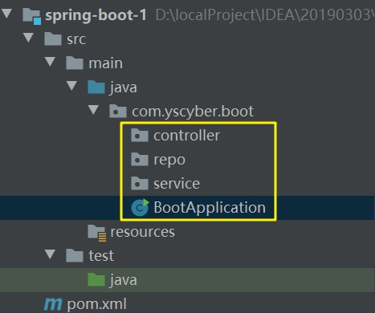
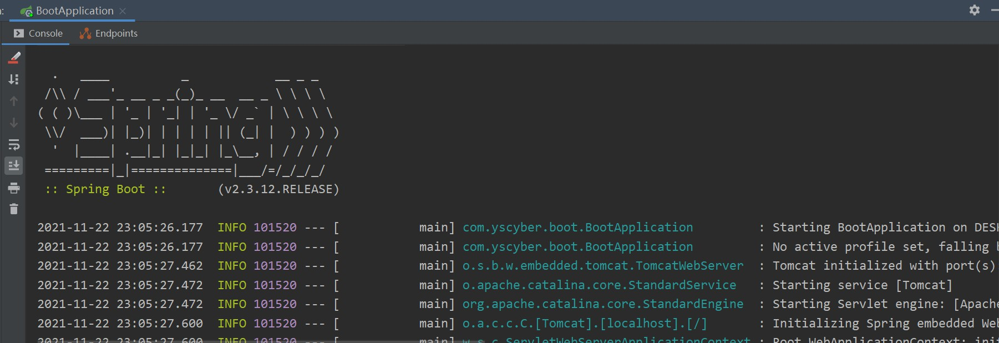
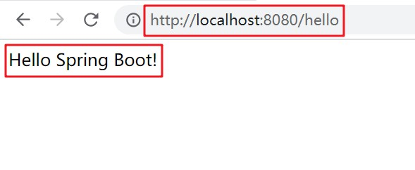

# 入门案例

<br/>

## 1、入门案例描述

- 使用 Maven 创建一个 Spring Boot Web 工程。
- 实现一个 Controller。

---

## 2、入门案例步骤

<br/>

### 2.1、创建 Maven 工程

- 创建一个空的 Maven 工程（不使用任何模板）即可。

---

### 2.2、导入依赖

- 参考：[https://docs.spring.io/spring-boot/docs/2.3.12.RELEASE/reference/html/getting-started.html](https://docs.spring.io/spring-boot/docs/2.3.12.RELEASE/reference/html/getting-started.html)


```xml
<?xml version="1.0" encoding="UTF-8"?>
<project xmlns="http://maven.apache.org/POM/4.0.0"
         xmlns:xsi="http://www.w3.org/2001/XMLSchema-instance"
         xsi:schemaLocation="http://maven.apache.org/POM/4.0.0 http://maven.apache.org/xsd/maven-4.0.0.xsd">
    
    <modelVersion>4.0.0</modelVersion>

    <groupId>com.yscyber.boot</groupId>
    <artifactId>spring-boot-1</artifactId>
    <version>1.0</version>

    <parent>
        <groupId>org.springframework.boot</groupId>
        <artifactId>spring-boot-starter-parent</artifactId>
        <version>2.3.12.RELEASE</version>
    </parent>

    <dependencies>
        <dependency>
            <groupId>org.springframework.boot</groupId>
            <artifactId>spring-boot-starter-web</artifactId>
            <!-- 无需版本号 -->
        </dependency>
    </dependencies>

    <build>
        <plugins>
            <plugin>
                <groupId>org.springframework.boot</groupId>
                <artifactId>spring-boot-maven-plugin</artifactId>
                <!-- 无需版本号 -->
            </plugin>
        </plugins>
    </build>

</project>
```


- Spring Boot 依赖，一般选择的版本是带`RELEASE`后缀的，比如上面的`2.3.12.RELEASE`。
- Spring Boot 依赖，命名一般含有`starter`，这个`starter`一般表示的是**一组**承担特定功能的库，这些库都是经过 Spring 官方验证后组合在一起的，基本上不会出现兼容性等问题。另外，`starter`这一词也可以代表着库可以用于 Spring Boot 工程。
- Spring Boot 工程中首先要引入`spring-boot-starter-parent`作为父依赖。`spring-boot-starter-parent`中有一些默认配置，比如：JDK 版本为1.8，工程编码为 UTF-8，指定一些相关依赖的版本号（后续引入这些相关依赖时可以不用带版本号）等。


```xml
<!-- spring-boot-starter-parent-2.3.12.RELEASE.pom -->

······

<properties>
    <java.version>1.8</java.version>
    <resource.delimiter>@</resource.delimiter>
    <maven.compiler.source>${java.version}</maven.compiler.source>
    <maven.compiler.target>${java.version}</maven.compiler.target>
    <project.build.sourceEncoding>UTF-8</project.build.sourceEncoding>
    <project.reporting.outputEncoding>UTF-8</project.reporting.outputEncoding>
</properties>

······
```


- `spring-boot-starter-web`是使用 Spring Boot 开发 Web 时所需要的最基本的依赖，包含 Spring MVC 等有关的库，并且内置了一个 Tomcat。
- Spring Boot 工程最终可以以 jar 的形式发布（也可以理解：Spring Boot 工程**默认**的发布形式是 jar）。插件`spring-boot-maven-plugin`是可以让 Maven 将 Spring Boot 工程“打包”成 jar。

---

### 2.3、创建入口类

- Spring Boot 工程需要一个类作为**入口类**或者叫**启动类**。
- 使用`@SpringBootApplication`注解标注这个类，说明该类是入口类；此外，这个类中须包含`public static void main(String[] args)`方法。运行`main`方法即是运行这个 Spring Boot 工程。
- 入口类的命名，一般是以`Application`、`App`等作为后缀，后缀的前面是一般是该工程的名称，比如`DemoApplication`。
- Spring Boot 会**自动扫描**（无需任何配置）入口类所在的包及其子包下的所有内容（注解等），所以一般的入口类的位置如下所示：





```java
package com.yscyber.boot;

import org.springframework.boot.SpringApplication;
import org.springframework.boot.autoconfigure.SpringBootApplication;

@SpringBootApplication // @SpringBootApplication 表示该类是当前 Spring Boot 工程的 入口类/启动类
public class BootApplication {

    public static void main(String[] args) {
        // 参数1：启动类的 Class
        SpringApplication.run(BootApplication.class, args);
    }

}
```

---

### 2.4、创建 Controller

- 到了这一步，实际上就是传统 Spring 项目中的 Spring MVC。


```java
package com.yscyber.boot.controller;

import org.springframework.web.bind.annotation.RequestMapping;
import org.springframework.web.bind.annotation.RequestMethod;
import org.springframework.web.bind.annotation.RestController;

@RestController
public class DemoController {

    @RequestMapping(path = "/hello", method = RequestMethod.GET)
    public String helloBoot() {
        return "Hello Spring Boot!";
    }

}
```


- 由于 Spring Boot 能够自动扫描入口类所在的包及其子包下的所有内容，所以像`@RestController`等注解可以直接使用。

---

### 2.5、运行工程

- 直接运行入口类中的`main`方法即可：





可以在控制台看到代表 Spring Boot 工程的 LOGO 以及日志。

输出的日志中可以看到`Starting Servlet engine: [Apache Tomcat/9.0.46]`，表示使用 Spring Boot 开发 Web 时，有一个内置的 Tomcat 供开发时使用。


