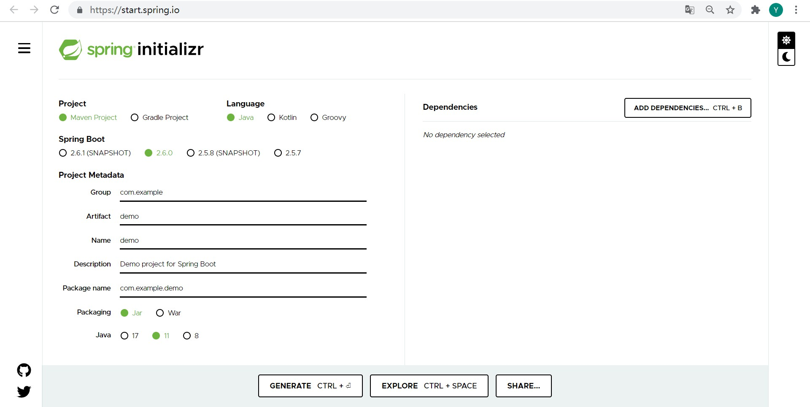
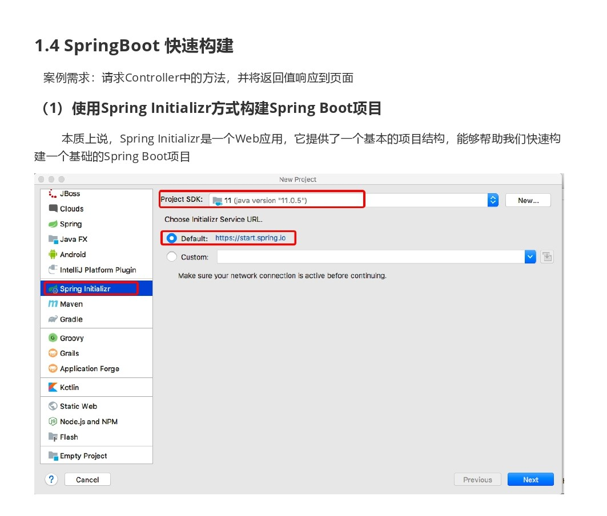
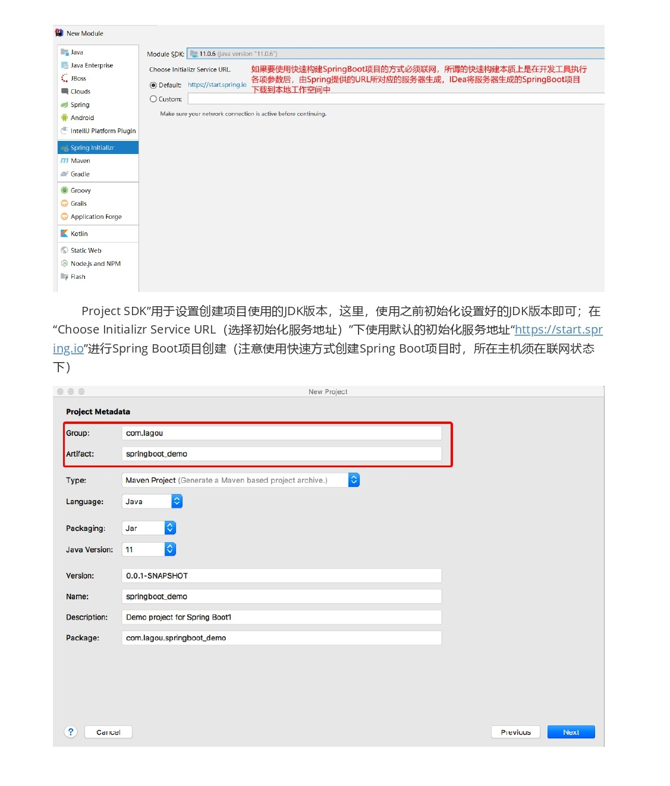
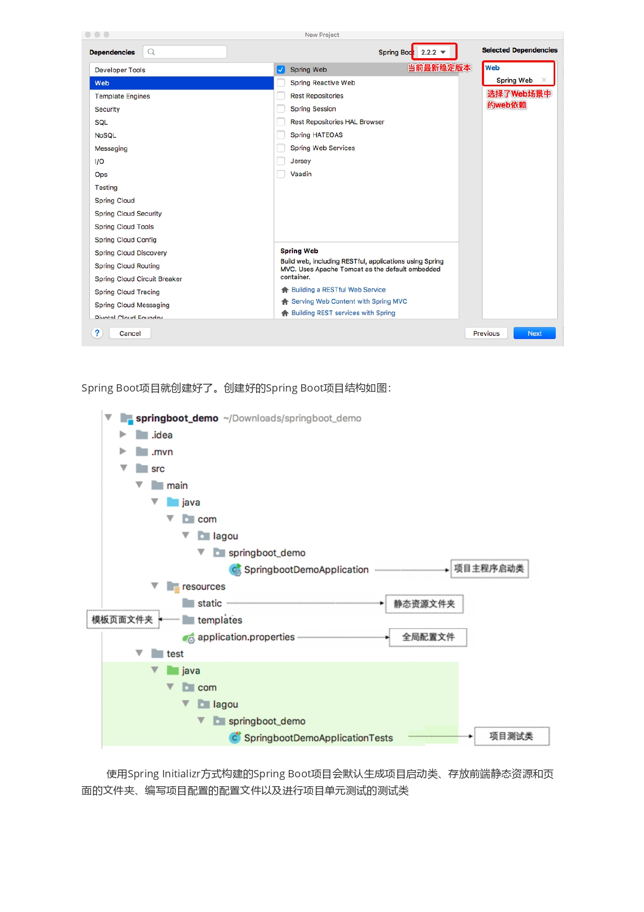
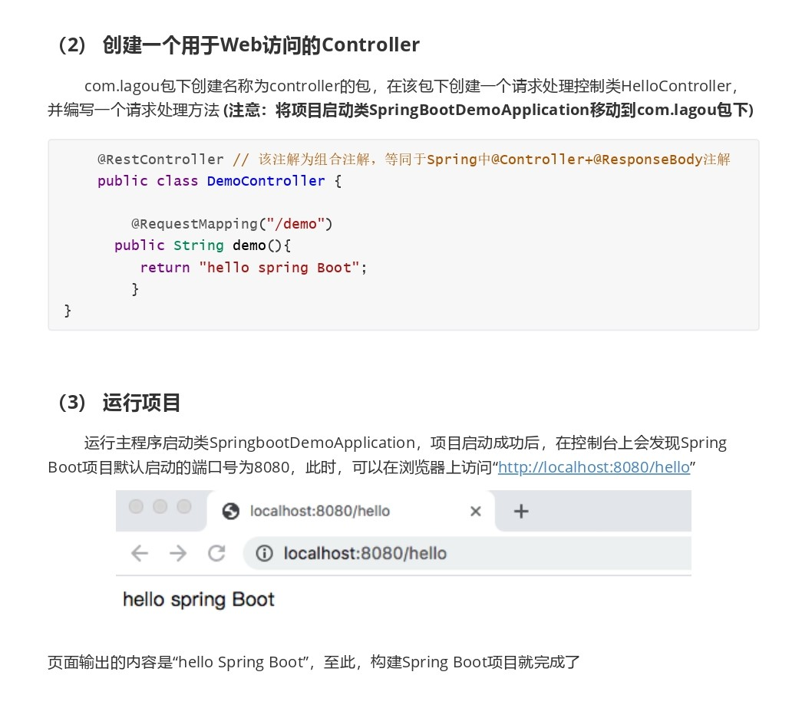

# 快速构建 Spring Boot 工程

 

## 1、概述

除了 [入门案例](https://yyscyber.github.io/java/lagou/basic/0d17c445-0a3b-4892-953f-b329e9a785ce) 中使用手动方式创建一个基于 Maven 的 Spring Boot Web 工程，还有其他的一些方式可以快速构建出一个 Spring Boot 工程。比如：

- [https://start.spring.io](https://start.spring.io) 

  根据网页上的提示操作，最终生成一个包含 Spring Boot 工程的压缩包，下载后直接使用。

- 一些 IDE 提供快速构建（Intellij IDEA / Spring Tools 4 for Eclipse 等） 。

以上方案的构建出的工程，最终来源是 Spring 官方提供的 [Spring Initializr](https://github.com/spring-io/initializr)，是一个 Spring Boot 工程快速构建器。

---

## 2、https://start.spring.io

- [https://start.spring.io](https://start.spring.io) 是 Spring Initializr 为方便用户使用而搭建的 Web。

- 根据提示进行操作即可。比如，选择工程使用的项目管理工具是 Maven 还是 Gradle、选择 Spring Boot 的版本等。

---

## 3、IDE 快速构建

- 以 Intellij IDEA 为例：

