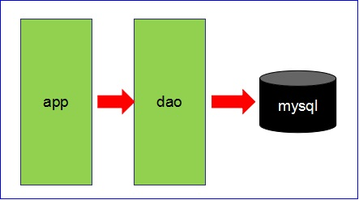
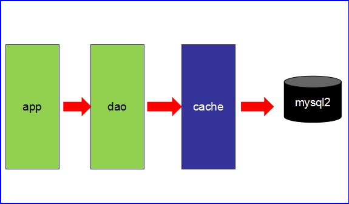
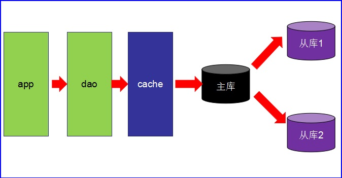
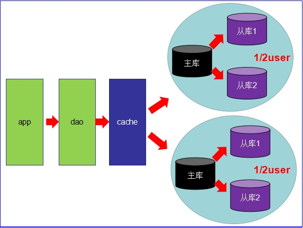
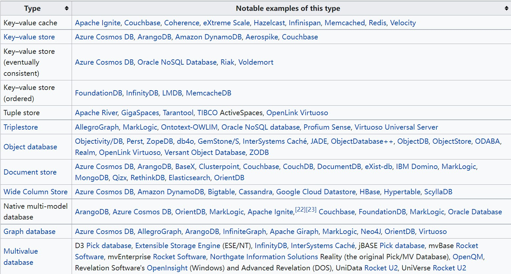
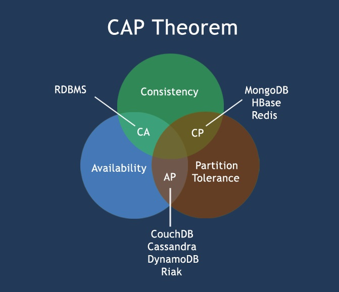
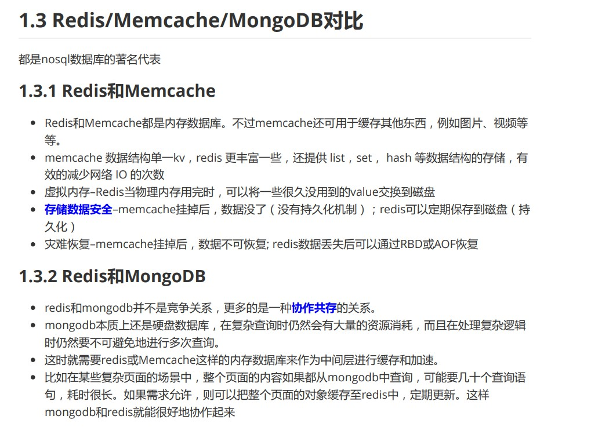

# 概述

 

## 1、互联网架构中数据访问演变概述

 

- 第一阶段：
  - 数据访问量不大，无需复杂的架构。

- 第二阶段：
  - 数据访问量开始增加。
  - 使用缓存技术来缓解数据库的读写压力。

- 第三阶段：
  - 数据访问量变得更大。
  - 仅依靠缓存，也很难缓解只有一个数据库时所面对的读写压力。开始使用多个数据库，让一个数据库作为“主数据库”（master），只负责事务性的操作（增删改）；而其余的数据库作为“从数据库”（slave），负责非事务性的操作（查询）。称之为“主从读写分离”。

- 第四阶段：
  - 数据库集群、分布式，缓存集群、分布式等。

- 第 n 阶段：
  - 更为复杂的架构。

---

## 2、NoSQL 数据库

 

- NoSQL，可以解释为 Non-SQL 或 Not only SQL，其中后者较为准确。
- NoSQL 数据库，是泛指**非关系型**数据库，是对不同于传统的关系数据库的数据库的统称。
- 在如今的互联网生态中，尤其是为了实现系统的**高并发、高可扩（扩展）、高性能**，以及**分布式**广泛应用的今天，NoSQL 数据库已在其中的扮演重要角色。
- NoSQL 数据库是一个比较泛化的概念，NoSQL 数据库的种类是多种多样的。常见的 NoSQL 数据库种类有：键值（Key-Value）存储数据库、列存储数据库、文档存储数据库、图存储数据库等。

- Redis 是一款开源的、运行速度快、并发性能强、运行在内存上的键值型存储 NoSQL 数据库。

---

## 3、CAP 定理

 

- CAP 定理（ CAP theorem），又被称作“布鲁尔定理（Brewer's theorem）”。是由计算机科学家 Eric Allen Brewer 提出。

- CAP 定理所针对的场景是**分布式系统**、**分布式数据存储**等各种分布式场景。

- 因为 NoSQL 数据库可以说是分布式场景中的主力军之一，所以 CAP 定理对其是具有比较大的意义的。

- CAP 定理指出：在任何一个分布式场景、系统中，不可能同时满足以下三点，最多只能满足以下三点之中的两点。

  - Consistency（C，一致性）
    - “All nodes see the same data at the same time”，所有节点在同一时间的数据完全一致。
    - 一致性的问题在分布式系统中不可避免，对于用户（客户端）来说，一致性指的是并发访问时更新过的数据如何获取的问题；从服务端来看，则是数据更新如何复制分布到整个系统，以保证数据最终一致。
  - Availability（A，可用性）
    - “Reads and writes always succeed”，服务一直是可用的而且服务的响应时间是正常的。
    - 好的可用性主要是指系统能够很好的为用户服务，不出现用户操作失败或者访问超时等用户体验不好的情况。
  - Partition tolerance（P，分区容错性）
    - 分布式系统在遇到某节点或分区故障时，仍能提供服务。
    - 但是此时，对外提供的服务在**一致性**、**可用性**方面只能满足其一。
    - 分区容错性要求能够使应用虽然是一个分布式系统，但看上去却好像是在一个可以运转正常的整体。比如现在的分布式系统中有某一个或者几个机器宕掉了，其他剩下的机器还能够正常运转满足系统需求，对于用户而言并没有什么体验上的影响。

- 没有人能保证分布式系统中的任何环节都一直不出现故障，并且从某些角度来说，**分布式**出现故障的概率要比**单一体系/架构**要大的多。但是对于大型应用而言，为了实现高访问、高流量、高并发等**必要目的**，分布式是毫无疑问是现阶段最佳的方案。所以，这里就形成了一个矛盾，针对这个矛盾，最终的选择是“容忍”在**分布式场景**中故障的出现（注意：这里的“容忍”不是出现故障后就不管不顾，而是说允许故障发生，但是在发生故障之后，修复故障之前，仍能对外提供服务，不影响用户的使用）。CAP 定理中，P 是分布式场景中必须具备的，如果没有 P 就不能算是分布式，最多只能算个单点集群。

- 既然 P 是分布式必须具备的，那么基于上述定理，C 和 A 只能取其一。

- 在分布式环境下，为了保证系统可用性，通常都采取**复制**的方式，避免一个节点损坏，导致系统不可用。那么就出现了每个节点上的数据出现了多个副本的情况，而数据从一个节点复制到另外的节点时需要时间和要求网络畅通的，所以，当某一节点或其链路上发生故障时，也就是无法向某个节点成功复制数据时，这时候有两个选择：

  - 选择确保可用性 A：此时，那个失去联系的节点依然可以向系统提供服务，不过它的数据就不能百分之百保证是同步的了（失去了一致性 C）。
  - 选择确保一致性C：为了保证数据的一致性，我们必须等待失去联系的节点恢复过来，在这个过程中，那个节点是不允许对外提供服务的，这时候可能会导致系统处于不可用状态（失去了可用性 A）。

- 最常见的例子是读写分离，某个节点负责写入数据，然后将数据同步到其它节点，其它节点提供读取的服务，当两个节点出现通信问题时，你就面临着选择 A（继续提供服务，但是数据不保证准确）或 C（用户处于等待状态，一直等到数据同步完成）。

- CAP 定理总结：

  - 分布式已然成为常态，CAP 中的 P 是分布式场景下的必然，也是基本要求。剩余的 C 和 A 只能满足其一。

  - 可用性和一致性可以认为是一对冤家。

  - 根据 CAP 原理，可以分成了满足 CA 原则、满足 CP 原则和满足 AP 原则的三大类：

    - CA：非分布式，顶多算“单点集群”。
    - CP：满足一致性，分区容忍性的系统，通常性能上不是特别高。
    - AP：满足可用性，分区容忍性的系统，通常可能对一致性要求低一些。

    需根据实际需求取舍。

- NoSQL 数据库使用 CAP 定理分类：

- 参考：[https://www.runoob.com/mongodb/nosql.html](https://www.runoob.com/mongodb/nosql.html)、[https://baike.baidu.com/item/CAP%E5%8E%9F%E5%88%99/5712863](https://baike.baidu.com/item/CAP%E5%8E%9F%E5%88%99/5712863)

---

## 4、Redis

 

### 4.1、概述

- Redis 是一款开源的、运行速度快、并发性能强、运行在内存上的键值型存储数据库。是比较知名的 NoSQL 数据库。
- Redis 官方网站：[https://redis.io](https://redis.io)

---

### 4.2、常用场景

- 缓存：毫无疑问这是 Redis 当今最为人熟知的使用场景。在提升服务器性能方面非常有效，一些频繁被访问的数据或者临时性的数据，经常被访问的数据如果放在关系型数据库，每次查询的开销都会很大，而放在 Redis 中，因 Redis 是运行在内存中，可以实现很高效的访问。
- 排行榜：利用 Redis 中特定的数据结构能够较为容易的实现。
- 计数器：利用 Redis 中原子性的自增操作，可以统计类似用户点赞数、用户访问数等，这类操作如果使用关系型数据库，频繁的读写会带来相当大的压力。
- 限速器：比较典型的使用场景是限制某个用户访问某个 API 的频率，常用的有“抢购”时，防止用户疯狂点击带来不必要的压力。
- 好友关系：利用 Redis 中的集合的一些命令，比如求交集、并集、差集等。可以方便实现一些像共同好友、共同爱好之类的功能。
- 简单消息队列：除了 Redis 自身的发布/订阅模式，也可以利用 Redis 中的 List 来实现一个队列机制，比如：到货通知、邮件发送之类的需求。
- Session 共享：在单一服务器提供服务时，Session 信息直接保存服务器上是没有问题的。但是如果是集群提供服务时，一个用户登录之后其 Session 信息如果只保存在一个服务器上就会出现问题，会导致用户一旦使用到另外一个服务器所提供的服务时，又要重新登录。采用 Redis 保存 Session 信息后，无论用户使用哪个服务器所提供的服务，都能直接使用，无需重复进行身份校验。
- 等等……

---

### 4.3、与其他常见的 NoSQL 数据库的比较

- 此处比较仅供参考，只有适合需求的才是最好的。

