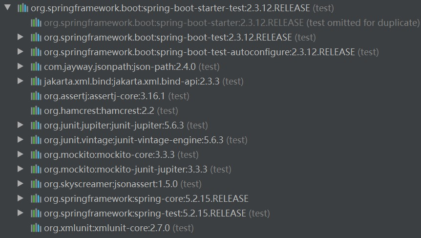

# 单元测试

<br/>

## 1、导入依赖

```xml
<?xml version="1.0" encoding="UTF-8"?>
<project xmlns="http://maven.apache.org/POM/4.0.0"
         xmlns:xsi="http://www.w3.org/2001/XMLSchema-instance"
         xsi:schemaLocation="http://maven.apache.org/POM/4.0.0 http://maven.apache.org/xsd/maven-4.0.0.xsd">
    
    <modelVersion>4.0.0</modelVersion>

    <groupId>com.yscyber.boot</groupId>
    <artifactId>spring-boot-1</artifactId>
    <version>1.0</version>

    <parent>
        <groupId>org.springframework.boot</groupId>
        <artifactId>spring-boot-starter-parent</artifactId>
        <version>2.3.12.RELEASE</version>
    </parent>

    <dependencies>
        <dependency>
            <groupId>org.springframework.boot</groupId>
            <artifactId>spring-boot-starter-web</artifactId>
        </dependency>

        <!-- Spring Boot 测试依赖 -->
        <dependency>
            <groupId>org.springframework.boot</groupId>
            <artifactId>spring-boot-starter-test</artifactId>
            <scope>test</scope>
            <!-- 不需要指定版本 -->
        </dependency>
    </dependencies>

    <build>
        <plugins>
            <plugin>
                <groupId>org.springframework.boot</groupId>
                <artifactId>spring-boot-maven-plugin</artifactId>
            </plugin>
        </plugins>
    </build>

</project>
```


在`spring-boot-starter-test`依赖中，集成了很多常用的测试工具：





---

## 2、创建测试类

- 对于 Maven 工程，可以在`src/test/java`下创建测试类。


```java
package com.yscyber.boot;

import com.yscyber.boot.controller.DemoController;

import org.junit.Test;
import org.junit.runner.RunWith;

import org.springframework.beans.factory.annotation.Autowired;
import org.springframework.boot.test.context.SpringBootTest;
import org.springframework.test.context.junit4.SpringRunner;

// @RunWith 指定测试运行器

// SpringRunner.class：使用 Spring 的测试环境
// JUnit4.class：使用 JUnit 的测试环境
// SpringJUnit4ClassRunner.class：上述两种的结合

// 一般情况下，在这里使用 SpringRunner.class 或 SpringJUnit4ClassRunner.class 均可
@RunWith(SpringRunner.class) 

// @SpringBootTest 指定当前类为 Spring Boot 测试类，自动加载项目的ApplicationContext 上下文环境
@SpringBootTest

public class BootApplicationTest {

    @Autowired // 可以自动注入
    private DemoController demoController;

    @Test
    public void test1() {
        System.out.println(demoController.helloBoot());
    }

}
```


```java
package com.yscyber.boot.controller;

import org.springframework.web.bind.annotation.RequestMapping;
import org.springframework.web.bind.annotation.RequestMethod;
import org.springframework.web.bind.annotation.RestController;

@RestController
public class DemoController {

    @RequestMapping(path = "/hello", method = RequestMethod.GET)
    public String helloBoot() {
        return "Hello Spring Boot!";
    }

}
```