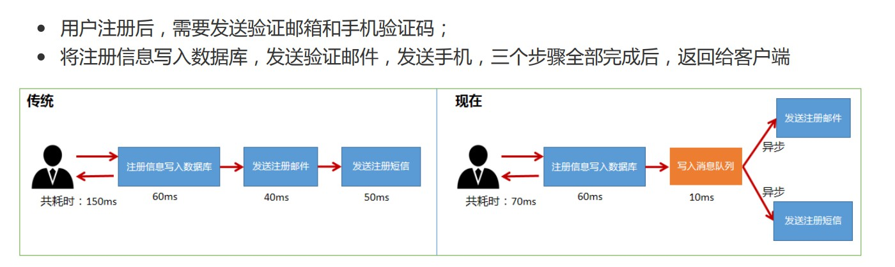
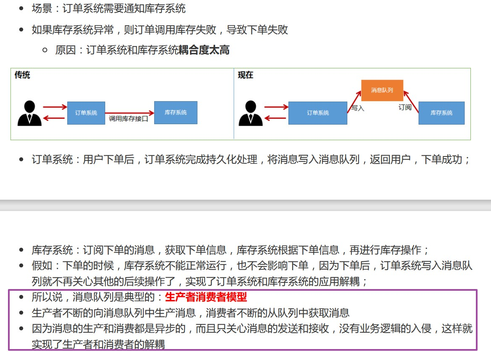
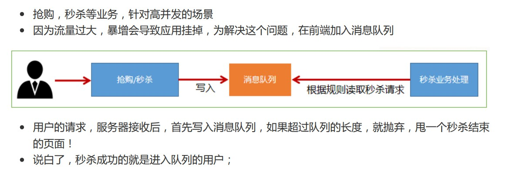
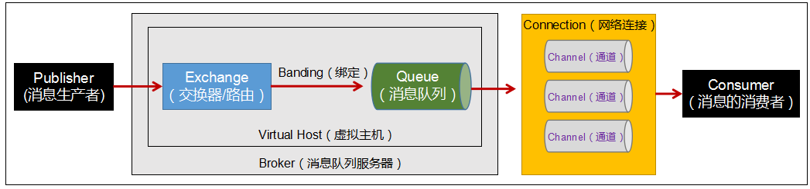

# 概述

 

## 1、消息队列

 

### 1.1、概述

- 消息队列（Message Queue），一般简称 MQ。
- 消息队列是一种**中间件**，是分布式系统中的重要组件，应用十分广泛，能够帮助我们实现高性能，高可用，可伸缩和最终一致性的架构。
- 消息队列产品有很多，常见的有 RabbitMQ、RocketMQ、ActiveMQ、ZeroMQ、Kafka 等。

---

### 1.2、作用

- 通过使用消息队列，可以实现异步处理、应用解耦、流量削峰等目的。

#### 1.2.1、异步处理

---

#### 1.2.2、应用解耦

---

#### 1.2.3、流量削峰

---

### 1.3、AMQP

- AMQP，全称是 Advanced Message Queuing Protocol，高级消息队列协议。
- AMQP 是一个提供统一消息服务的应用层标准高级消息队列协议，是应用层协议的一个开放标准，为面向消息的中间件设计。
- 绝大多数消息队列产品都遵守这一协议。
- [https://www.amqp.org](https://www.amqp.org)

---

### 1.4、JMS

- JMS，全称是 Java Message Server，Java 消息服务。
- JMS 是 Java 消息服务应用程序的接口，一种规范。
- JMS 类似于 JDBC，JDBC 是 Java 与关系型数据库交互的接口、规范；JMS 是 Java 与消息服务应用程序（消息队列）交互的规范。
- JMS 是 Java 平台中关于面向消息中间件（MOM）的 API，用于在两个应用程序之间或分布式系统中发送消息，进行异步通信。

---

## 2、RabbitMQ

 

### 2.1、概述

- 官方网站：[https://www.rabbitmq.com](https://www.rabbitmq.com)
- RabbitMQ 是实现了高级消息队列协议（AMQP）的开源消息的中间件.
- RabbitMQ 使用 Erlang 语言编写的。Erlang 是一种通用的面向并发的编程语言，它由瑞典电信设备制造商爱立信所辖的 CS-Lab 开发，目的是创造一种可以应对大规模并发活动的编程语言和运行环境。Erlang 运行时环境是一个虚拟机，类似于 Java 虚拟机，这样代码一经编译，同样可以随处运行。

---

### 2.2、特点

- Erlang 语言开发，AMQP 的最佳搭档，安装部署简单，上手门槛低。
- 企业级消息队列，经过大量实践考验的高可靠。
- 有强大的 Web 形式管理页面，便于操作。
- 支持消息持久化、消息确认机制、灵活的任务分发机制等，功能非常丰富。
- 集群扩展相对容易，并且可以通过增加节点实现成倍的性能提升。

- 总而言之，RabbitMQ 是一款可靠性高、功能强大、易于管理的消息队列。
- 虽然有一些消息队列产品（zeroMQ、Kafka 等）在性能上是比 RabbitMQ 要强大，但是从稳定、可靠的角度，RabbitMQ 仍是一个合适的选择。
- 当然，计算机领域，好坏的评价标准永远是能否“胜任”、“匹配”需求、业务场景。

---

### 2.3、RabbitMQ 中的概念

- 消息队列，这一类中间件，对应的模型就是“生产者消费者”。
- 以下所提到的概念，可能在其他消息队列产品中也适用。
- 消息队列与数据库一样，是服务端-客户端性质的软件（产品）。

- Publisher：消息的生产者。是向消息队列服务器发布消息的（客户端）应用程序。
- Consumer：消息的消费者。是从消息队列中取得消息的（客户端）应用程序。

- Message：消息。
  - 消息是不具名的，它是由消息头和消息体组成。
  - 消息头可以类似于 HTTP 报文的报文首部，由一系列的可选属性组成。消息头中具体的细节规定应该是基于 AMQP。

- Broker：消息队列服务器实体。
- Virtual Host：虚拟主机，简称 vhost。
  - 虚拟主机是由一批交换器、消息队列、相关对象等，形成的整体。
  - 虚拟主机是共享相同的身份认证和加密环境的独立服务器域。
  - 每个虚拟主机本质上就是一个 mini 版的 RabbitMQ 服务器，拥有自己的队列、交换器、绑定和权限机制。
  - 虚拟主机是 AMQP 的基础。
  - RabbitMQ 默认的虚拟主机（名、标识）是`/`。
- Exchange：交换器（路由）。用来接收生产者发送的消息并将这些消息**分配（分发）**给当前虚拟主机中的消息队列。
- Queue：消息队列。
  - 用来保存消息，消息的容器，直到消费者取走消息。
  - 一个虚拟主机中可以有一个或多个消息队列。
  - 一个消息可被投入进一个或多个队列。
- Banding：绑定。用于消息队列和交换器之间的关联。交换器接收到生产者产生的消息后分配（分发）给消息队列时的规则。
- Connection：网络连接。比如 TCP 连接。
- Channel：信道（通道）。
  - 信道可以理解为是 Connection 中的 Connection。
  - 信道是建立在真实的 TCP 连接内的虚拟链接。
  - 由于建立和销毁 TCP 连接的开销都很大，所以引入了信道的概念，实现多路复用 TCP 连接。
  - 一个信道：多路复用 TCP 连接中的一条**独立**的**双向**数据流通道。