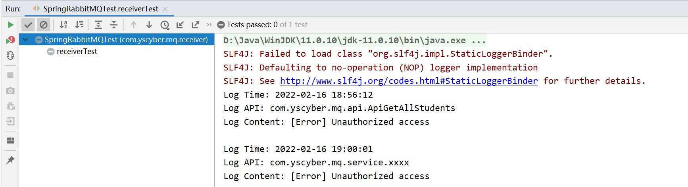

# Spring RabbitMQ

<br/>

## 1、概述

<br/>

- 在 Spring 工程中使用 RabbitMQ 的基本操作。
- Spring AMQP 是基于 Spring 框架的 AMQP 消息解决方案，提供模板化的发送和接收消息的抽象层，提供基于消息驱动的 POJO 的消息监听等，简化了对于 RabbitMQ 相关程序的开发。
- [https://spring.io/projects/spring-amqp](https://spring.io/projects/spring-amqp)


- 之前 [消息模型 — Hello World](https://yyscyber.github.io/java/lagou/basic/e82b8a20-8e6b-4b62-822c-5d7041d0e5a9)、[消息模型 — Work Queues](https://yyscyber.github.io/java/lagou/basic/36c1b71d-340e-4bdc-a365-a409f74b1ddf)、[消息模型 — Publish/Subscribe](https://yyscyber.github.io/java/lagou/basic/d71c3c63-82f0-4bf0-88c3-c475671daf0e)、[消息模型 — Routing](https://yyscyber.github.io/java/lagou/basic/66dff350-0886-49e3-9cb3-d4b952086fe9)、[消息模型 — Topics](https://yyscyber.github.io/java/lagou/basic/0032a734-39b4-4bcb-b496-62a95ad37e82) 等文章中的代码以及本文中的代码，均为测试性质的代码，供初学使用（熟悉语法、流程等），并不适合在实际项目中使用。

---

## 2、案例

<br/>

- RabbitMQ 作为经典的消息中间件，经常作为已经部署的两个项目（服务）之间消息传递的“桥梁”。
- 创建两个 Maven 工程，一个工程作为消息生产者，另一个工程作为消息消费者。


### 2.1、准备

- 创建两个 Maven 工程。
- 两个工程均引入以下依赖。


```xml
<?xml version="1.0" encoding="UTF-8"?>
<project xmlns="http://maven.apache.org/POM/4.0.0"
         xmlns:xsi="http://www.w3.org/2001/XMLSchema-instance"
         xsi:schemaLocation="http://maven.apache.org/POM/4.0.0 http://maven.apache.org/xsd/maven-4.0.0.xsd">

    <modelVersion>4.0.0</modelVersion>

    <groupId>com.yscyber.mq</groupId>
    <artifactId>mq-test-1</artifactId>
    <version>1.0</version>

    <properties>
        <project.build.sourceEncoding>UTF-8</project.build.sourceEncoding>
        <maven.compiler.source>1.8</maven.compiler.source>
        <maven.compiler.target>1.8</maven.compiler.target>
    </properties>

    <dependencies>
        
        <!-- Spring 核心 -->
        <dependency>
            <groupId>org.springframework</groupId>
            <artifactId>spring-context</artifactId>
            <version>5.2.19.RELEASE</version>
        </dependency>
        
        <!-- Spring AMQP RabbitMQ -->
        <dependency>
            <groupId>org.springframework.amqp</groupId>
            <artifactId>spring-rabbit</artifactId>
            <version>2.2.22.RELEASE</version>
        </dependency>

        <!-- JSON 数据解析 -->
        <dependency>
            <groupId>com.fasterxml.jackson.core</groupId>
            <artifactId>jackson-databind</artifactId>
            <version>2.12.3</version>
        </dependency>

        <!-- JUnit 测试用 -->
        <dependency>
            <groupId>junit</groupId>
            <artifactId>junit</artifactId>
            <version>4.12</version>
            <scope>test</scope>
        </dependency>

        <!-- Spring Test 测试用 -->
        <dependency>
            <groupId>org.springframework</groupId>
            <artifactId>spring-test</artifactId>
            <version>5.2.19.RELEASE</version>
            <scope>test</scope>
        </dependency>
    </dependencies>

    <build>
        <plugins>
            <plugin>
                <groupId>org.apache.maven.plugins</groupId>
                <artifactId>maven-compiler-plugin</artifactId>
                <version>3.8.1</version>
                <configuration>
                    <source>1.8</source>
                    <target>1.8</target>
                    <encoding>UTF-8</encoding>
                </configuration>
            </plugin>
        </plugins>
    </build>

</project>
```


---

### 2.2、消息生产者

- 消费生产者：产生消息、发送消息、创建交换机与消息队列、将消息队列与交换机绑定。


```xml
<?xml version="1.0" encoding="UTF-8"?>
<beans xmlns:xsi="http://www.w3.org/2001/XMLSchema-instance"
       xmlns="http://www.springframework.org/schema/beans"
       xmlns:rabbit="http://www.springframework.org/schema/rabbit"
       xsi:schemaLocation="http://www.springframework.org/schema/rabbit https://www.springframework.org/schema/rabbit/spring-rabbit.xsd
       http://www.springframework.org/schema/beans https://www.springframework.org/schema/beans/spring-beans.xsd">

    <!-- 连接配置 -->
    <rabbit:connection-factory id="connectionFactory" host="192.168.3.42" port="5672" username="admin" password="yyss" virtual-host="/mq-test-1" />
    
    <rabbit:admin connection-factory="connectionFactory" />

    <!-- 队列配置：创建或获取队列 -->
    <!-- durable：该消息队列是否进行持久化 -->
    <rabbit:queue name="hello_1" durable="false" />
    <rabbit:queue name="hello_2" durable="false" />
    <rabbit:queue name="hello_3" durable="false" />

    <!-- 交换机配置：创建交换机 -->
    <!-- topic-exchange：topic 类型的交换机 -->
    <rabbit:topic-exchange name="spring_test_exchange_topic" durable="false">
        <!-- 交换机绑定消息队列配置 -->
        <rabbit:bindings>
            <rabbit:binding pattern="com.yscyber.mq.*" queue="hello_1" />
            <rabbit:binding pattern="com.yscyber.redis.*" queue="hello_2" />
            <rabbit:binding pattern="com.yscyber.#" queue="hello_3" />
        </rabbit:bindings>
    </rabbit:topic-exchange>

    <!-- 配置 JSON 数据转换器 -->
    <bean id="jsonMessageConverter" class="org.springframework.amqp.support.converter.Jackson2JsonMessageConverter" />

    <!-- 配置 Spring RabbitMQ 的核心类 -->
    <rabbit:template id="rabbitTemplate" connection-factory="connectionFactory" exchange="spring_test_exchange_topic" message-converter="jsonMessageConverter"/>
    
</beans>
```


```java
import org.junit.Test;
import org.junit.runner.RunWith;

import org.springframework.amqp.rabbit.core.RabbitTemplate;

import org.springframework.beans.factory.annotation.Autowired;

import org.springframework.test.context.ContextConfiguration;
import org.springframework.test.context.junit4.SpringJUnit4ClassRunner;

import java.util.HashMap;
import java.util.Map;

// 测试代码

@RunWith(SpringJUnit4ClassRunner.class)
// 当前测试环境使用的 Spring 配置文件
@ContextConfiguration(locations = "classpath:rabbitmq-sender-application-context.xml") 
public class SpringRabbitMQTest {

    @Autowired
    private RabbitTemplate rabbitTemplate;

    // 发送消息 测试代码
    @Test
    public void senderTest() {
        Map<String, String> msgContent1 = new HashMap<>();
        msgContent1.put("log-time", "2022-02-16 18:56:12");
        msgContent1.put("log-api", "com.yscyber.mq.api.ApiGetAllStudents");
        msgContent1.put("log-content", "[Error] Unauthorized access");


        Map<String, String> msgContent2 = new HashMap<>();
        msgContent2.put("log-time", "2022-02-16 19:00:00");
        msgContent2.put("log-api", "com.yscyber.redis.api.ApiEmailCode");
        msgContent2.put("log-content", "[Error] Unauthorized access");

        Map<String, String> msgContent3 = new HashMap<>();
        msgContent3.put("log-time", "2022-02-16 19:00:01");
        msgContent3.put("log-api", "com.yscyber.mq.service.xxxx");
        msgContent3.put("log-content", "[Error] Unauthorized access");

        // 发送消息
        rabbitTemplate.convertAndSend("com.yscyber.mq.api", msgContent1);
        rabbitTemplate.convertAndSend("com.yscyber.redis.api", msgContent2);
        rabbitTemplate.convertAndSend("com.yscyber.mq.service", msgContent3);
    }

}
```


---

### 2.3、消息消费者

- 1、创建消息处理类。实现`org.springframework.amqp.core.MessageListener`接口，重写其中的`com.yscyber.mq.receiver.MyConsumerListener#onMessage`方法。
- 2、将消息处理类交予 Spring 容器进行管理。
- 上述步骤完成后，当消息消费者接收到消息后，将消息通过这个类处理。

- 3、根据实际，通过配置监听相关的消息队列。
- 4、运行


```java
import com.fasterxml.jackson.databind.JsonNode;
import com.fasterxml.jackson.databind.ObjectMapper;

import org.springframework.amqp.core.Message;
import org.springframework.amqp.core.MessageListener;
import org.springframework.stereotype.Component;

import java.io.IOException;

/**
 * 消息处理类
 * 消息消费者从消息队列中获取消息后如何处理
 */
@Component
public class MyConsumerListener implements MessageListener {

    private static final ObjectMapper OBJECT_MAPPER = new ObjectMapper();

    @Override
    public void onMessage(Message message) {
        try {
            JsonNode jsonNode =  OBJECT_MAPPER.readTree(message.getBody());
            String logTime = jsonNode.get("log-time").asText();
            String logApi = jsonNode.get("log-api").asText();
            String logContent = jsonNode.get("log-content").asText();
            System.out.println("Log Time: " + logTime);
            System.out.println("Log API: " + logApi);
            System.out.println("Log Content: " + logContent + "\n");
        } catch (IOException e) {
            e.printStackTrace();
        }
    }

}
```


```xml
<?xml version="1.0" encoding="UTF-8"?>
<beans xmlns:xsi="http://www.w3.org/2001/XMLSchema-instance"
       xmlns="http://www.springframework.org/schema/beans"
       xmlns:rabbit="http://www.springframework.org/schema/rabbit"
       xmlns:context="http://www.springframework.org/schema/context"
       xsi:schemaLocation="http://www.springframework.org/schema/rabbit https://www.springframework.org/schema/rabbit/spring-rabbit.xsd
       http://www.springframework.org/schema/beans https://www.springframework.org/schema/beans/spring-beans.xsd
       http://www.springframework.org/schema/context https://www.springframework.org/schema/context/spring-context.xsd">

    <!-- 注解 包扫描 -->
    <context:component-scan base-package="com.yscyber.mq.receiver" />
    
    <!-- 连接配置 -->
    <rabbit:connection-factory id="connectionFactory" host="192.168.3.42" port="5672" username="admin" password="yyss" virtual-host="/mq-test-1" />
    
    <rabbit:admin connection-factory="connectionFactory" />

    <bean id="jsonMessageConverter" class="org.springframework.amqp.support.converter.Jackson2JsonMessageConverter" />

    <!-- 消息消费者监听消息队列 配置 -->
    <rabbit:listener-container connection-factory="connectionFactory" message-converter="jsonMessageConverter">
        <!-- ref：消息处理类 MyConsumerListener -->
        <!-- queue-names：消息消费者监听的消息队列，多个消息队列之间使用逗号分隔 -->
        <rabbit:listener ref="myConsumerListener" queue-names="hello_1" />
    </rabbit:listener-container>

</beans>
```


```java
import org.junit.Test;
import org.junit.runner.RunWith;

import org.springframework.test.context.ContextConfiguration;
import org.springframework.test.context.junit4.SpringJUnit4ClassRunner;

import java.io.IOException;

@RunWith(SpringJUnit4ClassRunner.class)
// 当前测试环境使用的 Spring 配置文件
@ContextConfiguration(locations = "classpath:rabbitmq-receiver-application-context.xml")
public class SpringRabbitMQTest {

    @Test
    public void receiverTest() {
        // 测试时，需要让消息消费者一直运行（监听），便于接收消息，所以使用 System.in.read()
        try {
            System.in.read();
        } catch (IOException e) {
            e.printStackTrace();
        }
    }

}
```


---

### 2.4、结果


