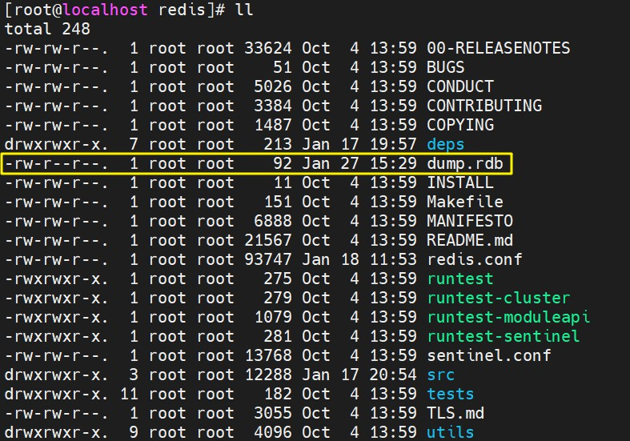
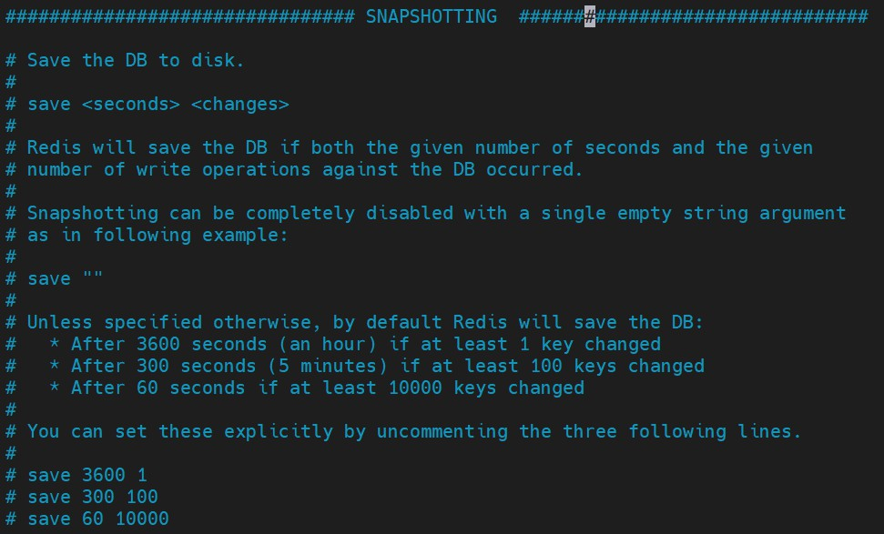
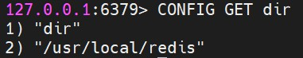
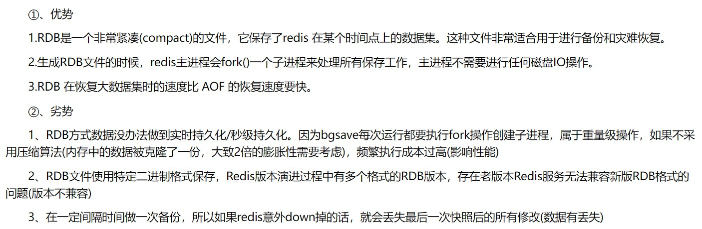
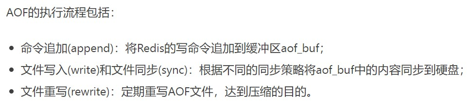
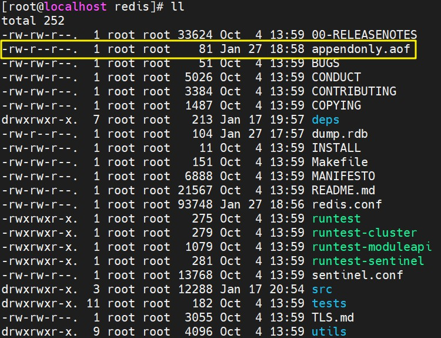
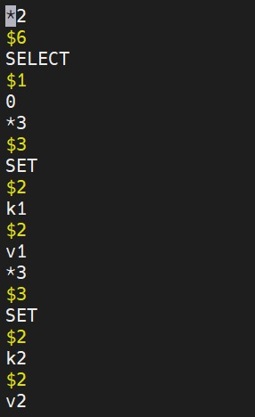
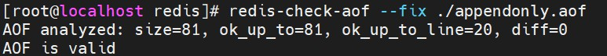
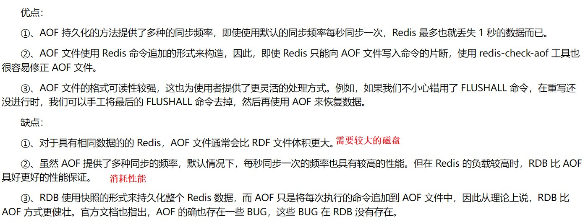

# 持久化（备份与恢复）

<br/>

## 1、概述

<br/>

- Redis 是一款内存数据库，按照常规的理解，一旦 Redis 服务关闭，内存就会被释放，数据就不复存在。但在实际使用中会发现，当正常关闭 Redis 服务后，再次启动 Redis 服务，数据不会丢失。这就是 Redis 的持久化在发挥作用。
- Redis 持久化，就是将内存中的数据写入磁盘中。
- Redis 持久化常见的策略有：RDB（Redis Database）、AOF（Append Only File）等。
- [Redis 官方关于“持久化”的文档](https://redis.io/topics/persistence)
- [https://www.jianshu.com/p/aa4b859191a7](https://www.jianshu.com/p/aa4b859191a7)


- **以下操作使用 Linux 版的 Redis 进行**。
- 以下内容仅是对 Redis 持久化的**简要**介绍，Redis 持久化是一个很复杂的话题。

---

## 2、RDB

<br/>

- RDB，全称是：Redis DataBase。
- [https://www.runoob.com/redis/redis-backup.html](https://www.runoob.com/redis/redis-backup.html)
- [https://www.cnblogs.com/ysocean/p/9114268.html](https://www.cnblogs.com/ysocean/p/9114268.html)
- RDB 是 Redis 用来进行持久化的一种方式，是把当前内存中的数据集快照写入磁盘，也就是 Snapshot 快照（数据库中所有键值对数据）。恢复时是将快照文件直接读到内存里。
- RDB 持久化策略可以分为自动、手动。
- RDB 默认持久化的结果是，在与`redis.conf`同目录下即 Redis 的安装目录下，生成一个`dump.rdb`文件。这个文件存储的就是数据的快照。Redis 服务启动时，默认会读取该文件。





### 2.1、备份数据 — 自动策略

- RDB 自动策略的相关配置在`redis.conf`配置文件中。
- 相关配置在`redis.conf`中的`SNAPSHOTTING`部分。





- 默认的自动策略是：3600秒内，也就是1个小时内，至少有1次键值对的变化（`SET`等**写**操作），自动进行一次持久化（备份）；300秒内，也就是5分钟内，至少有100次键值对的变化，自动进行一次持久化（备份）；60秒内，也就是1分钟内，至少有10000次键值对的变化，自动进行一次持久化（备份）。


```shell
# Unless specified otherwise, by default Redis will save the DB:
#   * After 3600 seconds (an hour) if at least 1 key changed
#   * After 300 seconds (5 minutes) if at least 100 keys changed
#   * After 60 seconds if at least 10000 keys changed
```


- 修改自动策略。在`redis.conf`中修改`save`配置项。配置的格式为`save <seconds> <changes>`。
  - 关闭自动策略：配置`save ""`，其余的`save`配置全部注释或删除。注意，`save ""`**只能**关闭自动策略，如果使用手动策略仍能正常持久化。
  - 其他的自动策略：配置`save <seconds> <changes>`，在`seconds`秒内至少进行`changes`次写操作自动进行一次持久化。允许有多个`save <seconds> <changes>`。
  - 以配置文件方式重启 Redis 服务。

---

### 2.2、备份数据 — 手动策略

- 手动策略，就是在 Redis 客户端显式使用命令。
- `SAVE`命令：该命令会阻塞当前 Redis 服务，执行`SAVE`命令期间，Redis 不能处理其他命令，直到 RDB 过程完成为止。
- `BGSAVE`命令：后台执行 save。

---

### 2.3、涉及 RDB 的相关配置

- `stop-writes-on-bgsave-error`：默认为`yes`。
  - 当启用了 RDB 且最后一次后台保存数据失败，Redis 是否停止接收数据。
  - 这会让用户意识到数据没有正确持久化到磁盘上，否则没有人会注意到灾难（disaster）发生了。如果 Redis 重启了，那么又可以重新开始接收数据了。
- `rdbcompression`：默认值是`yes`。
  - 对于存储到磁盘中的快照，可以设置是否进行压缩存储。
  - 如果`yes`的话，Redis 会采用 LZF 算法进行压缩。否则产生的快照会比较大。
  - 使用压缩算法，会损耗性能，但一般并会造成太大问题。
- `rdbchecksum`：默认值是`yes`。
  - 在存储快照后，是否让 Redis 使用 CRC64 算法来进行数据校验。
  - 进行校验的话会增加大约10%的性能消耗，如果希望获取到最大的性能提升，可以关闭。
- `dbfilename`：设置快照的文件名，默认是`dump.rdb`。
- `dir`：设置快照文件的存放路径。除了 RDB 策略产生的备份文件外，AOF 策略产生的日志文件的目录也受其控制。
  - 这个配置项必须是个目录。
  - 默认是`./`，即和当前配置文件保存在同一目录、Redis 的安装目录。

---

### 2.4、恢复数据

- 将备份产生的文件`dump.rdb`移动到 Redis 安装目录并重启动服务即可，Redis 就会自动加载文件数据至内存。
- Redis 服务器在载入 RDB 文件期间，会一直处于阻塞状态，直到载入工作完成为止。
- 获取 Redis 的安装目录可以使用`CONFIG GET dir`命令。





---

### 2.5、RDB 优缺点





---

## 3、AOF

<br/>

- AOF，全称：Append Only File。
- [https://www.cnblogs.com/ysocean/p/9114267.html](https://www.cnblogs.com/ysocean/p/9114267.html)
- AOF 是通过保存 Redis 服务所执行的写命令来记录数据库状态。
- 以**日志**文件的形式记录每个**写**操作。读操作不记录。





### 3.1、开启 AOF

- 默认 AOF 是没有开启的。
- 开启 AOF 仍需要先修改 Redis 配置文件`redis.conf`。
  - 1、`appendonly yes`：`appendonly`配置项默认是`no`，修改为`yes`，即开启 AOF。
  - 2、`appendfilename "appendonly.aof"`：日志文件名称。
  - 3、`dir ./`：AOF 保存文件的位置和 RDB 保存文件的位置一样，都是通过`redis.conf`配置文件的`dir`配置。默认是与`redis.conf`所在目录一致即 Redis 安装目录。
  - 4、以配置文件方式重启 Redis 服务。

---

### 3.2、尝试 AOF

- 开启 AOF 后，以配置文件方式启动 Redis 服务，在 Redis 客户端执行一些命令。


```shell
[root@localhost redis]# redis-server /usr/local/redis/redis.conf
[root@localhost redis]# redis-cli
127.0.0.1:6379> KEYS *
(empty array)
127.0.0.1:6379> SET k1 v1
OK
127.0.0.1:6379> SET k2 v2
OK
127.0.0.1:6379> KEYS *
1) "k1"
2) "k2"
127.0.0.1:6379> GET k1
"v1"
127.0.0.1:6379> GET k2
"v2"
```


- 退出 Redis 客户端，在 Redis 安装目录下，看到`appendonly.aof`这个文件。





- 可以使用 Vim 查看一下这个`appendonly.aof`文件。





- 如果想看到 AOF 的效果，可以修改`appendonly.aof`文件，删除一些日志（比如删除一个由`SET`命令产生的日志），然后关闭 Redis 服务。等再次启动 Redis 服务后，看看 Redis 中的数据。注意：Vim 修改 AOF 文件，需要使用强制保存，即`wq!`。

---

### 3.3、恢复数据

- 开启 AOF 的情况下，重启 Redis 之后就会默认进行 AOF 文件的载入。

---

### 3.4、AOF 文件修复

- 由于 AOF 的文件是可以被强制修改的，并且容易出现不符合 Redis 语法规范的错误，所以 Redis 提供了一个修复 AOF 文件的命令：


```shell
reids-check-aof --fix ./appendonly.aof
```





---

### 3.5、涉及 AOF 的相关配置

- `appendonly`：默认值为`no`。
  - AOF 策略是否开启。
  - Redis 默认只使用的是 RDB 持久化策略。
- `appendfilename`：默认值为`appendonly.aof`，AOF 文件名。
- `appendfsync`：默认值为`everysec`。
  - AOF 具体策略，也可以理解为 AOF （日志）文件追加策略，什么时候将操作数据由缓冲区写入日志文件中。
  - `no`：不执行`fsync`（同步内存中所有已修改的文件数据到储存设备，操作系统提供的函数），由操作系统保证数据同步到磁盘，但是无法保证数据安全。
  - `always`：每次写入都执行`fsync`，以保证数据（日志）**立即**同步到磁盘，效率低、性能差，但数据完整性是最好的。
  - `everysec`：表示每秒执行一次`fsync`，但如果1秒内出现宕机等，会导致丢失某1秒数据。
- `no-appendfsync-on-rewrite`：默认值为`no`。
  - [https://www.cnblogs.com/lyh233/p/13196202.html](https://www.cnblogs.com/lyh233/p/13196202.html)
- `auto-aof-rewrite-percentage`：默认值为`100`。
  - AOF 有重写机制。随着 Redis 不断的进行，AOF 的文件会越来越大，文件越大，占用磁盘越大以及 AOF 恢复要求时间越长。为了解决这个问题，Redis新增了重写机制，当AOF文件的大小超过所设定的阈值时，Redis就会启动AOF文件的内容压缩，只保留可以恢复数据的最小指令集。
  - AOF 自动重写配置，当目前 AOF 文件大小超过上一次重写的 AOF 文件大小的百分之多少进行重写，即当 AOF 文件增长到一定大小的时候，Redis 能够调用`BGREWRITEAOF`对日志文件进行重写。
- `auto-aof-rewrite-min-size`：默认值为`64mb`。
  - 设置允许重写的最小 AOF 文件大小，避免了达到约定百分比但尺寸仍然很小的情况还要重写的情况。

---

### 3.6、AOF 的优缺点





- AOF 为保证较高的数据完整性，需要付出较大的代价，较高的读写频率，较大的存储空间等。

---

## 4、RDB 与 AOF

<br/>

- 各有优缺点，配合使用最好。
- 持久化（备份与恢复）的手段不止 RDB、AOF，还有主从模式等。