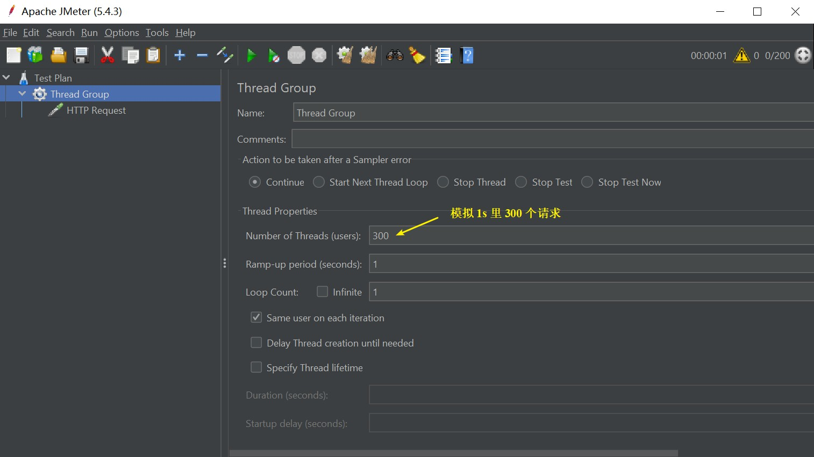
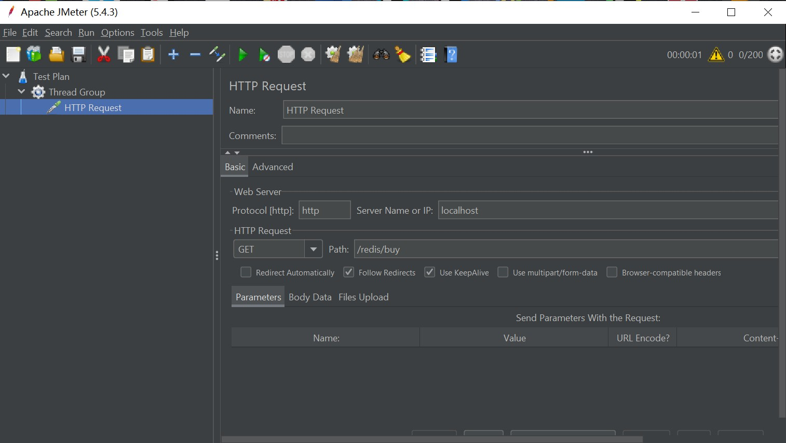
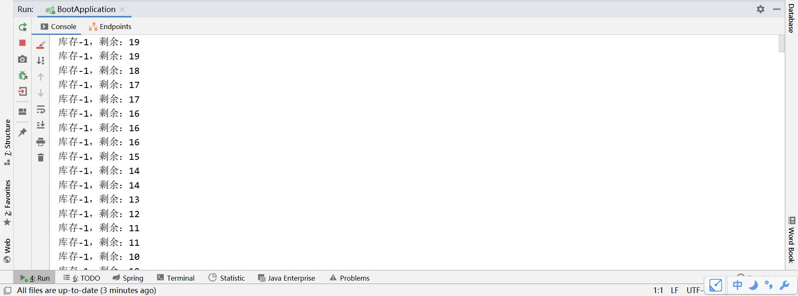
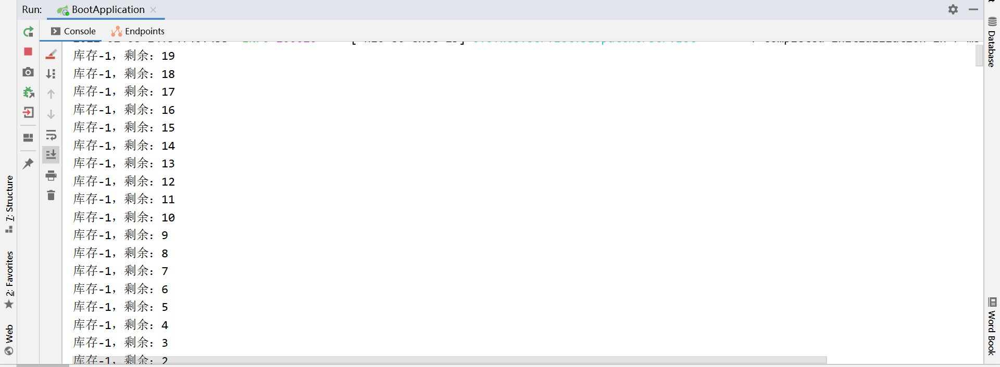
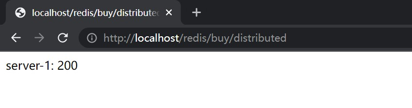
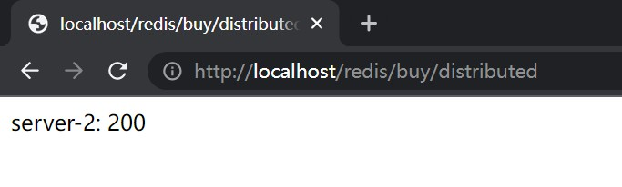
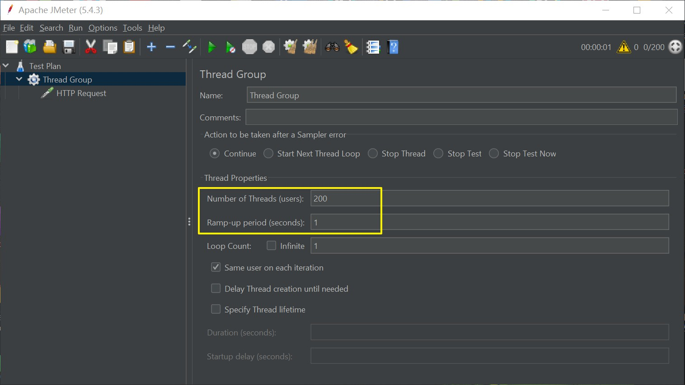
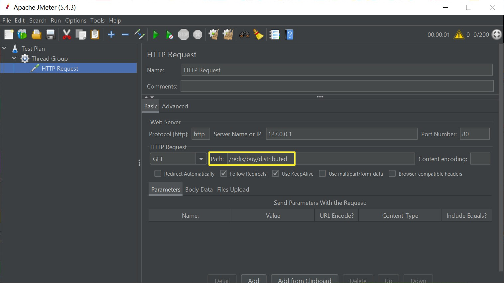
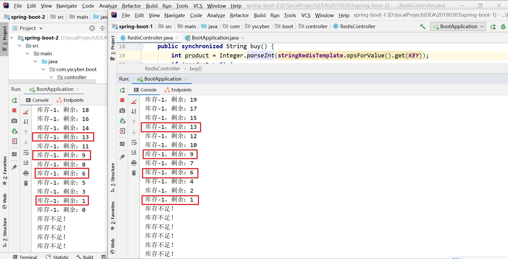
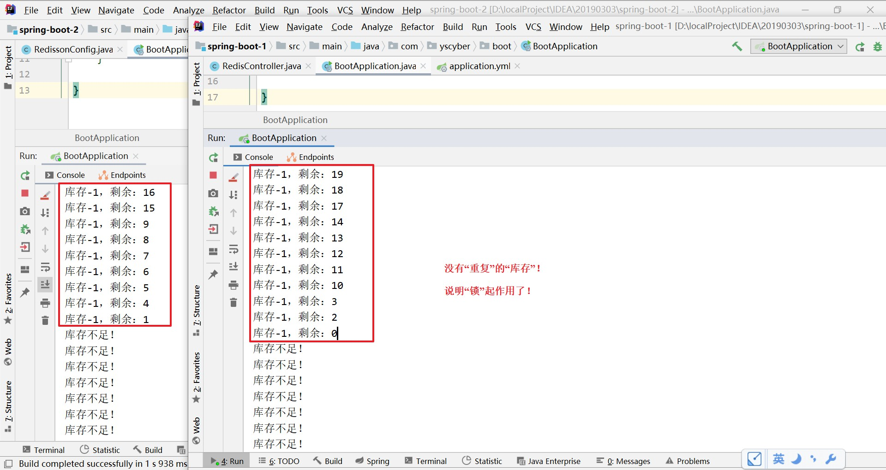

# Redis 实现分布式锁

<br/>

## 1、概述

<br/>

- 锁，解决多线程问题的重要手段。
- 在现代 Web 应用中，在高访问量的情况下是极容易出现多线程的场景的。所以多线程情景下的解决方案是必要的。
- 分布式服务情景与单机（单个服务器）服务的场景有很大的不同，但是都会面临多线程的问题。“锁”机制永远是多线程问题解决方案之一。
- 分布式锁具有一些特殊性，并且相对于单机服务情景中的“锁”，分布式锁机制更难实现，但是可以借助一些成熟的第三方库来实现分布式锁。
- 由于 Redis 是一种单线程的数据库（虽然新版本也支持多线程），所以可以**基于 Redis 实现分布式锁**。
- 除了**基于 Redis 实现分布式锁**，还有**其他的实现分布式锁的方案**。

---

## 2、单机服务场景多线程遇到的问题以及常见解决方案

<br/>

- 以模拟“抢购”为例，在 Redis 中存储一个值（或在 MySQL 等数据库中存储一个值），没发出一个请求，值减1。
- 使用 JMeter 这一测试工具，模拟“抢购”时的大量请求。


### 2.1、准备

- Redis
  - 为便于实验，各种前期准备，比如：配置防火墙，打开`6379`端口等。
  - 在 Redis 中添加一个值，执行命令`SET product 20`。或者使用 MySQL 等存储一个值。
- Maven 工程，导入依赖、配置等


```xml
<?xml version="1.0" encoding="UTF-8"?>
<project xmlns="http://maven.apache.org/POM/4.0.0"
         xmlns:xsi="http://www.w3.org/2001/XMLSchema-instance"
         xsi:schemaLocation="http://maven.apache.org/POM/4.0.0 http://maven.apache.org/xsd/maven-4.0.0.xsd">

    <modelVersion>4.0.0</modelVersion>

    <groupId>com.yscyber.boot</groupId>
    <artifactId>spring-boot-1</artifactId>
    <version>1.0</version>

    <parent>
        <groupId>org.springframework.boot</groupId>
        <artifactId>spring-boot-starter-parent</artifactId>
        <version>2.3.12.RELEASE</version>
    </parent>

    <dependencies>
        
        <dependency>
            <groupId>org.springframework.boot</groupId>
            <artifactId>spring-boot-starter-web</artifactId>
        </dependency>

        <dependency>
            <groupId>org.springframework.boot</groupId>
            <artifactId>spring-boot-starter-data-redis</artifactId>
        </dependency>

        <dependency>
            <groupId>redis.clients</groupId>
            <artifactId>jedis</artifactId>
        </dependency>

        <dependency>
            <groupId>org.apache.commons</groupId>
            <artifactId>commons-pool2</artifactId>
        </dependency>
        
        <dependency>
            <groupId>org.springframework.boot</groupId>
            <artifactId>spring-boot-devtools</artifactId>
        </dependency>

        <dependency>
            <groupId>org.projectlombok</groupId>
            <artifactId>lombok</artifactId>
            <scope>provided</scope>
        </dependency>

        <dependency>
            <groupId>org.springframework.boot</groupId>
            <artifactId>spring-boot-starter-test</artifactId>
            <scope>test</scope>
        </dependency>
        
    </dependencies>

    <build>
        <plugins>
            <plugin>
                <groupId>org.springframework.boot</groupId>
                <artifactId>spring-boot-maven-plugin</artifactId>
            </plugin>
        </plugins>
    </build>

</project>
```


```yaml
server:
  port: 80

spring:
  redis:
    host: 192.168.3.42
    port: 6379
```


---

### 2.2、编写一个 Controller

- “抢购”。每一次请求后，Redis 中的值减1。


```java
import org.springframework.beans.factory.annotation.Autowired;
import org.springframework.data.redis.core.StringRedisTemplate;
import org.springframework.web.bind.annotation.RequestMapping;
import org.springframework.web.bind.annotation.RequestMethod;
import org.springframework.web.bind.annotation.RestController;

@RestController
public class RedisController {

    private static final String KEY = "product";

    @Autowired
    private StringRedisTemplate stringRedisTemplate;

    @RequestMapping(path = "/redis/buy", method = RequestMethod.GET)
    public String buy() {
        int product = Integer.parseInt(stringRedisTemplate.opsForValue().get(KEY));
        if (product > 0) {
            product--;
            stringRedisTemplate.opsForValue().set(KEY, String.valueOf(product));
            System.out.println("库存-1，剩余：" + product);
        } else {
            System.out.println("库存不足！");
        }
        return "200";
    }

}
```


---

### 2.3、使用 JMeter 模拟大量请求








可以在控制台上的输出看到，已经出现了问题（库存数量“离谱”）：





---

### 2.4、解决方案

- 最简单的方式，使用`synchronized`关键字。


```java
import org.springframework.beans.factory.annotation.Autowired;
import org.springframework.data.redis.core.StringRedisTemplate;
import org.springframework.web.bind.annotation.RequestMapping;
import org.springframework.web.bind.annotation.RequestMethod;
import org.springframework.web.bind.annotation.RestController;

@RestController
public class RedisController {

    private static final String KEY = "product";

    @Autowired
    private StringRedisTemplate stringRedisTemplate;

    @RequestMapping(path = "/redis/buy", method = RequestMethod.GET)
    public synchronized String buy() {
        int product = Integer.parseInt(stringRedisTemplate.opsForValue().get(KEY));
        if (product > 0) {
            product--;
            stringRedisTemplate.opsForValue().set(KEY, String.valueOf(product));
            System.out.println("库存-1，剩余：" + product);
        } else {
            System.out.println("库存不足！");
        }
        return "200";
    }

}
```





---

## 3、分布式服务场景多线程遇到的问题

<br/>

- 以模拟“抢购”为例，在 Redis 中存储一个值（或在 MySQL 等数据库中存储一个值），没发出一个请求，值减1。
- 使用 JMeter 这一测试工具，模拟“抢购”时的大量请求。
- 既然是“分布式”，启动两个服务（不同端口，`8080`和`8081`），由 Nginx 实现反向代理。


### 3.1、准备

- 见 [2.1、准备](javascript:void(0);)
- Nginx
  - 为便于实验，采用 Windows 版的 Nginx。
  - 修改配置文件`nginx.conf`，让它能够对`8080`和`8081`这两个不同端口的服务实现反向代理。


```nginx
worker_processes  1;

events {
    worker_connections  1024;
}


http {
    include       mime.types;
    default_type  application/octet-stream;
    sendfile        on;
    keepalive_timeout  65;

    upstream myRedisBuy {
		server 127.0.0.1:8080;
		server 127.0.0.1:8081;
	}

    server {
        listen       80;
        server_name  localhost;
        
        location / {
            root   html;
            index  index.html index.htm;
        }

        # 访问 http://localhost:80/redis/buy/distributed 即可
        # 实现对两个不同端口服务的反向代理
        location /redis/buy/distributed {
            proxy_pass http://myRedisBuy/redis/buy;
        }

        error_page   500 502 503 504  /50x.html;
        location = /50x.html {
            root   html;
        }
    }
}
```


- 两个使用 Spring Boot 的 Maven 工程，配置不同的服务端口。


```yaml
server:
  port: 8080


spring:
  redis:
    host: 192.168.3.42
    port: 6379
```


```yaml
server:
  port: 8081


spring:
  redis:
    host: 192.168.3.42
    port: 6379
```


---

### 3.2、编写两个 Controller

- 在两个 Spring Boot 工程中分别编写。
- “抢购”。每一次请求后，Redis 中的值减1。


```java
import org.springframework.beans.factory.annotation.Autowired;
import org.springframework.data.redis.core.StringRedisTemplate;
import org.springframework.web.bind.annotation.RequestMapping;
import org.springframework.web.bind.annotation.RequestMethod;
import org.springframework.web.bind.annotation.RestController;

@RestController
public class RedisController {

    private static final String KEY = "product";

    @Autowired
    private StringRedisTemplate stringRedisTemplate;

    @RequestMapping(path = "/redis/buy", method = RequestMethod.GET)
    public synchronized String buy() {
        int product = Integer.parseInt(stringRedisTemplate.opsForValue().get(KEY));
        if (product > 0) {
            product--;
            stringRedisTemplate.opsForValue().set(KEY, String.valueOf(product));
            System.out.println("库存-1，剩余：" + product);
        } else {
            System.out.println("库存不足！");
        }
        return "server-1: 200";
    }

}
```


```java
import org.springframework.beans.factory.annotation.Autowired;
import org.springframework.data.redis.core.StringRedisTemplate;
import org.springframework.web.bind.annotation.RequestMapping;
import org.springframework.web.bind.annotation.RequestMethod;
import org.springframework.web.bind.annotation.RestController;

@RestController
public class RedisController {

    private static final String KEY = "product";

    @Autowired
    private StringRedisTemplate stringRedisTemplate;

    @RequestMapping(path = "/redis/buy", method = RequestMethod.GET)
    public synchronized String buy() {
        int product = Integer.parseInt(stringRedisTemplate.opsForValue().get(KEY));
        if (product > 0) {
            product--;
            stringRedisTemplate.opsForValue().set(KEY, String.valueOf(product));
            System.out.println("库存-1，剩余：" + product);
        } else {
            System.out.println("库存不足！");
        }
        return "server-2: 200";
    }

}
```


---

### 3.3、测试反向代理是否成功

- 启动 Nginx、Redis、两个 Spring Boot 工程。依据配置，使用浏览器访问`http://localhost:80/redis/buy/distributed`，看是否成功实现对两个服务的反向代理。








---

### 3.4、使用 JMeter 模拟大量请求








通过两个 Spring Boot 工程的控制台输出，看出问题（存在重复的“库存”）：





---

## 4、Redisson

<br/>

- 可以从 [3、分布式服务场景多线程遇到的问题](javascript:void(0);) 中看到，分布式场景下的多线程也是会出现问题的。所以，仍然需要“锁”这种机制来解决问题。
- 分布式锁机制真正实现起来对于初学者来说是比较困难的，因为需要考虑到的方面太多，所以比较稳妥的方案是借助成熟的第三方库。
- Redisson 是一款用于在 Java 程序中操作 Redis 的库。与 Jedis 是一个性质，但是比 Jedis 更为强大，尤其在分布式的场景下。
- 使用 Redisson 能够较为轻松的实现**基于 Redis 的分布式锁**。
- Redisson 官网：[https://redisson.org](https://redisson.org)


### 4.1、使用 Redisson — 准备

- 导入 Maven 依赖。


```xml
<!-- https://mvnrepository.com/artifact/org.redisson/redisson -->

<dependency>
    <groupId>org.redisson</groupId>
    <artifactId>redisson</artifactId>
    <version>3.16.8</version>
</dependency>
```


```xml
<!-- Spring Boot --->
<!-- https://mvnrepository.com/artifact/org.redisson/redisson-spring-boot-starter -->

<dependency>
    <groupId>org.redisson</groupId>
    <artifactId>redisson-spring-boot-starter</artifactId>
    <version>3.16.8</version>
</dependency>
```


- Spring Boot 工程中编写 Redisson 配置类。


```java
import org.redisson.Redisson;
import org.redisson.api.RedissonClient;
import org.redisson.config.Config;

import org.springframework.context.annotation.Bean;
import org.springframework.context.annotation.Configuration;

// 仅为简单配置
@Configuration
public class RedissonConfig {

    @Bean
    public RedissonClient redisson() {
        Config config = new Config();
        // 配置的含义：一个 Redis 服务的地址、使用该服务中的数据库索引号
        config.useSingleServer().setAddress("redis://192.168.3.42:6379").setDatabase(0);
        return Redisson.create(config);
    }

}
```


---

### 4.2、使用 Redisson — 解决分布式场景多线程的问题

- 使用 Redisson 解决上面 [3、分布式服务场景多线程遇到的问题](javascript:void(0);) 中遇到的问题。


#### 4.2.1、准备

- 见上面 [3.1、准备](javascript:void(0);)、[4.1、使用 Redisson — 准备](javascript:void(0);)。[4.1、使用 Redisson — 准备](javascript:void(0);) 中的内容在两个 Spring Boot 工程中均要进行。

---

#### 4.2.2、编写两个 Controller

- 在两个 Spring Boot 工程中分别编写。
- “抢购”。每一次请求后，Redis 中的值减1。


```java
import org.redisson.api.RLock;
import org.redisson.api.RedissonClient;

import org.springframework.beans.factory.annotation.Autowired;
import org.springframework.data.redis.core.StringRedisTemplate;
import org.springframework.web.bind.annotation.RequestMapping;
import org.springframework.web.bind.annotation.RequestMethod;
import org.springframework.web.bind.annotation.RestController;

import java.util.concurrent.TimeUnit;

@RestController
public class RedisController {

    private static final String KEY = "product";

    private static final String LOCK_NAME = "lock";

    @Autowired
    private RedissonClient redissonClient;

    @Autowired
    private StringRedisTemplate stringRedisTemplate;

    @RequestMapping(path = "/redis/buy", method = RequestMethod.GET)
    public synchronized String buy() {

        // 获取锁
        RLock rLock = redissonClient.getLock(LOCK_NAME);
        // 加锁，30s 内有效
        rLock.lock(30, TimeUnit.SECONDS);

        int product = Integer.parseInt(stringRedisTemplate.opsForValue().get(KEY));
        if (product > 0) {
            product--;
            stringRedisTemplate.opsForValue().set(KEY, String.valueOf(product));
            System.out.println("库存-1，剩余：" + product);
        } else {
            System.out.println("库存不足！");
        }
        
        // 释放锁
        rLock.unlock();
        
        return "server-1: 200";
    }

}
```


```java
import org.redisson.api.RLock;
import org.redisson.api.RedissonClient;

import org.springframework.beans.factory.annotation.Autowired;
import org.springframework.data.redis.core.StringRedisTemplate;
import org.springframework.web.bind.annotation.RequestMapping;
import org.springframework.web.bind.annotation.RequestMethod;
import org.springframework.web.bind.annotation.RestController;

import java.util.concurrent.TimeUnit;

@RestController
public class RedisController {

    private static final String KEY = "product";

    // 锁的名称，需要用同一把“锁”的时候，“锁”名要一致
    private static final String LOCK_NAME = "lock";

    @Autowired
    private StringRedisTemplate stringRedisTemplate;

    @Autowired
    private RedissonClient redissonClient;

    @RequestMapping(path = "/redis/buy", method = RequestMethod.GET)
    public synchronized String buy() {
        
        RLock rLock = redissonClient.getLock(LOCK_NAME);
        rLock.lock(30, TimeUnit.SECONDS);

        int product = Integer.parseInt(stringRedisTemplate.opsForValue().get(KEY));
        if (product > 0) {
            product--;
            stringRedisTemplate.opsForValue().set(KEY, String.valueOf(product));
            System.out.println("库存-1，剩余：" + product);
        } else {
            System.out.println("库存不足！");
        }
        
        rLock.unlock();
        
        return "server-2: 200";
    }

}
```


---

#### 4.2.3、使用 JMeter 模拟大量请求


通过两个 Spring Boot 工程的控制台输出，看出没有问题了（不存在重复的“库存”）：


