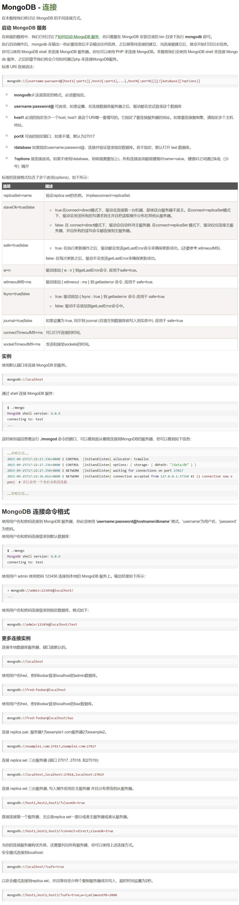

# 连接

> 时间：2022-04-18

 

## 1、概述

 

- 与 MySQL、Redis 等一样，MongoDB 属于“客户端-服务端”的软件，所以就会涉及**连接**的问题。
- [https://www.runoob.com/mongodb/mongodb-connections.html](https://www.runoob.com/mongodb/mongodb-connections.html)
- MongoDB 官方使用文档：[https://www.mongodb.com/docs/manual/tutorial/getting-started](https://www.mongodb.com/docs/manual/tutorial/getting-started)

---

## 2、连接字符串格式（Connection String URI Format）

 

- 官方文档：[https://www.mongodb.com/docs/manual/reference/connection-string](https://www.mongodb.com/docs/manual/reference/connection-string)
- [https://www.runoob.com/mongodb/mongodb-connections.html](https://www.runoob.com/mongodb/mongodb-connections.html)

