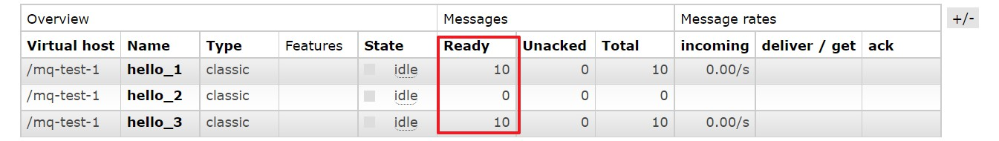
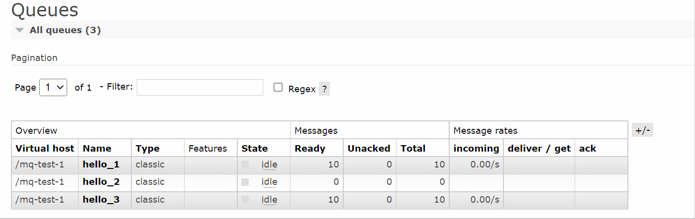

# 消费端限流

<br/>

## 1、概述

<br/>

- 消息消费者，处理消息的能力是有限的，如果大量的消息“涌入”消费者，消费者肯定是无法承受，甚至导致崩溃。
- 在实际场景中，对消息的生产端限流是不可取的。
- RabbitMQ 提供了一种 QoS （Quality of Service，服务质量）服务质量保证功能，即消息消费者在非自动确认（手动确认）消息的前提下，如果一定数目的消息未被确认前，不再进行消费（接收）新的消息。

---

## 2、Java 代码实现

<br/>

### 2.1、Spring 消息生产者


```xml
<?xml version="1.0" encoding="UTF-8"?>
<beans xmlns:xsi="http://www.w3.org/2001/XMLSchema-instance"
       xmlns="http://www.springframework.org/schema/beans"
       xmlns:rabbit="http://www.springframework.org/schema/rabbit"
       xsi:schemaLocation="http://www.springframework.org/schema/rabbit https://www.springframework.org/schema/rabbit/spring-rabbit.xsd
       http://www.springframework.org/schema/beans https://www.springframework.org/schema/beans/spring-beans.xsd">

    <!-- 连接配置 -->
    <rabbit:connection-factory id="connectionFactory" host="192.168.3.42" port="5672" username="admin" password="yyss" virtual-host="/mq-test-1" />
    
    <rabbit:admin connection-factory="connectionFactory" />

    <!-- 队列配置：创建或获取队列 -->
    <!-- durable：该消息队列是否进行持久化 -->
    <rabbit:queue name="hello_1" durable="false" />
    <rabbit:queue name="hello_2" durable="false" />
    <rabbit:queue name="hello_3" durable="false" />

    <!-- 交换机配置：创建交换机 -->
    <!-- topic-exchange：topic 类型的交换机 -->
    <rabbit:topic-exchange name="spring_test_exchange_topic_consumer_limit" durable="false">
        <!-- 交换机绑定消息队列配置 -->
        <rabbit:bindings>
            <rabbit:binding pattern="com.yscyber.mq.*" queue="hello_1" />
            <rabbit:binding pattern="com.yscyber.redis.*" queue="hello_2" />
            <rabbit:binding pattern="com.yscyber.#" queue="hello_3" />
        </rabbit:bindings>
    </rabbit:topic-exchange>

    <!-- 配置 JSON 数据转换器 -->
    <bean id="jsonMessageConverter" class="org.springframework.amqp.support.converter.Jackson2JsonMessageConverter" />

    <rabbit:template id="rabbitTemplate" connection-factory="connectionFactory" exchange="spring_test_exchange_topic_consumer_limit" message-converter="jsonMessageConverter" />
</beans>
```


```java
import org.junit.Test;
import org.junit.runner.RunWith;

import org.springframework.amqp.rabbit.core.RabbitTemplate;

import org.springframework.beans.factory.annotation.Autowired;

import org.springframework.test.context.ContextConfiguration;
import org.springframework.test.context.junit4.SpringJUnit4ClassRunner;

import java.util.HashMap;
import java.util.Map;

@RunWith(SpringJUnit4ClassRunner.class)
@ContextConfiguration(locations = "classpath:rabbitmq-sender-application-context.xml")
public class SpringRabbitMQTest {

    @Autowired
    private RabbitTemplate rabbitTemplate;

    @Test
    public void senderTest() {
        Map<String, String> msgContent1 = new HashMap<>();
        msgContent1.put("log-time", "2022-02-16 18:56:12");
        msgContent1.put("log-api", "com.yscyber.mq.api.ApiGetAllStudents");
        msgContent1.put("log-content", "[Error] Unauthorized access");

        // 发送消息
        // 模拟向消息队列发送大量消息，造成“消息堆积”
        for (int i = 1; i <= 10; i++) {
            rabbitTemplate.convertAndSend("com.yscyber.mq.api", msgContent1);
        }
        
    }

}
```


- 运行上面测试类中的方法，模拟在消息队列中造成“消息堆积”。





---

### 2.2、Spring 消息消费者

- 消息消费者因为消息队列中消息“堆积”，如果没有进行“限流”，当启动消息消费者时，大量消息“涌入”，可能会导致消费端无法“承受”、甚至崩溃。

- 1、编写消息处理类。继承`org.springframework.amqp.rabbit.listener.adapter.AbstractAdaptableMessageListener`类，这个类是在 Spring 容器接收到消息后用于处理消息的抽象基类。


```java
import com.fasterxml.jackson.databind.JsonNode;
import com.fasterxml.jackson.databind.ObjectMapper;

import com.rabbitmq.client.Channel;

import org.springframework.amqp.core.Message;
import org.springframework.amqp.rabbit.listener.adapter.AbstractAdaptableMessageListener;
import org.springframework.stereotype.Component;

import java.io.IOException;

/**
 * 消息处理类
 * 消息消费者从消息队列中获取消息后如何处理
 */
@Component
public class MyConsumerListener extends AbstractAdaptableMessageListener {

    private static final ObjectMapper OBJECT_MAPPER = new ObjectMapper();

    @Override
    public void onMessage(Message message, Channel channel) throws Exception {
        try {
            JsonNode jsonNode =  OBJECT_MAPPER.readTree(message.getBody());
            String logTime = jsonNode.get("log-time").asText();
            String logApi = jsonNode.get("log-api").asText();
            String logContent = jsonNode.get("log-content").asText();
            System.out.println("Log Time: " + logTime);
            System.out.println("Log API: " + logApi);
            System.out.println("Log Content: " + logContent + "\n");

            // deliveryTag 相当于消息的 id
            // 仅在同一个 Channel 下，这个 delivery tag 才有效
            // delivery tag 是正整数，单调递增的，接收到的第 2 条消息比第 1 条消息的 delivery tag 大
            long deliveryTag = message.getMessageProperties().getDeliveryTag();

            // 手动确认消息 ACK
            // 参数1：要确认消息的 id
            // 参数2：手动确认是否被批处理，当该参数为 true 时，则可以一次性确认小于等于 delivery_tag（参数1） 的所有消息
            channel.basicAck(deliveryTag, true);
            
            // 模拟消息处理的时间
            Thread.sleep(3000);
        } catch (IOException e) {
            e.printStackTrace();
        }
    }
    
}
```


- 2、配置文件。


```xml
<?xml version="1.0" encoding="UTF-8"?>
<beans xmlns:xsi="http://www.w3.org/2001/XMLSchema-instance"
       xmlns="http://www.springframework.org/schema/beans"
       xmlns:rabbit="http://www.springframework.org/schema/rabbit"
       xmlns:context="http://www.springframework.org/schema/context"
       xsi:schemaLocation="http://www.springframework.org/schema/rabbit https://www.springframework.org/schema/rabbit/spring-rabbit.xsd
       http://www.springframework.org/schema/beans https://www.springframework.org/schema/beans/spring-beans.xsd
       http://www.springframework.org/schema/context https://www.springframework.org/schema/context/spring-context.xsd">

    <!-- 注解 包扫描 -->
    <context:component-scan base-package="com.yscyber.mq.receiver" />
    
    <!-- 连接配置 -->
    <rabbit:connection-factory id="connectionFactory" host="192.168.3.42" port="5672" username="admin" password="yyss" virtual-host="/mq-test-1" />
    
    <rabbit:admin connection-factory="connectionFactory" />

    <bean id="jsonMessageConverter" class="org.springframework.amqp.support.converter.Jackson2JsonMessageConverter" />

    <!-- 消息消费者监听的队列 -->
    
    <!-- prefetch：一次性消费的消息数量，告诉 RabbitMQ 不要同时给一个消费者推送多于 N 个消息，一旦有 N 个消息还没有 ACK，则该 Consumer 将阻塞，直到消息被 ACK -->
    <!-- acknowledge="manual"：手动 ACK -->
    <rabbit:listener-container connection-factory="connectionFactory" message-converter="jsonMessageConverter" prefetch="3" acknowledge="manual">
        <rabbit:listener ref="myConsumerListener" queue-names="hello_3" />
    </rabbit:listener-container>

</beans>
```


- 可以看到`Unacked`一列是`3`。说明`prefetch="3"`配置在起“限流”的作用。


