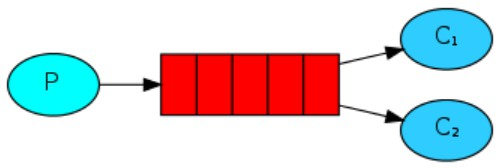
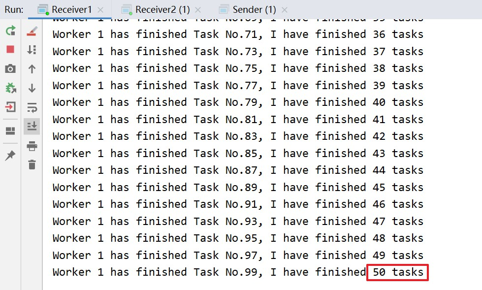
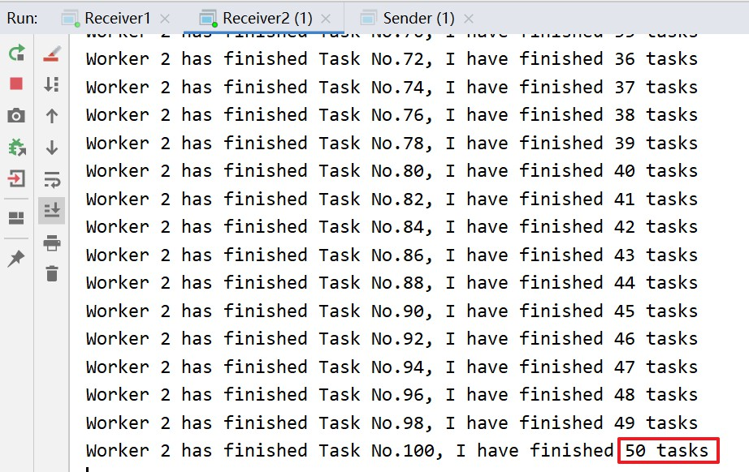
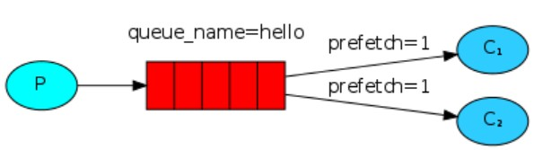
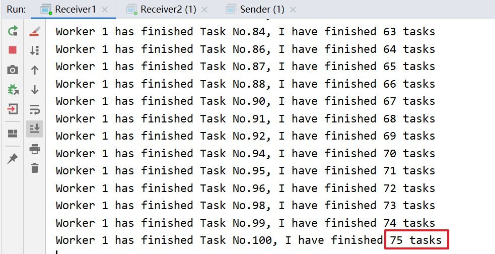
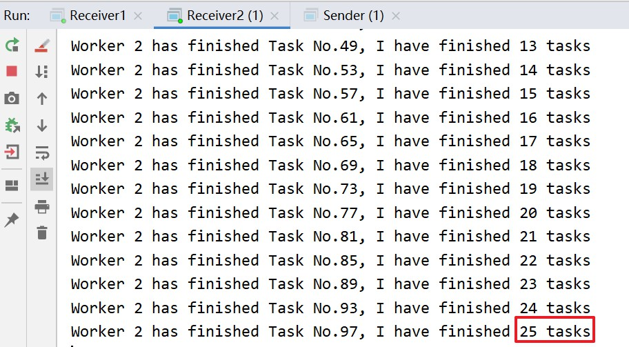

# 消息模型 — Work Queues

<br/>

## 1、概述

<br/>

- [https://www.rabbitmq.com/tutorials/tutorial-two-java.html](https://www.rabbitmq.com/tutorials/tutorial-two-java.html)
- Work Queues 模型面对的场景是通过 MQ 向“消息接收方”分配、调度任务。多个消费者监听同一个消息队列。

---

## 2、详情

- In the [first tutorial](https://www.rabbitmq.com/tutorials/tutorial-one-java.html) we wrote programs to send and receive messages from a named queue. In this one we'll create a *Work Queue* that will be used to distribute time-consuming tasks among multiple workers.
- 用于任务分配的消息队列。
- The main idea behind Work Queues (aka: Task Queues) is to avoid doing a resource-intensive task immediately and having to wait for it to complete. Instead we schedule the task to be done later. We encapsulate a task as a message and send it to a queue. A worker process running in the background will pop the tasks and eventually execute the job. When you run many workers the tasks will be shared between them.
- 能够通过消息队列形成一种“能者多劳”的局面，所谓“能者多劳”，就是将现有资源最大程度的利用，“消息接收者”接收一个任务消息并反馈 ACK 确认后，立即再从消息队列中再获取一个新的任务消息。形象的比喻：某种产品需要人工进行打包，有很多工人，每个工人成功打包一个后才能进行下一个打包，这样，就看工人的打包效率，打包效率高的，最终打包的产品就多，打包效率低的，最终打包的产品就少。





---

## 3、Java 代码实现

<br/>

### 3.1、常规

- 非公平分配（调度），效率高的和效率低的最终的完成的任务数量是一样的。


```java
import com.rabbitmq.client.Channel;
import com.rabbitmq.client.Connection;
import com.rabbitmq.client.ConnectionFactory;

import java.io.IOException;
import java.nio.charset.StandardCharsets;
import java.util.concurrent.TimeoutException;

public class Sender {

    private static final String MQ_HOST = "192.168.3.42";

    private static final int MQ_PORT = 5672;

    private static final String MQ_USERNAME = "admin";

    private static final String MQ_PASSWORD = "yyss";

    private static final String MQ_VIRTUAL_HOST = "/mq-test-1";

    private static final String MQ_QUEUE_NAME = "hello";

    public static void main(String[] args) {
        String msgPrefix = "Task No.";

        try {
            // 1、与 MQ 服务建立连接
            Connection connection = connection();

            // 2、在连接中创建信道
            Channel channel = connection.createChannel();

            // 3、创建消息队列
            channel.queueDeclare(MQ_QUEUE_NAME, false, false, false, null);

            // 4、将消息发送至指定的队列中
            // 放入多个消息进入队列
            for (int i = 1; i <= 100; i++) {
                String msg = msgPrefix + i;
                channel.basicPublish("", MQ_QUEUE_NAME, null, msg.getBytes(StandardCharsets.UTF_8));
                System.out.println("Tasks No. " + i + " finish creating!");

            }
            System.out.println("All Tasks finish creating!");

            // 5、关闭信道
            channel.close();

            // 6、关闭连接
            connectionClose(connection);
        } catch (IOException | TimeoutException e) {
            e.printStackTrace();
        }
    }

    /**
     * 简易与 MQ 服务建立连接
     */
    private static Connection connection() {
        ConnectionFactory connectionFactory = new ConnectionFactory();

        connectionFactory.setHost(MQ_HOST);
        connectionFactory.setPort(MQ_PORT);
        connectionFactory.setVirtualHost(MQ_VIRTUAL_HOST);
        connectionFactory.setUsername(MQ_USERNAME);
        connectionFactory.setPassword(MQ_PASSWORD);

        Connection connection = null;

        try {
            connection = connectionFactory.newConnection();
        } catch (IOException | TimeoutException e) {
            e.printStackTrace();
        }

        return connection;
    }

    private static void connectionClose(Connection connection) {
        if (connection != null) {
            try {
                connection.close();
            } catch (IOException e) {
                e.printStackTrace();
            }
        }
    }

}
```


```java
import com.rabbitmq.client.*;

import java.io.IOException;
import java.nio.charset.StandardCharsets;
import java.util.concurrent.TimeoutException;

public class Receiver1 {

    private static final String MQ_HOST = "192.168.3.42";

    private static final int MQ_PORT = 5672;

    private static final String MQ_USERNAME = "admin";

    private static final String MQ_PASSWORD = "yyss";

    private static final String MQ_VIRTUAL_HOST = "/mq-test-1";

    private static final String MQ_QUEUE_NAME = "hello";

    private static int finishedCount = 0;

    public static void main(String[] args) {
        try {
            // 1、与 MQ 服务建立连接
            Connection connection = connection();

            // 2、在连接中创建信道
            Channel channel = connection.createChannel();

            // 3、声明队列（当队列已存在时，仅获取该消息队列；当队列不存在时，创建消息队列）
            channel.queueDeclare(MQ_QUEUE_NAME, false, false, false, null);

            // 4、获取消息后如何处理、回调
            Consumer consumer = new DefaultConsumer(channel) {
                @Override
                public void handleDelivery(String consumerTag, Envelope envelope, AMQP.BasicProperties properties, byte[] body) throws IOException {
                    String msg = new String(body, StandardCharsets.UTF_8);
                    finishedCount++;
                    System.out.println("Worker 1 has finished " + msg + ", I have finished " + finishedCount + " tasks");

                    try {
                        // 使用 Thread.sleep 模拟不同的任务效率，时间越长表示效率越低
                        Thread.sleep(300);
                    } catch (InterruptedException e) {
                        e.printStackTrace();
                    }

                    this.getChannel().basicAck(envelope.getDeliveryTag(), false);
                }
            };

            // 5、从消息队列中获取消息
            channel.basicConsume(MQ_QUEUE_NAME, false, consumer);
        } catch (IOException e) {
            e.printStackTrace();
        }
    }

    /**
     * 简易与 MQ 服务建立连接
     */
    private static Connection connection() {
        ConnectionFactory connectionFactory = new ConnectionFactory();

        connectionFactory.setHost(MQ_HOST);
        connectionFactory.setPort(MQ_PORT);
        connectionFactory.setVirtualHost(MQ_VIRTUAL_HOST);
        connectionFactory.setUsername(MQ_USERNAME);
        connectionFactory.setPassword(MQ_PASSWORD);

        Connection connection = null;

        try {
            connection = connectionFactory.newConnection();
        } catch (IOException | TimeoutException e) {
            e.printStackTrace();
        }

        return connection;
    }

    private static void connectionClose(Connection connection) {
        if (connection != null) {
            try {
                connection.close();
            } catch (IOException e) {
                e.printStackTrace();
            }
        }
    }

}
```


```java
import com.rabbitmq.client.*;

import java.io.IOException;
import java.nio.charset.StandardCharsets;
import java.util.concurrent.TimeoutException;

public class Receiver2 {

    private static final String MQ_HOST = "192.168.3.42";

    private static final int MQ_PORT = 5672;

    private static final String MQ_USERNAME = "admin";

    private static final String MQ_PASSWORD = "yyss";

    private static final String MQ_VIRTUAL_HOST = "/mq-test-1";

    private static final String MQ_QUEUE_NAME = "hello";

    private static int finishedCount = 0;

    public static void main(String[] args) {
        try {
            // 1、与 MQ 服务建立连接
            Connection connection = connection();

            // 2、在连接中创建信道
            Channel channel = connection.createChannel();

            // 3、声明队列（当队列已存在时，仅获取该消息队列；当队列不存在时，创建消息队列）
            channel.queueDeclare(MQ_QUEUE_NAME, false, false, false, null);

            // 4、获取消息后如何处理、回调
            Consumer consumer = new DefaultConsumer(channel) {
                @Override
                public void handleDelivery(String consumerTag, Envelope envelope, AMQP.BasicProperties properties, byte[] body) throws IOException {
                    String msg = new String(body, StandardCharsets.UTF_8);
                    finishedCount++;
                    System.out.println("Worker 2 has finished " + msg + ", I have finished " + finishedCount + " tasks");

                    try {
                        // 使用 Thread.sleep 模拟不同的任务效率，时间越长表示效率越低
                        Thread.sleep(900);
                    } catch (InterruptedException e) {
                        e.printStackTrace();
                    }

                    this.getChannel().basicAck(envelope.getDeliveryTag(), false);
                }
            };
            
            // 5、从消息队列中获取消息
            channel.basicConsume(MQ_QUEUE_NAME, false, consumer);
        } catch (IOException e) {
            e.printStackTrace();
        }
    }

    /**
     * 简易与 MQ 服务建立连接
     */
    private static Connection connection() {
        ConnectionFactory connectionFactory = new ConnectionFactory();

        connectionFactory.setHost(MQ_HOST);
        connectionFactory.setPort(MQ_PORT);
        connectionFactory.setVirtualHost(MQ_VIRTUAL_HOST);
        connectionFactory.setUsername(MQ_USERNAME);
        connectionFactory.setPassword(MQ_PASSWORD);

        Connection connection = null;

        try {
            connection = connectionFactory.newConnection();
        } catch (IOException | TimeoutException e) {
            e.printStackTrace();
        }

        return connection;
    }

    private static void connectionClose(Connection connection) {
        if (connection != null) {
            try {
                connection.close();
            } catch (IOException e) {
                e.printStackTrace();
            }
        }
    }

}
```


- 上述代码，先执行`Receiver1`类和`Receiver2`类的`main`方法，再执行`Sender`类的`main`方法。因为`Receiver1`和`Receiver2`的代码中没有关闭信道、连接的代码，所以运行之后，就在那一直等待消息队列中的消息。
- 上述代码最后的执行结果是，`Receiver1`和`Receiver2`都“各自完成了任务总量的一半”。








---

### 3.2、公平分配 Fair dispatch

- [3.1、常规](javascript:void(0);) 中是 RabbitMQ 面对这种场景的默认机制，非公平的一种分配。“效率高的”和“效率低的”各自从同一个消息队列中获取到相同数量的消息。这样的机制，显然不是大家所期待的。
- 公平分配（Fair dispatch），也就是“能者多劳”，哪个消息接收者的“效率高”，谁就能从消息队列中获取数量更多的消息。RabbitMQ 能够实现这样的机制。
- 非公平分配是因为 RabbitMQ 默认情况只是在消息进入队列时分派消息。它不查看消费者未确认消息的数量。它只是盲目地将第 n 个消息发送给第 n 个消费者。
- 公平分配，给每个消息接收者预先设定一个值（prefetch），假设为`n`，在 RabbitMQ 服务没有收到来自消息接收者的`n`个消息确认 ACK 之前，消息队列不再将消息分配给这个消息接收者。
- 仅在**手动**消息确认 ACK 该机制才有效。





```java
import com.rabbitmq.client.Channel;
import com.rabbitmq.client.Connection;
import com.rabbitmq.client.ConnectionFactory;

import java.io.IOException;
import java.nio.charset.StandardCharsets;
import java.util.concurrent.TimeoutException;

public class Sender {

    private static final String MQ_HOST = "192.168.3.42";

    private static final int MQ_PORT = 5672;

    private static final String MQ_USERNAME = "admin";

    private static final String MQ_PASSWORD = "yyss";

    private static final String MQ_VIRTUAL_HOST = "/mq-test-1";

    private static final String MQ_QUEUE_NAME = "hello";

    public static void main(String[] args) {
        String msgPrefix = "Task No.";

        try {
            // 1、与 MQ 服务建立连接
            Connection connection = connection();

            // 2、在连接中创建信道
            Channel channel = connection.createChannel();

            // 3、创建消息队列
            channel.queueDeclare(MQ_QUEUE_NAME, false, false, false, null);

            for (int i = 1; i <= 100; i++) {
                // 4、将消息发送至指定的队列中
                String msg = msgPrefix + i;
                channel.basicPublish("", MQ_QUEUE_NAME, null, msg.getBytes(StandardCharsets.UTF_8));
                System.out.println("Tasks No. " + i + " finish creating!");

            }
            System.out.println("All Tasks finish creating!");

            // 5、关闭信道
            channel.close();

            // 6、关闭连接
            connectionClose(connection);
        } catch (IOException | TimeoutException e) {
            e.printStackTrace();
        }
    }

    /**
     * 简易与 MQ 服务建立连接
     */
    private static Connection connection() {
        ConnectionFactory connectionFactory = new ConnectionFactory();

        connectionFactory.setHost(MQ_HOST);
        connectionFactory.setPort(MQ_PORT);
        connectionFactory.setVirtualHost(MQ_VIRTUAL_HOST);
        connectionFactory.setUsername(MQ_USERNAME);
        connectionFactory.setPassword(MQ_PASSWORD);

        Connection connection = null;

        try {
            connection = connectionFactory.newConnection();
        } catch (IOException | TimeoutException e) {
            e.printStackTrace();
        }

        return connection;
    }

    private static void connectionClose(Connection connection) {
        if (connection != null) {
            try {
                connection.close();
            } catch (IOException e) {
                e.printStackTrace();
            }
        }
    }

}
```


```java
import com.rabbitmq.client.*;

import java.io.IOException;
import java.nio.charset.StandardCharsets;
import java.util.concurrent.TimeoutException;

public class Receiver1 {

    private static final String MQ_HOST = "192.168.3.42";

    private static final int MQ_PORT = 5672;

    private static final String MQ_USERNAME = "admin";

    private static final String MQ_PASSWORD = "yyss";

    private static final String MQ_VIRTUAL_HOST = "/mq-test-1";

    private static final String MQ_QUEUE_NAME = "hello";

    private static int finishedCount = 0;

    public static void main(String[] args) {
        try {
            // 1、与 MQ 服务建立连接
            Connection connection = connection();

            // 2、在连接中创建信道
            Channel channel = connection.createChannel();

            // 3、声明队列（当队列已存在时，仅获取该消息队列）
            channel.queueDeclare(MQ_QUEUE_NAME, false, false, false, null);

            // 在没有处理完1个消息之前，消息队列不再分配
            channel.basicQos(1);

            // 4、获取消息后如何处理、回调
            Consumer consumer = new DefaultConsumer(channel) {
                @Override
                public void handleDelivery(String consumerTag, Envelope envelope, AMQP.BasicProperties properties, byte[] body) throws IOException {
                    String msg = new String(body, StandardCharsets.UTF_8);
                    finishedCount++;
                    System.out.println("Worker 1 has finished " + msg + ", I have finished " + finishedCount + " tasks");

                    try {
                        // 使用 Thread.sleep 模拟不同的任务效率，时间越长表示效率越低
                        Thread.sleep(300);
                    } catch (InterruptedException e) {
                        e.printStackTrace();
                    }

                    this.getChannel().basicAck(envelope.getDeliveryTag(), false);
                }

            };

            // 5、从消息队列中获取消息
            channel.basicConsume(MQ_QUEUE_NAME, false, consumer);
        } catch (IOException e) {
            e.printStackTrace();
        }
    }

    /**
     * 简易与 MQ 服务建立连接
     */
    private static Connection connection() {
        ConnectionFactory connectionFactory = new ConnectionFactory();

        connectionFactory.setHost(MQ_HOST);
        connectionFactory.setPort(MQ_PORT);
        connectionFactory.setVirtualHost(MQ_VIRTUAL_HOST);
        connectionFactory.setUsername(MQ_USERNAME);
        connectionFactory.setPassword(MQ_PASSWORD);

        Connection connection = null;

        try {
            connection = connectionFactory.newConnection();
        } catch (IOException | TimeoutException e) {
            e.printStackTrace();
        }

        return connection;
    }

    private static void connectionClose(Connection connection) {
        if (connection != null) {
            try {
                connection.close();
            } catch (IOException e) {
                e.printStackTrace();
            }
        }
    }

}
```


```java
import com.rabbitmq.client.*;

import java.io.IOException;
import java.nio.charset.StandardCharsets;
import java.util.concurrent.TimeoutException;

public class Receiver2 {

    private static final String MQ_HOST = "192.168.3.42";

    private static final int MQ_PORT = 5672;

    private static final String MQ_USERNAME = "admin";

    private static final String MQ_PASSWORD = "yyss";

    private static final String MQ_VIRTUAL_HOST = "/mq-test-1";

    private static final String MQ_QUEUE_NAME = "hello";

    private static int finishedCount = 0;

    public static void main(String[] args) {
        try {
            // 1、与 MQ 服务建立连接
            Connection connection = connection();

            // 2、在连接中创建信道
            Channel channel = connection.createChannel();

            // 3、声明队列（当队列已存在时，仅获取该消息队列）
            channel.queueDeclare(MQ_QUEUE_NAME, false, false, false, null);

            // 在没有处理完1个消息之前，消息队列不再分配
            channel.basicQos(1);

            // 4、获取消息后如何处理、回调
            Consumer consumer = new DefaultConsumer(channel) {
                @Override
                public void handleDelivery(String consumerTag, Envelope envelope, AMQP.BasicProperties properties, byte[] body) throws IOException {
                    String msg = new String(body, StandardCharsets.UTF_8);
                    finishedCount++;
                    System.out.println("Worker 2 has finished " + msg + ", I have finished " + finishedCount + " tasks");

                    try {
                        // 使用 Thread.sleep 模拟不同的任务效率，时间越长表示效率越低
                        Thread.sleep(900);
                    } catch (InterruptedException e) {
                        e.printStackTrace();
                    }

                    this.getChannel().basicAck(envelope.getDeliveryTag(), false);
                }

            };
            
            // 5、从消息队列中获取消息
            channel.basicConsume(MQ_QUEUE_NAME, false, consumer);
        } catch (IOException e) {
            e.printStackTrace();
        }
    }

    /**
     * 简易与 MQ 服务建立连接
     */
    private static Connection connection() {
        ConnectionFactory connectionFactory = new ConnectionFactory();

        connectionFactory.setHost(MQ_HOST);
        connectionFactory.setPort(MQ_PORT);
        connectionFactory.setVirtualHost(MQ_VIRTUAL_HOST);
        connectionFactory.setUsername(MQ_USERNAME);
        connectionFactory.setPassword(MQ_PASSWORD);

        Connection connection = null;

        try {
            connection = connectionFactory.newConnection();
        } catch (IOException | TimeoutException e) {
            e.printStackTrace();
        }

        return connection;
    }

    private static void connectionClose(Connection connection) {
        if (connection != null) {
            try {
                connection.close();
            } catch (IOException e) {
                e.printStackTrace();
            }
        }
    }

}
```


- 上述代码，先执行`Receiver1`类和`Receiver2`类的`main`方法，再执行`Sender`类的`main`方法。
- 上述代码最后的执行结果是，`Receiver1`和`Receiver2`“分别完成基于各自效率的任务数量”。





