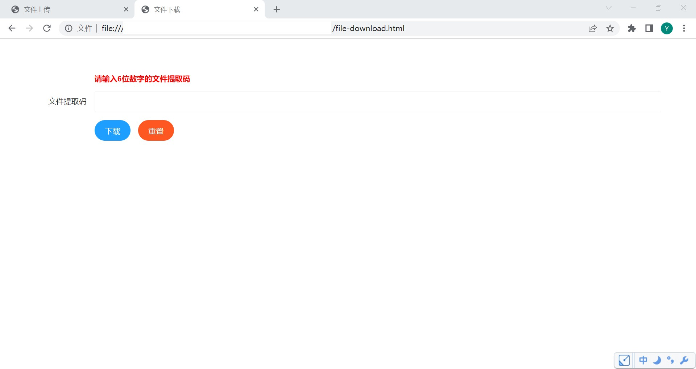

# 简单使用 — 简单的文件上传与下载的 Java Web 程序

<br/>

> 时间：2022-04-01

<br/>

## 1、概述

<br/>

- Maven 工程（单体 Maven 工程）。使用传统的 Spring 完成一个实现简单文件上传与下载的。
- FastDFS 是简单的单机部署（Tracker Server 与 Storage Server 部署在同一机器上），结合 Nginx（Nginx 与 FastDFS 均部署在同一机器上）。
- 程序流程：一个简易、不是十分完善的程序。类似于收快递时的快递柜。A 用户上传文件至服务器，上传成功后返回到一个“码”，将这个“码”发送给需要的用户，用户通过这个“码”获取文件（可以参考：[https://airportal.cn](https://airportal.cn)）。

---

## 2、准备

<br/>

### 2.1、相关软件版本

|                   软件                   |    版本     |
| :--------------------------------------: | :---------: |
|                  Maven                   |    3.8.1    |
|                  Tomcat                  |   8.5.66    |
|                 FastDFS                  |    6.08     |
|    libfastcommon（FastDFS 必要组件）     |    1.57     |
| fastdfs-nginx-module（FastDFS 必要组件） |    1.22     |
|                  Nginx                   |   1.20.2    |
|                  Redis                   |    6.2.6    |
|                   JDK                    | 11.0.10 LTS |


---

### 2.2、流程

- 上传文件：上传单个文件，大小有限制。文件上传至 FastDFS。生成的文件获取码与 FastDFS 生成的文件 id 形成键值对存入 Redis。
- 下载文件：通过文件获取码下载文件。文件下载后，Redis 中相应的键值对删除且 FastDFS 中相应的文件删除（文件只能下载一次）。

---

### 2.3、前后端技术

- 前端：HTML + JavaScript（jQuery、Ajax）+ Layui（弹窗等组件），由于是一个简易 Demo，就不使用较为复杂的前端框架
- 后端：Spring MVC 等
- 前后端交互：JSON 格式数据

---

### 2.4、Maven 依赖

- 注意版本号。


```xml
<?xml version="1.0" encoding="UTF-8"?>
<project xmlns="http://maven.apache.org/POM/4.0.0"
         xmlns:xsi="http://www.w3.org/2001/XMLSchema-instance"
         xsi:schemaLocation="http://maven.apache.org/POM/4.0.0 http://maven.apache.org/xsd/maven-4.0.0.xsd">

    <modelVersion>4.0.0</modelVersion>

    <groupId>com.yscyber.fastdfs</groupId>
    <artifactId>fastdfs-transfer-1</artifactId>
    <version>1.0</version>

    <packaging>war</packaging>

    <properties>
        <project.build.sourceEncoding>UTF-8</project.build.sourceEncoding>
        <maven.compiler.source>1.8</maven.compiler.source>
        <maven.compiler.target>1.8</maven.compiler.target>
    </properties>

    <dependencies>
        <dependency>
            <groupId>javax.servlet</groupId>
            <artifactId>javax.servlet-api</artifactId>
            <version>4.0.1</version>
            <scope>provided</scope>
        </dependency>

        <dependency>
            <groupId>org.springframework</groupId>
            <artifactId>spring-webmvc</artifactId>
            <version>5.3.8</version>
        </dependency>

        <dependency>
            <groupId>com.fasterxml.jackson.core</groupId>
            <artifactId>jackson-databind</artifactId>
            <version>2.12.3</version>
        </dependency>

        <dependency>
            <groupId>redis.clients</groupId>
            <artifactId>jedis</artifactId>
            <version>3.8.0</version>
        </dependency>

        <dependency>
            <groupId>org.apache.commons</groupId>
            <artifactId>commons-pool2</artifactId>
            <version>2.11.1</version>
        </dependency>

        <dependency>
            <groupId>org.springframework.data</groupId>
            <artifactId>spring-data-redis</artifactId>
            <version>2.6.1</version>
        </dependency>

        <dependency>
            <groupId>commons-fileupload</groupId>
            <artifactId>commons-fileupload</artifactId>
            <version>1.4</version>
        </dependency>

        <dependency>
            <groupId>org.csource</groupId>
            <artifactId>fastdfs-client-java</artifactId>
            <version>1.28-SNAPSHOT</version>
        </dependency>

        <dependency>
            <groupId>com.thetransactioncompany</groupId>
            <artifactId>cors-filter</artifactId>
            <version>2.5</version>
        </dependency>

        <dependency>
            <groupId>org.projectlombok</groupId>
            <artifactId>lombok</artifactId>
            <version>1.18.20</version>
            <scope>provided</scope>
        </dependency>

        <dependency>
            <groupId>junit</groupId>
            <artifactId>junit</artifactId>
            <version>4.12</version>
            <scope>test</scope>
        </dependency>

        <dependency>
            <groupId>org.springframework</groupId>
            <artifactId>spring-test</artifactId>
            <version>5.2.19.RELEASE</version>
            <scope>test</scope>
        </dependency>
    </dependencies>

    <build>
        <plugins>
            <plugin>
                <groupId>org.apache.maven.plugins</groupId>
                <artifactId>maven-compiler-plugin</artifactId>
                <version>3.8.1</version>
                <configuration>
                    <source>1.8</source>
                    <target>1.8</target>
                    <encoding>UTF-8</encoding>
                </configuration>
            </plugin>
        </plugins>
    </build>

</project>
```


---

## 3、前端

<br/>

### 3.1、文件上传


```html
<!-- file-upload.html -->

<!DOCTYPE html>
<html lang="zh">
<head>
    <meta charset="UTF-8">
    <title>文件上传</title>

    <link rel="stylesheet" href="layui/css/layui.css"/>
</head>
<body>
<div style="margin: 5%">

    <form class="layui-form">

        <div class="layui-form-item">
            <label class="layui-form-label"></label>
            <p style="color: #FF0000; font-weight: bolder">只允许上传1个文件且文件大小不超过 3MB</p>
        </div>

        <div class="layui-form-item">
            <label class="layui-form-label">选择文件</label>
            <div class="layui-input-block">
                <input type="file" id="yscyber_input_file" autocomplete="off" class="layui-input"/>
            </div>
        </div>

        <div class="layui-form-item">
            <label class="layui-form-label"></label>
            <button type="button" id="yscyber_btn_upload" class="layui-btn layui-btn-radius layui-btn-normal">上传</button>
            <button type="reset" id="yscyber_btn_reset" class="layui-btn layui-btn-radius layui-btn-danger">重置</button>
        </div>

    </form>

</div>

<script src="layui/layui.js"></script>
<script src="js/jquery-3.4.1.min.js"></script>

<script>
    $("#yscyber_btn_upload").click(function() {
        var eFile = $("#yscyber_input_file");
        var vFile = eFile[0].files[0];

        if (vFile === null || vFile === undefined) {
            layer.alert("请选择要上传的文件！", {
                icon: 2,
                title: "提示",
                closeBtn: 0
            });
        } else {
            if (vFile.size > 3 * 1024 * 1024) {
                layer.alert("文件大小超过3MB，请重新选择要上传的文件！", {
                    icon: 2,
                    title: "提示",
                    closeBtn: 0
                });
                eFile.val(null);
            } else {
                layer.confirm("确定上传该文件？", {
                    icon: 3,
                    title: "提示",
                    closeBtn: 0
                }, function() {
                    var vLoading = layer.load(0, {shade: [0.3, '#000']});

                    var formData = new FormData();
                    formData.append("uploadFile", vFile);

                    $.ajax({
                        contentType: false,
                        processData: false,
                        type: "POST",
                        url: "http://localhost:8080/fastdfs-transfer-1/api/file-upload",
                        data: formData,
                        success: function(result, status, xhr) {
                            layer.close(vLoading);
                            eFile.val(null);
                            if (status === "success") {
                                if (result.responseCode === "200") {
                                    layer.alert("文件上传成功！文件提取码为 " + result.responseContent.fileDownloadCode, {
                                        icon: 1,
                                        title: "提示",
                                        closeBtn: 0
                                    });
                                } else {
                                    layer.alert("文件上传失败！\n" + result.responseDescription, {
                                        icon: 2,
                                        title: "提示",
                                        closeBtn: 0
                                    });
                                }
                            } else {
                                layer.alert("文件上传失败！", {
                                    icon: 2,
                                    title: "提示",
                                    closeBtn: 0
                                });
                            }
                        },
                        error: function(xhr, status, error) {
                            layer.close(vLoading);
                            eFile.val(null);
                            layer.alert("文件上传失败！\n" + error, {
                                icon: 2,
                                title: "提示",
                                closeBtn: 0
                            });
                        }
                    });
                }, function() {});
            }
        }
    });
</script>
    
</body>
</html>
```


---

### 3.2、文件下载


```html
<!-- file-download.html -->

<!DOCTYPE html>
<html lang="zh">
<head>
    <meta charset="UTF-8">
    <title>文件下载</title>

    <link rel="stylesheet" href="layui/css/layui.css"/>
</head>
<body>

<div style="margin: 5%">

    <form class="layui-form">

        <div class="layui-form-item">
            <label class="layui-form-label"></label>
            <p style="color: #FF0000; font-weight: bolder">请输入6位数字的文件提取码</p>
        </div>

        <div class="layui-form-item">
            <label class="layui-form-label">文件提取码</label>
            <div class="layui-input-block">
                <input type="text" id="yscyber_input_text_code" autocomplete="off" class="layui-input"/>
            </div>
        </div>

        <div class="layui-form-item">
            <label class="layui-form-label"></label>
            <button type="button" id="yscyber_btn_submmit" class="layui-btn layui-btn-radius layui-btn-normal">下载</button>
            <button type="reset" id="yscyber_btn_reset" class="layui-btn layui-btn-radius layui-btn-danger">重置</button>
        </div>

    </form>

</div>

<script src="js/jquery-3.4.1.min.js"></script>
<script src="layui/layui.js"></script>
<script>
    var vCodeRegex = /^[0-9]{6}$/;

    $("#yscyber_btn_submmit").click(function() {

        var eCode = $("#yscyber_input_text_code");
        var vCode = eCode.val();

        if (vCode === "" || vCode.trim() === "" || vCode === null || vCode === undefined) {
            eCode.val("");
            layer.alert("请输入文件提取码！", {
                icon: 2,
                title: "提示",
                closeBtn: 0
            });
        } else {
            if (!vCodeRegex.test(vCode)) {
                eCode.val("");
                layer.alert("请输入正确形式的文件提取码！", {
                    icon: 2,
                    title: "提示",
                    closeBtn: 0
                });
            } else {
                var obj = {
                    "fileDownloadCode": vCode
                };
                var vLoading = layer.load(0, {shade: [0.3, '#000']});

                $.ajax({
                    contentType: "application/json;charset=utf-8",
                    processData: false,
                    type: "POST",
                    url: "http://localhost:8080/fastdfs-transfer-1/api/file-download",
                    data: JSON.stringify(obj),
                    success: function(result, status, xhr) {
                        layer.close(vLoading);
                        eCode.val("");
                        if (status === "success") {
                            if (result.responseCode === "404") {
                                layer.alert("文件下载失败！\n" + result.responseDescription, {
                                    icon: 2,
                                    title: "提示",
                                    closeBtn: 0
                                });
                            } else if (result.responseCode === "200") {
                                layer.alert("文件正在下载，请耐心等待！", {
                                    icon: 1,
                                    title: "提示",
                                    closeBtn: 0
                                });
                            }
                        } else {
                            layer.alert("文件下载失败！", {
                                icon: 2,
                                title: "提示",
                                closeBtn: 0
                            });
                        }
                    },
                    error: function(xhr, status, error) {
                        layer.close(vLoading);
                        eCode.val("");
                        layer.alert("文件下载失败！\n" + error, {
                            icon: 2,
                            title: "提示",
                            closeBtn: 0
                        });
                    }
                });
            }
        }
    });
</script>

</body>
</html>
```





---

## 4、后端

<br/>

### 4.1、工程结构


---

### 4.2、`src/main/webapp/WEB-INF/web.xml`


```xml
<?xml version="1.0" encoding="UTF-8"?>
<web-app xmlns="http://xmlns.jcp.org/xml/ns/javaee"
         xmlns:xsi="http://www.w3.org/2001/XMLSchema-instance"
         xsi:schemaLocation="http://xmlns.jcp.org/xml/ns/javaee http://xmlns.jcp.org/xml/ns/javaee/web-app_4_0.xsd"
         version="4.0">

    <!-- Spring MVC DispatcherServlet -->
    <servlet>
        <servlet-name>dispatcherServlet</servlet-name>
        <servlet-class>org.springframework.web.servlet.DispatcherServlet</servlet-class>
        <init-param>
            <param-name>contextConfigLocation</param-name>
            <param-value>classpath:spring-mvc.xml</param-value>
        </init-param>
        <load-on-startup>0</load-on-startup>
    </servlet>
    <servlet-mapping>
        <servlet-name>dispatcherServlet</servlet-name>
        <url-pattern>/</url-pattern>
    </servlet-mapping>

    <!-- 简单解决跨域问题的配置 -->
    <filter>
        <filter-name>CORSFilter</filter-name>
        <filter-class>com.thetransactioncompany.cors.CORSFilter</filter-class>
    </filter>
    <filter-mapping>
        <filter-name>CORSFilter</filter-name>
        <url-pattern>/*</url-pattern>
    </filter-mapping>

    <!-- Spring MVC 编码的配置 -->
    <filter>
        <filter-name>CharacterEncodingFilter</filter-name>
        <filter-class>org.springframework.web.filter.CharacterEncodingFilter</filter-class>
        <init-param>
            <param-name>encoding</param-name>
            <param-value>UTF-8</param-value>
        </init-param>
    </filter>
    <filter-mapping>
        <filter-name>CharacterEncodingFilter</filter-name>
        <url-pattern>/*</url-pattern>
    </filter-mapping>

    <!-- Spring MVC ContextLoaderListener -->
    <listener>
        <listener-class>org.springframework.web.context.ContextLoaderListener</listener-class>
    </listener>
    <context-param>
        <param-name>contextConfigLocation</param-name>
        <param-value>classpath:spring-application-context.xml</param-value>
    </context-param>

</web-app>
```


---

### 4.3、`src/main/resources/spring-mvc.xml`


```xml
<!-- Spring MVC 相关配置 -->

<?xml version="1.0" encoding="UTF-8"?>
<beans xmlns="http://www.springframework.org/schema/beans"
       xmlns:xsi="http://www.w3.org/2001/XMLSchema-instance"
       xmlns:context="http://www.springframework.org/schema/context"
       xmlns:mvc="http://www.springframework.org/schema/mvc"
       xsi:schemaLocation="http://www.springframework.org/schema/beans https://www.springframework.org/schema/beans/spring-beans.xsd
       http://www.springframework.org/schema/context https://www.springframework.org/schema/context/spring-context.xsd
       http://www.springframework.org/schema/mvc https://www.springframework.org/schema/mvc/spring-mvc.xsd">

    <context:component-scan base-package="com.yscyber.fastdfs.transfer.controller"/>

    <mvc:annotation-driven/>

    <mvc:default-servlet-handler/>

    <!-- 上传文件时所要用到的解析器 -->
    <bean id="multipartResolver" class="org.springframework.web.multipart.commons.CommonsMultipartResolver">
        <!-- 文件大小不超过 3MB -->
        <property name="maxUploadSize" value="3145728"/>
        <property name="maxUploadSizePerFile" value="3145728"/>
        <property name="defaultEncoding" value="UTF-8"/>
    </bean>

</beans>
```


---

### 4.4、`src/main/resources/spring-application-context.xml`


```xml
<!-- Spring 容器相关配置 -->

<?xml version="1.0" encoding="UTF-8"?>
<beans xmlns="http://www.springframework.org/schema/beans"
       xmlns:xsi="http://www.w3.org/2001/XMLSchema-instance"
       xmlns:context="http://www.springframework.org/schema/context"
       xsi:schemaLocation="http://www.springframework.org/schema/beans https://www.springframework.org/schema/beans/spring-beans.xsd
       http://www.springframework.org/schema/context https://www.springframework.org/schema/context/spring-context.xsd">

    <context:component-scan base-package="com.yscyber.fastdfs.transfer.service"/>

    <!-- 配置 Redis -->
    <context:property-placeholder location="classpath:redis/redis.properties"/>

    <bean class="org.springframework.data.redis.core.StringRedisTemplate">
        <property name="connectionFactory" ref="jedisConnectionFactory"/>
    </bean>

    <bean id="jedisConnectionFactory" class="org.springframework.data.redis.connection.jedis.JedisConnectionFactory">
        <property name="hostName" value="${redis.hostName}"/>
        <property name="port" value="${redis.port}"/>
        <property name="poolConfig" ref="jedisPoolConfig"/>
        <property name="usePool" value="${redis.use_pool}"/>
    </bean>

    <bean id="jedisPoolConfig" class="redis.clients.jedis.JedisPoolConfig">
        <property name="maxTotal" value="${redis.pool_max_total}"/>
        <property name="maxIdle" value="${redis.pool_max_idle}"/>
    </bean>

</beans>
```


---

### 4.5、`src/main/resources/fastdfs/fastdfs-client.properties`


```properties
# FastDFS 配置文件

fastdfs.connect_timeout_in_seconds = 5
fastdfs.network_timeout_in_seconds = 30
fastdfs.charset = UTF-8
fastdfs.http_anti_steal_token = false
fastdfs.http_secret_key = FastDFS1234567890
fastdfs.http_tracker_http_port = 80

fastdfs.tracker_servers = 192.168.1.8:22122

fastdfs.connection_pool.enabled = true
fastdfs.connection_pool.max_count_per_entry = 500
fastdfs.connection_pool.max_idle_time = 3600
fastdfs.connection_pool.max_wait_time_in_ms = 1000
```


---

### 4.6、`src/main/resources/redis/redis.properties`


```properties
# Redis 配置文件

redis.hostName = 192.168.1.8
redis.port = 6379

redis.use_pool = true
redis.pool_max_total = 10
redis.pool_max_idle = 5
```


---

### 4.7、`src/main/java/······（包名）/utils/FastDFSUtils.java`


```java
package com.yscyber.fastdfs.transfer.util;

import org.csource.common.MyException;
import org.csource.fastdfs.ClientGlobal;
import org.csource.fastdfs.StorageClient1;
import org.csource.fastdfs.TrackerClient;
import org.csource.fastdfs.TrackerServer;

import java.io.IOException;

public final class FastDFSUtils {

     private static final String CONFIG_PROPERTIES_FILE_PATH = "fastdfs/fastdfs-client.properties";

    private static TrackerClient trackerClient = null;

    private static TrackerServer trackerServer = null;

    private static StorageClient1 storageClient = null;

    static {
        try {
            ClientGlobal.initByProperties(CONFIG_PROPERTIES_FILE_PATH);
            trackerClient = new TrackerClient();
            trackerServer = trackerClient.getTrackerServer();
            storageClient = new StorageClient1(trackerServer);
        } catch (IOException | MyException e) {
            e.printStackTrace();
        }
    }

    private FastDFSUtils() {}

    public static String upload(byte[] fileBytes, String fileExtendName) throws IOException, MyException {
        return storageClient.upload_file1(fileBytes, fileExtendName, null);
    }

    public static int delete(String fileId) throws IOException, MyException {
        return storageClient.delete_file1(fileId);
    }

}
```


---

### 4.8、`src/main/java/······（包名）/pojo/FileDownloadCode.java`


```java
/* 封装文件下载码的类 */

package com.yscyber.fastdfs.transfer.pojo;

import lombok.AllArgsConstructor;
import lombok.Data;
import lombok.NoArgsConstructor;
import lombok.ToString;

import java.io.Serializable;

@Data
@NoArgsConstructor
@AllArgsConstructor
@ToString
public class FileDownloadCode implements Serializable {

    private static final long serialVersionUID = -964487849562845540L;

    // 文件下载码
    private String fileDownloadCode;

}
```


---

### 4.9、`src/main/java/······（包名）/pojo/CommonResponseContent.java`


```java
/* 封装响应数据，便于以 JSON 形式返回给前端 */

package com.yscyber.fastdfs.transfer.pojo;

import lombok.AllArgsConstructor;
import lombok.Data;
import lombok.NoArgsConstructor;
import lombok.ToString;

import java.io.Serializable;

@Data
@NoArgsConstructor
@AllArgsConstructor
@ToString
public class CommonResponseContent<E> implements Serializable {

    private static final long serialVersionUID = 4814308567138554312L;

    // 响应的业务码
    private String responseCode;

    // 响应的业务描述
    private String responseDescription;

    // 响应的业务封装数据
    private E responseContent;

}
```


---

### 4.10、`src/main/java/······（包名）/service/FileService.java`


```java
/* 文件上传、下载核心处理逻辑 */

package com.yscyber.fastdfs.transfer.service;

import com.yscyber.fastdfs.transfer.util.FastDFSUtils;

import org.apache.commons.io.FileUtils;

import org.csource.common.MyException;

import org.springframework.beans.factory.annotation.Autowired;
import org.springframework.data.redis.core.StringRedisTemplate;
import org.springframework.stereotype.Service;

import java.io.File;
import java.io.IOException;
import java.net.URL;
import java.util.UUID;

@Service
public class FileService {

    @Autowired
    private StringRedisTemplate stringRedisTemplate;

    // 文件 HTTP URL = FILE_STORAGE_HTTP_PATH_PREFIX + FastDFS 返回的文件 id
    private static final String FILE_STORAGE_HTTP_PATH_PREFIX = "http://192.168.1.8:8888/";

    // 文件下载路径前缀
    private static final String DOWNLOAD_PATH_PREFIX = "E:\\fastdfs\\";

    public String upload(byte[] fileBytes, String fileExtendName) {
        try {
            // 1、生成一个与之前不重复的“文件获取码”
            String fileDownloadCode = generateFileDownloadCode();
            while (stringRedisTemplate.opsForValue().get(fileDownloadCode) != null) {
                fileDownloadCode = generateFileDownloadCode();
            }

            // 2、文件上传至 FastDFS 中存储，获取一个完整的可以访问到该文件的 HTTP URL
            String fileStorageHttpPath = FILE_STORAGE_HTTP_PATH_PREFIX + FastDFSUtils.upload(fileBytes, fileExtendName);

            // 3、文件获取码作为“键”，文件完整的 HTTP URL 作为“值”，存入 Redis
            stringRedisTemplate.opsForValue().set(fileDownloadCode, fileStorageHttpPath);

            return fileDownloadCode;
        } catch (IOException | MyException e) {
            e.printStackTrace();
            return null;
        }
    }

    public Integer download(String fileDownloadCode) {
        // 1、根据文件获取码，检查文件是否存在
        String fileStorageHttpPath = stringRedisTemplate.opsForValue().get(fileDownloadCode);
        
        if (fileStorageHttpPath != null) {
            // 1.1、文件存在，最终返回状态码 1
            try {
                // 下载文件至本地
                URL urlObj = new URL(fileStorageHttpPath);
                String filePath = DOWNLOAD_PATH_PREFIX + generateUUID() + fileStorageHttpPath.substring(fileStorageHttpPath.lastIndexOf("."));
                File fileObj = new File(filePath);
                FileUtils.copyURLToFile(urlObj, fileObj);

                // 删除 Redis、FastDFS 中相应数据
                stringRedisTemplate.delete(fileDownloadCode);
                FastDFSUtils.delete(fileStorageHttpPath.replace(FILE_STORAGE_HTTP_PATH_PREFIX, ""));

                return 1;
            } catch (IOException | MyException e) {
                // 1.1.1、出现异常，最终返回状态码 -1
                e.printStackTrace();
                return -1;
            }
        } else {
            // 1.2、文件不存在，最终返回状态码 0
            return 0;
        }
    }

    // 随机生成一个“文件获取码”，6位数字
    private String generateFileDownloadCode() {
        StringBuilder sb = new StringBuilder();
        for (int i = 1; i <= 6; i++) {
            sb.append(getRandomInteger(0, 9));
        }
        return sb.toString();
    }

    private int getRandomInteger(int min, int max) {
        return (int) (Math.random() * (max - min + 1) + min);
    }

    // 随机生成一个 UUID
    private String generateUUID() {
        return UUID.randomUUID().toString().replaceAll("-", "");
    }

}
```


---

### 4.11、`src/main/java/······（包名）/controller/FileUploadApi.java`


```java
/* 文件上传 API */

package com.yscyber.fastdfs.transfer.controller;

import com.yscyber.fastdfs.transfer.pojo.CommonResponseContent;
import com.yscyber.fastdfs.transfer.pojo.FileDownloadCode;
import com.yscyber.fastdfs.transfer.service.FileService;

import org.springframework.beans.factory.annotation.Autowired;
import org.springframework.web.bind.annotation.PostMapping;
import org.springframework.web.bind.annotation.RestController;
import org.springframework.web.multipart.MultipartFile;
import org.springframework.web.multipart.MultipartHttpServletRequest;

import java.io.IOException;

@RestController
public class FileUploadApi {

     @Autowired
    private FileService fileService;

    @PostMapping(path = "/api/file-upload")
    public CommonResponseContent<FileDownloadCode> upload(MultipartHttpServletRequest request) {
        MultipartFile uploadFile = request.getFile("uploadFile");

        CommonResponseContent<FileDownloadCode> responseContent = new CommonResponseContent<>();
        FileDownloadCode fileDownloadCodeObj = null;

        if (uploadFile != null) {
            try {
                String fileExtendName = uploadFile.getOriginalFilename().substring(uploadFile.getOriginalFilename().lastIndexOf(".")).replace(".", "");
                String fileDownloadCode = fileService.upload(uploadFile.getBytes(), fileExtendName);
                if (fileDownloadCode != null) {
                    responseContent.setResponseCode("200");
                    responseContent.setResponseDescription("OK");
                    fileDownloadCodeObj = new FileDownloadCode();
                    fileDownloadCodeObj.setFileDownloadCode(fileDownloadCode);
                } else {
                    responseContent.setResponseCode("5xx");
                    responseContent.setResponseDescription("文件传输错误！");
                }
            } catch (IOException e) {
                responseContent.setResponseCode("5xx");
                responseContent.setResponseDescription("文件传输错误！");
                e.printStackTrace();
            }
        } else {
            responseContent.setResponseCode("4xx");
            responseContent.setResponseDescription("无法获取上传的文件！");
        }
        responseContent.setResponseContent(fileDownloadCodeObj);
        return responseContent;
    }

}

```


---

### 4.11、`src/main/java/······（包名）/controller/FileDownloadApi.java`


```java
/* 文件下载 API */

package com.yscyber.fastdfs.transfer.controller;

import com.yscyber.fastdfs.transfer.pojo.CommonResponseContent;
import com.yscyber.fastdfs.transfer.pojo.FileDownloadCode;
import com.yscyber.fastdfs.transfer.service.FileService;

import org.springframework.beans.factory.annotation.Autowired;
import org.springframework.web.bind.annotation.PostMapping;
import org.springframework.web.bind.annotation.RequestBody;
import org.springframework.web.bind.annotation.RestController;

@RestController
public class FileDownloadApi {

    @Autowired
    private FileService fileService;

    @PostMapping(path = "/api/file-download")
    public CommonResponseContent<FileDownloadCode> upload(@RequestBody FileDownloadCode fileDownloadCode) {
        CommonResponseContent<FileDownloadCode> responseContent = new CommonResponseContent<>();

        Integer state = fileService.download(fileDownloadCode.getFileDownloadCode());

        if (state == 1) {
            responseContent.setResponseCode("200");
            responseContent.setResponseDescription("OK");
            responseContent.setResponseContent(null);
        } else if (state == 0) {
            responseContent.setResponseCode("404");
            responseContent.setResponseDescription("文件不存在！");
            responseContent.setResponseContent(null);
        } else {
            responseContent.setResponseCode("50x");
            responseContent.setResponseDescription("文件下载失败！");
            responseContent.setResponseContent(null);
        }
        return responseContent;
    }

}
```


---

## 5、效果

<br/>

- 文件上传


- 文件下载


---

## 6、总结

<br/>

- 仅是一个简单的 Java 使用 FastDFS 的程序，诸多环节不完善。