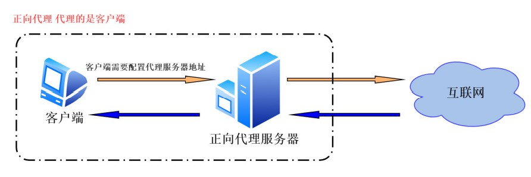
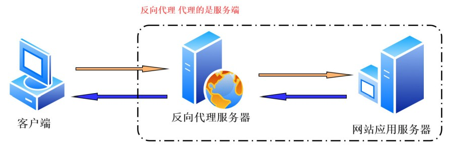
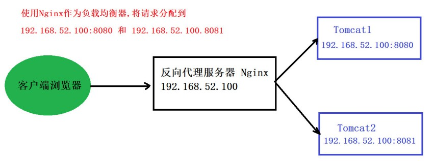
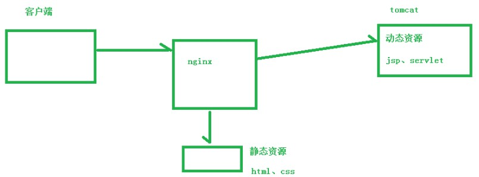

# 概述

 

### 1、概述

- Nginx (engine x) 是一个高性能的 HTTP 服务器（Web 服务器）和反向代理 Web 服务器。同时也提供了 IMAP/POP3/SMTP 服务。
- Nginx 是由伊戈尔·赛索耶夫为俄罗斯访问量第二的 Rambler.ru 站点开发的。

---

### 2、使用目的

- 使用 Nginx 的目的，常见的有：反向代理、负载均衡、动静分离。

---

#### 2.1、反向代理

- 代理：代理其实就是一个中介，A 和 B 本来可以直连，中间插入一个 C，C 就是中介。客户端在发送请求时，不会直接发送给目的主机，而是先发送给代理服务器，代理服务接受客户端请求之后，再向主机发出，并接收目的主机返回的数据再发送给客户端。

- 正向代理：客户端主动配置，以达到访问指定服务器的目的。

  正向代理“代理”的是客户端，服务端不知道实际发起请求的客户端。

- 反向代理：服务端主动配置，反向代理“代理”的是服务端，意味着客户端不知道真正的服务器地址，但仍能正常从服务器获取信息。
反向代理是指用代理服务器接收客户端的请求，然后将请求转发给真正的服务器，并将从服务器上得到的结果返回给客户端。

---

#### 2.2、负载均衡

- 增加服务器的数量，然后将请求分发到各个服务器上，将原先请求集中到单个服务器上的情况改为将请求分发到多个服务器上，将负载分发到不同的服务器，也就是我们所说的负载均衡。
- Nginx 可以作为负载均衡服务器。

---

#### 2.3、动静分离

- 将图片、文档等静态资源从 Web 服务器中剥离出来，放置在一个单独服务器上，已经是一个比较常见的做法。

- Nginx 可以作为静态资源服务器与客户端的“桥梁”或者本身就可以作为静态资源服务器（软件）使用。

