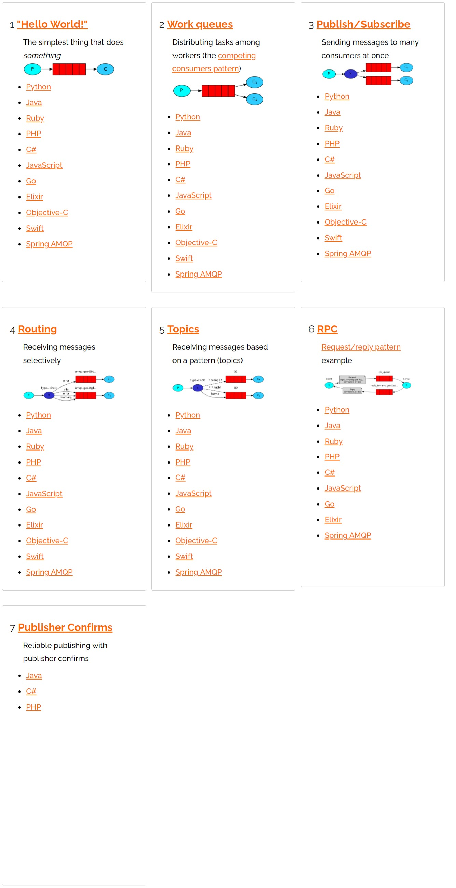

# 消息模型 — 概述

 

## 1、概述

 

- 消息模型，实际上就是 RabbitMQ 常见的**基本**使用方式。
- [https://www.rabbitmq.com/getstarted.html](https://www.rabbitmq.com/getstarted.html)

---

## 2、消息模型

 

- 其中，上图中的1~5是属于比较基础的，6是 RPC（远程过程调用），7是消息确认。
- 1~5 可以从有无使用“交换机（Exchange）”的角度，分为两类（上图中，深蓝色的椭圆节点表示“交换机”）。1~2 不使用“交换机”，3~5 使用“交换机”。