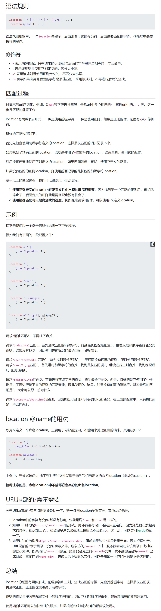
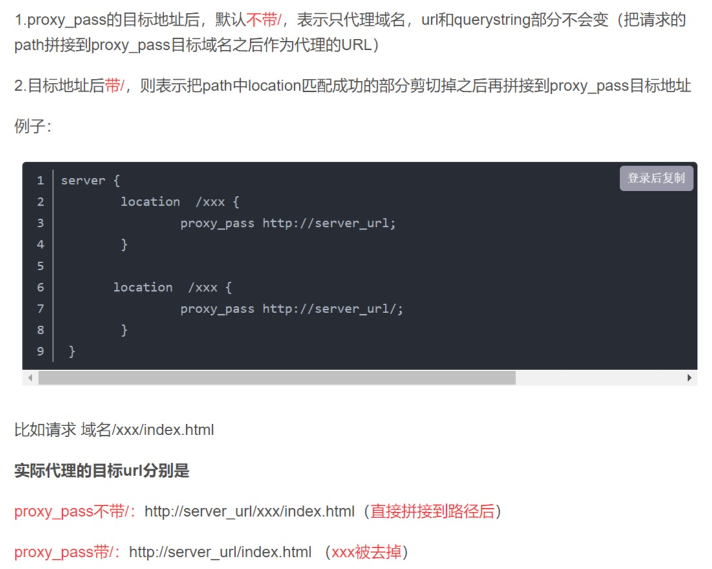

# 使用 Nginx 实现反向代理

<br/>

## 1、概述

- 反向代理，即服务器端的代理。用户并不知道反向代理的存在。由反向代理服务器接收请求然后转发给真正的服务器，服务器的响应再通过反向代理服务器返回给用户。
- Nginx 实现反向代理的基础是虚拟主机，因为真正的服务器对于 Nginx 而言就是一个虚拟主机，只不过在配置 Nginx 的时候要配置真正服务器的地址。

---

## 2、举例

<br/>

### 2.1、使用 Nginx 反向代理与其部署在同一机器上的 Tomcat

- 为了最佳效果，还需借助“本地 DNS” — `hosts`文件。在`hosts`文件中配置一个域名（`www.nginxtest.com`），映射到部署 Nginx 的主机 IP 地址中。
- 部署 Nginx 和 Tomcat 的主机的 IP 地址是`192.168.3.42`（举例使用的是虚拟机）
- 正常情况下，Tomcat 启动之后，使用`http://192.168.3.42:8080`就能访问到。但是“反向代理”要实现的是：通过 Nginx，使用`www.nginxtest.com`也能访问到 Tomcat。


- 1、开启 Tomcat，开放防火墙的8080端口，访问`http://192.168.3.42:8080`，验证 Tomcat 是否正常。


- 2、配置`hosts`:


- 3、Nginx 配置文件：

```nginx
worker_processes  1;


events {
	worker_connections  1024;
}


http {
	include       mime.types;
	default_type  application/octet-stream;
	sendfile        on;
	keepalive_timeout  65;

	server {
		listen       80;
		server_name  www.nginxtest.com;

		location / {
			proxy_pass http://192.168.3.42:8080; # 反向代理的关键，使用 proxy_pass 配置要代理的真实 IP 地址和端口
		}

		error_page   500 502 503 504  /50x.html;
		location = /50x.html {
			root   html;
		}    
	}
}
```


> 关于 server 块中的 server_name 不理解的可以参考：[使用 Nginx 实现虚拟主机](https://yyscyber.github.io/java/lagou/basic/dba285e9-3ba9-4470-acca-2010bfdf0b35) 最后的流程图


- 4、启动 Nginx 或已启动重新加载配置文件。在浏览器上输入`http://www.nginxtest.com`，可以看到 Tomcat 的页面，说明反向代理成功。


---

### 2.2、使用 Nginx 反向代理与其部署在不同一机器上的 Tomcat

- 原理跟“**2.1、使用 Nginx 反向代理与其部署在同一机器上的 Tomcat**”是一样的。只需要修改 Nginx 配置文件中对应 server 块中的`proxy_pass`指令即可（比如说`proxy_pass http://192.168.3.55:8080`等）。

---

### 2.3、使用 Nginx 反向代理多个 Tomcat

一般情况：

- 如果每个 Tomcat 部署的是不同的内容，打算使用不同域名，那么这个时候，多个 Tomcat 就需要多个 server 块。
- 如果每个 Tomcat 部署的内容相同，目的是为了降低服务器压力，这个时候使用一个 server 块即可，但需要进行一些与“负载均衡”有关的配置。

---

## 3、反向代理中 Nginx 配置文件中的 server 块

```nginx
worker_processes  1;


events {
	worker_connections  1024;
}


http {
	include       mime.types;
	default_type  application/octet-stream;
	sendfile        on;
	keepalive_timeout  65;

	server {
		listen       80;
		server_name  www.nginxtest.com;

		location / {
			proxy_pass http://192.168.3.42:8080;
		}

		error_page   500 502 503 504  /50x.html;
		location = /50x.html {
			root   html;
		}    
	}
}
```

- `listen`：Nginx 所监听的本机（部署并启动 Nginx 的主机）端口。

- `server_name`：虚拟主机名称，见 [使用 Nginx 实现虚拟主机](https://yyscyber.github.io/java/lagou/basic/dba285e9-3ba9-4470-acca-2010bfdf0b35) 最后的“流程图”。

- location 块：路由，一个 server 块中可以有多个 location 块。

常见 location 块的通式是：

```nginx
location [=|~|~*|^~|@] /pattern/ {
    # ······
}
```

其中，`location`后的部分是定义的路由（映射）规则。通过指定模式来与客户端请求的 **URI** 相匹配。

---

[https://segmentfault.com/a/1190000013267839](https://segmentfault.com/a/1190000013267839)：





[https://blog.csdn.net/weixin_44367006/article/details/101715799](https://blog.csdn.net/weixin_44367006/article/details/101715799)：


---

`proxy_pass`：代理转发，被代理的真实服务器的 IP、端口等。

关于`proxy_pass`注意事项：[https://blog.csdn.net/weixin_42170236/article/details/109315541](https://blog.csdn.net/weixin_42170236/article/details/109315541)





---

## 4、总结

- 使用 Nginx 作为反向代理服务器，可以直接将其看作“其所代理的服务器”，否则对一些现象很难理解。

比如说：Nginx 的配置文件如下：

```nginx
worker_processes  1;


events {
	worker_connections  1024;
}


http {
	include       mime.types;
	default_type  application/octet-stream;
	sendfile        on;
	keepalive_timeout  65;

	server {
		listen       80;
		server_name  localhost;

		location / {
			proxy_pass http://192.168.3.42:8090;
		}
	}
}
```

浏览器访问`http://192.168.3.42`，然后看到 Tomcat 页面，没有问题：


当修改 Nginx 配置文件中的`location`：

```nginx
worker_processes  1;


events {
	worker_connections  1024;
}


http {
	include       mime.types;
	default_type  application/octet-stream;
	sendfile        on;
	keepalive_timeout  65;

	server {
		listen       80;
		server_name  localhost;

		location = / {
			proxy_pass http://192.168.3.42:8090;
		}
	}
}
```

浏览器再次访问`http://192.168.3.42`，看到的结果：


发现一些静态资源（CSS 等）无法加载。


通过浏览器控制台，看到相关静态资源的响应码是404，但是“请求网址”是`http://192.168.3.42/tomcat.css`，而不是`http://192.168.3.42:8090/tomcat.css`。

原因是在 Nginx 的配置文件中只提供了`location = / {······}`这一精确路由（使用`=`）
页面中的`<link href="tomcat.css" rel="stylesheet" type="text/css" />`等转化为 HTTP 请求，由于 Nginx 中存在精确路由，所以请求的是**`http://192.168.3.42/tomcat.css`**（成功被代理）。但是 Nginx 并没有提供其他的路由与之匹配，导致404。