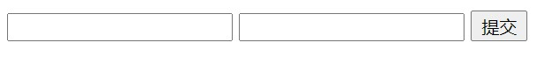

# 数据传输 — 请求数据传输（前端至后端）

<br/>

## 1、概述

- Web 中的数据传输，基本上核心都是 HTTP 协议（HTTPS 等协议仍是建立在 HTTP 基础上的）。

- 不论开发所使用的框架如何发生变化（从普通的 Servlet 到 Spring 等），**归根到底都是浏览器、开发框架、服务器软件（Web 容器）等自动构建出了 HTTP 协议请求报文或响应报文**。

---

## 2、前端向后端传输数据

- 预备知识：

> 见 [https://yyscyber.github.io/java/lagou/basic/e56eeb71-e87e-4297-a13f-10ff303bb136](https://yyscyber.github.io/java/lagou/basic/e56eeb71-e87e-4297-a13f-10ff303bb136) 的“第6章 HTTP 首部”

> HTML 中`<form>`标签的`enctype`属性规定在发送到服务器之前应该如何对表单数据进行编码。默认值是`application/x-www-form-urlencoded`。
>
> 
>
> `application/x-www-form-urlencoded`中“编码”方案采用的是“**URL 编码**”，参考：`https://www.ruanyifeng.com/blog/2010/02/url_encoding.html`
>
> `multipart/form-data`，`application/x-www-form-urlencoded`机制是使用“URL 编码”将数据传输，但是只适用于字符，并不适合文件（尤其是非文本文件），所以产生了`multipart/form-data`。
相当于将数据直接以二进制形式传输（可以简单理解成“字节流”）。
**字符**（尤其是中文等特殊一点的字符）采用的“编码”方案**暂时不明确**。


> HTML 中`<form>`标签的`method`属性的默认值是`GET`

- 前端向后端传输数据，绝大多数情况的本质是将数据写入 HTTP 请求报文中。

- ***声明：以下所列举的 HTTP 请求报文的格式并不是规范的，为了便于查看，可能会有原本不存在的“换行”、“空格”、“注释”等；另外不同的 HTTP 抓包插件、浏览器控制台所解析出的 HTTP 请求报文也是不尽相同的。***

- 目前数据传输常见的几种形式：

<br/>

### 2.1、HTML 表单（不含提交文件的表单）向后端传输数据：





> HTTP 请求报文：
>
> 请求行中方法：`GET`或`POST`
>
> 实体首部字段：`Content-type: application/x-www-form-urlencoded`（方法为`POST`的时候有效，因为`GET`**不会**将数据写入**报文主体**中，而是写入**请求行**中，所以`GET`的时候不具有“实体首部字段”）


- GET

```html
<!DOCTYPE html>
<html lang="zh">

<head>
    <meta charset="UTF-8">
    <title>数据传输</title>
</head>

<body>
<!-- method="get" -->
<form action="http://localhost:8080/receive-data/receive">
    <input type="text" name="my_text" />
    <input type="submit" />
</form>
</body>

</html>
```

```java
import javax.servlet.ServletException;
import javax.servlet.annotation.WebServlet;
import javax.servlet.http.HttpServlet;
import javax.servlet.http.HttpServletRequest;
import javax.servlet.http.HttpServletResponse;
import java.io.IOException;

@WebServlet(urlPatterns = "/receive")
public class MyServlet extends HttpServlet {

    @Override
    protected void doGet(HttpServletRequest request, HttpServletResponse response) throws ServletException, IOException {
        request.setCharacterEncoding("UTF-8");
        response.setCharacterEncoding("UTF-8");

        String myText = request.getParameter("my_text");
        System.out.println(myText);
    }

}
```

抓包（HTTP 请求、GET）：

```
GET /receive-data/receive?my_text=22222 HTTP/1.1

Host: localhost:8080
Accept: text/html,application/xhtml+xml,application/xml;q=0.9,image/avif,image/webp,image/apng,*/*;q=0.8,application/signed-exchange;v=b3;q=0.9
sec-ch-ua: "Chromium";v="94", "Google Chrome";v="94", ";Not A Brand";v="99"
sec-ch-ua-mobile: ?0
sec-ch-ua-platform: "Windows"
Upgrade-Insecure-Requests: 1
User-Agent: Mozilla/5.0 (Windows NT 10.0; Win64; x64) AppleWebKit/537.36 (KHTML, like Gecko) Chrome/94.0.4606.71 Safari/537.36
```

- POST

```html
<!DOCTYPE html>
<html lang="zh">

<head>
    <meta charset="UTF-8">
    <title>数据传输</title>
</head>

<body>
<form enctype="application/x-www-form-urlencoded" method="post" action="http://localhost:8080/receive-data/receive">
    <input type="text" name="my_text_1" />
    <input type="text" name="my_text_2" />
    <input type="submit" />
</form>
</body>

</html>
```

```java
import javax.servlet.ServletException;
import javax.servlet.annotation.WebServlet;
import javax.servlet.http.HttpServlet;
import javax.servlet.http.HttpServletRequest;
import javax.servlet.http.HttpServletResponse;
import java.io.IOException;

@WebServlet(urlPatterns = "/receive")
public class MyServlet extends HttpServlet {

    @Override
    protected void doPost(HttpServletRequest request, HttpServletResponse response) throws ServletException, IOException {
        request.setCharacterEncoding("UTF-8");
        response.setCharacterEncoding("UTF-8");

        String myText1 = request.getParameter("my_text_1");
        String myText2 = request.getParameter("my_text_2");

        System.out.println(myText1);
        System.out.println(myText2);
    }

}
```

抓包（HTTP 请求、POST）：

```
POST /receive-data/receive HTTP/1.1
Host: localhost:8080
Accept: text/html,application/xhtml+xml,application/xml;q=0.9,image/avif,image/webp,image/apng,*/*;q=0.8,application/signed-exchange;v=b3;q=0.9

Content-Type: application/x-www-form-urlencoded

sec-ch-ua: "Chromium";v="94", "Google Chrome";v="94", ";Not A Brand";v="99"
sec-ch-ua-mobile: ?0
sec-ch-ua-platform: "Windows"
Sec-Fetch-Dest: document
Sec-Fetch-Mode: navigate
Sec-Fetch-Site: cross-site
Sec-Fetch-User: ?1
Upgrade-Insecure-Requests: 1
User-Agent: Mozilla/5.0 (Windows NT 10.0; Win64; x64) AppleWebKit/537.36 (KHTML, like Gecko) Chrome/94.0.4606.71 Safari/537.36


my_text_1=8988&my_text_2=8888
```


上述两种 HTTP 请求报文中的主体数据，在 Servlet 中，可以直接使用`javax.servlet.ServletRequest`（`javax.servlet.http.HttpServlet`的父接口）中的`String getParameter(String var1)`方法获取到。

---

### 2.2、HTML 表单（含提交文件的表单）向后端传输数据：


> HTTP 请求报文：
>
> 请求行中方法：文件的提交，一般是`POST`
>
> 实体首部字段：`Content-type: multipart/form-data; boundary=······`


- 不含文件


```html
<!DOCTYPE html>
<html lang="zh">

<head>
    <meta charset="UTF-8">
    <title>数据传输</title>
</head>

<body>
<!-- 虽然没有“文件”表单项，enctype 也可以使用 multipart/form-data -->
<form enctype="multipart/form-data" method="post" action="http://localhost:8080/receive-data/receive">
    <input type="text" name="my_text_1" />
    <input type="text" name="my_text_2" />
    <input type="submit" />
</form>
</body>

</html>
```

```java
import javax.servlet.ServletException;
import javax.servlet.ServletInputStream;
import javax.servlet.annotation.WebServlet;
import javax.servlet.http.HttpServlet;
import javax.servlet.http.HttpServletRequest;
import javax.servlet.http.HttpServletResponse;
import java.io.IOException;
import java.nio.charset.StandardCharsets;

@WebServlet(urlPatterns = "/receive")
public class MyServlet extends HttpServlet {

    @Override
    protected void doPost(HttpServletRequest request, HttpServletResponse response) throws ServletException, IOException {
        request.setCharacterEncoding("UTF-8");
        response.setCharacterEncoding("UTF-8");

        ServletInputStream inputStream = request.getInputStream();
        byte[] bytes = inputStream.readAllBytes();
        System.out.println(new String(bytes, StandardCharsets.UTF_8));
    }

}
```

抓包（HTTP 请求、POST）：

```
POST /receive-data/receive HTTP/1.1
Host: localhost:8080
Accept: text/html,application/xhtml+xml,application/xml;q=0.9,image/avif,image/webp,image/apng,*/*;q=0.8,application/signed-exchange;v=b3;q=0.9

Content-Type: multipart/form-data; boundary=----WebKitFormBoundaryed5ee49V0h9DnXhE

sec-ch-ua: "Chromium";v="94", "Google Chrome";v="94", ";Not A Brand";v="99"
sec-ch-ua-mobile: ?0
sec-ch-ua-platform: "Windows"
Sec-Fetch-Dest: document
Sec-Fetch-Mode: navigate
Sec-Fetch-Site: cross-site
Sec-Fetch-User: ?1
Upgrade-Insecure-Requests: 1
User-Agent: Mozilla/5.0 (Windows NT 10.0; Win64; x64) AppleWebKit/537.36 (KHTML, like Gecko) Chrome/94.0.4606.71 Safari/537.36


------WebKitFormBoundaryed5ee49V0h9DnXhE
Content-Disposition: form-data; name="my_text_1"

我（此处实际上应该是“乱码”）
------WebKitFormBoundaryed5ee49V0h9DnXhE
Content-Disposition: form-data; name="my_text_2"

你（此处实际上应该是“乱码”）
------WebKitFormBoundaryed5ee49V0h9DnXhE--
```


- 含文件


```html
<!DOCTYPE html>
<html lang="zh">

<head>
    <meta charset="UTF-8">
    <title>数据传输</title>
</head>

<body>
<form enctype="multipart/form-data" method="post" action="http://localhost:8080/receive-data/receive">
    <input type="text" name="my_text_1" />
    <input type="text" name="my_text_2" />
    <input type="file" name="my_file_1"/>
    <input type="file" name="my_file_2"/>
    <input type="submit" />
</form>
</body>

</html>
```

```java
import javax.servlet.ServletException;
import javax.servlet.ServletInputStream;
import javax.servlet.annotation.WebServlet;
import javax.servlet.http.HttpServlet;
import javax.servlet.http.HttpServletRequest;
import javax.servlet.http.HttpServletResponse;
import java.io.IOException;
import java.nio.charset.StandardCharsets;

@WebServlet(urlPatterns = "/receive")
public class MyServlet extends HttpServlet {

    @Override
    protected void doPost(HttpServletRequest request, HttpServletResponse response) throws ServletException, IOException {
        request.setCharacterEncoding("UTF-8");
        response.setCharacterEncoding("UTF-8");

        ServletInputStream inputStream = request.getInputStream();
        byte[] bytes = inputStream.readAllBytes();
        System.out.println(new String(bytes, StandardCharsets.UTF_8));
    }

}
```

抓包（HTTP 请求、POST）：

```
POST /receive-data/receive HTTP/1.1
Host: localhost:8080
Connection: keep-alive
Content-Length: 302466
Cache-Control: max-age=0
sec-ch-ua: "Chromium";v="94", "Google Chrome";v="94", ";Not A Brand";v="99"
sec-ch-ua-mobile: ?0
sec-ch-ua-platform: "Windows"
Upgrade-Insecure-Requests: 1
Origin: null

Content-Type: multipart/form-data; boundary=----WebKitFormBoundaryHakjPbK74YCPfsX0

User-Agent: Mozilla/5.0 (Windows NT 10.0; Win64; x64) AppleWebKit/537.36 (KHTML, like Gecko) Chrome/94.0.4606.71 Safari/537.36
Accept: text/html,application/xhtml+xml,application/xml;q=0.9,image/avif,image/webp,image/apng,*/*;q=0.8,application/signed-exchange;v=b3;q=0.9
Sec-Fetch-Site: cross-site
Sec-Fetch-Mode: navigate
Sec-Fetch-User: ?1
Sec-Fetch-Dest: document
Accept-Encoding: gzip, deflate, br
Accept-Language: zh-CN,zh-TW;q=0.9,zh;q=0.8,en-US;q=0.7,en;q=0.6


------WebKitFormBoundaryHakjPbK74YCPfsX0
Content-Disposition: form-data; name="my_text_1"

（此处乱码）
------WebKitFormBoundaryHakjPbK74YCPfsX0
Content-Disposition: form-data; name="my_text_2"

（此处乱码）
------WebKitFormBoundaryHakjPbK74YCPfsX0
Content-Disposition: form-data; name="my_file_1"; filename="c3p0-1.jpg"
Content-Type: image/jpeg


------WebKitFormBoundaryHakjPbK74YCPfsX0
Content-Disposition: form-data; name="my_file_2"; filename="DBCP-1.jpg"
Content-Type: image/jpeg


------WebKitFormBoundaryHakjPbK74YCPfsX0--
```


通过上述过程，明确：
a、当`Content-Type: multipart/form-data; boundary=······`时，数据写入**报文主体**，不同数据（不同表单项）之间使用`boundary`所定义内容的分隔。
b、在传输字符的时候，可以肯定是采用了一种编码方式（具体不明确），所以会看到报文中中文出现乱码。
c、针对`Content-Type: multipart/form-data`这类 HTTP 请求报文中的主体数据，在 Servlet 中只有通过解析字节数入流的方式获取，使用`javax.servlet.ServletRequest#getInputStream`方法获取“字节输入流”。当然，一些第三方库、框架会有提供一些方法方便开发者解析主体数据，即“封装对字节流的解析”。经典的有：Apache Commons FileUpload、Spring 等。

---

### 2.3、JSON

- 使用 JSON 格式传输数据（前向后，后向前）也是现在比较常见的。但是，HTML 表单默认不会使用 JSON 格式数据传输，因为 HTML 表单的`enctype`只支持三种。所以如果想使用 JSON 传输数据，需要借助 JavaScript。


> HTTP 请求报文：
>
> 请求行中方法：JSON 传输必须使用 `POST`
>
> 实体首部字段：`Content-type: application/json;charset=utf-8`


```html
<!DOCTYPE html>
<html lang="zh">

<head>
    <meta charset="UTF-8">
    <title>数据传输</title>
</head>

<body>
<form>
    <input type="text" name="my_text_1" id="my_text_1" />
    <input type="text" name="my_text_2" id="my_text_2" />
    <input type="button" id="submit" value="提交" />
</form>

<script src="https://cdn.bootcdn.net/ajax/libs/jquery/3.6.0/jquery.js"></script>
<script>
    $("#submit").on('click', function() {
        let obj = {
            'text1': $('#my_text_1').val(),
            'text2': $('#my_text_2').val()
        };

        $.ajax({
            // 发送数据到服务器时所使用的内容类型 JSON
            // 注意，contentType 默认值是 application/x-www-form-urlencoded
            contentType: 'application/json;charset=utf-8',

            // 请求的方法
            type: 'POST',

            // 请求发送的 URL
            url: 'http://localhost:8080/receive-data/receive',

            // 数据以原始形式送出，不作“键值化”处理
            processData: false,

            // 数据必须使用严格的 JSON
            data: JSON.stringify(obj),

            success: function(result, status, xhr) {
                console.log(status);
            },

            error: function(xhr,status,error) {
                console.log(status);
            }
        });
    });
</script>
</body>

</html>
```

```java
import javax.servlet.ServletException;
import javax.servlet.ServletInputStream;
import javax.servlet.annotation.WebServlet;
import javax.servlet.http.HttpServlet;
import javax.servlet.http.HttpServletRequest;
import javax.servlet.http.HttpServletResponse;
import java.io.IOException;
import java.nio.charset.StandardCharsets;

@WebServlet(urlPatterns = "/receive")
public class MyServlet extends HttpServlet {

    @Override
    protected void doPost(HttpServletRequest request, HttpServletResponse response) throws ServletException, IOException {
        request.setCharacterEncoding("UTF-8");
        response.setCharacterEncoding("UTF-8");

        ServletInputStream inputStream = request.getInputStream();
        byte[] bytes = inputStream.readAllBytes();
        System.out.println(new String(bytes, StandardCharsets.UTF_8));
    }

}
```

抓包（HTTP 请求，POST）：

```
POST /receive-data/receive HTTP/1.1
Host: localhost:8080
Connection: keep-alive
Content-Length: 41
sec-ch-ua: "Chromium";v="94", "Google Chrome";v="94", ";Not A Brand";v="99"
Accept: */*

Content-Type: application/json;charset=UTF-8

sec-ch-ua-mobile: ?0
User-Agent: Mozilla/5.0 (Windows NT 10.0; Win64; x64) AppleWebKit/537.36 (KHTML, like Gecko) Chrome/94.0.4606.71 Safari/537.36
sec-ch-ua-platform: "Windows"
Origin: null
Sec-Fetch-Site: cross-site
Sec-Fetch-Mode: cors
Sec-Fetch-Dest: empty
Accept-Encoding: gzip, deflate, br
Accept-Language: zh-CN,zh-TW;q=0.9,zh;q=0.8,en-US;q=0.7,en;q=0.6

{"text1":"xxxxxxx","text2":"xxxxxxx"}
```


针对`Content-Type: application/json;charset=UTF-8`这类 HTTP 请求报文中的主体数据，在 Servlet 中也是只有通过解析字节数入流的方式获取，使用javax.servlet.ServletRequest#getInputStream方法获取“字节输入流”。当然，一些第三方库、框架会有提供一些方法方便开发者解析 JSON 数据，即“封装对字节流的解析”。经典的有：Spring 中的`@RequestBody`等。

---

### 2.4、JavaScript 上传文件


> HTTP 请求报文：
>
> 请求行中方法：文件的提交，一般是`POST`
>
> 实体首部字段：`Content-type: multipart/form-data; boundary=······`


需要借助`FormData`先对表单中的数据进行一个封装（`https://developer.mozilla.org/zh-CN/docs/Web/API/FormData`）。

```html
<!DOCTYPE html>
<html lang="zh">

<head>
    <meta charset="UTF-8">
    <title>数据传输</title>
</head>

<body>
<form>
    <input type="text" name="my_text" id="my_text" />
    <input type="file" name="my_file" id="my_file" />
    <input type="button" id="submit" value="提交" />
</form>

<script src="https://cdn.bootcdn.net/ajax/libs/jquery/3.6.0/jquery.js"></script>
<script>
    $("#submit").on('click', function() {
        let dataForm = new FormData();
        dataForm.append("text", $("#my_text").val());
        dataForm.append("file", $("#my_file")[0].files[0]);

        $.ajax({
            // 注意：将 contentType 设置 false
            contentType: false,

            // 请求的方法
            type: 'POST',

            // 请求发送的 URL
            url: 'http://localhost:8080/receive-data/receive',

            // 数据以原始形式送出，不作“键值化”处理
            processData: false,

            data: dataForm,

            success: function(result, status, xhr) {
                console.log(status);
            },

            error: function(xhr,status,error) {
                console.log(status);
            }
        });
    });
</script>
</body>

</html>
```

```java
import javax.servlet.ServletException;
import javax.servlet.ServletInputStream;
import javax.servlet.annotation.WebServlet;
import javax.servlet.http.HttpServlet;
import javax.servlet.http.HttpServletRequest;
import javax.servlet.http.HttpServletResponse;
import java.io.IOException;
import java.nio.charset.StandardCharsets;

@WebServlet(urlPatterns = "/receive")
public class MyServlet extends HttpServlet {

    @Override
    protected void doPost(HttpServletRequest request, HttpServletResponse response) throws ServletException, IOException {
        request.setCharacterEncoding("UTF-8");
        response.setCharacterEncoding("UTF-8");

        ServletInputStream inputStream = request.getInputStream();
        byte[] bytes = inputStream.readAllBytes();
        System.out.println(new String(bytes, StandardCharsets.UTF_8));
    }

}
```

```
POST /receive-data/receive HTTP/1.1
Host: localhost:8080
Connection: keep-alive
Content-Length: 58069
sec-ch-ua: "Chromium";v="94", "Google Chrome";v="94", ";Not A Brand";v="99"
Accept: */*

Content-Type: multipart/form-data; boundary=----WebKitFormBoundaryXuF83krJUJqLHqA9

sec-ch-ua-mobile: ?0
User-Agent: Mozilla/5.0 (Windows NT 10.0; Win64; x64) AppleWebKit/537.36 (KHTML, like Gecko) Chrome/94.0.4606.71 Safari/537.36
sec-ch-ua-platform: "Windows"
Origin: null
Sec-Fetch-Site: cross-site
Sec-Fetch-Mode: cors
Sec-Fetch-Dest: empty
Accept-Encoding: gzip, deflate, br
Accept-Language: zh-CN,zh-TW;q=0.9,zh;q=0.8,en-US;q=0.7,en;q=0.6


------WebKitFormBoundaryXuF83krJUJqLHqA9
Content-Disposition: form-data; name="text"

wo
------WebKitFormBoundaryXuF83krJUJqLHqA9
Content-Disposition: form-data; name="file"; filename="c3p0-1.jpg"
Content-Type: image/jpeg


------WebKitFormBoundaryXuF83krJUJqLHqA9--
```


通过上述过程，明确：
a、为什么在 Ajax 中的`contentType`是`false`，而不是`multipart/form-data`？
因为如果`$.ajax({···})`中的`contentType`直接设置为`multipart/form-data`，在 HTTP 请求报文的实体首部的`Content-Type`直接就是`multipart/form-data`：

```
Content-Type: multipart/form-data
```

这样的话，没有`boundary`，但是请求报文的主体数据中还是会以一种 boundary 分隔。这种情况下，服务端无法进行正常解析获取的数据。（`https://segmentfault.com/a/1190000007207128`、`https://www.cnblogs.com/arduka/p/13127003.html`）

b、当`Content-Type: multipart/form-data; boundary=······`时，数据写入报文主体，不同数据（不同表单项）之间使用`boundary`所定义内容的分隔。
c、在传输字符的时候，可以肯定是采用了一种编码方式（具体不明确），所以会看到报文中中文出现乱码。
d、针对`Content-Type: multipart/form-data`这类 HTTP 请求报文中的主体数据，在 Servlet 中只有通过解析字节数入流的方式获取，使用`javax.servlet.ServletRequest#getInputStream`方法获取“字节输入流”。当然，一些第三方库、框架会有提供一些方法方便开发者解析主体数据，即“封装对字节流的解析”。经典的有：Apache Commons FileUpload、Spring 等。
