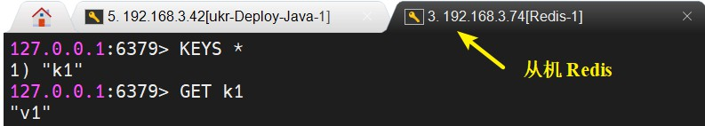
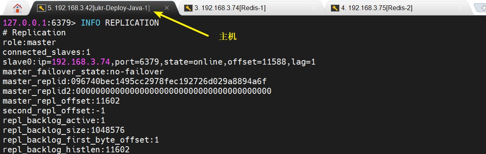
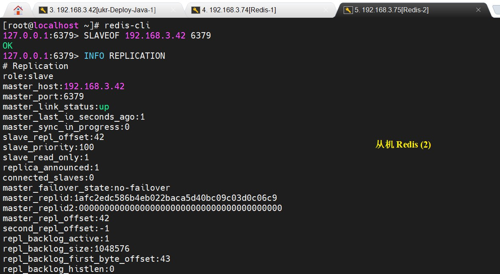

# 主从模式

<br/>

## 1、概述

<br/>

- 主从模式，也可以称为 Redis 集群。
- 主从模式也可以作为“备份”策略之一。
- 主（master）从（slave）模式，从机可以选择主机，但主机无法选择从机（“小弟”可以选“大哥”，“大哥”不能选“小弟”）。
- 主从模式常见的任务分配是：主机写，从机读。写操作通过主机进行，然后通过数据同步机制，将数据同步到从机中，这样读操作通过从机即可。
- [https://www.runoob.com/redis/server-slaveof.html](https://www.runoob.com/redis/server-slaveof.html)


- **以下操作使用 Linux 版的 Redis 进行**。
- 以下内容仅是对 Redis 主从模式（集群）的简要介绍。

---

## 2、主从复制 — “一主多仆”

<br/>

- 一个主 Redis 配多个从 Redis。

### 2.1、准备

- 准备三个安装有 Redis 的 Linux 虚拟机，配置好网络。这里 IP 分别为`192.168.3.42`、`192.168.3.74`、`192.168.3.75`，端口号均为`6379`。将`192.168.3.42`中的 Redis 作为主机（master），其余两台中的 Redis 作为从机（slave）。
- 为便于实验，修改三个 Redis 中的配置文件`redis.conf`：
  - 将默认的`bind 127.0.0.1 -::1`这一配置项注释或删除。如果有这一配置项，Redis 服务只允许通过本机进行连接。
  - 将默认的`protected-mode yes`这一配置项，修改为`protected-mode no`。
- 为便于实验，设置“防火墙”，打开`6379`端口。
- 如何查看当今的 Redis 是主机还是从机：使用`INFO REPLICATION`命令。


---

### 2.2、实现

- 从机的 Redis 使用`SLAVEOF host port`命令，将当前 Redis 服务器转变为指定 Redis 服务器的从属服务器。


- 查看主机的“角色”。


- 通过主机进行写操作，然后看从机中是否能够读出主机写入的数据。





---

### 2.3、注意

- 所有的 slave 默认情况下，一旦指定了 master，master 中的数据会立即同步至 slave 中。后续向 master 中写入的数据，slave 也会立即通过同步获取到。
- 一旦成为了从机（slave），便无法执行任何写操作，只能进行读操作。主机（master）既能读又能写。
- 作为主机的 Redis 服务一旦停止，默认情况，从机（slave）仍是从机，从机查询“角色”信息时显示其 master 离线。
- 作为主机的 Redis 服务停止后又启动，默认情况，主机仍是主机，从机仍是从机，从机查询“角色”信息时显示其 master 在线。


- 作为从机的 Redis 服务停止，主机会少了一个从机。当 Redis 服务重启后，就不再是从机，“自立门户”成为主机。

---

## 3、主从复制 — “血脉相承”

<br/>

- 一个主机理论上是可以有很多个从机，但是从机的数量太多也会消耗主机的性能。
- 利用类似于面向对象中“继承”的做法，一个主机 A 有从机 B，而这些从机 B 又可以作为从机 C 的“主机”。注意，虽然 B 可以认为是 C 的“主机”，但是 B 仍是从机，仍只能进行读操作，不能进行写操作。
- 其余内容与 [2.1、准备](javascript:void(0);)、[2.3、注意](javascript:void(0);) 中一致。


```shell
# IP：192.168.3.74
# 从机 B

127.0.0.1:6379> SLAVEOF 192.168.3.42 6379
OK
```


```shell
# IP：192.168.3.75
# 从机 C

127.0.0.1:6379> SLAVEOF 192.168.3.74 6379
OK
```





---

## 4、主从复制 — 取消作为从机

<br/>

- 使用`SLAVEOF NO ONE`命令，取消作为从机，成为独立的主机。
- 作为从机时同步得到主机的数据并不会丢失。

---

## 5、主从复制 — 数据同步原理

<br/>


- 数据同步策略：
  - 全量复制（同步）：slave 初始化阶段，这时 slave 需要将 master 上的所有数据都复制一份，slave 接收到数据
    文件后，存盘，并加载到内存中（上图中的步骤1、2、3、4）。只要是重新连接 master，全量复制（同步）将自动执行。
  - 增量复制（同步）：slave 初始化后，开始正常工作时，master 发生的写操作同步到 slave 的过程（上图中的步
    骤5、6）。
- Redis 主从同步策略：主从刚刚连接的时候，进行全量同步（只要是重新连接 master，全量复制将自动执行）；全同步结束后，进行增量同步。
- Redis 主从复制上整体上，首先会尝试增量同步，如果不成功，会进行全量同步。从机在任何时候都可以发起全量同步，如果有需要。

---

## 6、哨兵模式

<br/>

- 哨兵模式的目的是在主从模式的情景下，提高可用性。
- 通过设立“哨兵”，对主从服务进行监视，当“哨兵”发现主服务“挂掉”后，会自动从所有从机中基于机制选择出一个从机作为新的主机。避免因主机出现问题，而导致无法进行**写**操作。
- “哨兵”是一个独立的进程，作为进程，它会独立运行，默认“哨兵”会通过`26379`端口实现对 Redis 的监控。Redis 中的“哨兵”既可以监控本机的 Redis，也可以监控远程的 Redis。
- [https://redis.io/topics/sentinel](https://redis.io/topics/sentinel)
- [https://www.jianshu.com/p/06ab9daf921d](https://www.jianshu.com/p/06ab9daf921d)


- 使用哨兵模式需要配置文件，在 Linux 版的 Redis 的安装目录下，会默认提供一个哨兵模式配置文件`sentinel.conf`。实际使用时，也可以根据实际重新编写这一配置文件。


- “哨兵”的配置文件中，核心的一些配置项：


```shell
# master-group-name：“哨兵”要监控的主机名称
# ip：“哨兵”要监控的 Redis 的 IP，可以是 Redis 所在本机的 IP
# port：“哨兵”要监控的 Redis 的端口，可以是本机上 Redis 服务的端口，Redis 服务的默认端口是 6379
# quorum：判断为所监控的 Redis 服务失效至少需要多少个“哨兵”的同意

sentinel monitor <master-group-name> <ip> <port> <quorum>
```


```shell
# “哨兵”进程所使用的端口号

port 26379

# “哨兵”进程是否后台运行
# 与 redis.conf 中的 daemonize 效果一样
# 一般配置为 yes，为了不占用命令行

daemonize yes
```


- 启动“哨兵”：已经使用`redis-server`命令启动了 Redis 服务。然后使用`redis-sentinel`命令启动“哨兵”。

  

  ```shell
  # 与 redis-server 命令一样，可以在命令后跟“配置文件路径”，以配置文件启动“哨兵”
  
  redis-sentinel /path/to/sentinel.conf
  ```


### 6.1、一个简单的哨兵模式举例

- 准备：与 [2.1、准备](javascript:void(0);)、[2.3、注意](javascript:void(0);) 中一致。`192.168.3.42`上安装的 Redis 将作为 master，`192.168.3.74`和`192.168.3.75`上的 Redis 将作为 slave。**配置防火墙，打开`26379`端口**。
- 三个“哨兵”在配置时分别监视本机上的 Redis 服务，虽然从配置上看，每一个“哨兵”只是监控本机的 Redis，但一旦 Redis 之间形成了“主从”关系，“哨兵”之间也有了“联系”。


| 服务类型 | 主 / 从 |      IP      | 端口号 |
| :------: | :-----: | :----------: | :----: |
|  Redis   |   主    | 192.168.3.42 |  6379  |
|  Redis   |   从    | 192.168.3.74 |  6379  |
|  Redis   |   从    | 192.168.3.75 |  6379  |
| Sentinel |    /    | 192.168.3.42 | 26379  |
| Sentinel |    /    | 192.168.3.74 | 26379  |
| Sentinel |    /    | 192.168.3.75 | 26379  |


- 1、为了使操作显得简洁，决定使用新建的“哨兵”配置文件。

  - `192.168.3.42`（主 Redis 服务）的“哨兵”配置文件：

  

  ```shell
  # 路径：/usr/local/redis-sentinel-config/sentinel.conf
  
  sentinel monitor redis42 127.0.0.1 6379 1
  ```
  
  
  
  - `192.168.3.74`（从 Redis 服务）的“哨兵”配置文件：

  

  ```shell
  # 路径：/usr/local/redis-sentinel-config/sentinel.conf
  
  sentinel monitor redis74 127.0.0.1 6379 1
  ```
  
  
  
  - `192.168.3.75`（从 Redis 服务）的“哨兵”配置文件：
  
  
  
  ```shell
  # 路径：/usr/local/redis-sentinel-config/sentinel.conf
  
  sentinel monitor redis75 127.0.0.1 6379 1
  ```

  

- 2、启动 Redis 服务，建立“主从”关系。





- 3、启动“哨兵”（因为未将“哨兵”配置文件中的`daemonize`显式设置为`yes`，所以需要通过“打开多个命令行窗口”进行一些操作）。


- 5、将主机“挂掉”，使用`SHUTDOWN`命令。看从机的“身份”变化。在本例中，主机`192.168.3.42`“挂掉”之后，`192.168.3.75`成为新的主机，`192.168.3.74`成为`192.168.3.75`的从机。


- 6、当`192.168.3.42`恢复服务后，当“哨兵”被检测到后，也会成为`192.168.3.75`的从机。

---

## 7、主从模式缺点

<br/>

- 写操作都是由 master 完成，会造成压力。
- 主从之间同步数据需要花费时间。
