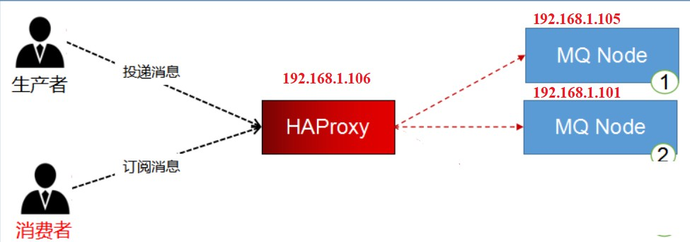
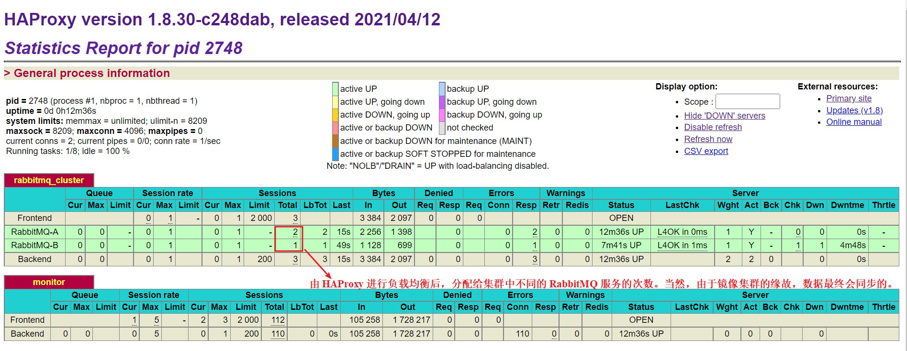

# 集群 — HAProxy

<br/>

## 1、概述

<br/>

- HAProxy 是一款强大的负载均衡工具。
- HAProxy 意思是 High Available Proxy，高可用代理。
- HAProxy 可以用来在对 RabbitMQ 集群进行负载均衡，也就是 HAProxy 可以根据情况，从集群中不同的 RabbitMQ 服务中获取消息。


- HAProxy 与 Nginx
  - 两个都可以被认为是出色的负载均衡工具。
  - Nginx 的业务领域更多的针对的是 HTTP **应用**并且在这一领域可以说是有“绝对优势”；HAProxy 的业务领域是相对更广泛的，它甚至可以进行比较底层的负载均衡，比如 TCP 层面的。
  - 性能上 HAProxy 胜，功能性和便利性上 Nginx 胜。


- HAProxy 官方网站：[https://www.haproxy.org](https://www.haproxy.org)

---

## 2、安装

<br/>

见 [CentOS 7 HAProxy 安装](https://yyscyber.github.io/development-environment-and-tools/af3f318c-9088-4464-bff3-750b069d809d)

---

## 3、基本使用

<br/>

- 1、启动集群中的 RabbitMQ 服务，启动 HAProxy。
- 2、此时的消息生产者就可以将消息发送给 HAProxy，再由 HAProxy 进行负载均衡，将消息分配给集群中不同的 RabbitMQ 服务；消息消费者也可以先通过 HAProxy，再由 HAProxy 决定从集群中哪个 RabbitMQ 服务中获取消息。





- 消息生产者

```xml
<?xml version="1.0" encoding="UTF-8"?>
<beans xmlns:xsi="http://www.w3.org/2001/XMLSchema-instance"
       xmlns="http://www.springframework.org/schema/beans"
       xmlns:rabbit="http://www.springframework.org/schema/rabbit"
       xsi:schemaLocation="http://www.springframework.org/schema/rabbit https://www.springframework.org/schema/rabbit/spring-rabbit.xsd
       http://www.springframework.org/schema/beans https://www.springframework.org/schema/beans/spring-beans.xsd">

    <!-- 连接配置 -->
    <!-- host 可以改为 HAProxy 的 IP，由 HAProxy 进行负载均衡 -->
    <rabbit:connection-factory id="connectionFactory" host="192.168.1.106" port="5672" username="admincluster" password="yyss" virtual-host="/cluster-test" />
    
    <rabbit:admin connection-factory="connectionFactory" />

    <rabbit:queue name="hello"/>
    <rabbit:queue name="pre_hello"/>

    <rabbit:topic-exchange name="spring_test_exchange_topic">
        <rabbit:bindings>
            <rabbit:binding pattern="com.khai.#" queue="hello" />
            <rabbit:binding pattern="com.nchu.#" queue="pre_hello" />
        </rabbit:bindings>
    </rabbit:topic-exchange>

    <rabbit:topic-exchange name="pre_spring_test_exchange_topic"/>

    <bean id="jsonMessageConverter" class="org.springframework.amqp.support.converter.Jackson2JsonMessageConverter" />

    <rabbit:template id="rabbitTemplate" connection-factory="connectionFactory" exchange="spring_test_exchange_topic" message-converter="jsonMessageConverter" />

</beans>
```





- 消息消费者


```xml
<?xml version="1.0" encoding="UTF-8"?>
<beans xmlns:xsi="http://www.w3.org/2001/XMLSchema-instance"
       xmlns="http://www.springframework.org/schema/beans"
       xmlns:rabbit="http://www.springframework.org/schema/rabbit"
       xsi:schemaLocation="http://www.springframework.org/schema/rabbit https://www.springframework.org/schema/rabbit/spring-rabbit.xsd
       http://www.springframework.org/schema/beans https://www.springframework.org/schema/beans/spring-beans.xsd">

    <!-- 连接配置 -->
     <!-- host 可以改为 HAProxy 的 IP，由 HAProxy 进行负载均衡 -->
    <rabbit:connection-factory id="connectionFactory" host="192.168.1.106" port="5672" username="admincluster" password="yyss" virtual-host="/cluster-test" />
    
    <rabbit:admin connection-factory="connectionFactory" />

    <rabbit:queue name="hello"/>
    <rabbit:queue name="pre_hello"/>

    <rabbit:topic-exchange name="spring_test_exchange_topic">
       
        <rabbit:bindings>
            <rabbit:binding pattern="com.khai.#" queue="hello" />
            <rabbit:binding pattern="com.nchu.#" queue="pre_hello" />
        </rabbit:bindings>
    </rabbit:topic-exchange>

    <rabbit:topic-exchange name="pre_spring_test_exchange_topic"/>

    <bean id="jsonMessageConverter" class="org.springframework.amqp.support.converter.Jackson2JsonMessageConverter" />

    <rabbit:template id="rabbitTemplate" connection-factory="connectionFactory" exchange="spring_test_exchange_topic" message-converter="jsonMessageConverter" />

</beans>
```