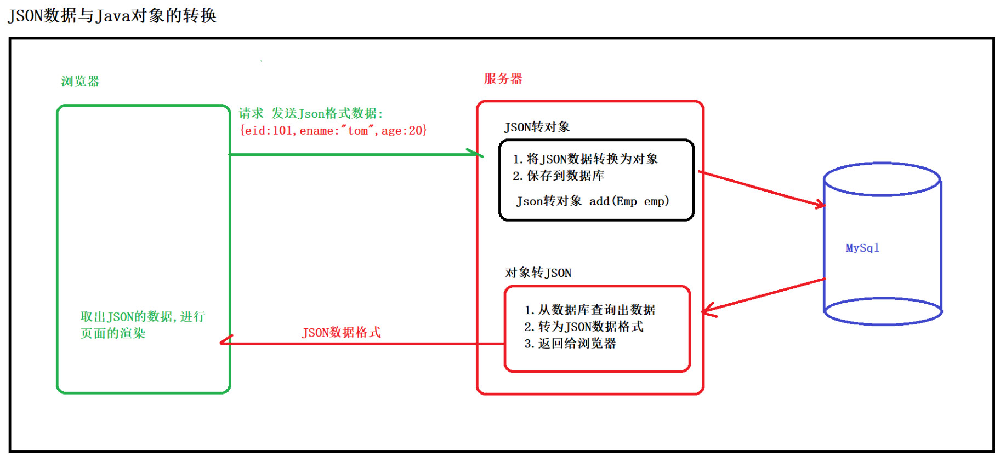

# JSON

<br/>

## 1、概述

- JSON，全称 JavaScript Object Notation（JavaScript 对象符号）。
- JSON 是一种轻量级的**数据交换格式**。
- 虽然 JSON 中带有 JavaScript 字样，但并不意味着 JSON 这种数据格式只适用于 JavaScript 这一种编程语言中。JSON 是一种完全独立于编程语言的数据格式，不同的编程语言都可以使用 JSON，不同编程语言之间同样可以使用 JSON 作为数据交换格式（只要约定好）。
- JSON 采用完全独立于语言的文本格式，就是说不同的编程语言 JSON 数据是一致的。绝大多数编程语言都可以去解析、生成 JSON 这种数据格式。
- 与 JSON 类似，XML 也可以作为数据交换格式。XML 相比 JSON 来说，是一种“重量级”的，传输过程中比较占用带宽。在数据交换方面，多数情况下，JSON 的使用要远比 XML 要多的多。现在常规的开发模式，前后端分离，采用的数据交换格式一般都是 JSON。

---

## 2、JSON 结构

- JSON 中之所以含 JavaScript，是因为其格式与 JavaScript 的对象类似，而 JSON 的标准也是由 ECMAScript 制定的。

```json
{
    "id": "1234",
    "name": "张三",
    "type": 1
}
```

- 结构特点：
1、外面由`{ }`括起来；
2、其中的数据以“键:值”对的形式出现（其中“键”大多以**字符串**形式出现；“值”可取字符串、数值、数组、对象等）。
3、每两个“键:值”对以逗号分隔（最后一个“键:值”对可以省略逗号）。
4、值如果是字符串类型，就必须加引号；如果是数值类型，引号可加可不加。

```json
{
    "arr": [
        {
            "id": "1234",
            "name": "张三"
        },
        {
            "id": "5678",
            "name": "李四"
        }
    ]
}
```

---

## 3、作为数据交换格式

<br/>

### 3.1、JSON 作为数据交换最经典的场景

- 常规模式前后端分离，使用 JSON 作为数据交换格式：





---

### 3.2、Java 对象与 JSON 转换

- 在 Java Web 开发中，用 POJO 类来封装数据，而数据最终要从服务器后端反馈给前端的，既然说到了用 JSON 作为数据交换格式，那么势必需要 Java 对象与 JSON 数据格式之间进行相互转换。
- Java 中实现 Java 对象与 JSON 数据格式相互转换的第三方库有很多，比较经典的有：Gson（由 Google 开发，`https://github.com/google/gson`）、Fastjson（由阿里巴巴开发，`https://github.com/alibaba/fastjson`，在国内较受欢迎）、Jackson（`https://github.com/FasterXML/jackson`，是很多框架的默认 JSON 处理工具，比如 Spring）。
- Gson、Fastjson、Jackson 等第三方库各有优劣，**一般的开发**无需过多关注这些第三方库的优劣、性能。

---

### 3.3、Fastjson

- 引入 Jar 包方式或 Maven 方式：

```xml
<dependency>
    <groupId>com.alibaba</groupId>
    <artifactId>fastjson</artifactId>
    <version>1.2.76</version>
</dependency>
```

- Java 对象转 JSON 数据格式（JSON 字符串）：

使用`com.alibaba.fastjson.JSON`类的`public static String toJSONString(Object object)`方法。

```java
public class Person {

    private String name;

    private String gender;

    private Integer age;

    public Person() {}

    public Person(String name, String gender, Integer age) {
        this.name = name;
        this.gender = gender;
        this.age = age;
    }

    public String getName() {
        return name;
    }

    public void setName(String name) {
        this.name = name;
    }

    public String getGender() {
        return gender;
    }

    public void setGender(String gender) {
        this.gender = gender;
    }

    public Integer getAge() {
        return age;
    }

    public void setAge(Integer age) {
        this.age = age;
    }

}
```

```java
import com.alibaba.fastjson.JSON;
import org.junit.Test;

public class JsonTest {

    @Test
    public void test1() {
        Person person = new Person("张三", "男", 20);

        String jsonString = JSON.toJSONString(person);

        System.out.println(jsonString);
        // {"age":20,"gender":"男","name":"张三"}
    }

}
```

```java
public class Person {

    private String name;

    private String gender;

    private Integer age;

    private Integer[] arr;

    public Person() {}

    public Person(String name, String gender, Integer age, Integer[] arr) {
        this.name = name;
        this.gender = gender;
        this.age = age;
        this.arr = arr;
    }

    public String getName() {
        return name;
    }

    public void setName(String name) {
        this.name = name;
    }

    public String getGender() {
        return gender;
    }

    public void setGender(String gender) {
        this.gender = gender;
    }

    public Integer getAge() {
        return age;
    }

    public void setAge(Integer age) {
        this.age = age;
    }

    public Integer[] getArr() {
        return arr;
    }

    public void setArr(Integer[] arr) {
        this.arr = arr;
    }

}
```

```java
import com.alibaba.fastjson.JSON;
import org.junit.Test;

public class JsonTest {

    @Test
    public void test1() {
        Person person = new Person("张三", "男", 20, new Integer[]{1, 2, 3});

        String jsonString = JSON.toJSONString(person);

        System.out.println(jsonString);
        // {"age":20,"arr":[1,2,3],"gender":"男","name":"张三"}
    }

}
```

```java
public class CourseGrade {

    private String courseName;

    private Integer courseGrade;

    public CourseGrade() {}

    public CourseGrade(String courseName, Integer courseGrade) {
        this.courseName = courseName;
        this.courseGrade = courseGrade;
    }

    public String getCourseName() {
        return courseName;
    }

    public void setCourseName(String courseName) {
        this.courseName = courseName;
    }

    public Integer getCourseGrade() {
        return courseGrade;
    }

    public void setCourseGrade(Integer courseGrade) {
        this.courseGrade = courseGrade;
    }

}
```

```java
public class Person {

    private String name;

    private String gender;

    private Integer age;

    private CourseGrade[] courseGradeArr;

    public Person() {}

    public Person(String name, String gender, Integer age, CourseGrade[] courseGradeArr) {
        this.name = name;
        this.gender = gender;
        this.age = age;
        this.courseGradeArr = courseGradeArr;
    }

    public String getName() {
        return name;
    }

    public void setName(String name) {
        this.name = name;
    }

    public String getGender() {
        return gender;
    }

    public void setGender(String gender) {
        this.gender = gender;
    }

    public Integer getAge() {
        return age;
    }

    public void setAge(Integer age) {
        this.age = age;
    }

    public CourseGrade[] getCourseGradeArr() {
        return courseGradeArr;
    }

    public void setCourseGradeArr(CourseGrade[] courseGradeArr) {
        this.courseGradeArr = courseGradeArr;
    }

}
```

```java
import com.alibaba.fastjson.JSON;
import org.junit.Test;

public class JsonTest {

    @Test
    public void test1() {

        CourseGrade courseGrade1 = new CourseGrade("Java", 100);
        CourseGrade courseGrade2 = new CourseGrade("Vue.js", 98);
        CourseGrade courseGrade3 = new CourseGrade("MySQL", 85);

        Person person = new Person("张三", "男", 20, new CourseGrade[]{courseGrade1, courseGrade2, courseGrade3});

        String jsonString = JSON.toJSONString(person);

        System.out.println(jsonString);
        // {"age":20,"courseGradeArr":[{"courseGrade":100,"courseName":"Java"},{"courseGrade":98,"courseName":"Vue.js"},{"courseGrade":85,"courseName":"MySQL"}],"gender":"男","name":"张三"}
    }

}
```

- 注解`@JSONField`：

注解`@JSONField`的作用是：在 Java 对象转为 JSON 的时候，使用该注解，自定义字段的名称进行输出，并控制字段的排序，还可以决定字段是否进行序列化。

> `name`：字段的名称 	
`ordinal`：字段的顺序，越小的排在前面
`serialize`：字段是否序列化（是否转换为 JSON），`true`参与序列化，`false`不参与序列化


```java
import com.alibaba.fastjson.annotation.JSONField;

public class CourseGrade {

    @JSONField(name = "Course-Name", ordinal = 0, serialize = true)
    private String courseName;

    @JSONField(name = "Course-Grade", ordinal = 1, serialize = true)
    private Integer courseGrade;

    public CourseGrade() {}

    public CourseGrade(String courseName, Integer courseGrade) {
        this.courseName = courseName;
        this.courseGrade = courseGrade;
    }

    public String getCourseName() {
        return courseName;
    }

    public void setCourseName(String courseName) {
        this.courseName = courseName;
    }

    public Integer getCourseGrade() {
        return courseGrade;
    }

    public void setCourseGrade(Integer courseGrade) {
        this.courseGrade = courseGrade;
    }

}
```

```java
import com.alibaba.fastjson.annotation.JSONField;

public class Person {

    @JSONField(name = "Name", ordinal = 0, serialize = true)
    private String name;

    @JSONField(name = "Gender", ordinal = 1, serialize = true)
    private String gender;

    @JSONField(name = "Age", serialize = false)
    private Integer age;

    @JSONField(name = "Course-Grade-List", ordinal = 2, serialize = true)
    private CourseGrade[] courseGradeArr;

    public Person() {}

    public Person(String name, String gender, Integer age, CourseGrade[] courseGradeArr) {
        this.name = name;
        this.gender = gender;
        this.age = age;
        this.courseGradeArr = courseGradeArr;
    }

    public String getName() {
        return name;
    }

    public void setName(String name) {
        this.name = name;
    }

    public String getGender() {
        return gender;
    }

    public void setGender(String gender) {
        this.gender = gender;
    }

    public Integer getAge() {
        return age;
    }

    public void setAge(Integer age) {
        this.age = age;
    }

    public CourseGrade[] getCourseGradeArr() {
        return courseGradeArr;
    }

    public void setCourseGradeArr(CourseGrade[] courseGradeArr) {
        this.courseGradeArr = courseGradeArr;
    }

}
```

```java
import com.alibaba.fastjson.JSON;
import org.junit.Test;

public class JsonTest {

    @Test
    public void test1() {

        CourseGrade courseGrade1 = new CourseGrade("Java", 100);
        CourseGrade courseGrade2 = new CourseGrade("Vue.js", 98);
        CourseGrade courseGrade3 = new CourseGrade("MySQL", 85);

        Person person = new Person("张三", "男", 20, new CourseGrade[]{courseGrade1, courseGrade2, courseGrade3});

        String jsonString = JSON.toJSONString(person);

        System.out.println(jsonString);
        // {"Name":"张三","Gender":"男","Course-Grade-List":[{"Course-Name":"Java","Course-Grade":100},{"Course-Name":"Vue.js","Course-Grade":98},{"Course-Name":"MySQL","Course-Grade":85}]}
    }

}
```

- JSON 数据格式（JSON 字符串）转 Java 对象：

使用`com.alibaba.fastjson.JSON`类的`public static <T> T parseObject(String text, Class<T> clazz)`方法。

成功转换的前提是，必须有`setter/getter`：

```java
import lombok.AllArgsConstructor;
import lombok.Data;
import lombok.NoArgsConstructor;
import lombok.ToString;

@NoArgsConstructor
@AllArgsConstructor
@Data
@ToString
public class Person {

    private String myName;

    private String myGender;

}
```

```java
import com.alibaba.fastjson.JSON;

import com.yscyber.json.one.Person;

import org.junit.Test;

public class JsonTest {

    @Test
    public void test1() {
        String jsonStr = "{'myName': '张三', 'myGender': '男'}";

        Person person = JSON.parseObject(jsonStr, Person.class);
        System.out.println(person); // Person(myName=张三, myGender=男)
    }

}
```

`@JSONField`中的`name`属性：

```java
import com.alibaba.fastjson.annotation.JSONField;

import lombok.AllArgsConstructor;
import lombok.Data;
import lombok.NoArgsConstructor;
import lombok.ToString;

@NoArgsConstructor
@AllArgsConstructor
@Data
@ToString
public class Person {

    @JSONField(name = "x")
    private String myName;

    @JSONField(name = "y")
    private String myGender;

}
```

```java
import com.alibaba.fastjson.JSON;

import com.yscyber.json.one.Person;

import org.junit.Test;

public class JsonTest {

    @Test
    public void test1() {
        String jsonStr = "{'x': '张三', 'y': '男'}";

        Person person = JSON.parseObject(jsonStr, Person.class);
        System.out.println(person); // Person(myName=张三, myGender=男)
    }

}
```

自动忽略大小写、“下划线”转“驼峰”：

```java
import lombok.AllArgsConstructor;
import lombok.Data;
import lombok.NoArgsConstructor;
import lombok.ToString;

@NoArgsConstructor
@AllArgsConstructor
@Data
@ToString
public class Person {

    private String myName;

    private String myGender;

}
```

```java
import com.alibaba.fastjson.JSON;

import com.yscyber.json.one.Person;

import org.junit.Test;

public class JsonTest {

    @Test
    public void test1() {
        String jsonStr = "{'my_name': '张三', 'my_gender': '男'}";

        Person person = JSON.parseObject(jsonStr, Person.class);
        System.out.println(person); // Person(myName=张三, myGender=男)
    }

}
```

---

### 3.4、JavaScript 关于 JSON 的处理

- 多数情况下，JavaScript 能够自动的将后端响应回的 JSON 字符串**自动解析**成一个 JavaScript 对象。

- JavaScript 原生关于 JSON 的处理：

`object JSON.parse(string)`：JSON 字符串转 JavaScript 对象；
`string JSON.stringify(object)`：JavaScript 对象转 JSON 字符串；

```js
    let obj = JSON.parse("{\"name\": \"张三\", \"age\": 20}");
    console.log(obj);
    console.log(typeof obj);

    let str = JSON.stringify(obj);
    console.log(str);
    console.log(typeof str);
```

注意：`object JSON.parse(string)`中的参数，JSON 字符串**内**中不能含有单引号：

```js
let jsonStr = "{\"name\": \"张三\", \"age\": 20}"; //正确，内部使用转义字符

let jsonStr = '{"name": "张三", "age": 20}'; // 正确，因为使用单引号包裹可以，内部可以直接使用双引号，无需转义

let jsonStr = "{'name': '张三', 'age': 20}"; // 错误
```
