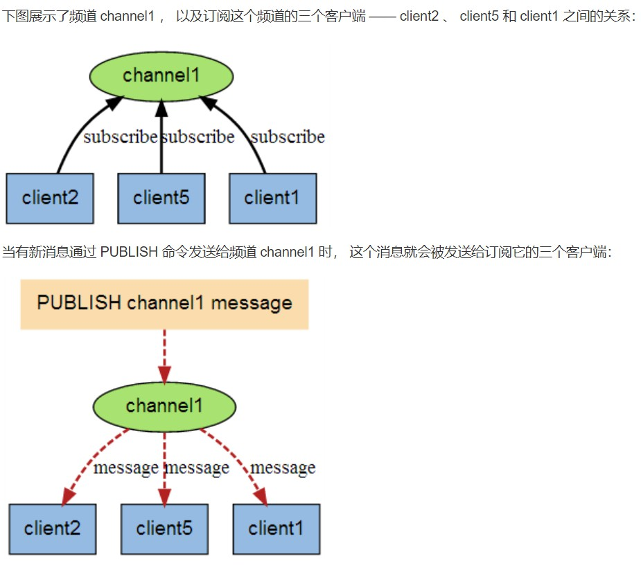
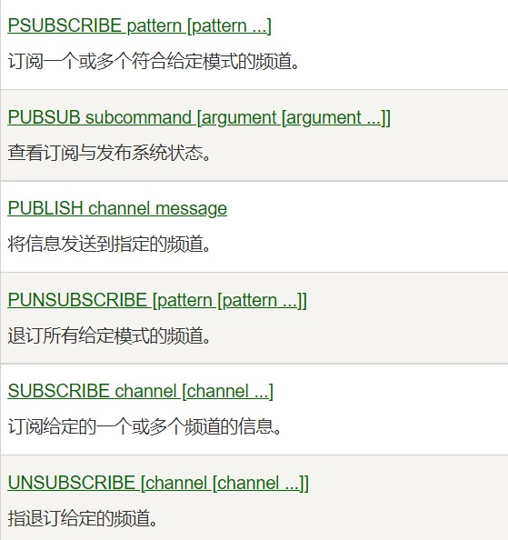

# 订阅与发布

<br/>

## 1、概述

<br/>

- Redis 发布与订阅 (pub/sub) 是一种消息通信模式：发送者 (pub) 发送消息，订阅者 (sub) 接收消息。
- Redis 客户端既可以担任发布者，也可以担任订阅者。
- 一个 Redis 客户端可以订阅任意数量的频道。
- [https://www.runoob.com/redis/redis-pub-sub.html](https://www.runoob.com/redis/redis-pub-sub.html)





---

## 2、使用发布与订阅

- Redis 与发布、订阅有关的命令：





- 举例：客户端 A 作为“订阅者”，客户端 B 作为“发布者”。


```shell
# 客户端 A 作为“订阅者”
# SUBSCRIBE 命令执行后，就开始等待“发布者”发布消息

127.0.0.1:6379> SUBSCRIBE CCTV1 CCTV5 CCTV13
Reading messages... (press Ctrl-C to quit)
1) "subscribe"
2) "CCTV1"
3) (integer) 1
1) "subscribe"
2) "CCTV5"
3) (integer) 2
1) "subscribe"
2) "CCTV13"
3) (integer) 3
```


```shell
# 客户端 B 作为“发布者”
# PUBLISH 命令发布消息

127.0.0.1:6379> PUBLISH CCTV13 'Living News'
(integer) 1
127.0.0.1:6379>
```


```shell
# 客户端 A 接收到订阅的消息

127.0.0.1:6379> SUBSCRIBE CCTV1 CCTV5 CCTV13
Reading messages... (press Ctrl-C to quit)
1) "subscribe"
2) "CCTV1"
3) (integer) 1
1) "subscribe"
2) "CCTV5"
3) (integer) 2
1) "subscribe"
2) "CCTV13"
3) (integer) 3

1) "message"
2) "CCTV13"
3) "Living News"
```