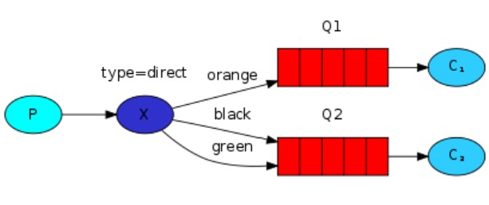
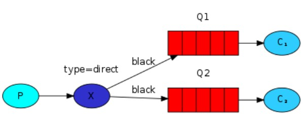
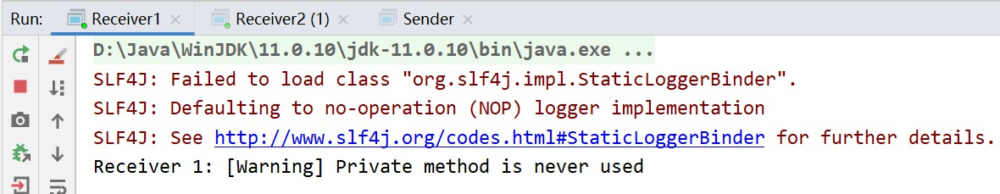
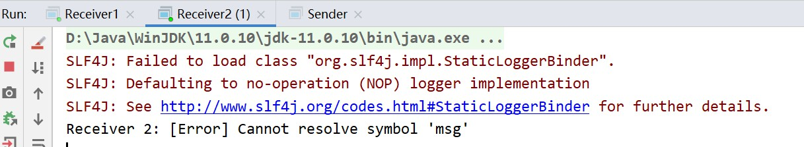
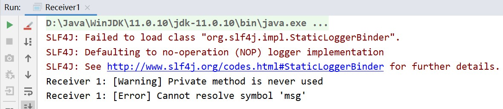
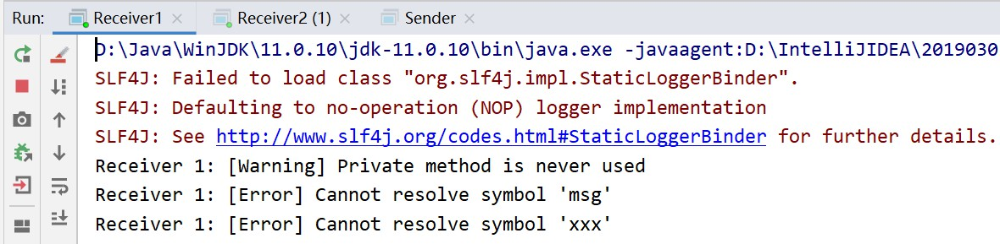
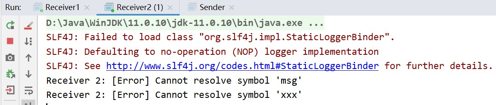
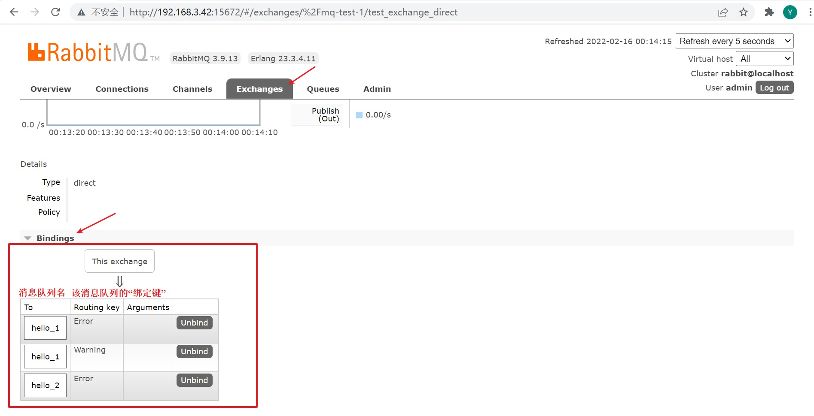

# 消息模型 — Routing

<br/>

## 1、概述

<br/>

- [https://www.rabbitmq.com/tutorials/tutorial-four-java.html](https://www.rabbitmq.com/tutorials/tutorial-four-java.html)
- 路由，这一模型与 [消息模型 — Publish/Subscribe](https://yyscyber.github.io/java/lagou/basic/d71c3c63-82f0-4bf0-88c3-c475671daf0e) 极为相似，或者说这一模型是以“发布与订阅”为基础。与之前的“发布与订阅”不同，“发布与订阅”中，所有与交换机绑定的**任何**消息队列**均能**获取到由交换机转发的消息，这一模型中的交换机会根据“消息的类型”**将消息分发给不同的队列**。这时的交换机类似于快递的分拣中心。

---

## 2、详情

<br/>

- 这里的交换机可以比喻成快递的分拣中心，只不过“快递”是消息。既然是“分拣”，那么就需要有“分拣”的依据，在这里的“分拣”依据成为路由键（Routing Key），字符串类型的路由键。

- 路由键，一方面消息生产者生产消息时需要为该消息设置路由键，另一方面在消息队列绑定到交换机时，需要设置该消息队列的路由键，只有这样，交换机才能够实现消息的定向分发。

  - 消息生产者生产消息时需要为该消息设置路由键（Routing key of the message）。

  - 在消息队列绑定到交换机时，需要设置该消息队列的路由键，这里的“路由键”，官方文档中标准说法是“绑定键”（Binding key of the queue）。

  - 当 Routing key 与 Binding key 一致时，该消息就会被转发至指定的队列。

    

    > We will use a *direct* exchange instead. The routing algorithm behind a direct exchange is simple - a message goes to the queues whose *binding key* exactly matches the *routing key* of the message.

    

- [消息模型 — Publish/Subscribe](https://yyscyber.github.io/java/lagou/basic/d71c3c63-82f0-4bf0-88c3-c475671daf0e) 中的交换机类型是`fanout`，而这里的需要使用的交换机类型是`direct`。

- 多个消息队列可以设置同一个路由键，一个消息队列可以设置不同的路由键。








---

## 3、Java 代码实现

<br/>

### 3.1、常规

- 不同的消息队列，互不相同的 Binding Key。


```java
import com.rabbitmq.client.Channel;
import com.rabbitmq.client.Connection;
import com.rabbitmq.client.ConnectionFactory;

import java.io.IOException;
import java.util.concurrent.TimeoutException;

public class ExchangeCreator {

    private static final String MQ_HOST = "192.168.3.42";

    private static final int MQ_PORT = 5672;

    private static final String MQ_USERNAME = "admin";

    private static final String MQ_PASSWORD = "yyss";

    private static final String MQ_VIRTUAL_HOST = "/mq-test-1";

    private static final String MQ_EXCHANGE_NAME = "test_exchange_direct";

    private static final String MQ_EXCHANGE_TYPE = "direct";

    public static void main(String[] args) {
        try {
            // 1、与 MQ 服务建立连接
            Connection connection = connection();

            // 2、在连接中创建信道
            Channel channel = connection.createChannel();

            // 3、创建或获取交换机
            // exchangeDeclare 的参数 1：交换机的名称
            // exchangeDeclare 的参数 2：交换机的类型
            channel.exchangeDeclare(MQ_EXCHANGE_NAME, MQ_EXCHANGE_TYPE);

            System.out.println("Finish creating exchange!");

            // 4、关闭信道
            channel.close();

            // 5、关闭连接
            connectionClose(connection);
        } catch (IOException | TimeoutException e) {
            e.printStackTrace();
        }
    }

    /**
     * 简易与 MQ 服务建立连接
     */
    private static Connection connection() {
        ConnectionFactory connectionFactory = new ConnectionFactory();

        connectionFactory.setHost(MQ_HOST);
        connectionFactory.setPort(MQ_PORT);
        connectionFactory.setVirtualHost(MQ_VIRTUAL_HOST);
        connectionFactory.setUsername(MQ_USERNAME);
        connectionFactory.setPassword(MQ_PASSWORD);

        Connection connection = null;

        try {
            connection = connectionFactory.newConnection();
        } catch (IOException | TimeoutException e) {
            e.printStackTrace();
        }

        return connection;
    }

    private static void connectionClose(Connection connection) {
        if (connection != null) {
            try {
                connection.close();
            } catch (IOException e) {
                e.printStackTrace();
            }
        }
    }

}
```


```java
import com.rabbitmq.client.Channel;
import com.rabbitmq.client.Connection;
import com.rabbitmq.client.ConnectionFactory;

import java.io.IOException;
import java.nio.charset.StandardCharsets;
import java.util.concurrent.TimeoutException;

public class Sender {

    private static final String MQ_HOST = "192.168.3.42";

    private static final int MQ_PORT = 5672;

    private static final String MQ_USERNAME = "admin";

    private static final String MQ_PASSWORD = "yyss";

    private static final String MQ_VIRTUAL_HOST = "/mq-test-1";

    private static final String MQ_EXCHANGE_NAME = "test_exchange_direct";

    private static final String MQ_MESSAGE_ROUTING_KEY_WARNING = "Warning";

    private static final String MQ_MESSAGE_ROUTING_KEY_ERROR = "Error";

    public static void main(String[] args) {
        String msg1 = "[Warning] Private method is never used";
        String msg2 = "[Error] Cannot resolve symbol 'msg'";

        try {
            // 1、与 MQ 服务建立连接
            Connection connection = connection();

            // 2、在连接中创建信道
            Channel channel = connection.createChannel();

            // 3、将消息发送至交换机
            // basicPublish 方法的参数 2：消息的路由键（没有参数 1 时，参数 2 直接表示“目标消息队列名称”）
            channel.basicPublish(MQ_EXCHANGE_NAME, MQ_MESSAGE_ROUTING_KEY_WARNING, null, msg1.getBytes(StandardCharsets.UTF_8));
            channel.basicPublish(MQ_EXCHANGE_NAME, MQ_MESSAGE_ROUTING_KEY_ERROR, null, msg2.getBytes(StandardCharsets.UTF_8));

            System.out.println("Finish sending messages!");

            // 4、关闭信道
            channel.close();

            // 5、关闭连接
            connectionClose(connection);
        } catch (IOException | TimeoutException e) {
            e.printStackTrace();
        }
    }

    /**
     * 简易与 MQ 服务建立连接
     */
    private static Connection connection() {
        ConnectionFactory connectionFactory = new ConnectionFactory();

        connectionFactory.setHost(MQ_HOST);
        connectionFactory.setPort(MQ_PORT);
        connectionFactory.setVirtualHost(MQ_VIRTUAL_HOST);
        connectionFactory.setUsername(MQ_USERNAME);
        connectionFactory.setPassword(MQ_PASSWORD);

        Connection connection = null;

        try {
            connection = connectionFactory.newConnection();
        } catch (IOException | TimeoutException e) {
            e.printStackTrace();
        }

        return connection;
    }

    private static void connectionClose(Connection connection) {
        if (connection != null) {
            try {
                connection.close();
            } catch (IOException e) {
                e.printStackTrace();
            }
        }
    }

}
```


```java
import com.rabbitmq.client.*;

import java.io.IOException;
import java.nio.charset.StandardCharsets;
import java.util.concurrent.TimeoutException;

public class Receiver1 {

    private static final String MQ_HOST = "192.168.3.42";

    private static final int MQ_PORT = 5672;

    private static final String MQ_USERNAME = "admin";

    private static final String MQ_PASSWORD = "yyss";

    private static final String MQ_VIRTUAL_HOST = "/mq-test-1";

    private static final String MQ_QUEUE_NAME = "hello_1";

    private static final String MQ_EXCHANGE_NAME = "test_exchange_direct";

    private static final String MQ_QUEUE_BINDING_KEY_WARNING = "Warning";

    public static void main(String[] args) {
        try {
            // 1、与 MQ 服务建立连接
            Connection connection = connection();

            // 2、在连接中创建信道
            Channel channel = connection.createChannel();

            // 3、创建或获取队列
            channel.queueDeclare(MQ_QUEUE_NAME, false, false, false, null);

            // 4、队列绑定至交换机
            // queueBind 方法的参数 1：队列名称
            // queueBind 方法的参数 2：交换机名称
            // queueBind 方法的参数 3：路由键，“没有”提供空串即可
            channel.queueBind(MQ_QUEUE_NAME, MQ_EXCHANGE_NAME, MQ_QUEUE_BINDING_KEY_WARNING);

            // 5、获取消息后如何处理、回调
            Consumer consumer = new DefaultConsumer(channel) {
                @Override
                public void handleDelivery(String consumerTag, Envelope envelope, AMQP.BasicProperties properties, byte[] body) throws IOException {
                    String msg = new String(body, StandardCharsets.UTF_8);
                    System.out.println("Receiver 1: " + msg);
                }
            };

            // 6、从消息队列中获取消息
            channel.basicConsume(MQ_QUEUE_NAME, true, consumer);
        } catch (IOException e) {
            e.printStackTrace();
        }
    }

    /**
     * 简易与 MQ 服务建立连接
     */
    private static Connection connection() {
        ConnectionFactory connectionFactory = new ConnectionFactory();

        connectionFactory.setHost(MQ_HOST);
        connectionFactory.setPort(MQ_PORT);
        connectionFactory.setVirtualHost(MQ_VIRTUAL_HOST);
        connectionFactory.setUsername(MQ_USERNAME);
        connectionFactory.setPassword(MQ_PASSWORD);

        Connection connection = null;

        try {
            connection = connectionFactory.newConnection();
        } catch (IOException | TimeoutException e) {
            e.printStackTrace();
        }

        return connection;
    }

}
```


```java
import com.rabbitmq.client.*;

import java.io.IOException;
import java.nio.charset.StandardCharsets;
import java.util.concurrent.TimeoutException;

public class Receiver2 {

    private static final String MQ_HOST = "192.168.3.42";

    private static final int MQ_PORT = 5672;

    private static final String MQ_USERNAME = "admin";

    private static final String MQ_PASSWORD = "yyss";

    private static final String MQ_VIRTUAL_HOST = "/mq-test-1";

    private static final String MQ_QUEUE_NAME = "hello_2";

    private static final String MQ_EXCHANGE_NAME = "test_exchange_direct";

    private static final String MQ_QUEUE_BINDING_KEY_ERROR = "Error";

    public static void main(String[] args) {
        try {
            // 1、与 MQ 服务建立连接
            Connection connection = connection();

            // 2、在连接中创建信道
            Channel channel = connection.createChannel();

            // 3、创建或获取队列
            channel.queueDeclare(MQ_QUEUE_NAME, false, false, false, null);

            // 4、队列绑定至交换机
            // queueBind 方法的参数 1：队列名称
            // queueBind 方法的参数 2：交换机名称
            // queueBind 方法的参数 3：路由键，“没有”提供空串即可
            channel.queueBind(MQ_QUEUE_NAME, MQ_EXCHANGE_NAME, MQ_QUEUE_BINDING_KEY_ERROR);

            // 5、获取消息后如何处理、回调
            Consumer consumer = new DefaultConsumer(channel) {
                @Override
                public void handleDelivery(String consumerTag, Envelope envelope, AMQP.BasicProperties properties, byte[] body) throws IOException {
                    String msg = new String(body, StandardCharsets.UTF_8);
                    System.out.println("Receiver 2: " + msg);
                }
            };

            // 6、从消息队列中获取消息
            channel.basicConsume(MQ_QUEUE_NAME, true, consumer);
        } catch (IOException e) {
            e.printStackTrace();
        }
    }

    /**
     * 简易与 MQ 服务建立连接
     */
    private static Connection connection() {
        ConnectionFactory connectionFactory = new ConnectionFactory();

        connectionFactory.setHost(MQ_HOST);
        connectionFactory.setPort(MQ_PORT);
        connectionFactory.setVirtualHost(MQ_VIRTUAL_HOST);
        connectionFactory.setUsername(MQ_USERNAME);
        connectionFactory.setPassword(MQ_PASSWORD);

        Connection connection = null;

        try {
            connection = connectionFactory.newConnection();
        } catch (IOException | TimeoutException e) {
            e.printStackTrace();
        }

        return connection;
    }
    
}
```


- 上述代码，先运行`ExchangeCreator`类，再运行`Receiver1`和`Receiver2`类，最后运行`Sender`类。首先要创建交换机；然后由于`Receiver1`和`Receiver2`类中没有关闭信道与连接，所以它们可以一直运行；运行`Sender`类后，可以看到`Receiver1`和`Receiver2`接收到消息。
- 最终的结果是，`Receiver1`和`Receiver2`接收到不同的消息，`Receiver1`接收到的是`[Warning]`，`Receiver2`接收到的是`[Error]`。








---

### 3.2、一个消息队列，不同的 Binding key


```java
import com.rabbitmq.client.Channel;
import com.rabbitmq.client.Connection;
import com.rabbitmq.client.ConnectionFactory;

import java.io.IOException;
import java.util.concurrent.TimeoutException;

public class ExchangeCreator {

    private static final String MQ_HOST = "192.168.3.42";

    private static final int MQ_PORT = 5672;

    private static final String MQ_USERNAME = "admin";

    private static final String MQ_PASSWORD = "yyss";

    private static final String MQ_VIRTUAL_HOST = "/mq-test-1";

    private static final String MQ_EXCHANGE_NAME = "test_exchange_direct";

    private static final String MQ_EXCHANGE_TYPE = "direct";

    public static void main(String[] args) {
        try {
            // 1、与 MQ 服务建立连接
            Connection connection = connection();

            // 2、在连接中创建信道
            Channel channel = connection.createChannel();

            // 3、创建或获取交换机
            // exchangeDeclare 的参数 1：交换机的名称
            // exchangeDeclare 的参数 2：交换机的类型
            channel.exchangeDeclare(MQ_EXCHANGE_NAME, MQ_EXCHANGE_TYPE);

            System.out.println("Finish creating exchange!");

            // 4、关闭信道
            channel.close();

            // 5、关闭连接
            connectionClose(connection);
        } catch (IOException | TimeoutException e) {
            e.printStackTrace();
        }
    }

    /**
     * 简易与 MQ 服务建立连接
     */
    private static Connection connection() {
        ConnectionFactory connectionFactory = new ConnectionFactory();

        connectionFactory.setHost(MQ_HOST);
        connectionFactory.setPort(MQ_PORT);
        connectionFactory.setVirtualHost(MQ_VIRTUAL_HOST);
        connectionFactory.setUsername(MQ_USERNAME);
        connectionFactory.setPassword(MQ_PASSWORD);

        Connection connection = null;

        try {
            connection = connectionFactory.newConnection();
        } catch (IOException | TimeoutException e) {
            e.printStackTrace();
        }

        return connection;
    }

    private static void connectionClose(Connection connection) {
        if (connection != null) {
            try {
                connection.close();
            } catch (IOException e) {
                e.printStackTrace();
            }
        }
    }

}
```


```java
import com.rabbitmq.client.Channel;
import com.rabbitmq.client.Connection;
import com.rabbitmq.client.ConnectionFactory;

import java.io.IOException;
import java.nio.charset.StandardCharsets;
import java.util.concurrent.TimeoutException;

public class Sender {

    private static final String MQ_HOST = "192.168.3.42";

    private static final int MQ_PORT = 5672;

    private static final String MQ_USERNAME = "admin";

    private static final String MQ_PASSWORD = "yyss";

    private static final String MQ_VIRTUAL_HOST = "/mq-test-1";

    private static final String MQ_EXCHANGE_NAME = "test_exchange_direct";

    private static final String MQ_MESSAGE_ROUTING_KEY_WARNING = "Warning";

    private static final String MQ_MESSAGE_ROUTING_KEY_ERROR = "Error";

    public static void main(String[] args) {
        String msg1 = "[Warning] Private method is never used";
        String msg2 = "[Error] Cannot resolve symbol 'msg'";

        try {
            // 1、与 MQ 服务建立连接
            Connection connection = connection();

            // 2、在连接中创建信道
            Channel channel = connection.createChannel();

            // 3、将消息发送至交换机
            // basicPublish 方法的参数 2：消息的路由键（没有参数 1 时，参数 2 直接表示“目标消息队列名称”）
            channel.basicPublish(MQ_EXCHANGE_NAME, MQ_MESSAGE_ROUTING_KEY_WARNING, null, msg1.getBytes(StandardCharsets.UTF_8));
            channel.basicPublish(MQ_EXCHANGE_NAME, MQ_MESSAGE_ROUTING_KEY_ERROR, null, msg2.getBytes(StandardCharsets.UTF_8));

            System.out.println("Finish sending messages!");

            // 4、关闭信道
            channel.close();

            // 5、关闭连接
            connectionClose(connection);
        } catch (IOException | TimeoutException e) {
            e.printStackTrace();
        }
    }

    /**
     * 简易与 MQ 服务建立连接
     */
    private static Connection connection() {
        ConnectionFactory connectionFactory = new ConnectionFactory();

        connectionFactory.setHost(MQ_HOST);
        connectionFactory.setPort(MQ_PORT);
        connectionFactory.setVirtualHost(MQ_VIRTUAL_HOST);
        connectionFactory.setUsername(MQ_USERNAME);
        connectionFactory.setPassword(MQ_PASSWORD);

        Connection connection = null;

        try {
            connection = connectionFactory.newConnection();
        } catch (IOException | TimeoutException e) {
            e.printStackTrace();
        }

        return connection;
    }

    private static void connectionClose(Connection connection) {
        if (connection != null) {
            try {
                connection.close();
            } catch (IOException e) {
                e.printStackTrace();
            }
        }
    }

}
```


```java
import com.rabbitmq.client.*;

import java.io.IOException;
import java.nio.charset.StandardCharsets;
import java.util.concurrent.TimeoutException;

public class Receiver {

    private static final String MQ_HOST = "192.168.3.42";

    private static final int MQ_PORT = 5672;

    private static final String MQ_USERNAME = "admin";

    private static final String MQ_PASSWORD = "yyss";

    private static final String MQ_VIRTUAL_HOST = "/mq-test-1";

    private static final String MQ_QUEUE_NAME = "hello_1";

    private static final String MQ_EXCHANGE_NAME = "test_exchange_direct";

    private static final String MQ_QUEUE_BINDING_KEY_WARNING = "Warning";

    private static final String MQ_QUEUE_BINDING_KEY_ERROR = "Error";

    public static void main(String[] args) {
        try {
            // 1、与 MQ 服务建立连接
            Connection connection = connection();

            // 2、在连接中创建信道
            Channel channel = connection.createChannel();

            // 3、创建或获取队列
            channel.queueDeclare(MQ_QUEUE_NAME, false, false, false, null);

            // 4、队列绑定至交换机
            channel.queueBind(MQ_QUEUE_NAME, MQ_EXCHANGE_NAME, MQ_QUEUE_BINDING_KEY_WARNING);
            channel.queueBind(MQ_QUEUE_NAME, MQ_EXCHANGE_NAME, MQ_QUEUE_BINDING_KEY_ERROR);

            // 5、获取消息后如何处理、回调
            Consumer consumer = new DefaultConsumer(channel) {
                @Override
                public void handleDelivery(String consumerTag, Envelope envelope, AMQP.BasicProperties properties, byte[] body) throws IOException {
                    String msg = new String(body, StandardCharsets.UTF_8);
                    System.out.println("Receiver 1: " + msg);
                }
            };

            // 6、从消息队列中获取消息
            channel.basicConsume(MQ_QUEUE_NAME, true, consumer);
        } catch (IOException e) {
            e.printStackTrace();
        }
    }

    /**
     * 简易与 MQ 服务建立连接
     */
    private static Connection connection() {
        ConnectionFactory connectionFactory = new ConnectionFactory();

        connectionFactory.setHost(MQ_HOST);
        connectionFactory.setPort(MQ_PORT);
        connectionFactory.setVirtualHost(MQ_VIRTUAL_HOST);
        connectionFactory.setUsername(MQ_USERNAME);
        connectionFactory.setPassword(MQ_PASSWORD);

        Connection connection = null;

        try {
            connection = connectionFactory.newConnection();
        } catch (IOException | TimeoutException e) {
            e.printStackTrace();
        }

        return connection;
    }

}
```


- 上述代码，先运行`ExchangeCreator`类，再运行`Receiver`类，最后运行`Sender`类。首先要创建交换机；然后由于`Receiver`类中没有关闭信道与连接，所以它们可以一直运行；运行`Sender`类后，可以看到`Receiver`接收到消息。
- 最终的结果是，`Receiver`既能够接收到的`[Warning]`消息，也能接收到`[Error]`消息。





---

### 3.3、不同的消息队列，相同的 Binding key


```java
import com.rabbitmq.client.Channel;
import com.rabbitmq.client.Connection;
import com.rabbitmq.client.ConnectionFactory;

import java.io.IOException;
import java.util.concurrent.TimeoutException;

public class ExchangeCreator {

    private static final String MQ_HOST = "192.168.3.42";

    private static final int MQ_PORT = 5672;

    private static final String MQ_USERNAME = "admin";

    private static final String MQ_PASSWORD = "yyss";

    private static final String MQ_VIRTUAL_HOST = "/mq-test-1";

    private static final String MQ_EXCHANGE_NAME = "test_exchange_direct";

    private static final String MQ_EXCHANGE_TYPE = "direct";

    public static void main(String[] args) {
        try {
            // 1、与 MQ 服务建立连接
            Connection connection = connection();

            // 2、在连接中创建信道
            Channel channel = connection.createChannel();

            // 3、创建或获取交换机
            // exchangeDeclare 的参数 1：交换机的名称
            // exchangeDeclare 的参数 2：交换机的类型
            channel.exchangeDeclare(MQ_EXCHANGE_NAME, MQ_EXCHANGE_TYPE);

            System.out.println("Finish creating exchange!");

            // 4、关闭信道
            channel.close();

            // 5、关闭连接
            connectionClose(connection);
        } catch (IOException | TimeoutException e) {
            e.printStackTrace();
        }
    }

    /**
     * 简易与 MQ 服务建立连接
     */
    private static Connection connection() {
        ConnectionFactory connectionFactory = new ConnectionFactory();

        connectionFactory.setHost(MQ_HOST);
        connectionFactory.setPort(MQ_PORT);
        connectionFactory.setVirtualHost(MQ_VIRTUAL_HOST);
        connectionFactory.setUsername(MQ_USERNAME);
        connectionFactory.setPassword(MQ_PASSWORD);

        Connection connection = null;

        try {
            connection = connectionFactory.newConnection();
        } catch (IOException | TimeoutException e) {
            e.printStackTrace();
        }

        return connection;
    }

    private static void connectionClose(Connection connection) {
        if (connection != null) {
            try {
                connection.close();
            } catch (IOException e) {
                e.printStackTrace();
            }
        }
    }

}
```


```java
import com.rabbitmq.client.Channel;
import com.rabbitmq.client.Connection;
import com.rabbitmq.client.ConnectionFactory;

import java.io.IOException;
import java.nio.charset.StandardCharsets;
import java.util.concurrent.TimeoutException;

public class Sender {

    private static final String MQ_HOST = "192.168.3.42";

    private static final int MQ_PORT = 5672;

    private static final String MQ_USERNAME = "admin";

    private static final String MQ_PASSWORD = "yyss";

    private static final String MQ_VIRTUAL_HOST = "/mq-test-1";

    private static final String MQ_EXCHANGE_NAME = "test_exchange_direct";

    private static final String MQ_MESSAGE_ROUTING_KEY_WARNING = "Warning";

    private static final String MQ_MESSAGE_ROUTING_KEY_ERROR = "Error";

    public static void main(String[] args) {
        String msg1 = "[Warning] Private method is never used";
        String msg2 = "[Error] Cannot resolve symbol 'msg'";
        String msg3 = "[Error] Cannot resolve symbol 'xxx'";

        try {
            // 1、与 MQ 服务建立连接
            Connection connection = connection();

            // 2、在连接中创建信道
            Channel channel = connection.createChannel();

            // 3、将消息发送至交换机
            // basicPublish 方法的参数 2：消息的路由键（没有参数 1 时，参数 2 直接表示“目标消息队列名称”）
            channel.basicPublish(MQ_EXCHANGE_NAME, MQ_MESSAGE_ROUTING_KEY_WARNING, null, msg1.getBytes(StandardCharsets.UTF_8));
            channel.basicPublish(MQ_EXCHANGE_NAME, MQ_MESSAGE_ROUTING_KEY_ERROR, null, msg2.getBytes(StandardCharsets.UTF_8));
            channel.basicPublish(MQ_EXCHANGE_NAME, MQ_MESSAGE_ROUTING_KEY_ERROR, null, msg3.getBytes(StandardCharsets.UTF_8));

            System.out.println("Finish sending messages!");

            // 4、关闭信道
            channel.close();

            // 5、关闭连接
            connectionClose(connection);
        } catch (IOException | TimeoutException e) {
            e.printStackTrace();
        }
    }

    /**
     * 简易与 MQ 服务建立连接
     */
    private static Connection connection() {
        ConnectionFactory connectionFactory = new ConnectionFactory();

        connectionFactory.setHost(MQ_HOST);
        connectionFactory.setPort(MQ_PORT);
        connectionFactory.setVirtualHost(MQ_VIRTUAL_HOST);
        connectionFactory.setUsername(MQ_USERNAME);
        connectionFactory.setPassword(MQ_PASSWORD);

        Connection connection = null;

        try {
            connection = connectionFactory.newConnection();
        } catch (IOException | TimeoutException e) {
            e.printStackTrace();
        }

        return connection;
    }

    private static void connectionClose(Connection connection) {
        if (connection != null) {
            try {
                connection.close();
            } catch (IOException e) {
                e.printStackTrace();
            }
        }
    }

}
```


```java
import com.rabbitmq.client.*;

import java.io.IOException;
import java.nio.charset.StandardCharsets;
import java.util.concurrent.TimeoutException;

public class Receiver1 {

    private static final String MQ_HOST = "192.168.3.42";

    private static final int MQ_PORT = 5672;

    private static final String MQ_USERNAME = "admin";

    private static final String MQ_PASSWORD = "yyss";

    private static final String MQ_VIRTUAL_HOST = "/mq-test-1";

    private static final String MQ_QUEUE_NAME = "hello_1";

    private static final String MQ_EXCHANGE_NAME = "test_exchange_direct";

    private static final String MQ_QUEUE_BINDING_KEY_WARNING = "Warning";

    private static final String MQ_QUEUE_BINDING_KEY_ERROR = "Error";

    public static void main(String[] args) {
        try {
            // 1、与 MQ 服务建立连接
            Connection connection = connection();

            // 2、在连接中创建信道
            Channel channel = connection.createChannel();

            // 3、创建或获取队列
            channel.queueDeclare(MQ_QUEUE_NAME, false, false, false, null);

            // 4、队列绑定至交换机
            channel.queueBind(MQ_QUEUE_NAME, MQ_EXCHANGE_NAME, MQ_QUEUE_BINDING_KEY_WARNING);
            channel.queueBind(MQ_QUEUE_NAME, MQ_EXCHANGE_NAME, MQ_QUEUE_BINDING_KEY_ERROR);

            // 5、获取消息后如何处理、回调
            Consumer consumer = new DefaultConsumer(channel) {
                @Override
                public void handleDelivery(String consumerTag, Envelope envelope, AMQP.BasicProperties properties, byte[] body) throws IOException {
                    String msg = new String(body, StandardCharsets.UTF_8);
                    System.out.println("Receiver 1: " + msg);
                }
            };

            // 6、从消息队列中获取消息
            channel.basicConsume(MQ_QUEUE_NAME, true, consumer);
        } catch (IOException e) {
            e.printStackTrace();
        }
    }

    /**
     * 简易与 MQ 服务建立连接
     */
    private static Connection connection() {
        ConnectionFactory connectionFactory = new ConnectionFactory();

        connectionFactory.setHost(MQ_HOST);
        connectionFactory.setPort(MQ_PORT);
        connectionFactory.setVirtualHost(MQ_VIRTUAL_HOST);
        connectionFactory.setUsername(MQ_USERNAME);
        connectionFactory.setPassword(MQ_PASSWORD);

        Connection connection = null;

        try {
            connection = connectionFactory.newConnection();
        } catch (IOException | TimeoutException e) {
            e.printStackTrace();
        }

        return connection;
    }

}
```


```java
import com.rabbitmq.client.*;

import java.io.IOException;
import java.nio.charset.StandardCharsets;
import java.util.concurrent.TimeoutException;

public class Receiver2 {

    private static final String MQ_HOST = "192.168.3.42";

    private static final int MQ_PORT = 5672;

    private static final String MQ_USERNAME = "admin";

    private static final String MQ_PASSWORD = "yyss";

    private static final String MQ_VIRTUAL_HOST = "/mq-test-1";

    private static final String MQ_QUEUE_NAME = "hello_2";

    private static final String MQ_EXCHANGE_NAME = "test_exchange_direct";

    private static final String MQ_QUEUE_BINDING_KEY_ERROR = "Error";

    public static void main(String[] args) {
        try {
            // 1、与 MQ 服务建立连接
            Connection connection = connection();

            // 2、在连接中创建信道
            Channel channel = connection.createChannel();

            // 3、创建或获取队列
            channel.queueDeclare(MQ_QUEUE_NAME, false, false, false, null);

            // 4、队列绑定至交换机
            // queueBind 方法的参数 1：队列名称
            // queueBind 方法的参数 2：交换机名称
            // queueBind 方法的参数 3：路由键，“没有”提供空串即可
            channel.queueBind(MQ_QUEUE_NAME, MQ_EXCHANGE_NAME, MQ_QUEUE_BINDING_KEY_ERROR);

            // 5、获取消息后如何处理、回调
            Consumer consumer = new DefaultConsumer(channel) {
                @Override
                public void handleDelivery(String consumerTag, Envelope envelope, AMQP.BasicProperties properties, byte[] body) throws IOException {
                    String msg = new String(body, StandardCharsets.UTF_8);
                    System.out.println("Receiver 2: " + msg);
                }
            };

            // 6、从消息队列中获取消息
            channel.basicConsume(MQ_QUEUE_NAME, true, consumer);
        } catch (IOException e) {
            e.printStackTrace();
        }
    }

    /**
     * 简易与 MQ 服务建立连接
     */
    private static Connection connection() {
        ConnectionFactory connectionFactory = new ConnectionFactory();

        connectionFactory.setHost(MQ_HOST);
        connectionFactory.setPort(MQ_PORT);
        connectionFactory.setVirtualHost(MQ_VIRTUAL_HOST);
        connectionFactory.setUsername(MQ_USERNAME);
        connectionFactory.setPassword(MQ_PASSWORD);

        Connection connection = null;

        try {
            connection = connectionFactory.newConnection();
        } catch (IOException | TimeoutException e) {
            e.printStackTrace();
        }

        return connection;
    }
    
}
```


- 上述代码，先运行`ExchangeCreator`类，再运行`Receiver1`和`Receiver2`类，最后运行`Sender`类。首先要创建交换机；然后由于`Receiver1`和`Receiver2`类中没有关闭信道与连接，所以它们可以一直运行；运行`Sender`类后，可以看到`Receiver1`和`Receiver2`接收到消息。
- 最终的结果是，`Receiver1`和`Receiver2`接收到相应的消息，`Receiver1`接收到的是`[Warning]`和`[Error]`，`Receiver2`接收到的是`[Error]`。








---

## 4、管理平台查看相关信息

<br/>

- 在 RabbitMQ 服务的 Web 管理平台中，可以查看一些相关信息，比如当前的交换机、路由键的情况等。





