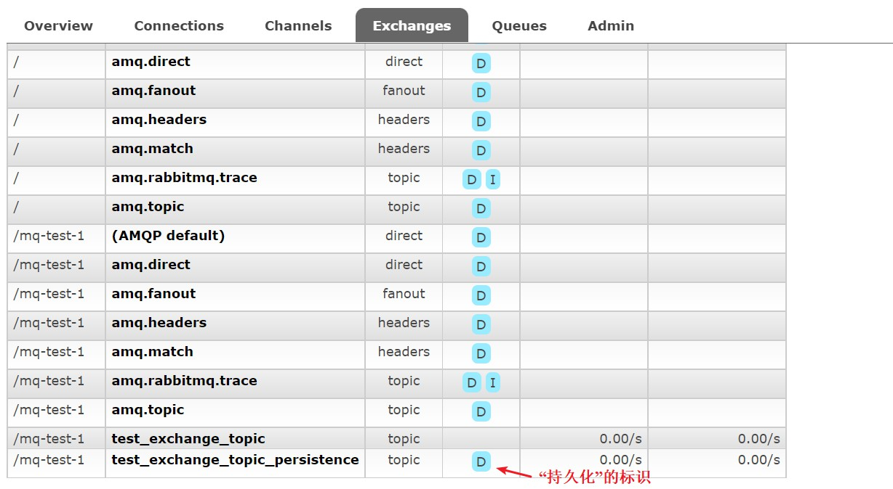
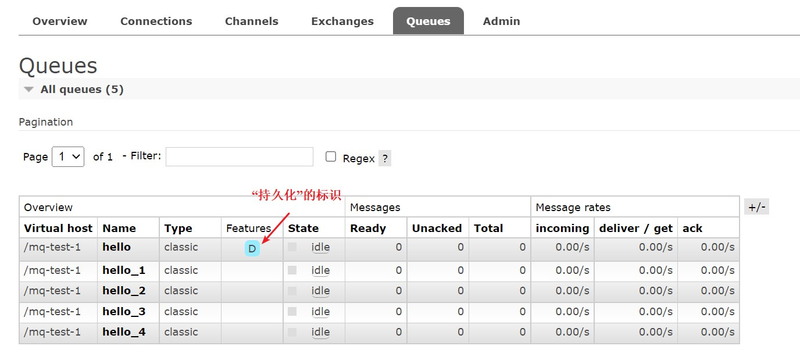

# 消息持久化

<br/>

## 1、概述

<br/>

- 默认情况下，RabbitMQ 服务如果关闭或停止的话，消息将不会被保存，会丢失。
- 默认情况下，消息队列（Queue）、交换机（Exchange）在 RabbitMQ 服务关闭、停止后也会丢失；虚拟主机（Virtual Host）不会丢失。
- 如果希望消息在 RabbitMQ 服务重启后不丢失，就需要交换机、消息队列持久化。

---

## 2、Java 代码实现

<br/>

```java
import com.rabbitmq.client.Channel;
import com.rabbitmq.client.Connection;
import com.rabbitmq.client.ConnectionFactory;

import java.io.IOException;
import java.util.concurrent.TimeoutException;

public class ExchangeCreator {

    private static final String MQ_HOST = "192.168.3.42";

    private static final int MQ_PORT = 5672;

    private static final String MQ_USERNAME = "admin";

    private static final String MQ_PASSWORD = "yyss";

    private static final String MQ_VIRTUAL_HOST = "/mq-test-1";

    private static final String MQ_EXCHANGE_NAME = "test_exchange_topic_persistence";

    private static final String MQ_EXCHANGE_TYPE = "topic";

    public static void main(String[] args) {
        try {
            // 1、与 MQ 服务建立连接
            Connection connection = connection();

            // 2、在连接中创建信道
            Channel channel = connection.createChannel();

            // 3、创建或获取交换机
            // exchangeDeclare 的参数 1：交换机的名称
            // exchangeDeclare 的参数 2：交换机的类型
            // exchangeDeclare 的参数 3：交换机的是否持久化
            channel.exchangeDeclare(MQ_EXCHANGE_NAME, MQ_EXCHANGE_TYPE, true);

            System.out.println("Finish creating exchange!");

            // 4、关闭信道
            channel.close();

            // 5、关闭连接
            connectionClose(connection);
        } catch (IOException | TimeoutException e) {
            e.printStackTrace();
        }
    }

    /**
     * 简易与 MQ 服务建立连接
     */
    private static Connection connection() {
        ConnectionFactory connectionFactory = new ConnectionFactory();

        connectionFactory.setHost(MQ_HOST);
        connectionFactory.setPort(MQ_PORT);
        connectionFactory.setVirtualHost(MQ_VIRTUAL_HOST);
        connectionFactory.setUsername(MQ_USERNAME);
        connectionFactory.setPassword(MQ_PASSWORD);

        Connection connection = null;

        try {
            connection = connectionFactory.newConnection();
        } catch (IOException | TimeoutException e) {
            e.printStackTrace();
        }

        return connection;
    }

    private static void connectionClose(Connection connection) {
        if (connection != null) {
            try {
                connection.close();
            } catch (IOException e) {
                e.printStackTrace();
            }
        }
    }

}
```


```java
import com.rabbitmq.client.Channel;
import com.rabbitmq.client.Connection;
import com.rabbitmq.client.ConnectionFactory;
import com.rabbitmq.client.MessageProperties;

import java.io.IOException;
import java.nio.charset.StandardCharsets;
import java.util.concurrent.TimeoutException;

public class Sender {

    private static final String MQ_HOST = "192.168.3.42";

    private static final int MQ_PORT = 5672;

    private static final String MQ_USERNAME = "admin";

    private static final String MQ_PASSWORD = "yyss";

    private static final String MQ_VIRTUAL_HOST = "/mq-test-1";

    private static final String MQ_EXCHANGE_NAME = "test_exchange_topic_persistence";

    private static final String MQ_MESSAGE_ROUTING_KEY_P1 = "com.yscyber.mq.dao";

    private static final String MQ_MESSAGE_ROUTING_KEY_P2 = "com.yscyber.mq.api";

    private static final String MQ_MESSAGE_ROUTING_KEY_P3 = "com.yscyber.redis.api";

    public static void main(String[] args) {
        String msg1 = "log-[com.yscyber.mq.dao]";
        String msg2 = "log-[com.yscyber.mq.api]";
        String msg3 = "log-[com.yscyber.redis.api]";

        try {
            // 1、与 MQ 服务建立连接
            Connection connection = connection();

            // 2、在连接中创建信道
            Channel channel = connection.createChannel();

            // 3、将消息发送至交换机
            // basicPublish 方法的参数 3：MessageProperties.PERSISTENT_TEXT_PLAIN 消息持久化，“非持久化”使用 null
            channel.basicPublish(MQ_EXCHANGE_NAME, MQ_MESSAGE_ROUTING_KEY_P1, MessageProperties.PERSISTENT_TEXT_PLAIN, msg1.getBytes(StandardCharsets.UTF_8));
            channel.basicPublish(MQ_EXCHANGE_NAME, MQ_MESSAGE_ROUTING_KEY_P2, MessageProperties.PERSISTENT_TEXT_PLAIN, msg2.getBytes(StandardCharsets.UTF_8));
            channel.basicPublish(MQ_EXCHANGE_NAME, MQ_MESSAGE_ROUTING_KEY_P3, MessageProperties.PERSISTENT_TEXT_PLAIN, msg3.getBytes(StandardCharsets.UTF_8));

            System.out.println("Finish sending messages!");

            // 4、关闭信道
            channel.close();

            // 5、关闭连接
            connectionClose(connection);
        } catch (IOException | TimeoutException e) {
            e.printStackTrace();
        }
    }

    /**
     * 简易与 MQ 服务建立连接
     */
    private static Connection connection() {
        ConnectionFactory connectionFactory = new ConnectionFactory();

        connectionFactory.setHost(MQ_HOST);
        connectionFactory.setPort(MQ_PORT);
        connectionFactory.setVirtualHost(MQ_VIRTUAL_HOST);
        connectionFactory.setUsername(MQ_USERNAME);
        connectionFactory.setPassword(MQ_PASSWORD);

        Connection connection = null;

        try {
            connection = connectionFactory.newConnection();
        } catch (IOException | TimeoutException e) {
            e.printStackTrace();
        }

        return connection;
    }

    private static void connectionClose(Connection connection) {
        if (connection != null) {
            try {
                connection.close();
            } catch (IOException e) {
                e.printStackTrace();
            }
        }
    }

}
```


```java
import com.rabbitmq.client.*;

import java.io.IOException;
import java.nio.charset.StandardCharsets;
import java.util.concurrent.TimeoutException;

public class Receiver {

    private static final String MQ_HOST = "192.168.3.42";

    private static final int MQ_PORT = 5672;

    private static final String MQ_USERNAME = "admin";

    private static final String MQ_PASSWORD = "yyss";

    private static final String MQ_VIRTUAL_HOST = "/mq-test-1";

    private static final String MQ_QUEUE_NAME = "hello";

    private static final String MQ_EXCHANGE_NAME = "test_exchange_topic_persistence";

    private static final String MQ_QUEUE_BINDING_KEY_PATTERN = "com.yscyber.#";

    public static void main(String[] args) {
        try {
            // 1、与 MQ 服务建立连接
            Connection connection = connection();

            // 2、在连接中创建信道
            Channel channel = connection.createChannel();

            // 3、创建或获取队列
            // queueDeclare 方法的参数 2：该消息队列是否持久化
            channel.queueDeclare(MQ_QUEUE_NAME, true, false, false, null);

            // 4、队列绑定至交换机
            channel.queueBind(MQ_QUEUE_NAME, MQ_EXCHANGE_NAME, MQ_QUEUE_BINDING_KEY_PATTERN);

            // 5、获取消息后如何处理、回调
            Consumer consumer = new DefaultConsumer(channel) {
                @Override
                public void handleDelivery(String consumerTag, Envelope envelope, AMQP.BasicProperties properties, byte[] body) throws IOException {
                    String msg = new String(body, StandardCharsets.UTF_8);
                    System.out.println("Receiver 4: " + msg);
                }
            };

            // 6、从消息队列中获取消息
            channel.basicConsume(MQ_QUEUE_NAME, true, consumer);
        } catch (IOException e) {
            e.printStackTrace();
        }
    }

    /**
     * 简易与 MQ 服务建立连接
     */
    private static Connection connection() {
        ConnectionFactory connectionFactory = new ConnectionFactory();

        connectionFactory.setHost(MQ_HOST);
        connectionFactory.setPort(MQ_PORT);
        connectionFactory.setVirtualHost(MQ_VIRTUAL_HOST);
        connectionFactory.setUsername(MQ_USERNAME);
        connectionFactory.setPassword(MQ_PASSWORD);

        Connection connection = null;

        try {
            connection = connectionFactory.newConnection();
        } catch (IOException | TimeoutException e) {
            e.printStackTrace();
        }

        return connection;
    }

}
```


---

## 3、管理平台相关信息

<br/>





