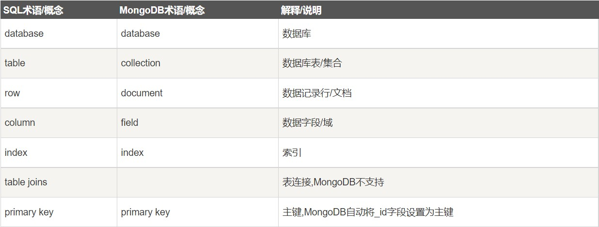
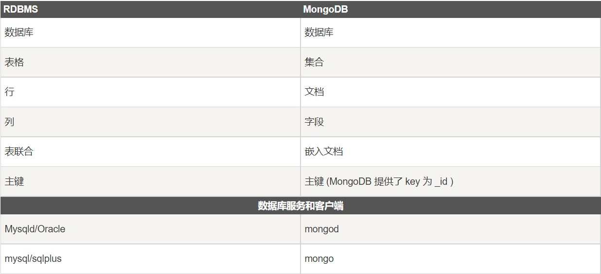

# 基本概念

>时间：2022-04-12

<br/>

## 1、概述

<br/>

- MongoDB 是由 C++ 语言编写的，是一个基于分布式文件存储的开源数据库系统。
- MongoDB 与 MySQL、Redis 等一样，属于客户端/服务端性质的软件。
- MongoDB 会将数据存储为文档。
- MongoDB 存储数据的格式，是由键值对组成，类似于 JSON，可以称之为 BSON。
- MongoDB 存储数据时，区分类型和大小写。
- MongoDB 服务的默认端口是`27017`。

---

## 2、database（数据库）

<br/>

- 一个 MongoDB 实例（服务）中可以有多个 database。
- 如果要将 MongoDB 中的概念与关系型数据库中的概念相比较，database 相当于关系型数据库中一个数据库。
- MongoDB 的单个实例可以容纳多个独立的 database，每一个都有自己的集合、文档数据和权限，不同的 database 也放置在不同的文件中。
- MongoDB 中初始默认存在的 database，不可以使用这些 database 的名称作为用户创建的 database 的名称：
  - admin：从权限的角度来看，这是 root 数据库。要是将一个用户添加到这个数据库，这个用户自动继承所有数据库的权限。一些特定的 MongoDB 服务器命令也只能从这个数据库运行，比如列出所有的数据库或者关闭服务器等。
  - local：这个数据库中的数据永远不会被复制，可以用来存储限于本地单台服务器的任意集合。
  - config：当 MongoDB 分片设置时，config 数据库在内部使用，用于保存分片的相关信息。
- 在未指定要操作的 database 时，MongoDB 默认指定的 database 是 test。
- 只有当 database 中**有数据**时，该 database 才能够存在。
- database 可以是满足以下条件的任意 UTF-8 字符串：
  - 不能是空字符串。
  - 不得含有空格、`.`、`$`、`/`、`\`和`\0` （空字符）等。
  - 不得使用`admin`、`local`、`config`等 MongoDB 初始默认存在的 database 的名称；一个实例下的 database 之间，命名不能相同。
  - 不超过64字节。
  - 字母应使用小写。

---

## 3、document（文档）

<br/>

- document 是 MongoDB 中的最基本概念之一。
- 一个 document 是一组键值（Key-Value）对（即 BSON）。


```json
{"site":"www.runoob.com", "name":"菜鸟教程"}
```


- document 相对来说并不是一种十分严格的数据结构，很灵活。
- 如果要将 MongoDB 中的概念与关系型数据库中的概念相比较，document 相当于关系型数据库中一张表中的**行**。
- document 中的键值对是**有序**的。
- 一个 document 中**不能有重复**的键。
- document 的键是字符串。除了少数例外情况，键可以使用任意 UTF-8 字符。
- document 中的值不仅可以是在双引号里面的字符串，还可以是其他几种数据类型（比如：可以是整个嵌入的 document)。


```json
{
    "name":"张三",
    
    "passport":{
        "no":"EJ111111",
        "type":"P",
        "authority":"NIA of PRC"
    }
}
```


---

## 4、collection（集合）

<br/>

- collection 是由多个 document 构成。
- 如果要将 MongoDB 中的概念与关系型数据库中的概念相比较，collection 相当于关系型数据库中一张**表**。
- collection 比较灵活，无模式的，一个 collection 中可以允许有不同格式的 document。


```json
{"site":"www.baidu.com"}
{"site":"www.google.com","name":"Google"}
```


- 当第一个 document 插入时，collection 就会被创建。
- collection 命名：
  - collection 名不能是空字符串。
  - collection 名不能含有`\0`字符（空字符），这个字符表示 collection 名的结尾。
  - collection 名不能以`system.`开头，这是为系统集合保留的前缀。
  - 用户创建的 collection 名字不能含有保留字符。有些驱动程序的确支持在集合名里面包含这些字符，这是因为某些系统生成的集合中包含该字符。除非要访问这种系统创建的集合，否则千万不要在名字里出现`$`。

---

## 5、补充

<br/>

- MongoDB 中的基本概念与关系型数据库中的基本概念对应：








- [https://www.runoob.com/mongodb/mongodb-databases-documents-collections.html](https://www.runoob.com/mongodb/mongodb-databases-documents-collections.html)

