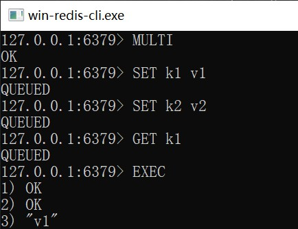
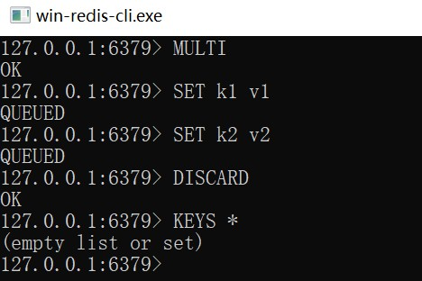
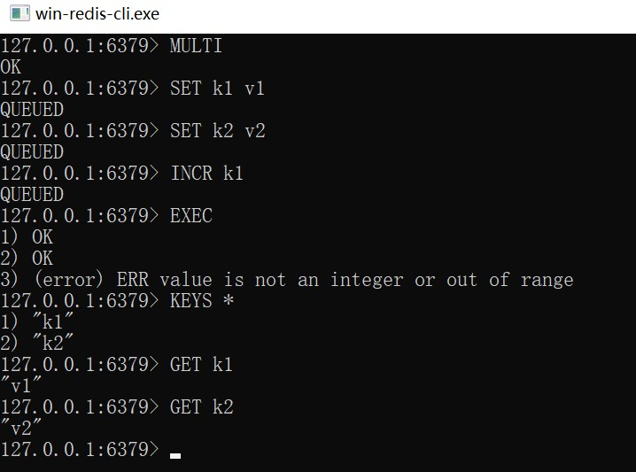
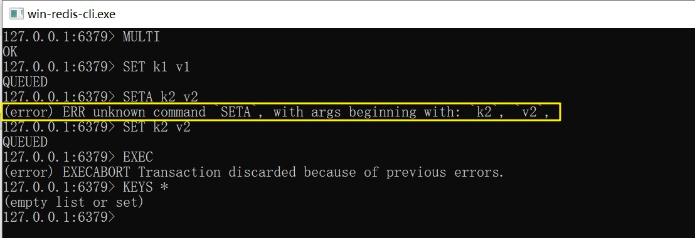
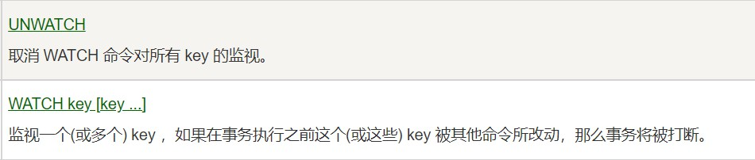

# 事务

<br/>

## 1、概述

<br/>

- Redis 的事务与传统的关系型数据库有相似的地方，但是仍存在较大区别。
- Redis 的事务更恰当的理解是：本质是一组命令的集合。事务支持一次执行多个命令，一个事务中所有命令都会被序列化。在事务执行过程，会按照顺序串行化执行队列中的命令，其他客户端提交的命令请求不会插入到事务执行命令序列中。
- Redis 事务就是一次性、顺序性、排他性的执行一个队列中的一系列命令。
- Redis 的事务不具备传统关系型数据库中的事务的“原子性”。单个 Redis 的命令（比如`SET`等）是可以理解为具有原子性的，但是 Redis 的事务不具备原子性，即一个事务中如果中间某条指令的失败（注意是“失败”，不是“报错”），不会导致前面已做指令的回滚，也不会造成后续的指令不做。
- Redis 事务没有隔离级别的概念：批量操作在发送`EXEC`命令前被放入队列缓存，并不会被实际执行，也就**不存在**事务内的查询要看到事务里的更新，事务外查询不能看到。
- Redis 事务的三个阶段：
  - 开始事务：使用`MULTI`命令
  - 命令入队
  - 执行事务/取消事务：使用`EXEC`命令 / 使用`DISCARD`命令
- Redis 的事务中允许有**读**操作。

---

## 2、使用事务

<br/>

### 2.1、正常的执行 / 取消事务

- `MULTI`命令开启事务；入队多个命令；`EXEC`命令执行事务（“一起生”）：


```shell
127.0.0.1:6379> MULTI
OK
127.0.0.1:6379> SET k1 v1
QUEUED
127.0.0.1:6379> SET k2 v2
QUEUED
127.0.0.1:6379> GET k1
QUEUED
127.0.0.1:6379> EXEC
1) OK
2) OK
3) "v1"
```





- `MULTI`命令开启事务；入队多个命令；`DISCARD`命令取消事务（“一起死”）：


```shell
127.0.0.1:6379> MULTI
OK
127.0.0.1:6379> SET k1 v1
QUEUED
127.0.0.1:6379> SET k2 v2
QUEUED
127.0.0.1:6379> DISCARD
OK
127.0.0.1:6379> KEYS *
(empty list or set)
```





---

### 2.2、执行事务（中间有命令失败）

- 验证 Redis 事务不具备原子性。
- “失败”指的是命令在语法上是正确的，但是在执行后会出错。
- 形容为“冤有头债有主”。


```shell
127.0.0.1:6379> MULTI
OK
127.0.0.1:6379> SET k1 v1
QUEUED
127.0.0.1:6379> SET k2 v2
QUEUED
127.0.0.1:6379> INCR k1
QUEUED
127.0.0.1:6379> EXEC
1) OK
2) OK
3) (error) ERR value is not an integer or out of range

127.0.0.1:6379> KEYS *
1) "k1"
2) "k2"
127.0.0.1:6379> GET k1
"v1"
127.0.0.1:6379> GET k2
"v2"
```





---

### 2.3、执行事务（中间有命令错误）

- “错误”指的是命令在语法上就出现错误。出现“错误”的情况下，即使最后使用`EXEC`命令，该事务也会被取消。
- 形容为“一粒老鼠屎坏一锅汤”。


```shell
127.0.0.1:6379> MULTI
OK
127.0.0.1:6379> SET k1 v1
QUEUED
127.0.0.1:6379> SETA k2 v2
(error) ERR unknown command `SETA`, with args beginning with: `k2`, `v2`,
127.0.0.1:6379> SET k2 v2
QUEUED
127.0.0.1:6379> EXEC
(error) EXECABORT Transaction discarded because of previous errors.
127.0.0.1:6379> KEYS *
(empty list or set)
```





---

## 3、监控

<br/>

- 监控，对指定键值对的监控。
- 监控，类似于“乐观锁”，在执行事务时，如果所监控的键值对中任何键的值已经被**其他客户端**更改，则使用`EXEC`执行事务时，**事务队列将不会被执行**，同时返回`Nullmulti-bulk`应答以通知调用者事务执行失败。
- 监控的命令有：`WATCH`、`UNWATCH`。





- 使用监控：准备两个命令行客户端，连接同一个 Redis 服务。客户端 A 监控键为`k1`的键值对，然后在事务中对`k1`进行修改；在 A 客户端执行事务之前，在客户端 B 对`k1`进行修改；最后看客户端 A 能否正常执行事务。


```shell
# 客户端 A 监控 k1 这一键值对
# 开启事务，修改 k1

127.0.0.1:6379> WATCH k1
OK
127.0.0.1:6379> MULTI
OK
127.0.0.1:6379> SET k1 v2
QUEUED
```


```shell
# 客户端 B 修改 k1

127.0.0.1:6379> SET k1 v1
OK
127.0.0.1:6379> GET k1
"v1"
```


```shell
# 客户端 A 执行事务 

127.0.0.1:6379> EXEC
(nil) # 事务将不被执行
```


- 除了`UNWATCH`命令解除所有监控，当执行`EXEC`命令后，无论事务是被执行还是取消，所有的监控也会被解除。