# 基本使用 2

<br/>

## 1、概述

<br/>

- Redis 基本命令。
- 参考：
  - [https://www.runoob.com/redis/redis-tutorial.html](https://www.runoob.com/redis/redis-tutorial.html)
  - [http://doc.redisfans.com](http://doc.redisfans.com)
  - Redis Web 版（供简单测试一些命令功能）：[https://try.redis.io](https://try.redis.io)
- Redis 命令执行需要通过 Redis 客户端进行。[https://www.runoob.com/redis/redis-commands.html](https://www.runoob.com/redis/redis-commands.html)
- Redis 命令（关键字）不区分大小写。

---

## 2、添加数据（增）

<br/>


```shell
# key 和 value 区分大小写

SET key value
```


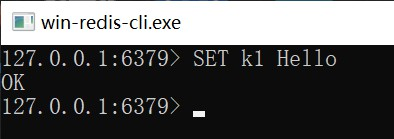


---

## 3、获取数据（查）

<br/>


```shell
GET key_name
```


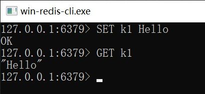


---

## 4、默认 16 个数据库

<br/>

- 一个 Redis 服务中，默认是有16个数据库，可以理解成能够存储键值的16张表。
- 默认的16个数据库，编号是 0~15。默认选中的是0号数据库。
- 数据库的数量可以配置。通过配置文件`redis.conf`中的`databases`项进行配置。


```config
# Set the number of databases. The default database is DB 0, you can select
# a different one on a per-connection basis using SELECT <dbid> where
# dbid is a number between 0 and 'databases'-1
databases 16
```


- 使用`SELECT`切换要操作的数据库。


```shell
SELECT db_id
```


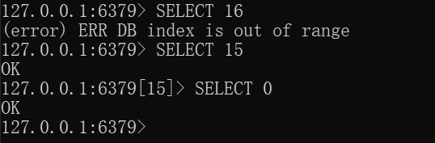


---

## 5、当前数据库中数据量

<br/>


```shell
DBSIZE
```


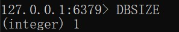


---

## 6、清空数据库（删）

<br/>


```shell
# 清空当前选中的数据库中的数据
FLUSHDB

# 清空所有数据库中的数据
FLUSHALL
```


---

## 7、键名的模糊查询（查）

<br/>

- 使用`KEYS`命令，查询当前选中的数据库中是否包含相应的键。


```shell
KEYS pattern
```


- `*`表示通配任意数量个字符、`?`表示通配一个字符、`[]`表示通配括号其中的某一个字符。


```shell
# 查询当前数据库中所有的键（名）

KEYS *
```


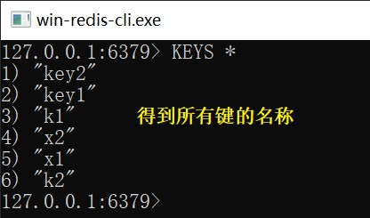


```shell
# 查询当前数据库中键名以 k 开头的所有的键（名）

KEYS k*
```


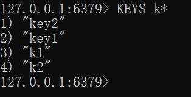


```shell
# 查询当前数据库中键名以 1 结尾的所有的键（名）

KEYS *1
```


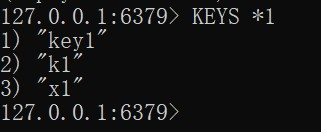


```shell
# 查询当前数据库中键名包含 y 的所有的键（名）

KEYS *y*
```


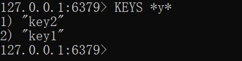


```shell
# 查询当前数据库中键名为 x后跟1个字符 的所有的键（名）

KEYS x?
```


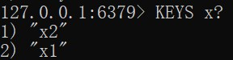


```shell
# 查询当前数据库中键名为 x后跟3个字符 的所有的键（名）

KEYS k???
```


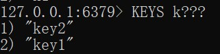


```shell
# 查询当前数据库中键名为 k1、k2、k3 的所有的键（名）

KEYS k[123]
```


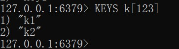


---

## 8、有关键的命令

<br/>


```shell
# 键名为 key_name 的键是否在当前数据库中存在
# 得到 1：存在；得到 0：不存在

EXISTS key_name
```


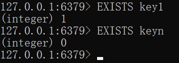


```shell
# 将当前数据库中键名为 key_name 的键值对移动到 db_id 数据库中

MOVE key_name db_id
```


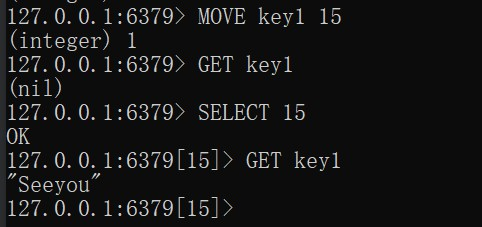


```shell
# TTL：Time To Live
# 当前数据库中的键名为 key_name 的键值对的剩余存活时间（单位：秒）
# 键值对一旦“过期”，将被自动删除
# 默认添加的键值对是“永久的”，“永久的”的结果是 -1

TTL key_name
```


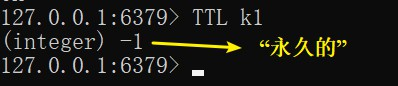


```shell
# 设置当前数据库中的键名为 key_name 的键值对的剩余存活时间（单位：秒）

EXPIRE key_name seconds
```


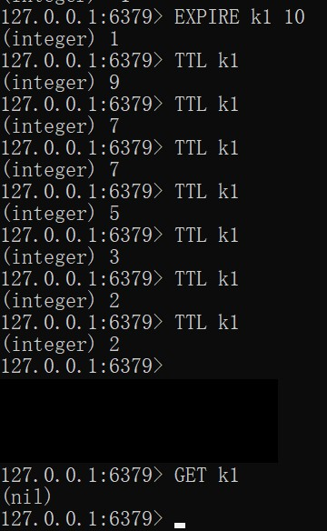


```shell
# 当前数据库中的键名为 key_name 的键值对中“值”的数据类型

TYPE key_name
```