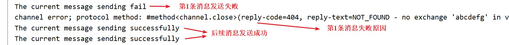
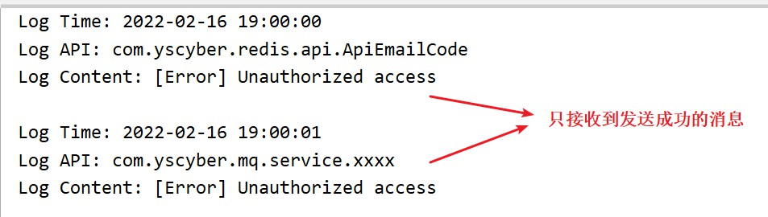

# 消息模型 — Publisher Confirms

<br/>

## 1、概述

<br/>

- 消息发送确认（Confirm）机制，是确保**消息生产者**将消息成功发送到消息队列的机制之一。
- 相比于“事务机制”，这一机制效率更高。
- 事务机制在消息发送出现问题时，采用的措施是“全部撤回”；发送确认机制在消息发送出现问题时，采用的措施是“补发”，将出现问题之后没有发送出的消息在补发一遍。
- 事务机制与发送确认机制，是确保**消息生产者**将消息成功发送到消息队列的机制，但是两者在同一个信道中是互斥的，也就是同一信道下，两种机制只能采用一种。
- 消息发送确认机制与之前的 [消息模型 — Hello World](https://yyscyber.github.io/java/lagou/basic/e82b8a20-8e6b-4b62-822c-5d7041d0e5a9) 一文中提到的 [3.3、消息确认 ACK](javascript:void(0);) 也是不同的。前者是消息发送者对发送的确认，后者是消息接收者对接收的确认。


- [https://www.rabbitmq.com/tutorials/tutorial-seven-java.html](https://www.rabbitmq.com/tutorials/tutorial-seven-java.html)

---

## 2、Spring 实现消息发送确认机制

<br/>

- 1、编写消息发送确认回调。实现`org.springframework.amqp.rabbit.core.RabbitTemplate.ConfirmCallback`接口，重写`confirm`方法。


```java
import org.springframework.amqp.rabbit.connection.CorrelationData;
import org.springframework.amqp.rabbit.core.RabbitTemplate;

public class MyConfirmCallback implements RabbitTemplate.ConfirmCallback {

    /**
     * @param correlationData 封装了消息数据的对象
     * @param b 消息发送是否成功的标志
     * @param s 消息发送如果出现异常，异常信息
     */
    @Override
    public void confirm(CorrelationData correlationData, boolean b, String s) {
        if (b) {
            System.out.println("The current message sending successfully");
        } else {
            System.out.println("The current message sending fail");
            // TODO 补发的逻辑（比如：采用 “Redis + 定时任务”）
        }
    }

}
```


- 2、配置消息发送确认机制（一般在“消息生产者”的配置文件中配置）。


```xml
<?xml version="1.0" encoding="UTF-8"?>
<beans xmlns:xsi="http://www.w3.org/2001/XMLSchema-instance"
       xmlns="http://www.springframework.org/schema/beans"
       xmlns:rabbit="http://www.springframework.org/schema/rabbit"
       xsi:schemaLocation="http://www.springframework.org/schema/rabbit https://www.springframework.org/schema/rabbit/spring-rabbit.xsd
       http://www.springframework.org/schema/beans https://www.springframework.org/schema/beans/spring-beans.xsd">

    <!-- 连接配置 -->
    <rabbit:connection-factory id="connectionFactory" host="192.168.3.42" port="5672" username="admin" password="yyss" virtual-host="/mq-test-1" publisher-confirms="true" />
    
    <rabbit:admin connection-factory="connectionFactory" />

    <!-- 队列配置：创建或获取队列 -->
    <!-- durable：该消息队列是否进行持久化 -->
    <rabbit:queue name="hello_1" durable="false" />
    <rabbit:queue name="hello_2" durable="false" />
    <rabbit:queue name="hello_3" durable="false" />

    <!-- 交换机配置：创建交换机 -->
    <!-- topic-exchange：topic 类型的交换机 -->
    <rabbit:topic-exchange name="spring_test_exchange_topic_publisher_confirm" durable="false">
        <!-- 交换机绑定消息队列配置 -->
        <rabbit:bindings>
            <rabbit:binding pattern="com.yscyber.mq.*" queue="hello_1" />
            <rabbit:binding pattern="com.yscyber.redis.*" queue="hello_2" />
            <rabbit:binding pattern="com.yscyber.#" queue="hello_3" />
        </rabbit:bindings>
    </rabbit:topic-exchange>

    <!-- 配置 JSON 数据转换器 -->
    <bean id="jsonMessageConverter" class="org.springframework.amqp.support.converter.Jackson2JsonMessageConverter" />

    <!-- 配置消息发送确认回调 -->
    <bean id="confirmCallback" class="com.yscyber.mq.sender.MyConfirmCallback"/>

    <!-- confirm-callback：消息发送确认回调 -->
    <rabbit:template id="rabbitTemplate" connection-factory="connectionFactory" exchange="spring_test_exchange_topic_publisher_confirm" message-converter="jsonMessageConverter" confirm-callback="confirmCallback" />
</beans>
```


- 3、测试，运行“生产者”、“消费者”程序。


```java
import org.junit.Test;
import org.junit.runner.RunWith;

import org.springframework.amqp.rabbit.core.RabbitTemplate;

import org.springframework.beans.factory.annotation.Autowired;

import org.springframework.test.context.ContextConfiguration;
import org.springframework.test.context.junit4.SpringJUnit4ClassRunner;

import java.util.HashMap;
import java.util.Map;

@RunWith(SpringJUnit4ClassRunner.class)
@ContextConfiguration(locations = "classpath:rabbitmq-sender-application-context.xml")
public class SpringRabbitMQTest {

    @Autowired
    private RabbitTemplate rabbitTemplate;

    @Test
    public void senderTest() {
        Map<String, String> msgContent1 = new HashMap<>();
        msgContent1.put("log-time", "2022-02-16 18:56:12");
        msgContent1.put("log-api", "com.yscyber.mq.api.ApiGetAllStudents");
        msgContent1.put("log-content", "[Error] Unauthorized access");


        Map<String, String> msgContent2 = new HashMap<>();
        msgContent2.put("log-time", "2022-02-16 19:00:00");
        msgContent2.put("log-api", "com.yscyber.redis.api.ApiEmailCode");
        msgContent2.put("log-content", "[Error] Unauthorized access");

        Map<String, String> msgContent3 = new HashMap<>();
        msgContent3.put("log-time", "2022-02-16 19:00:01");
        msgContent3.put("log-api", "com.yscyber.mq.service.xxxx");
        msgContent3.put("log-content", "[Error] Unauthorized access");

        // 发送消息

        // 制造一个消息发送错误，参数使用不存在的交换机
        rabbitTemplate.convertAndSend("abcdefg", "com.yscyber.mq.api", msgContent1);

        rabbitTemplate.convertAndSend("com.yscyber.redis.api", msgContent2);
        rabbitTemplate.convertAndSend("com.yscyber.mq.service", msgContent3);
    }

}
```


“生产者”输出：





“消费者”输出：




