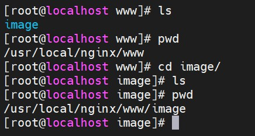

# 使用 Nginx 实现动静分离

<br/>

## 1、概述

- “动静分离”目前是一个常见并且成熟的开发模式。将静态资源比如说图片、音频、视频等放在一个（或多个）独立的服务器中，与部署代码的服务器分离。

  比如说“简书”，“简书”将用户所上传的图片均保存至域名为`https://upload-images.jianshu.io`服务器中。

- 分离包括硬件（物理）上的分离以及软件上的分离：

  物理上：部署在相互独立的物理机器上，每个机器上有对应的服务器软件。

  软件上：类似于虚拟主机的概念，只有一个物理机器，但可以通过使用服务器软件使得动静两者分离，比如一个物理机器上部署了 Tomcat 与 Apache，其中 Apache 作为静态资源服务器软件。

- 通过 Nginx 实现动静分离的常见方案有下面几种：

1、Nginx **本身**就可以作为 Web 服务器软件使用，即 Nginx 可以作为静态服务器软件，所以 Nginx 所部署的主机就可以成为静态资源服务器。


2、Nginx 通过“虚拟主机”或“反向代理”，指向部署了服务器软件（比如 Apache、Tomcat、Nginx 等），作为静态资源服务器的主机。


3、静态资源与代码部署在一起（比如说都部署在一个 Tomcat 中），但通过 Nginx 将其严格区分。


方案1和方案2最为常见，因为这样不管是物理上还是软件上的分离，是实现了一种静态资源相对独立。方案3的“动静分离”就不算十分明显。

- 云静态资源服务器有很多。

---

## 2、举例

- Nginx 作为服务器软件，部署 Nginx 的主机作为静态资源服务器

- 1、在 Nginx 目录下创建目录`/www/image`，用于保存静态图片资源。为了后续的一些效果，可以上传一些图片到这个目录下。





- 2、Nginx 配置文件：

```nginx
worker_processes  1;


events {
        worker_connections  1024;
}


http {
        include       mime.types;
        default_type  application/octet-stream;
        sendfile        on;
        keepalive_timeout  65;

        server {
                listen       80;
                server_name  localhost;

                location /image {
                        root www/;
                        autoindex on; # 开启索引，效果见图
                }
        }
}
```

- 3、启动 Nginx 或已启动重新加载配置文件。浏览器访问`http://192.168.3.42/image`，看到：


---

## 3、注意


