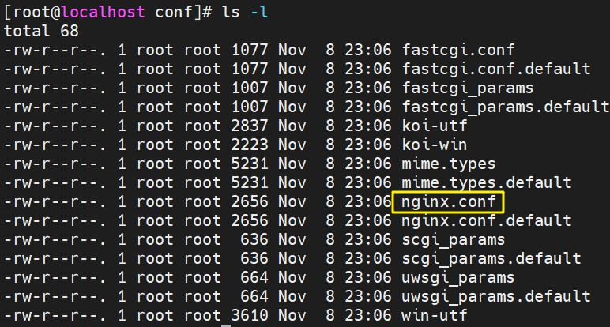
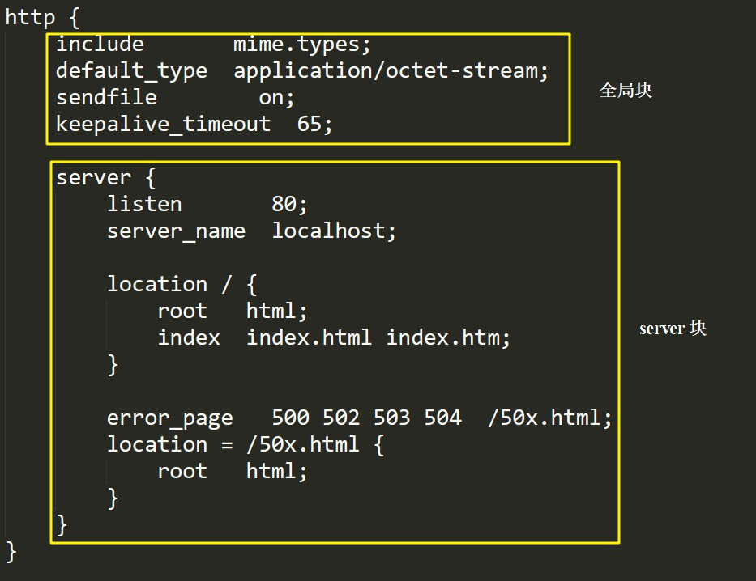

# 核心配置文件

<br/>

## 1、概述

- Nginx 的核心配置文件为其安装路径下的`conf`目录下的`nginx.conf`





---

## 2、配置文件默认内容

- Nginx 版本号：1.20.1

- `#`后为注释

```nginx
#user  nobody;
worker_processes  1;

#error_log  logs/error.log;
#error_log  logs/error.log  notice;
#error_log  logs/error.log  info;

#pid        logs/nginx.pid;


events {
    worker_connections  1024;
}


http {
    include       mime.types;
    default_type  application/octet-stream;

    #log_format  main  '$remote_addr - $remote_user [$time_local] "$request" '
    #                  '$status $body_bytes_sent "$http_referer" '
    #                  '"$http_user_agent" "$http_x_forwarded_for"';

    #access_log  logs/access.log  main;

    sendfile        on;
    #tcp_nopush     on;

    #keepalive_timeout  0;
    keepalive_timeout  65;

    #gzip  on;

    server {
        listen       80;
        server_name  localhost;

        #charset koi8-r;

        #access_log  logs/host.access.log  main;

        location / {
            root   html;
            index  index.html index.htm;
        }

        #error_page  404              /404.html;

        # redirect server error pages to the static page /50x.html
        #
        error_page   500 502 503 504  /50x.html;
        location = /50x.html {
            root   html;
        }

        # proxy the PHP scripts to Apache listening on 127.0.0.1:80
        #
        #location ~ \.php$ {
        #    proxy_pass   http://127.0.0.1;
        #}

        # pass the PHP scripts to FastCGI server listening on 127.0.0.1:9000
        #
        #location ~ \.php$ {
        #    root           html;
        #    fastcgi_pass   127.0.0.1:9000;
        #    fastcgi_index  index.php;
        #    fastcgi_param  SCRIPT_FILENAME  /scripts$fastcgi_script_name;
        #    include        fastcgi_params;
        #}

        # deny access to .htaccess files, if Apache's document root
        # concurs with nginx's one
        #
        #location ~ /\.ht {
        #    deny  all;
        #}
    }


    # another virtual host using mix of IP-, name-, and port-based configuration
    #
    #server {
    #    listen       8000;
    #    listen       somename:8080;
    #    server_name  somename  alias  another.alias;

    #    location / {
    #        root   html;
    #        index  index.html index.htm;
    #    }
    #}


    # HTTPS server
    #
    #server {
    #    listen       443 ssl;
    #    server_name  localhost;

    #    ssl_certificate      cert.pem;
    #    ssl_certificate_key  cert.key;

    #    ssl_session_cache    shared:SSL:1m;
    #    ssl_session_timeout  5m;

    #    ssl_ciphers  HIGH:!aNULL:!MD5;
    #    ssl_prefer_server_ciphers  on;

    #    location / {
    #        root   html;
    #        index  index.html index.htm;
    #    }
    #}

}
```

- 将注释删除后

```nginx
worker_processes  1;


events {
    worker_connections  1024;
}


http {
    include       mime.types;
    default_type  application/octet-stream;
    sendfile        on;
    keepalive_timeout  65;

    server {
        listen       80;
        server_name  localhost;

        location / {
            root   html;
            index  index.html index.htm;
        }

        error_page   500 502 503 504  /50x.html;
        location = /50x.html {
            root   html;
        }    
    }
}
```

---

## 3、配置文件内容

- Nginx 的配置文件大致上可以分为三个部分，全局块、events 块、http 块，其中 http 块中还包含 server 块，server 块中还包含 location 块。

- [https://nginx.org/en/docs/ngx_core_module.html](https://nginx.org/en/docs/ngx_core_module.html)

  [https://www.runoob.com/w3cnote/nginx-setup-intro.html](https://www.runoob.com/w3cnote/nginx-setup-intro.html)


### 3.1、全局块

- 从配置文件开始到 events 块（`events {······}`）之间的内容为全局块。
- 主要会设置一些影响 Nginx 服务器整体运行的配置**指令**，主要包括配置运行 Nginx 服务器的用户（组）、允许生成的`worker process`数（工作进程数、处理的并发数），进程 PID 存放路径、日志存放路径和类型以及配置文件的引入等。
- `worker_processes  1;`，这是 Nginx 服务器并发处理服务的关键配置，`worker_processes`值越大，可以支持的并发处理量也越多，但是会受到硬件、软件等各方面的制约，需根据实际情况合理配置。

---

### 3.2、events 块

- events 块涉及的指令主要影响 Nginx 服务器与用户的网络连接。

- 常用的设置包括，是否开启对多 work process 下的网络连接进行序列化，是否允许同时接收多个网络连接，选取哪种事件驱动模型来处理连接请求，每个 word process 可以同时支持的最大连接数等。

- `worker_connections 1024;`，表示每个 work process（工作进程） 支持的最大连接数，同样需根据实际情况合理配置。

  理论上每台 Nginx 服务器（软件）的最大连接数为：worker_processes × worker_connections

---

### 3.3、http 块

- http 块可以认为是 Nginx 核心配置文件中配置最频繁的部分，代理、缓存、日志定义等绝大多数功能和第三方模块的配置都在这里。

- http 块中又可以分为 http 全局块、server 块（可以配置多个 server 块）等。





#### 3.3.1、http 全局块

- http 全局块配置的指令包括文件引入、MIME-TYPE 定义、日志自定义、连接超时时间、单链接请求数上限等。


#### 3.3.2、server 块

- server 块，与虚拟主机配置密切相关。

  虚拟主机简单理解是多个服务（网站等）部署在同一台物理机器上，但是各个服务之间均有独立的业务、功能，使得用户认为这几种服务（网站等）是分别部署在不同的机器上。即虚拟主机从用户角度看，和一台独立的物理主机是完全一样的。虚拟主机技术的产生是为了节省互联网服务器硬件成本。

- 每个 http 块可以包括多个 server 块，而每个 server 块就相当于**一个虚拟主机**。

- server 块中又可以分为 server 的全局块、location 块（可以包含多个 location 块）


##### 3.3.2.1、server 全局块

- 最常见的配置是监听（listen）和本虚拟主机的名称（server_name）。


##### 3.3.2.2、location 块

- 这块的主要作用是基于 Nginx 服务器接收到的请求字符串（例如 `server_name/uri-string`），对虚拟主机名称（server_name）之外的字符串进行匹配，对特定的请求进行处理。

  地址定向、数据缓存和应答控制等功能，还有许多第三方模块的配置也在这里进行。
