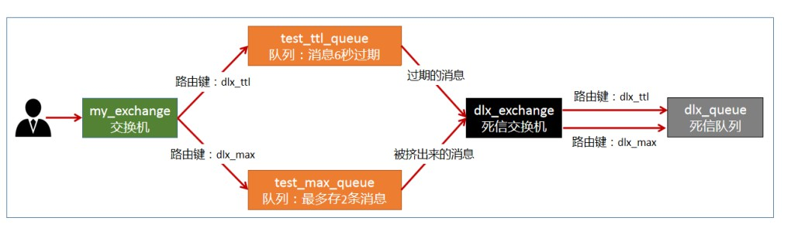
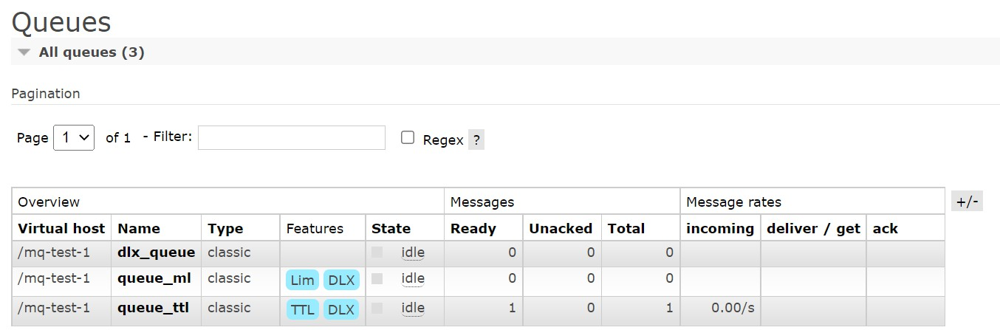
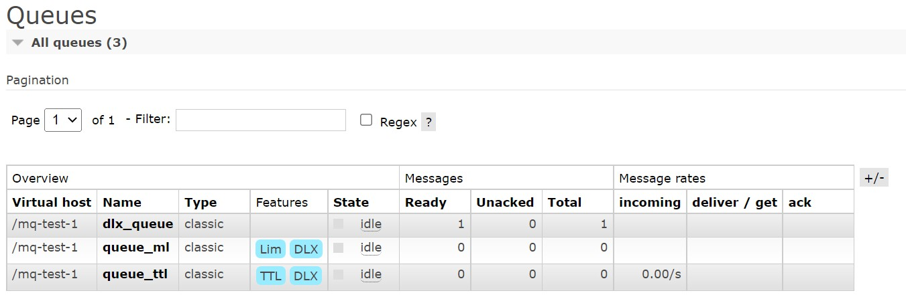
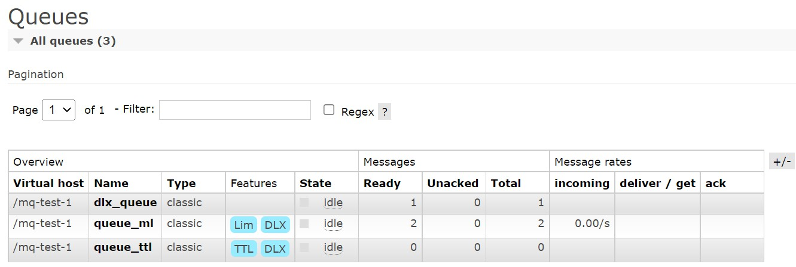
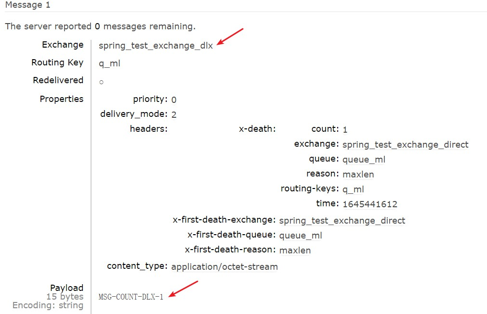

# 死信交换机 / 队列

<br/>

## 1、概述

<br/>

- 死信交换机/死信邮箱（Dead Letter Exchanges, DLX）。
- 当消息队列中的消息，由于某些原因没有被及时消费，这样的消息被称为“死信”（Dead Message）。
- 成为“死信”的消息，将会被分发到 DLX 中。与 DLX 绑定的消息队列，可以成为“死信队列”。“死信”最终经过 DLX，进入“死信队列”中。
- 消息成为“死信”的原因：
  - 消息超时（TTL）
  - 消息队列有消息数量限制，消息数量超出限制
  - 消息被拒绝并且不再重新投递

---

## 2、Java 代码实现

<br/>





- 配置文件（消息生产者）。
- 此示例中，使用的交换机类型是`direct`。实际使用中根据需求选择交换机类型。


```xml
<?xml version="1.0" encoding="UTF-8"?>
<beans xmlns:xsi="http://www.w3.org/2001/XMLSchema-instance"
       xmlns="http://www.springframework.org/schema/beans"
       xmlns:rabbit="http://www.springframework.org/schema/rabbit"
       xsi:schemaLocation="http://www.springframework.org/schema/rabbit https://www.springframework.org/schema/rabbit/spring-rabbit.xsd
       http://www.springframework.org/schema/beans https://www.springframework.org/schema/beans/spring-beans.xsd">

    <!-- 连接配置 -->
    <rabbit:connection-factory id="connectionFactory" host="192.168.3.42" port="5672" username="admin" password="yyss" virtual-host="/mq-test-1" />
    
    <rabbit:admin connection-factory="connectionFactory" />

    <!-- 死信队列 -->
    <rabbit:queue name="dlx_queue" durable="false"/>

    <!-- 死信交换机 -->
    <rabbit:direct-exchange name="spring_test_exchange_dlx" durable="false">
        <rabbit:bindings>
            <rabbit:binding key="q_ttl" queue="dlx_queue"/>
            <rabbit:binding key="q_ml" queue="dlx_queue"/>
        </rabbit:bindings>
    </rabbit:direct-exchange>

    <!-- 普通队列：消息超时后，将消息转入死信队列 -->
    <rabbit:queue name="queue_ttl" durable="false">
        <rabbit:queue-arguments>
            <entry key="x-message-ttl" value-type="long" value="5000"/>
            <entry key="x-dead-letter-exchange" value="spring_test_exchange_dlx"/>
        </rabbit:queue-arguments>
    </rabbit:queue>

    <!-- 普通队列：消息数量超过限制后，将最先入队的消息转入死信队列 -->
    <rabbit:queue name="queue_ml" durable="false">
        <rabbit:queue-arguments>
            <entry key="x-max-length" value-type="long" value="2"/>
            <entry key="x-dead-letter-exchange" value="spring_test_exchange_dlx"/>
        </rabbit:queue-arguments>
    </rabbit:queue>

    <!-- 普通交换机 -->
    <rabbit:direct-exchange name="spring_test_exchange_direct" durable="false">
        <rabbit:bindings>
            <rabbit:binding key="q_ttl" queue="queue_ttl"/>
            <rabbit:binding key="q_ml" queue="queue_ml"/>
        </rabbit:bindings>
    </rabbit:direct-exchange>

    <rabbit:template id="rabbitTemplate" connection-factory="connectionFactory" exchange="spring_test_exchange_direct" />

</beans>
```


- 测试超时消息进入死信队列。


```java
import org.junit.Test;
import org.junit.runner.RunWith;

import org.springframework.amqp.rabbit.core.RabbitTemplate;

import org.springframework.beans.factory.annotation.Autowired;

import org.springframework.test.context.ContextConfiguration;
import org.springframework.test.context.junit4.SpringJUnit4ClassRunner;

import java.nio.charset.StandardCharsets;

@RunWith(SpringJUnit4ClassRunner.class)
@ContextConfiguration(locations = "classpath:rabbitmq-sender-dlx-application-context.xml")
public class SpringRabbitMQTest {

    @Autowired
    private RabbitTemplate rabbitTemplate;

    @Test
    public void senderTest() {
        rabbitTemplate.convertAndSend("q_ttl", "TTL-DLX-1".getBytes(StandardCharsets.UTF_8));
    }

}
```








- 测试超过消息数量限制的消息进入死信队列。


```java
import org.junit.Test;
import org.junit.runner.RunWith;

import org.springframework.amqp.rabbit.core.RabbitTemplate;

import org.springframework.beans.factory.annotation.Autowired;

import org.springframework.test.context.ContextConfiguration;
import org.springframework.test.context.junit4.SpringJUnit4ClassRunner;

import java.nio.charset.StandardCharsets;

@RunWith(SpringJUnit4ClassRunner.class)
@ContextConfiguration(locations = "classpath:rabbitmq-sender-dlx-application-context.xml")
public class SpringRabbitMQTest {

    @Autowired
    private RabbitTemplate rabbitTemplate;

    @Test
    public void senderTest() {
        rabbitTemplate.convertAndSend("q_ml", "MSG-COUNT-DLX-1".getBytes(StandardCharsets.UTF_8));
        rabbitTemplate.convertAndSend("q_ml", "MSG-COUNT-DLX-2".getBytes(StandardCharsets.UTF_8));
        rabbitTemplate.convertAndSend("q_ml", "MSG-COUNT-DLX-3".getBytes(StandardCharsets.UTF_8));
    }

}
```







