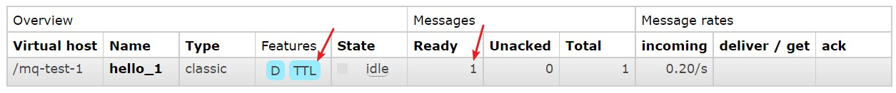
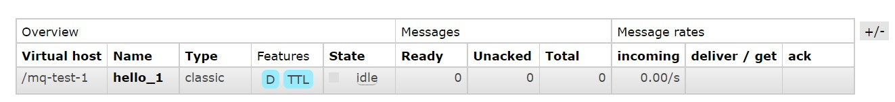

# 消息过期时间

<br/>

## 1、概述

<br/>

- TTL（Time To Live）：消息生存时间，单位毫秒。
- 消息没有被消费者正常消费，超过 TTL 这个时间，则自动删除。
- RabbitMQ 可以对消息队列设置 TTL，这样的话，其中的所有消息都遵循这个 TTL；也可以对每个消息单独设置 TTL，不同的消息可以有不同的 TTL。
- 当消息队列和当前消息均设置了 TTL，以较小的 TTL 为准。

---

## 2、消息队列设置 TTL

<br/>


```xml
<?xml version="1.0" encoding="UTF-8"?>
<beans xmlns:xsi="http://www.w3.org/2001/XMLSchema-instance"
       xmlns="http://www.springframework.org/schema/beans"
       xmlns:rabbit="http://www.springframework.org/schema/rabbit"
       xsi:schemaLocation="http://www.springframework.org/schema/rabbit https://www.springframework.org/schema/rabbit/spring-rabbit.xsd
       http://www.springframework.org/schema/beans https://www.springframework.org/schema/beans/spring-beans.xsd">

    <!-- 连接配置 -->
    <rabbit:connection-factory id="connectionFactory" host="192.168.3.42" port="5672" username="admin" password="yyss" virtual-host="/mq-test-1" />
    
    <rabbit:admin connection-factory="connectionFactory" />

    <!-- 队列配置：创建或获取队列 -->
    <rabbit:queue name="hello_1">
        <rabbit:queue-arguments>
            <!-- 设置消息队列的 TTL -->
            
            <!-- 5s -->
            <entry key="x-message-ttl" value-type="long" value="5000"/>
        </rabbit:queue-arguments>
    </rabbit:queue>

    <!-- 交换机配置：创建交换机 -->
    <!-- topic-exchange：topic 类型的交换机 -->
    <rabbit:topic-exchange name="spring_test_exchange_topic_queue_ttl">
        <!-- 交换机绑定消息队列配置 -->
        <rabbit:bindings>
            <rabbit:binding pattern="com.yscyber.#" queue="hello_1" />
        </rabbit:bindings>
    </rabbit:topic-exchange>

    <!-- 配置 JSON 数据转换器 -->
    <bean id="jsonMessageConverter" class="org.springframework.amqp.support.converter.Jackson2JsonMessageConverter" />

    <rabbit:template id="rabbitTemplate" connection-factory="connectionFactory" exchange="spring_test_exchange_topic_queue_ttl" message-converter="jsonMessageConverter" />
</beans>
```


```java
import org.junit.Test;
import org.junit.runner.RunWith;

import org.springframework.amqp.rabbit.core.RabbitTemplate;

import org.springframework.beans.factory.annotation.Autowired;

import org.springframework.test.context.ContextConfiguration;
import org.springframework.test.context.junit4.SpringJUnit4ClassRunner;

import java.util.HashMap;
import java.util.Map;

@RunWith(SpringJUnit4ClassRunner.class)
@ContextConfiguration(locations = "classpath:rabbitmq-sender-application-context.xml")
public class SpringRabbitMQTest {

    @Autowired
    private RabbitTemplate rabbitTemplate;

    @Test
    public void senderTest() {
        Map<String, String> msgContent1 = new HashMap<>();
        msgContent1.put("log-time", "2022-02-16 18:56:12");
        msgContent1.put("log-api", "com.yscyber.mq.api.ApiGetAllStudents");
        msgContent1.put("log-content", "[Error] Unauthorized access");


        rabbitTemplate.convertAndSend("com.yscyber.mq.api", msgContent1);
    }

}
```


- 消息队列中的消息在没有被消息消费者“消费”的话，超时后自动被删除。








---

## 3、消息设置 TTL

<br/>


```xml
<?xml version="1.0" encoding="UTF-8"?>
<beans xmlns:xsi="http://www.w3.org/2001/XMLSchema-instance"
       xmlns="http://www.springframework.org/schema/beans"
       xmlns:rabbit="http://www.springframework.org/schema/rabbit"
       xsi:schemaLocation="http://www.springframework.org/schema/rabbit https://www.springframework.org/schema/rabbit/spring-rabbit.xsd
       http://www.springframework.org/schema/beans https://www.springframework.org/schema/beans/spring-beans.xsd">

    <!-- 连接配置 -->
    <rabbit:connection-factory id="connectionFactory" host="192.168.3.42" port="5672" username="admin" password="yyss" virtual-host="/mq-test-1" />
    
    <rabbit:admin connection-factory="connectionFactory" />

    <!-- 队列配置：创建或获取队列 -->
    <rabbit:queue name="hello_2"/>

    <!-- 交换机配置：创建交换机 -->
    <!-- topic-exchange：topic 类型的交换机 -->
    <rabbit:topic-exchange name="spring_test_exchange_topic_message_ttl">
        <!-- 交换机绑定消息队列配置 -->
        <rabbit:bindings>
            <rabbit:binding pattern="com.yscyber.#" queue="hello_2" />
        </rabbit:bindings>
    </rabbit:topic-exchange>

    <!-- 配置 JSON 数据转换器 -->
    <bean id="jsonMessageConverter" class="org.springframework.amqp.support.converter.Jackson2JsonMessageConverter" />

    <rabbit:template id="rabbitTemplate" connection-factory="connectionFactory" exchange="spring_test_exchange_topic_message_ttl" message-converter="jsonMessageConverter" />
</beans>
```


```java
package com.yscyber.mq.sender;

import com.fasterxml.jackson.core.JsonProcessingException;
import com.fasterxml.jackson.databind.ObjectMapper;

import org.junit.Test;
import org.junit.runner.RunWith;

import org.springframework.amqp.core.Message;
import org.springframework.amqp.core.MessageProperties;
import org.springframework.amqp.rabbit.core.RabbitTemplate;

import org.springframework.beans.factory.annotation.Autowired;

import org.springframework.test.context.ContextConfiguration;
import org.springframework.test.context.junit4.SpringJUnit4ClassRunner;

import java.nio.charset.StandardCharsets;
import java.util.HashMap;
import java.util.Map;

@RunWith(SpringJUnit4ClassRunner.class)
@ContextConfiguration(locations = "classpath:rabbitmq-sender-application-context.xml")
public class SpringRabbitMQTest {

    @Autowired
    private RabbitTemplate rabbitTemplate;

    private static final ObjectMapper MAPPER = new ObjectMapper();

    @Test
    public void senderTest() throws JsonProcessingException {
        Map<String, String> msgContent = new HashMap<>();
        msgContent.put("log-time", "2022-02-16 18:56:12");
        msgContent.put("log-api", "com.yscyber.mq.api.ApiGetAllStudents");
        msgContent.put("log-content", "[Error] Unauthorized access");

        MessageProperties messageProperties = new MessageProperties();
        messageProperties.setExpiration("5000");
        Message message = new Message(MAPPER.writeValueAsString(msgContent).getBytes(StandardCharsets.UTF_8), messageProperties);

        rabbitTemplate.convertAndSend("com.yscyber.mq.api", message);
    }

}
```