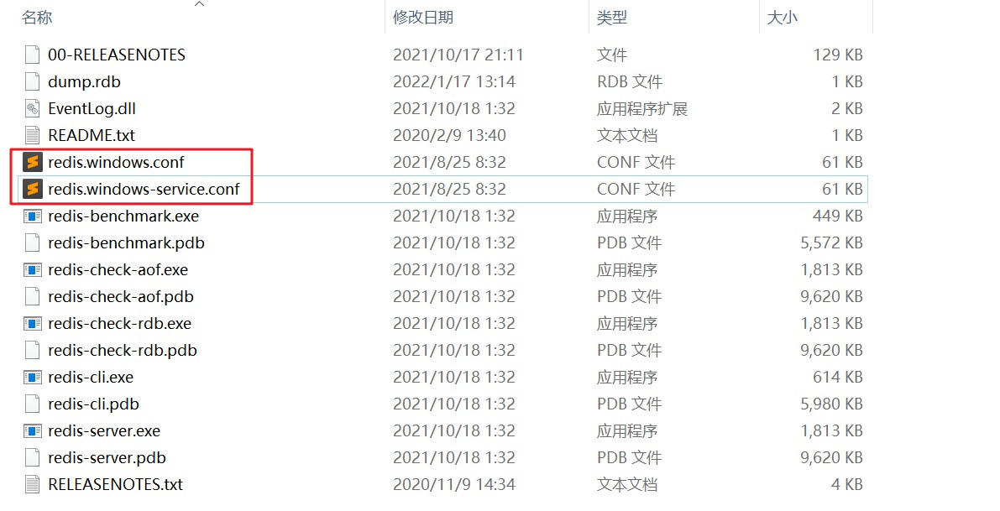

# 基本使用 1

<br/>

## 1、概述

<br/>

- Redis 的一些基本操作。
- [https://redis.io/topics/quickstart](https://redis.io/topics/quickstart)
- Redis 与 MySQL 类似，也是一种 C/S 模式，服务端对外提供数据存储等服务，客户端可以连接服务端进行一系列操作。Redis 成功安装后，自带一个命令行形式的客户端。
- Redis 对外服务的默认端口是 6379。
- Linux 系统中，Redis 的基本配置文件是其目录下的`redis.conf`；Windows 系统中，Redis 的基本配置文件是其目录下的`redis.windows.conf`、`redis.windows-service.conf`





---

## 2、启动 Redis 服务

<br/>

- Linux系统：
  - 如果完成了 [CentOS7 Redis 安装](https://yyscyber.github.io/development-environment-and-tools/0242477c-47f0-420c-9928-3a81fccfd1b9) 中的 [2.6、可选操作 — make install]()，那么可以在任何目录下使用`redis-server`命令启动 Redis 服务。默认 Redis 服务是非后台启动。
  - 在`redis-server`后加上配置文件的路径，这个时候，Redis 服务是基于配置文件中的配置启动。


```shell
# 常规启动

redis-server

# 指定配置文件启动
# /usr/local/redis/redis.conf 配置文件的路径

redis-server /usr/local/redis/redis.conf
```


- Windows 系统：
  - 打开 Redis 目录下的`redis-server.exe`即可。
  - 当然，也可以通过配置环境变量等，直接使用命令行启动。

---

## 3、Redis 服务后台启动

<br/>

- 后台启动**主要**针对安装在 Linux 系统上的 Redis。
- Windows 系统本身就支持“多窗口”，所以没有必要进行这种配置。
- 默认启动 Redis 服务端不是“后台启动/运行”，这样会导致 Redis 会一直“占用”命令行，命令行无法进行其他操作。像下图这样：


- 可以通过修改`redis.conf`配置文件，配置 Redis 服务的后台启动/运行。
  - 修改其中的`daemonize`项，默认`daemonize`项为`no`，修改为`yes`。
  - `daemonize`可以翻译成“守护进程”，守护进程是一类在后台运行的特殊进程，用于执行特定的系统任务。


```config
daemonize yes
```


- 配置文件修改完成后，启动 Redis 服务的命令要使用“基于配置文件启动”的命令。


```shell
# 指定配置文件路径，可基于配置文件中的配置启动 Redis 服务
redis-server /usr/local/redis/redis.conf
```


- 可以通过一些方法验证 Redis 服务是否已经在后台运行。


```shell
# https://www.runoob.com/linux/linux-comm-ps.html
# 查看 Redis 服务进程是否运行

ps -ef | grep redis
```


```shell
# https://www.runoob.com/linux/linux-comm-netstat.html
# netstat 命令用于显示网络状态
# 通过 netstat 命令可以检测指定端口是否在监听

netstat -lntp | grep 6379
```


```shell
# 通过启动自带的 Redis 客户端，判断 Redis 服务是否运行
redis-cli
```


```shell
# 自带客户端专门测试连接的
# 如果结果是输出 PONG，说明 Redis 服务、连接正常

redis-cli ping
```


---

## 4、启动自带的 Redis 客户端（命令行式）

<br/>

- Linux 系统：
  - 如果完成了 [CentOS7 Redis 安装](https://yyscyber.github.io/development-environment-and-tools/0242477c-47f0-420c-9928-3a81fccfd1b9) 中的 [2.6、可选操作 — make install]()，并且启动了 Redis 服务，那么可以在任何目录下使用`redis-cli`命令启动自带的 Redis 客户端。


```shell
redis-cli
```


- Windows 系统：
  - 成功启动 Redis 服务后，打开 Redis 目录下的`redis-cli.exe`即可。
  - 当然，也可以通过配置环境变量等，直接使用命令行启动。

---

## 5、测试连接情况

<br/>

- 使用`redis-cli ping`命令或在客户端（命令行）中使用`ping`命令，测试 Redis 客户端与服务端的连接情况。执行后输出`PONG`，说明连接正常。


```shell
redis-cli ping
```


---

## 6、可视化工具等其他形式客户端连接 Redis 服务（远程连接）

<br/>

- 有些时候，为了方便操作 Linux 系统上安装的 Redis，需借助 Redis 可视化工具。
- 下面所进行的配置，适合个人学习、试验阶段使用，切勿直接在生产环境使用。实际实践中必须在确保安全的情况下使用。


- 1、修改 Redis 配置文件`redis.conf`。
  - 将默认配置`bind 127.0.0.1 -::1`删除或注释。`bind 127.0.0.1 -::1`意思是“只允许本地的客户端对服务进行连接”。
  - 将默认配置`protected-mode yes`改为`protected-mode no`。该配置的意思是“保护模式是否开启”。
- 2、防火墙将 Redis 服务的端口对外开放。
- 3、以配置文件启动 Redis 服务。
- 参考：Redis Desktop Manager（RDM）连接虚拟机中的 Redis：[https://blog.csdn.net/weixin_45749742/article/details/118565332](https://blog.csdn.net/weixin_45749742/article/details/118565332)

---

## 7、关闭（退出）自带的 Redis 客户端（命令行式）

<br/>

- Linux 系统：使用`ctrl + c`关闭自带的 Redis 客户端。
- Windows 系统：直接关闭`redis-cli.exe`窗口即可或使用`ctrl + c`关闭。
- 通用：在客户端（命令行）中使用`exit`或`quit`命令。


---

## 8、关闭 Redis 服务

<br/>

- Linux 系统：
  - 未配置后台启动：使用`ctrl + c`直接关闭。
  - 配置后台启动：使用`redis-cli shutdown`命令；或在客户端（命令行）中使用`shutdown`命令，再使用`ctrl + c`关闭（退出）自带的 Redis 客户端。


- Windows 系统：直接关闭`redis-server.exe`窗口即可或使用`ctrl + c`关闭。
- 通用：在客户端（命令行）中使用`shutdown`命令。

---

## 9、等等

