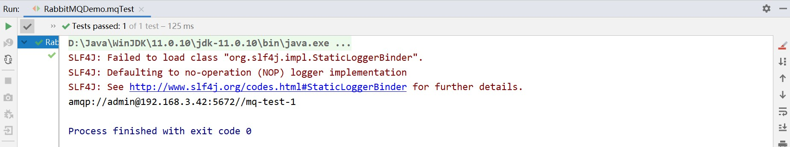

# Java 使用 RabbitMQ

<br/>

## 1、概述

- Java 使用 RabbitMQ 的最基本的操作，即建立与 RabbitMQ 服务的连接。

---

## 2、具体步骤

<br/>

### 2.1、导入依赖

- 在 Maven 工程中导入相关的依赖。


```xml
<!-- https://mvnrepository.com/artifact/com.rabbitmq/amqp-client -->
<!-- https://www.rabbitmq.com/java-client.html -->

<dependency>
    <groupId>com.rabbitmq</groupId>
    <artifactId>amqp-client</artifactId>
    <version>5.14.0</version>
</dependency>
```


---

### 2.2、建立连接

- 以下仅为建立连接的简单代码。仅供初学使用。


```java
import com.rabbitmq.client.Connection;
import com.rabbitmq.client.ConnectionFactory;

import org.junit.Test;

import java.io.IOException;
import java.util.concurrent.TimeoutException;

public class RabbitMQDemo {

    @Test
    public void mqTest() {
        ConnectionFactory connectionFactory = new ConnectionFactory();

        // 设置连接参数
        connectionFactory.setHost("192.168.3.42");
        connectionFactory.setPort(5672);
        connectionFactory.setVirtualHost("/mq-test-1");
        connectionFactory.setUsername("admin");
        connectionFactory.setPassword("xxxx");

        Connection connection = null;
        try {
            // 获取连接
            connection = connectionFactory.newConnection();
            System.out.println(connection);
        } catch (IOException | TimeoutException e) {
            e.printStackTrace();
        } finally {
            if (connection != null) {
                try {
                    // 关闭连接
                    connection.close();
                } catch (IOException e) {
                    e.printStackTrace();
                }
            }
        }
    }

}
```




