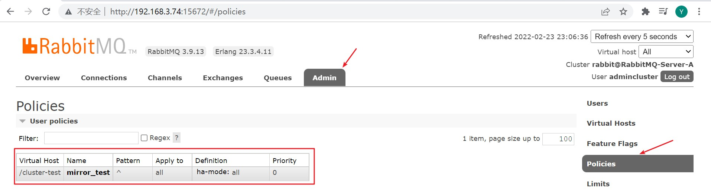
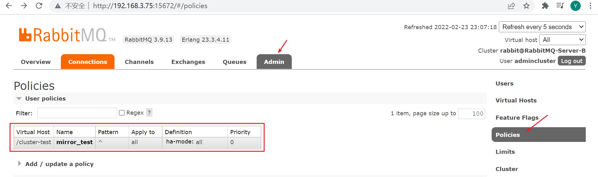
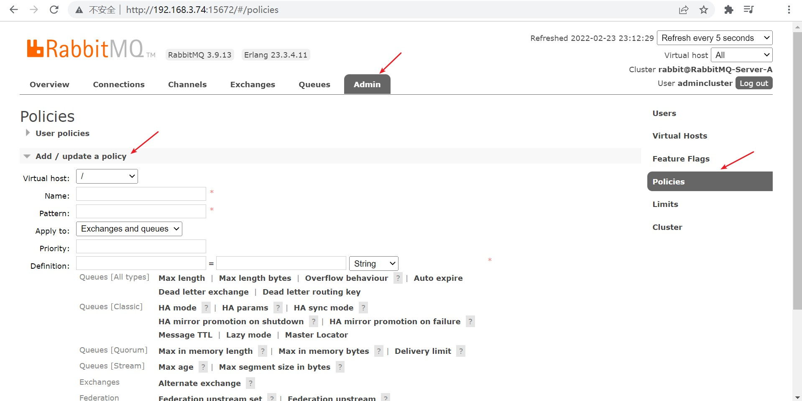
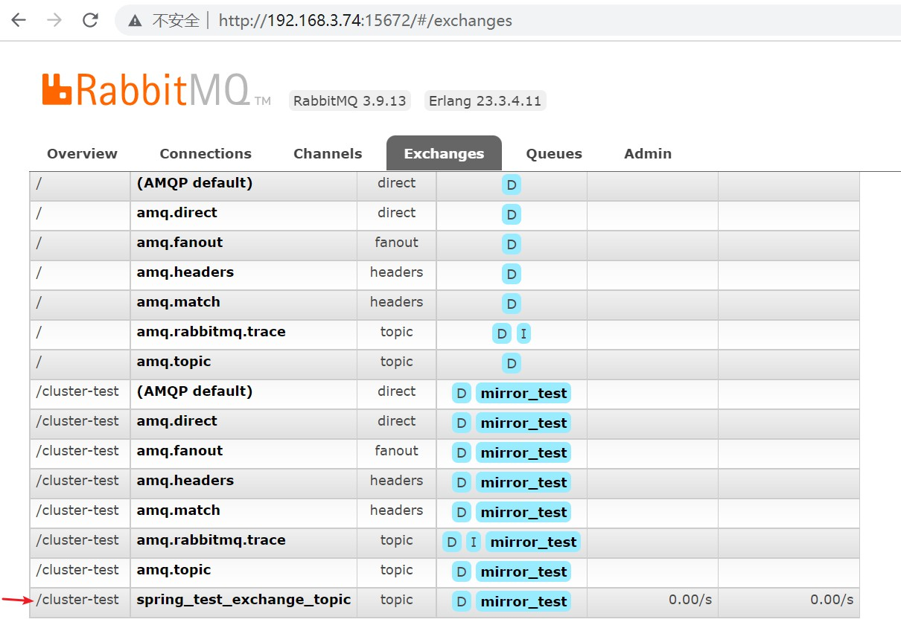
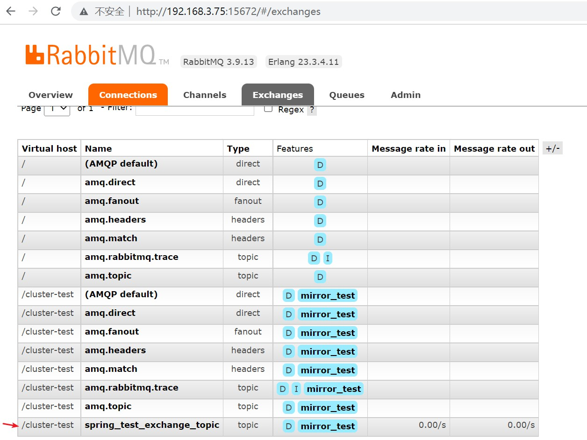
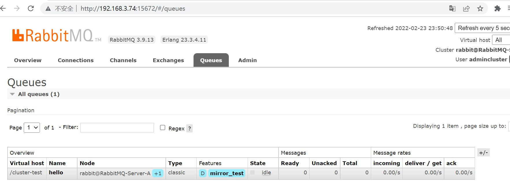
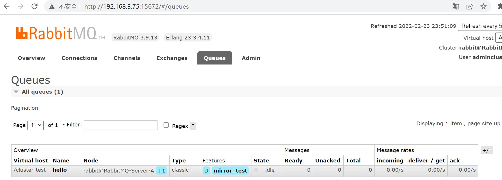
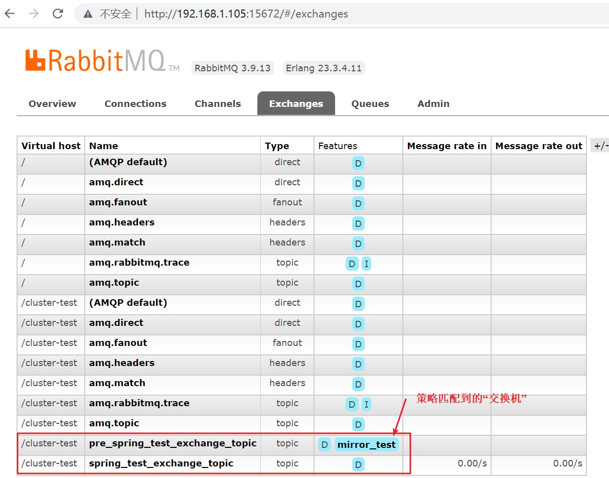
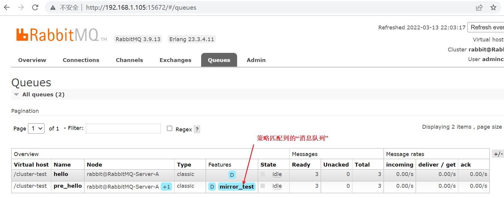

# 集群 — 镜像模式集群

<br/>

## 1、概述

<br/>

- 镜像模式集群，RabbitMQ 集群中最常见的。
- 所谓“镜像”，就是集群中的任何一个 RabbitMQ 服务中的数据发生变化（交换机、消息队列、消息等），集群中的其他 RabbitMQ 服务会基于设置的策略，对数据进行同步。换种说法，将集群中的某一个节点的数据在集群中的其他节点设置镜像。
- 镜像模式的核心是设置“策略”，所谓策略就是指如何进行数据同步。
- 镜像模式的前提是，已经完成了普通模式的集群。[集群 — 普通模式集群](https://yyscyber.github.io/java/lagou/basic/c2eef2b6-8b4c-4e96-9812-b92ec6994b71)
- 镜像模式实质和普通模式不同之处在于，消息实体会主动在镜像节点间同步，而不是在 consumer 取数据时临时拉取。

---

## 2、示例

<br/>

- 在 [集群 — 普通模式集群](https://yyscyber.github.io/java/lagou/basic/c2eef2b6-8b4c-4e96-9812-b92ec6994b71) 中的 [2、示例](javascript:void(0);) 的基础上进行。


### 2.1、命令方式设置策略

- 官方命令文档：[https://www.rabbitmq.com/rabbitmqctl.8.html](https://www.rabbitmq.com/rabbitmqctl.8.html)
- [https://blog.csdn.net/mingongge/article/details/99512557](https://blog.csdn.net/mingongge/article/details/99512557)
- 在集群中的任意一个主机上执行设置策略、删除策略等命令均可。


```shell
# [] 可选项
# <> 变量

# -p <vhost> 当前策略针对的虚拟主机
# --priority <priority> 优先级
# --apply-to <apply-to> 策略适用的对象，对哪些类型的数据进行镜像
# <name> 策略名称
# <pattern> 匹配模式，正则表达式，具体对名称为什么的数据进行镜像
# <definition> 策略的具体定义。语法是 JSON 格式，'{"":"", "":""}'

rabbitmqctl set_policy [-p <vhost>] [--priority <priority>] [--apply-to <apply-to>] <name> <pattern>  <definition>
```


> `priority`
>
> The priority of the policy as an integer. Higher numbers indicate greater precedence. The default is 0.


> `apply-to`
>
> Which types of object this policy should apply to. 
>
> 当前策略适用于哪些类型的对象。该策略下对什么进行镜像。
>
> 取值有三种，`queues`、`exchanges`、`all`，含义分别是“该策略下仅对消息队列进行镜像”、“该策略下仅对交换机进行镜像”、“该策略下对交换机、消息队列均进行镜像”。默认值为`all`。


> `pattern`
>
> The regular expression, which when matches on a given resources causes the policy to apply.
>
> 正则表达式，该策略下对名称匹配该正则表达式的消息队列、交换机等进行镜像。
>
> 语法上可以使用`""`或`''`对正则表达式进行包裹，也可以不使用。
>
> 
>
> 例如：`^queue_`：表示对消息队列等名称以“queue_”开头的所有消息队列等进行镜像。
>
> `^`：对任意名称的消息队列等进行镜像。


> `definition`
>
> The definition of the policy, as a JSON term. In most shells you are very likely to need to quote this.
>
> 镜像策略的定义。JSON 格式数据。
>
> JSON 中的键有：`ha-mode`、`ha-params`、`ha-sync-mode`。
>
> - `ha-mode`的取值有：`all`（镜像设置在集群中的所有节点）、`exactly`（镜像设置在集群中指定数目的节点，数目由`ha-params`指定）、`nodes`（镜像在集群中指定名称的节点，名称由`ha-params`指定）。
> - `ha-params`：见上。
> - `ha-sync-mode`的取值有：`manual`（默认值。手动，新建立的消息队列镜像将不会同步原消息队列中已有的消息，只会接收新的消息）、`automatic`（自动。新建立的消息队列镜像将会同步原消息队列中已有的消息，并且队列同步是一个阻塞操作）。


- 综上，可以写出的示例命令是。


```shell
# 创建针对虚拟主机 /cluster-test 的名为 mirror_test 的策略
# 该策略下，将在所有节点中对所有的交换机、消息队列等设置镜像

rabbitmqctl set_policy -p /cluster-test mirror_test "^" '{"ha-mode":"all"}'
```


可以在 Web 管理平台上查看已创建的策略








- 其他命令。


```shell
# 删除策略

rabbitmqctl clear_policy [-p <vhost>] <name>

# 显示所有策略

rabbitmqctl list_policies [-p <vhost>]
```


---

### 2.2、Web 管理平台设置策略

- 可以通过 RabbitMQ 服务的 Web 管理平台，以图形化的方式进行设置策略、删除策略等操作。





---

### 2.3、验证镜像模式

- 消息生产者将消息发送至一个主机中的 RabbitMQ 中，消息消费者从另一个主机中的 RabbitMQ  中获取消息。
- 在策略`rabbitmqctl set_policy -p /cluster-test mirror_test "^" '{"ha-mode":"all"}'`下进行。


- 消息生产者。

```xml
<?xml version="1.0" encoding="UTF-8"?>
<beans xmlns:xsi="http://www.w3.org/2001/XMLSchema-instance"
       xmlns="http://www.springframework.org/schema/beans"
       xmlns:rabbit="http://www.springframework.org/schema/rabbit"
       xsi:schemaLocation="http://www.springframework.org/schema/rabbit https://www.springframework.org/schema/rabbit/spring-rabbit.xsd
       http://www.springframework.org/schema/beans https://www.springframework.org/schema/beans/spring-beans.xsd">

    <!-- 连接配置 -->
    <rabbit:connection-factory id="connectionFactory" host="192.168.3.74" port="5672" username="admincluster" password="yyss" virtual-host="/cluster-test" />
    
    <rabbit:admin connection-factory="connectionFactory" />

    <!-- 队列配置：创建或获取队列 -->
    <rabbit:queue name="hello"/>

    <!-- 交换机配置：创建交换机 -->
    <!-- topic-exchange：topic 类型的交换机 -->
    <rabbit:topic-exchange name="spring_test_exchange_topic">
        <!-- 交换机绑定消息队列配置 -->
        <rabbit:bindings>
            <rabbit:binding pattern="com.yscyber.#" queue="hello" />
        </rabbit:bindings>
    </rabbit:topic-exchange>

    <!-- 配置 JSON 数据转换器 -->
    <bean id="jsonMessageConverter" class="org.springframework.amqp.support.converter.Jackson2JsonMessageConverter" />

    <rabbit:template id="rabbitTemplate" connection-factory="connectionFactory" exchange="spring_test_exchange_topic" message-converter="jsonMessageConverter" />

</beans>
```


```java
import org.junit.Test;
import org.junit.runner.RunWith;

import org.springframework.amqp.core.Message;
import org.springframework.amqp.rabbit.core.RabbitTemplate;

import org.springframework.beans.factory.annotation.Autowired;

import org.springframework.test.context.ContextConfiguration;
import org.springframework.test.context.junit4.SpringJUnit4ClassRunner;

import java.nio.charset.StandardCharsets;

@RunWith(SpringJUnit4ClassRunner.class)
@ContextConfiguration(locations = "classpath:rabbitmq-sender-application-context.xml")
public class SpringRabbitMQTest {

    @Autowired
    private RabbitTemplate rabbitTemplate;

    @Test
    public void senderTest() {
        rabbitTemplate.convertAndSend("com.yscyber.api", new Message("我和你，心连心".getBytes(StandardCharsets.UTF_8)));
    }

}
```


- 消息消费者。

```xml
<?xml version="1.0" encoding="UTF-8"?>
<beans xmlns:xsi="http://www.w3.org/2001/XMLSchema-instance"
       xmlns="http://www.springframework.org/schema/beans"
       xmlns:rabbit="http://www.springframework.org/schema/rabbit"
       xmlns:context="http://www.springframework.org/schema/context"
       xsi:schemaLocation="http://www.springframework.org/schema/rabbit https://www.springframework.org/schema/rabbit/spring-rabbit.xsd
       http://www.springframework.org/schema/beans https://www.springframework.org/schema/beans/spring-beans.xsd
       http://www.springframework.org/schema/context https://www.springframework.org/schema/context/spring-context.xsd">

    <!-- 注解 包扫描 -->
    <context:component-scan base-package="com.yscyber.mq.receiver" />
    
    <!-- 连接配置 -->
    <rabbit:connection-factory id="connectionFactory" host="192.168.3.75" port="5672" username="admincluster" password="yyss" virtual-host="/cluster-test" />
    
    <rabbit:admin connection-factory="connectionFactory" />

    <bean id="jsonMessageConverter" class="org.springframework.amqp.support.converter.Jackson2JsonMessageConverter" />

    <!-- 消息消费者监听的队列 -->
    <rabbit:listener-container connection-factory="connectionFactory" message-converter="jsonMessageConverter">
        <!-- ref：消息处理类 MyConsumerListener -->
        <!-- queue-names：消息消费者监听的消息队列，多个消息队列之间使用逗号分隔 -->
        <rabbit:listener ref="myConsumerListener" queue-names="hello" />
    </rabbit:listener-container>

</beans>
```


```java
import org.springframework.amqp.core.Message;
import org.springframework.amqp.core.MessageListener;

import org.springframework.stereotype.Component;

import java.nio.charset.StandardCharsets;

/**
 * 消息处理类
 * 消息消费者从消息队列中获取消息后如何处理
 */
@Component
public class MyConsumerListener implements MessageListener {

    @Override
    public void onMessage(Message message) {
        System.out.println(new String(message.getBody(), StandardCharsets.UTF_8));
    }

}
```


```java
import org.junit.Test;
import org.junit.runner.RunWith;

import org.springframework.test.context.ContextConfiguration;
import org.springframework.test.context.junit4.SpringJUnit4ClassRunner;

import java.io.IOException;

@RunWith(SpringJUnit4ClassRunner.class)
@ContextConfiguration(locations = "classpath:rabbitmq-receiver-application-context.xml")
public class SpringRabbitMQTest {

    @Test
    public void receiverTest() {
        // 测试时，需要让消息消费者一直运行，便于接收消息，所以使用 System.in.read()
        try {
            System.in.read();
        } catch (IOException e) {
            e.printStackTrace();
        }
    }

}
```


- 从两个 RabbitMQ 服务的 Web 管理平台可以看到已经实现同步的交换机、消息队列。毫无疑问，上面的代码执行后，消息消费者是能够成功获取到消息的。














---

### 2.4、验证镜像模式中的模式匹配


```shell
# 策略
# 对以 pre 开头的队列进行镜像

rabbitmqctl set_policy -p /cluster-test mirror_test "^pre" '{"ha-mode":"all"}'
```


```xml
<?xml version="1.0" encoding="UTF-8"?>
<beans xmlns:xsi="http://www.w3.org/2001/XMLSchema-instance"
       xmlns="http://www.springframework.org/schema/beans"
       xmlns:rabbit="http://www.springframework.org/schema/rabbit"
       xsi:schemaLocation="http://www.springframework.org/schema/rabbit https://www.springframework.org/schema/rabbit/spring-rabbit.xsd
       http://www.springframework.org/schema/beans https://www.springframework.org/schema/beans/spring-beans.xsd">

    <!-- 连接配置 -->
    <rabbit:connection-factory id="connectionFactory" host="192.168.1.105" port="5672" username="admincluster" password="yyss" virtual-host="/cluster-test" />
    
    <rabbit:admin connection-factory="connectionFactory" />

    <!-- 队列配置：创建或获取队列 -->
    <rabbit:queue name="hello"/>
    <rabbit:queue name="pre_hello"/>

    <!-- 交换机配置：创建交换机 -->
    <!-- topic-exchange：topic 类型的交换机 -->
    <rabbit:topic-exchange name="spring_test_exchange_topic">
        <!-- 交换机绑定消息队列配置 -->
        <rabbit:bindings>
            <rabbit:binding pattern="com.khai.#" queue="hello" />
            <rabbit:binding pattern="com.nchu.#" queue="pre_hello" />
        </rabbit:bindings>
    </rabbit:topic-exchange>

    <rabbit:topic-exchange name="pre_spring_test_exchange_topic"/>

    <!-- 配置 JSON 数据转换器 -->
    <bean id="jsonMessageConverter" class="org.springframework.amqp.support.converter.Jackson2JsonMessageConverter" />

    <rabbit:template id="rabbitTemplate" connection-factory="connectionFactory" exchange="spring_test_exchange_topic" message-converter="jsonMessageConverter" />

</beans>
```





