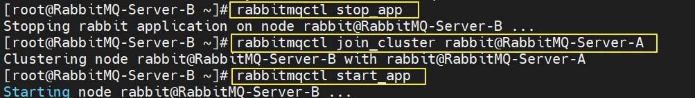

# 集群 — 普通模式集群

<br/>

## 1、概述

<br/>

- 普通模式是 RabbitMQ 搭建集群后的默认模式。实际应用中不常用。
- 后续的镜像模式，需要建立在搭建普通模式集群的操作基础上。

---

## 2、示例

<br/>

- 本示例中将使用两台主机，建立 RabbitMQ 集群即在两台主机中分别安装 RabbitMQ 服务，两个 RabbitMQ 服务建立普通模式集群。


### 2.1、准备

- 两台 CentOS 7 主机。IP 地址分别为`192.168.3.74`、`192.168.3.75`。
- 参考 [CentOS 7 RabbitMQ 安装](https://yyscyber.github.io/development-environment-and-tools/5a35ac4e-343d-491f-b9de-819ec8fc0d5f)，在两台主机上分别安装 RabbitMQ 服务。

---

### 2.2、修改 `/etc/hosts` 文件

- `/etc/hosts`，类似于 Windows 系统中的`C:\Windows\System32\drivers\etc\hosts`文件，一个本地的 DNS 解析。
- 在两台主机的`/etc/hosts`文件中**均**追加以下内容。


```json
// 相当于给主机起了一个名字，供外界使用

192.168.3.74 RabbitMQ-Server-A
192.168.3.75 RabbitMQ-Server-B
```


- 重新启动主机，使用`reboot`命令，生效。

---

### 2.3、修改 Cookie

- 如果希望安装在两个不同的主机上的 RabbitMQ 服务之间实现最基本的通信，需要让两个的 Cookie 保持一致。
- 这个 Cookie 是一个字符串，使用`rpm`命令安装 RabbitMQ 的情况下，这个 Cookie 默认被存储在`/var/lib/rabbitmq/.erlang.cookie`文件中，`.erlang.cookie`是一个隐藏文件，需要使用`ls -all`命令才能看到。


- 为了实现最基本的通信，将 Cookie 设置一致。使用拷贝`.erlang.cookie`文件的方式，将其中一个主机中的`.erlang.cookie`文件拷贝覆盖另一个主机中的`.erlang.cookie`。
- 修改 Cookie 后，需要重新启动主机，使用`reboot`命令，才生效。


- 注意：`.erlang.cookie`这一文件的默认的权限是**`r-- --- ---`**，默认的所有者是**`rabbitmq`**，默认的所有组是**`rabbitmq`**。一旦与默认的不同，会导致 RabbitMQ 服务无法启动。所以，在拷贝覆盖`.erlang.cookie`后，需要关注其权限、所有者、所有组是否发生，一旦发生变化，使用`chmod`、`chown`、`chgrp`命令予以修正。


---

### 2.4、集群

- 为方便操作，关闭两台主机的防火墙。


```shell
systemctl stop firewalld
```


- 启动两台主机上的 RabbitMQ 服务。


```shell
systemctl start rabbitmq-server
```


- 考虑哪个节点作为主节点。这里，将`192.168.3.74`（RabbitMQ-Server-A）作为主节点，`192.168.3.75`（RabbitMQ-Server-B）作为次节点。在`192.168.3.75`上执行以下命令。


```shell
[root@RabbitMQ-Server-B ~]# rabbitmqctl stop_app

# join_cluster：该 RabbitMQ 加入集群
[root@RabbitMQ-Server-B ~]# rabbitmqctl join_cluster rabbit@RabbitMQ-Server-A

[root@RabbitMQ-Server-B ~]# rabbitmqctl start_app
```





- 在`192.168.3.74`和`192.168.3.75`这两台主机中的任意一台，使用`rabbitmqctl cluster_status`命令，可以查看当前集群情况。


---

### 2.5、添加新用户

- 一旦形成集群，之前节点单独（单机 RabbitMQ 服务）创建的用户、交换机、消息队列等，在集群情况下是**不能使用**的。除非当节点脱离集群后，之前节点单独创建的用户、交换机、消息队列等才能继续使用。
- 所以，为了方便操作，需要在集群情况下创建一个新用户，创建新用户的命令与之前一样。另外，因为已经形成了集群，所以创建新用户的命令，可以在集群中的任意一台主机上执行。


```shell
[root@RabbitMQ-Server-A ~]# rabbitmqctl add_user admincluster yyss

[root@RabbitMQ-Server-A ~]# rabbitmqctl set_user_tags admincluster administrator

[root@RabbitMQ-Server-A ~]# rabbitmqctl set_permissions -p "/" admincluster  ".*" ".*" ".*"
```


- 使用新创建的用户登录两个 RabbitMQ 服务的 Web 管理平台。在管理平台上，可以看到集群中节点的情况。


