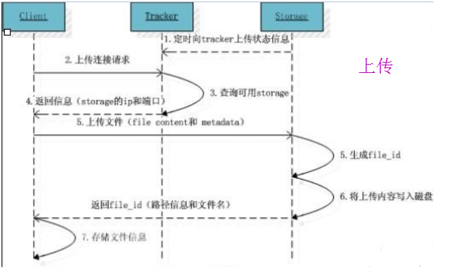
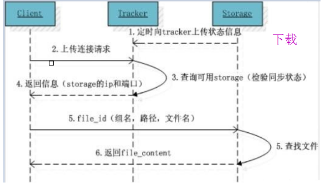

# 机制（原理）

 

## 1、概述

 

- FastDFS 开源：[https://github.com/happyfish100/fastdfs](https://github.com/happyfish100/fastdfs)，[https://gitee.com/fastdfs100/fastdfs](https://gitee.com/fastdfs100/fastdfs)
- FastDFS 是一款开源的分布式文件系统，功能主要包括：文件存储、文件同步、文件访问（文件上传、文件下载）等，解决了文件大容量存储和高性能访问的问题。FastDFS 特别适合以文件为载体的在线服务，如图片、视频、文档等等。
- FastDFS 作为一款轻量级分布式文件系统，版本 V6.01 代码量6.3万行。FastDFS 用 C 语言实现，支持 Linux、FreeBSD、MacOS 等类 UNIX 系统。
- FastDFS 为互联网应用量身定做，解决大容量文件存储问题，追求高性能和高扩展性。FastDFS 可以看做是基于文件的key value存储系统，key 为文件 ID，value 为文件内容，因此称作分布式文件存储服务更为合适。

---

## 2、机制

 

- FastDFS 的架构图：

- FastDFS 大致上分为 Tracker Server 和 Storage Server。客户端请求 Tracker Server 进行文件的上传与下载；Tracker Server 调度 Storage Server 最终完成上传与下载。
- Storage Server（存储服务器）：
  - 作用是文件存储，客户端上传的文件最终存储到 Storage Server 上；
  - Storage Server 可以形成集群；
  - Storage Server 集群的时候采用分组的方式。同组内的每台服务器是平等关系，能够进行数据同步，目的是实现数据备份，从而高可用；不同组的服务器之间是不通信的；
  - 同组内的每台服务器的存储容量不一致的情况下，会选取容量较小的那个，所以同组内的服务器之间的性能、参数最好相近；
  - Storage Server 会与集群中的所有 Tracker Server 建立连接，定时向他们汇报自己的状态，例如：剩余空间，文件同步情况，文件上传下载次数等信息；
  - Storage Server 可以结合 Nginx。
- Tracker Server（追踪服务器）：
  - 作用是调度，客户端需要通过 Tracker Server 来确定最终使用集群中哪组 Storage Server；
  - Tracker Server 不会保存文件；
  - Tracker Server 可以形成集群，策略可以使用像轮询；
  - Storage Server 可以结合 Nginx。
- FastDFS特点（[https://gitee.com/fastdfs100/fastdfs/blob/master/README_zh.md](https://gitee.com/fastdfs100/fastdfs/blob/master/README_zh.md) [https://github.com/happyfish100/fastdfs/blob/master/README_zh.md](https://github.com/happyfish100/fastdfs/blob/master/README_zh.md)）：
  - 1）分组存储，简单灵活；
  - 2）对等结构，不存在单点；
  - 3）文件 ID 由 FastDFS 生成，作为文件访问凭证。FastDFS 不需要传统的 name server 或 meta server；
  - 4）大、中、小文件均可以很好支持，可以存储海量小文件；
  - 5）一台 storage 支持多块磁盘，支持单盘数据恢复；
  - 6）提供了 Nginx 扩展模块，可以和 Nginx 无缝衔接；
  - 7）支持多线程方式上传和下载文件，支持断点续传；
  - 8）存储服务器上可以保存文件附加属性。

---

## 3、上传与下载

 

### 3.1、上传

- 文件上传后，FastFDS 会返回文件访问凭证即文件 id。
- 文件 id 举例：`group1/M00/02/11/aJxAeF21O5wAAAAAAAAGaEIOA12345.pdf`
  - `/group1`：组名。文件上传后，文件所在 Storage Server 组的名称。
  - `/M00`：表示虚拟磁盘。一个 Storage Server 中可以划分出多个磁盘（M00 ~ Mxx）。虚拟磁盘的具体路径可以进行配置。
  - `/02/11`：数据目录。在虚拟磁盘下可以自行创建目录。
  - `/aJxAeF21O5wAAAAAAAAGaEIOA12345.pdf`：文件名。根据特定信息自动生成。

---

### 3.2、下载

