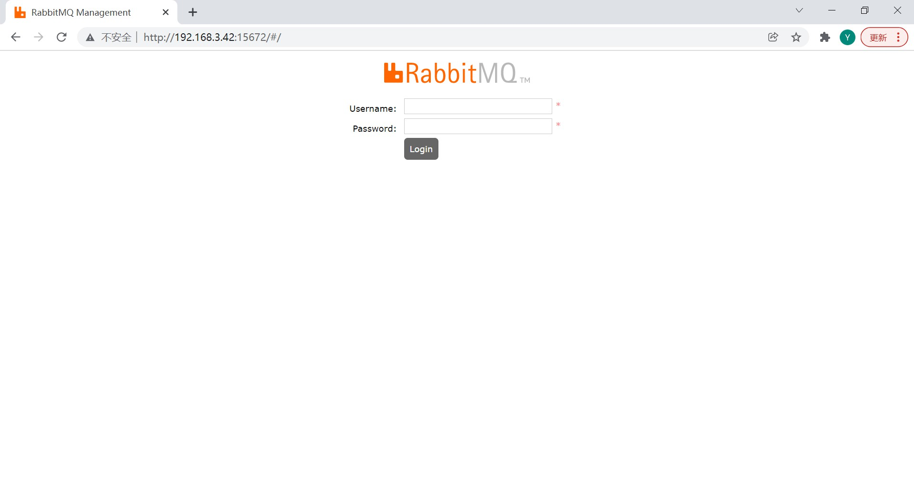
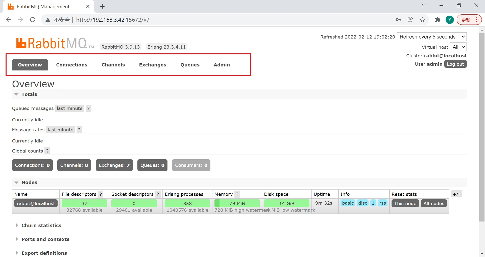

# Web 管理平台

 

## 1、概述

 

- 管理 RabbitMQ 的方式大致上分为两种。一种是通过命令的方式，另一种是通过 Web 管理平台的方式。
- 进入 RabbitMQ 服务的 Web 管理平台的默认方式是：启动 RabbitMQ 服务后，浏览器访问`http://${ip}:15672`。
- RabbitMQ 默认提供的登录 Web 管理平台的用户名是`guest`，对应的密码也是`guest`。但是只允许**本地**通过这个账户去登录这个管理平台。

---

## 2、大致介绍

 

- 登录页面：

- 主页：

标签的含义：

Overview：概览、主页；

Connections：当前与 RabbitMQ 服务连接的情况；

Channels：信道的情况；

Exchanges：交换机（路由）的情况；

Queues：消息队列的情况；

Admin：用户的情况。

---

## 3、端口

- RabbitMQ 服务**默认**使用的端口情况：
  - `5672`：RabbitMQ 服务的端口，供给客户端连接的端口。
  - `15672`：RabbitMQ 服务的 Web 管理平台。
  - `25672`：RabbitMQ 服务用于集群的端口。

