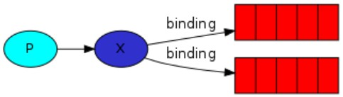
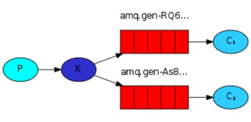
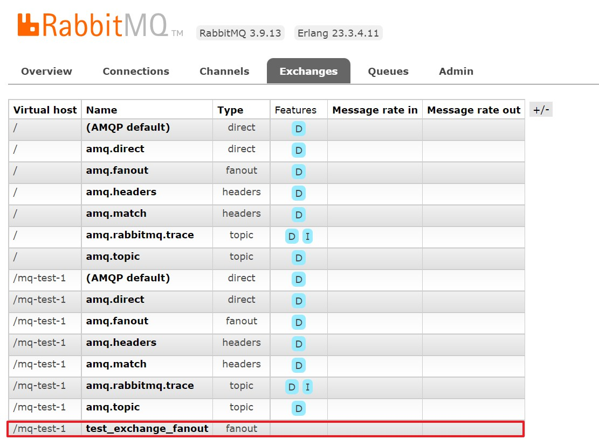
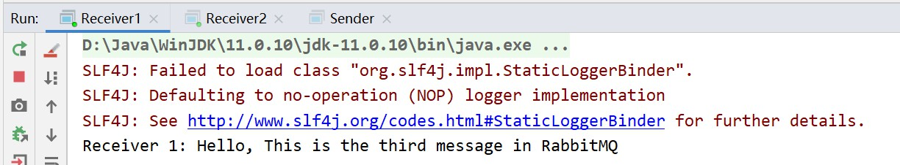
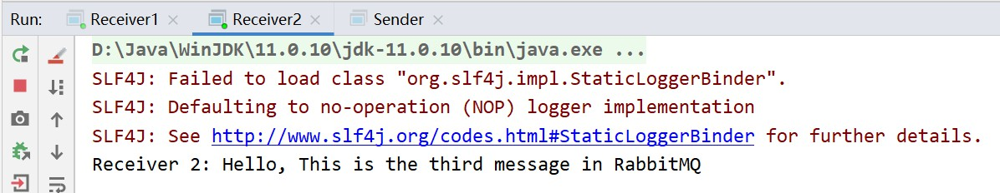

# 消息模型 — Publish / Subscribe

<br/>

## 1、概述

<br/>

- [https://www.rabbitmq.com/tutorials/tutorial-three-java.html](https://www.rabbitmq.com/tutorials/tutorial-three-java.html)
- 发布与订阅。类似于在视频平台，普通用户关注一些博主（订阅），当这些博主一旦发布新的内容，关注他的用户就能够看到他发布的内容。

---

## 2、详情

<br/>

- 发布与订阅。消息生产者将产生的消息先发送至“交换机（路由）”（Exchange）；再由交换机将消息转发至与其绑定的消息队列中，“绑定”就是“订阅”；最终消息消费者再从消息队列中获取消息。








- 上图中深蓝色的`X`表示“交换机（路由）”。
- 交换机（路由）是这一发布与订阅模型中的核心组件，所以需要先**创建交换机**。
- 交换机没有存储消息的能力，只是转发的功能，消息队列才是真正存储消息的。另外，交换机只有在确认了哪些消息队列绑定到该交换机后，消息才能被转发。

---

## 3、Java 代码实现

<br/>

```java
import com.rabbitmq.client.Channel;
import com.rabbitmq.client.Connection;
import com.rabbitmq.client.ConnectionFactory;

import java.io.IOException;
import java.util.concurrent.TimeoutException;

public class ExchangeCreator {

    private static final String MQ_HOST = "192.168.3.42";

    private static final int MQ_PORT = 5672;

    private static final String MQ_USERNAME = "admin";

    private static final String MQ_PASSWORD = "yyss";

    private static final String MQ_VIRTUAL_HOST = "/mq-test-1";

    private static final String MQ_EXCHANGE_NAME = "test_exchange_fanout";

    // fanout 类型交换机
    // 只需要将消息队列绑定到交换机上，发送到交换机的消息都会被转发到与该交换机绑定的所有消息队列上
    private static final String MQ_EXCHANGE_TYPE = "fanout";

    public static void main(String[] args) {
        try {
            // 1、与 MQ 服务建立连接
            Connection connection = connection();

            // 2、在连接中创建信道
            Channel channel = connection.createChannel();

            // 3、创建或获取交换机
            // exchangeDeclare 的参数 1：交换机的名称
            // exchangeDeclare 的参数 2：交换机的类型
            channel.exchangeDeclare(MQ_EXCHANGE_NAME, MQ_EXCHANGE_TYPE);

            System.out.println("Finish creating!");

            // 4、关闭信道
            channel.close();

            // 5、关闭连接
            connectionClose(connection);
        } catch (IOException | TimeoutException e) {
            e.printStackTrace();
        }
    }

    /**
     * 简易与 MQ 服务建立连接
     */
    private static Connection connection() {
        ConnectionFactory connectionFactory = new ConnectionFactory();

        connectionFactory.setHost(MQ_HOST);
        connectionFactory.setPort(MQ_PORT);
        connectionFactory.setVirtualHost(MQ_VIRTUAL_HOST);
        connectionFactory.setUsername(MQ_USERNAME);
        connectionFactory.setPassword(MQ_PASSWORD);

        Connection connection = null;

        try {
            connection = connectionFactory.newConnection();
        } catch (IOException | TimeoutException e) {
            e.printStackTrace();
        }

        return connection;
    }

    private static void connectionClose(Connection connection) {
        if (connection != null) {
            try {
                connection.close();
            } catch (IOException e) {
                e.printStackTrace();
            }
        }
    }

}
```


```java
import com.rabbitmq.client.Channel;
import com.rabbitmq.client.Connection;
import com.rabbitmq.client.ConnectionFactory;

import java.io.IOException;
import java.nio.charset.StandardCharsets;
import java.util.concurrent.TimeoutException;

public class Sender {

    private static final String MQ_HOST = "192.168.3.42";

    private static final int MQ_PORT = 5672;

    private static final String MQ_USERNAME = "admin";

    private static final String MQ_PASSWORD = "yyss";

    private static final String MQ_VIRTUAL_HOST = "/mq-test-1";

    private static final String MQ_EXCHANGE_NAME = "test_exchange_fanout";

    public static void main(String[] args) {
        String msg = "Hello, This is the third message in RabbitMQ";

        try {
            // 1、与 MQ 服务建立连接
            Connection connection = connection();

            // 2、在连接中创建信道
            Channel channel = connection.createChannel();

            // 3、将消息发送至交换机
            channel.basicPublish(MQ_EXCHANGE_NAME, "", null, msg.getBytes(StandardCharsets.UTF_8));

            System.out.println("Finish sending!");

            // 4、关闭信道
            channel.close();

            // 5、关闭连接
            connectionClose(connection);
        } catch (IOException | TimeoutException e) {
            e.printStackTrace();
        }
    }

    /**
     * 简易与 MQ 服务建立连接
     */
    private static Connection connection() {
        ConnectionFactory connectionFactory = new ConnectionFactory();

        connectionFactory.setHost(MQ_HOST);
        connectionFactory.setPort(MQ_PORT);
        connectionFactory.setVirtualHost(MQ_VIRTUAL_HOST);
        connectionFactory.setUsername(MQ_USERNAME);
        connectionFactory.setPassword(MQ_PASSWORD);

        Connection connection = null;

        try {
            connection = connectionFactory.newConnection();
        } catch (IOException | TimeoutException e) {
            e.printStackTrace();
        }

        return connection;
    }

    private static void connectionClose(Connection connection) {
        if (connection != null) {
            try {
                connection.close();
            } catch (IOException e) {
                e.printStackTrace();
            }
        }
    }

}
```


```java
import com.rabbitmq.client.*;

import java.io.IOException;
import java.nio.charset.StandardCharsets;
import java.util.concurrent.TimeoutException;

public class Receiver1 {

    private static final String MQ_HOST = "192.168.3.42";

    private static final int MQ_PORT = 5672;

    private static final String MQ_USERNAME = "admin";

    private static final String MQ_PASSWORD = "yyss";

    private static final String MQ_VIRTUAL_HOST = "/mq-test-1";

    private static final String MQ_QUEUE_NAME = "hello_1";

    private static final String MQ_EXCHANGE_NAME = "test_exchange_fanout";

    private static int finishedCount = 0;

    public static void main(String[] args) {
        try {
            // 1、与 MQ 服务建立连接
            Connection connection = connection();

            // 2、在连接中创建信道
            Channel channel = connection.createChannel();

            // 3、创建或获取队列
            channel.queueDeclare(MQ_QUEUE_NAME, false, false, false, null);

            // 4、队列绑定至交换机
            // queueBind 方法的参数 1：队列名称
            // queueBind 方法的参数 2：交换机名称
            // queueBind 方法的参数 3：路由键，“没有”提供空串即可
            channel.queueBind(MQ_QUEUE_NAME, MQ_EXCHANGE_NAME, "");

            // 5、获取消息后如何处理、回调
            Consumer consumer = new DefaultConsumer(channel) {
                @Override
                public void handleDelivery(String consumerTag, Envelope envelope, AMQP.BasicProperties properties, byte[] body) throws IOException {
                    String msg = new String(body, StandardCharsets.UTF_8);
                    System.out.println("Receiver 1: " + msg);
                }
            };

            // 6、从消息队列中获取消息
            channel.basicConsume(MQ_QUEUE_NAME, true, consumer);
        } catch (IOException e) {
            e.printStackTrace();
        }
    }

    /**
     * 简易与 MQ 服务建立连接
     */
    private static Connection connection() {
        ConnectionFactory connectionFactory = new ConnectionFactory();

        connectionFactory.setHost(MQ_HOST);
        connectionFactory.setPort(MQ_PORT);
        connectionFactory.setVirtualHost(MQ_VIRTUAL_HOST);
        connectionFactory.setUsername(MQ_USERNAME);
        connectionFactory.setPassword(MQ_PASSWORD);

        Connection connection = null;

        try {
            connection = connectionFactory.newConnection();
        } catch (IOException | TimeoutException e) {
            e.printStackTrace();
        }

        return connection;
    }
    
}
```


```java
import com.rabbitmq.client.*;

import java.io.IOException;
import java.nio.charset.StandardCharsets;
import java.util.concurrent.TimeoutException;

public class Receiver2 {

    private static final String MQ_HOST = "192.168.3.42";

    private static final int MQ_PORT = 5672;

    private static final String MQ_USERNAME = "admin";

    private static final String MQ_PASSWORD = "yyss";

    private static final String MQ_VIRTUAL_HOST = "/mq-test-1";

    private static final String MQ_QUEUE_NAME = "hello_2";

    private static final String MQ_EXCHANGE_NAME = "test_exchange_fanout";

    private static int finishedCount = 0;

    public static void main(String[] args) {
        try {
            // 1、与 MQ 服务建立连接
            Connection connection = connection();

            // 2、在连接中创建信道
            Channel channel = connection.createChannel();

            // 3、创建或获取队列
            channel.queueDeclare(MQ_QUEUE_NAME, false, false, false, null);

            // 4、队列绑定至交换机
            // queueBind 方法的参数 1：队列名称
            // queueBind 方法的参数 2：交换机名称
            // queueBind 方法的参数 3：路由键，“没有”提供空串即可
            channel.queueBind(MQ_QUEUE_NAME, MQ_EXCHANGE_NAME, "");

            // 5、获取消息后如何处理、回调
            Consumer consumer = new DefaultConsumer(channel) {
                @Override
                public void handleDelivery(String consumerTag, Envelope envelope, AMQP.BasicProperties properties, byte[] body) throws IOException {
                    String msg = new String(body, StandardCharsets.UTF_8);
                    System.out.println("Receiver 2: " + msg);
                }
            };

            // 6、从消息队列中获取消息
            channel.basicConsume(MQ_QUEUE_NAME, true, consumer);
        } catch (IOException e) {
            e.printStackTrace();
        }
    }

    /**
     * 简易与 MQ 服务建立连接
     */
    private static Connection connection() {
        ConnectionFactory connectionFactory = new ConnectionFactory();

        connectionFactory.setHost(MQ_HOST);
        connectionFactory.setPort(MQ_PORT);
        connectionFactory.setVirtualHost(MQ_VIRTUAL_HOST);
        connectionFactory.setUsername(MQ_USERNAME);
        connectionFactory.setPassword(MQ_PASSWORD);

        Connection connection = null;

        try {
            connection = connectionFactory.newConnection();
        } catch (IOException | TimeoutException e) {
            e.printStackTrace();
        }

        return connection;
    }

}
```


- 上述代码，先运行`ExchangeCreator`类，再运行`Receiver1`和`Receiver2`类，最后运行`Sender`类。首先要创建交换机；然后由于`Receiver1`和`Receiver2`类中没有关闭信道与连接，所以它们可以一直运行；运行`Sender`类后，可以看到`Receiver1`和`Receiver2`接收到消息。










