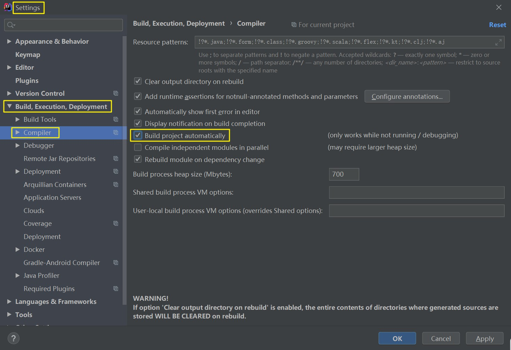

# 热部署

<br/>

## 1、概述

- 热部署：在修改完代码之后，不需要重新启动容器，就可以实现更新。

- 在开发过程中，通常会对一段业务代码不断地修改测试，在修改之后往往需要重启服务，有些服务需要加载很久才能启动成功，这种不必要的重复操作极大的降低了程序开发效率。为此，Spring Boot 框架专门提供了进行热部署的依赖启动器，用于进行项目热部署，而无需手动重启项目。

- 以 IntelliJ IDEA 为例，开启“热部署”。

---

## 2、步骤

<br/>

### 2.1、导入依赖


```xml
<?xml version="1.0" encoding="UTF-8"?>
<project xmlns="http://maven.apache.org/POM/4.0.0"
         xmlns:xsi="http://www.w3.org/2001/XMLSchema-instance"
         xsi:schemaLocation="http://maven.apache.org/POM/4.0.0 http://maven.apache.org/xsd/maven-4.0.0.xsd">

    <modelVersion>4.0.0</modelVersion>

    <groupId>com.yscyber.boot</groupId>
    <artifactId>spring-boot-1</artifactId>
    <version>1.0</version>

    <parent>
        <groupId>org.springframework.boot</groupId>
        <artifactId>spring-boot-starter-parent</artifactId>
        <version>2.3.12.RELEASE</version>
    </parent>

    <dependencies>
        <dependency>
            <groupId>org.springframework.boot</groupId>
            <artifactId>spring-boot-starter-web</artifactId>
        </dependency>

        <!-- 热部署 依赖 -->
        <dependency>
            <groupId>org.springframework.boot</groupId>
            <artifactId>spring-boot-devtools</artifactId>
        </dependency>

        <dependency>
            <groupId>org.springframework.boot</groupId>
            <artifactId>spring-boot-starter-test</artifactId>
            <scope>test</scope>
        </dependency>
    </dependencies>

    <build>
        <plugins>
            <plugin>
                <groupId>org.springframework.boot</groupId>
                <artifactId>spring-boot-maven-plugin</artifactId>
            </plugin>
        </plugins>
    </build>

</project>
```


---

### 2.2、IDEA 开启自动编译





---

### 2.3、IDEA 允许项目运行时编译

- 使用`Ctrl + Shift + A`或连续两次`Shift`，打开“搜索”界面，搜索`Registry`，打开如下界面：


---

## 3、参考

[https://stackoverflow.com/questions/23155244/spring-boot-hotswap-with-intellij-ide](https://stackoverflow.com/questions/23155244/spring-boot-hotswap-with-intellij-ide)


