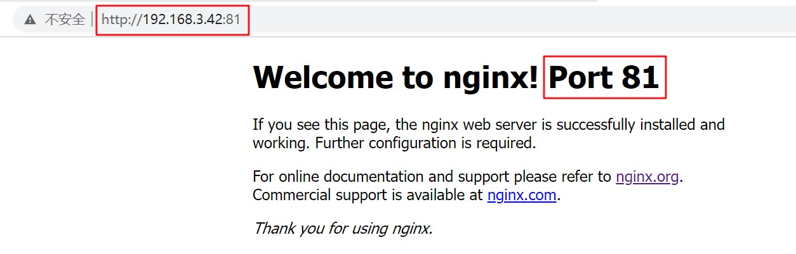

# 使用 Nginx 实现虚拟主机

<br/>

## 1、概述

- 虚拟主机，在同一台物理机器上可以同时部署多个相互独立的服务、网站等，从外部看起来这些服务、网站等是分别部署在不同的物理机器上。

  一个比较直观的例子是：两个网站，域名不同，`www.t1.com`与`www.abc.com`，这两个网站从域名上看毫无关联，但这两个网站是有可能同时部署在同一台物理机器上的。

  虚拟主机技术，能够有效降低硬件设备成本，使得资源最大程度被利用。

  


- Nginx 是一个能够实现虚拟主机技术的常用工具、手段。
- 在 Nginx 中配置虚拟主机，是一个基本操作，像使用 Nginx 实现“反向代理”等操作，需要以配置虚拟主机为基础。
- 在 Nginx 配置文件中，一个 server 块代表一个虚拟主机。
- 区分不同的虚拟主机的常见方式有：使用不同的端口号来区分、使用不同的域名来区分

---

## 2、Nginx 配置虚拟主机 — 不同的端口号区分虚拟主机

<br/>

### 2.1、含义

- Nginx 可以通过**监听不同的端口**进而实现虚拟主机。

---

### 2.2、举例


> 使用不同的端口号区分不同的虚拟主机，Nginx 需要分别监听不同的端口。
>
> Nginx 监听80端口和81端口这两个端口


- 1、在 Nginx 安装目录下，复制出两个`html`目录，分别是`html01`与`html02`，并且修改其中的默认的`index.html`内容，以区分两个虚拟主机（模拟“不同的虚拟主机部署不同的内容”）。


```html
<!-- 模拟 端口80 对应的虚拟主机 部署内容 -->

<!DOCTYPE html>
<html>
<head>
<title>Welcome to nginx!</title>
<style>
    body {
        width: 35em;
        margin: 0 auto;
        font-family: Tahoma, Verdana, Arial, sans-serif;
    }
</style>
</head>
<body>
<h1>Welcome to nginx! Port 80</h1>
<p>If you see this page, the nginx web server is successfully installed and
working. Further configuration is required.</p>

<p>For online documentation and support please refer to
<a href="http://nginx.org/">nginx.org</a>.<br/>
Commercial support is available at
<a href="http://nginx.com/">nginx.com</a>.</p>

<p><em>Thank you for using nginx.</em></p>
</body>
</html>
```

```html
<!-- 模拟 端口81 对应的虚拟主机 部署内容 -->

<!DOCTYPE html>
<html>
<head>
<title>Welcome to nginx!</title>
<style>
    body {
        width: 35em;
        margin: 0 auto;
        font-family: Tahoma, Verdana, Arial, sans-serif;
    }
</style>
</head>
<body>
<h1>Welcome to nginx! Port 81</h1>
<p>If you see this page, the nginx web server is successfully installed and
working. Further configuration is required.</p>

<p>For online documentation and support please refer to
<a href="http://nginx.org/">nginx.org</a>.<br/>
Commercial support is available at
<a href="http://nginx.com/">nginx.com</a>.</p>

<p><em>Thank you for using nginx.</em></p>
</body>
</html>
```

- 2、修改`nginx.conf`如下：

```nginx
worker_processes  1;


events {
	worker_connections  1024;
}


http {
	include       mime.types;
	default_type  application/octet-stream;
	sendfile        on;
	keepalive_timeout  65;

    # 虚拟主机 1
	server {
		listen       80; # 监听端口 80
		server_name  localhost;

		location / {
			root   html01;
			index  index.html index.htm;
		}

		error_page   500 502 503 504  /50x.html;
		location = /50x.html {
			root   html;
		}    
	}

    # 虚拟主机 2
	server {
		listen 81; # 监听端口 81
		server_name localhost;

		location / {
			root html02;
			index index.html index.htm;
		}

		error_page   500 502 503 504  /50x.html;
		location = /50x.html {
			root html;
		}  
	}
}
```

- 3、启动 Nginx 或已经启动、重新加载 Nginx 的配置文件，分别访问`http://192.168.3.42:80`、`http://192.168.3.42:81`（防火墙需开放相应端口才能看到效果）





---

## 3、Nginx 配置虚拟主机 — 不同的域名区分虚拟主机

<br/>

### 3.1、举例

#### 3.1.1、举例前置知识

- 由于域名这个东西需要申请，但为了仍体现出“域名区分”，需要借助 Windows 系统中的`hosts`文件（一般位置`C:\Windows\System32\drivers\etc\hosts`）或者使用一些工具（比如：SwitchHosts，[https://swh.app/zh](https://swh.app/zh)）能够实现对`hosts`的快速配置。

- 使用域名区分虚拟主机，首先要保证一件事，那就是**域名解析后的 IP 地址为同一个 IP 地址**，否则的话就不算严格意义的“虚拟主机”（见前图`Nginx-18`~`Nginx-20`）。

- 域名解析为 IP 地址的方式，常见的就是使用网络中的 DNS。

  但是，在 Windows 系统中提供了一个可以理解为“本地 DNS”的机制，那就是`hosts`，在`hosts`文件中可以根据需要配置指定的 IP 地址与域名的映射关系，并且这个`hosts`的优先级要高于网络中的 DNS。也就是说，如果在`hosts`文件中配置一个映射关系，`127.0.0.1 www.baidu.com`，当你在浏览器的地址栏中输入`www.baidu.com`时，就无法访问到真正的百度，转而去访问本机。

- `hosts`文件默认的权限是“只读”，所以在进行模拟之前，需要将赋予“写入”权限（即使使用像 SwitchHosts 等工具，也需要提前设置好“写入”权限）。

- `hosts`文件里边只能配置 IP 和域名的映射关系，不能配置端口号。

---

#### 3.1.2、举例

- 1、在`hosts`文件中写入两个映射关系，随便编写两个域名，但是这两个域名的 IP 地址均需要是 Nginx 所在的 IP 地址。下面是使用 SwitchHosts 工具配置`hosts`文件：


- 2、在 Nginx 安装目录下，复制出两个`html`目录，分别是`html01`与`html02`，并且修改其中的默认的`index.html`内容，以区分这两个虚拟主机（模拟“不同的虚拟主机部署不同的内容”）。


```html
<!-- 模拟 域名 www.nginxtest1.com 对应的虚拟主机 部署内容  -->

<!DOCTYPE html>
<html>
<head>
<title>Welcome to nginx!</title>
<style>
    body {
        width: 35em;
        margin: 0 auto;
        font-family: Tahoma, Verdana, Arial, sans-serif;
    }
</style>
</head>
<body>
<h1>Welcome to nginx! www.nginxtest1.com</h1>
<p>If you see this page, the nginx web server is successfully installed and
working. Further configuration is required.</p>

<p>For online documentation and support please refer to
<a href="http://nginx.org/">nginx.org</a>.<br/>
Commercial support is available at
<a href="http://nginx.com/">nginx.com</a>.</p>

<p><em>Thank you for using nginx.</em></p>
</body>
</html>
```

```html
<!-- 模拟 域名 www.nginxtest2.com 对应的虚拟主机 部署内容  -->

<!DOCTYPE html>
<html>
<head>
<title>Welcome to nginx!</title>
<style>
    body {
        width: 35em;
        margin: 0 auto;
        font-family: Tahoma, Verdana, Arial, sans-serif;
    }
</style>
</head>
<body>
<h1>Welcome to nginx! www.nginxtest2.com</h1>
<p>If you see this page, the nginx web server is successfully installed and
working. Further configuration is required.</p>

<p>For online documentation and support please refer to
<a href="http://nginx.org/">nginx.org</a>.<br/>
Commercial support is available at
<a href="http://nginx.com/">nginx.com</a>.</p>

<p><em>Thank you for using nginx.</em></p>
</body>
</html>
```

- 3、修改 Nginx 配置文件`nginx.conf`如下：

```nginx
worker_processes  1;


events {
	worker_connections  1024;
}


http {
	include       mime.types;
	default_type  application/octet-stream;
	sendfile        on;
	keepalive_timeout  65;

	server {
		listen       80; # 端口一致
		server_name  www.nginxtest1.com; # 注意此处

		location / {
			root   html01;
			index  index.html index.htm;
		}

		error_page   500 502 503 504  /50x.html;
		location = /50x.html {
			root   html;
		}    
	}

	server {
		listen 80; # 端口一致
		server_name www.nginxtest2.com; # 注意此处

		location / {
			root html02;
			index index.html index.htm;
		}

		error_page   500 502 503 504  /50x.html;
		location = /50x.html {
			root html;
		}  
	}
}
```

- 4、启动 SwitchHosts 中的映射配置以及启动 Nginx 或已经启动的话重新加载 Nginx 配置文件。


- 5、访问`http://www.nginxtest1.com`和`http://www.nginxtest2.com`


---

## 4、server 块

```nginx
	server {
		listen       80;
		server_name  www.nginxtest1.com;

		location / {
			root   html01;
			index  index.html index.htm;
		}

		error_page   500 502 503 504  /50x.html;
		location = /50x.html {
			root   html;
		}    
	}
```

- `listen`：Nginx 所监听的端口（一般是监听 Nginx 所在主机的端口即部署 Nginx 的主机）。

- `server_name`：**虚拟主机的名称**，常见的取值有`localhost`、域名、含通配符的域名等。

  关于`server_name`这一指令（或叫“配置项”）很**容易让人产生误解**，在后面会给出详细的解释。

- `location`：配置虚拟主机的路由，能够在其中配置所代理服务器的地址（进而重定向）等。

  默认 Nginx 配置文件中的`location`是指向 Nginx 内部的一个页面（`/usr/local/nginx/html/index.html`）。

---

## 5、Nginx 配置虚拟主机 — 总结

- 1、虚拟主机，指一台物理主机上可以部署相互独立网站、服务等。**一般情况下，一台物理主机只有一个 IP 地址**，所以部署在同一物理主机上虚拟主机的 IP 也是一致的。

- 2、区分虚拟主机的常见方法：端口号区分、域名区分（域名区分的时候端口一般都一样，比如都是80）

- 3、Nginx 是可以实现虚拟主机的一个常用工具、手段。

- 4、Nginx 通过在配置文件中配置 server 块实现虚拟主机，一个 server 块代表一个虚拟主机。

- 5、在上面“域名区分”的案例中，两个 server 块中的`server_name`配置的是不同的域名，同端口。在 Nginx 中使用域名区分虚拟主机本质上是**使用`server_name`区分虚拟主机**。

Nginx 域名区分虚拟主机流程：


- 6、上述的两个案例（端口区分、域名区分）的最终结果是映射到 Nginx 目录下的两个不同的页面以区分不同的虚拟主机。现实中，更常见的是映射到不同的网站、服务等即实现“反向代理”。
