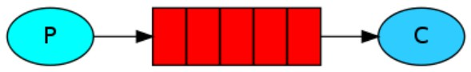
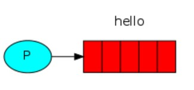
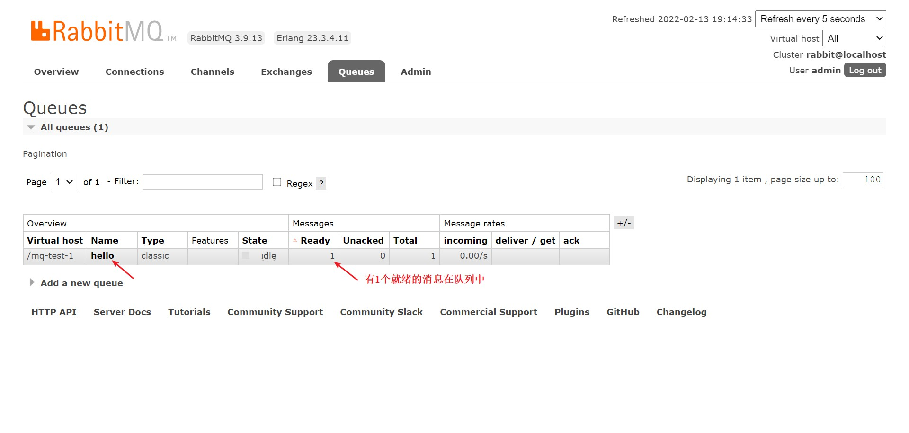
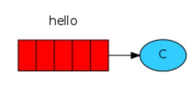
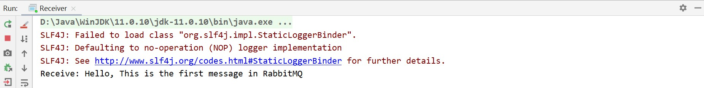
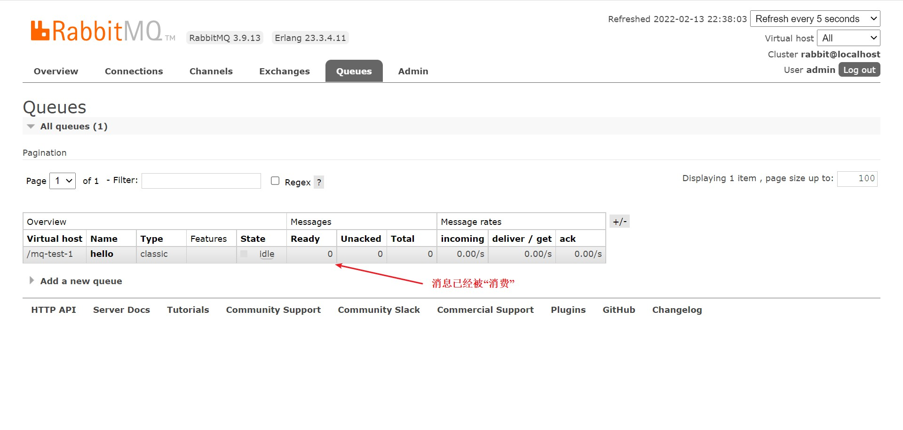
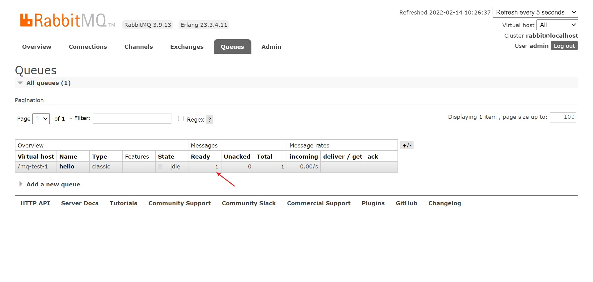

# 消息模型 — Hello World

<br/>

## 1、概述

<br/>

- [https://www.rabbitmq.com/tutorials/tutorial-one-java.html](https://www.rabbitmq.com/tutorials/tutorial-one-java.html)
- Hello World 是使用 RabbitMQ 最基础的案例。

---

## 2、详情

<br/>

- RabbitMQ is a message broker: it accepts and forwards messages. You can think about it as a post office: when you put the mail that you want posting in a post box, you can be sure that the letter carrier will eventually deliver the mail to your recipient. In this analogy, RabbitMQ is a post box, a post office, and a letter carrier.
- RabbitMQ 是一个消息代理：它接受和转发消息。您可以将其视为邮局：当您将要邮寄的邮件放入邮箱时，您可以确定邮递员最终会将邮件投递给您的收件人。在这个类比中，RabbitMQ 是一个邮箱、一个邮局和一个邮递员。
- The major difference between RabbitMQ and the post office is that it doesn't deal with paper, instead it accepts, stores, and forwards binary blobs of data ‒ messages.
- RabbitMQ 和邮局之间的主要区别在于它不处理纸张，而是接受、存储和转发二进制数据块 — 消息。


- Hello World 这一消息模型涉及到的组件有：消息生产/发送者（Producer / Sender）、消息队列（Queue）、消息消费/接收者（Consumer / Receiver）。
- 流程很简单，消息生产者将消息放入消息队列中，消息消费者从消息队列中取出消息。简单的一对一即一个消息生产者与一个消息消费者，用一个消息队列建立两者间的联系。





---

## 3、Java 代码实现

<br/>

- [https://www.rabbitmq.com/api-guide.html](https://www.rabbitmq.com/api-guide.html)


### 3.1、消息发送





```java
import com.rabbitmq.client.Channel;
import com.rabbitmq.client.Connection;
import com.rabbitmq.client.ConnectionFactory;

import java.io.IOException;
import java.nio.charset.StandardCharsets;
import java.util.concurrent.TimeoutException;

public class Sender {

    private static final String MQ_HOST = "192.168.3.42";

    private static final int MQ_PORT = 5672;

    private static final String MQ_USERNAME = "admin";

    private static final String MQ_PASSWORD = "yyss";

    private static final String MQ_VIRTUAL_HOST = "/mq-test-1";

    private static final String MQ_QUEUE_NAME = "hello";

    public static void main(String[] args) {
        String msg = "Hello, This is the first message in RabbitMQ";

        try {
            // 1、与 MQ 服务建立连接
            Connection connection = connection();

            // 2、在连接中创建信道
            Channel channel = connection.createChannel();

            // 3、创建消息队列
            // queueDeclare 方法的参数 1：消息队列的名称
            // queueDeclare 方法的参数 2：该消息队列中的数据是否进行持久化。进行持久化，MQ 服务重启后数据不会丢失
            // queueDeclare 方法的参数 3：该消息队列是否排他
            // queueDeclare 方法的参数 4：该消息队列是否自动删除
            // queueDeclare 方法的参数 5：该消息队列的其他参数。“没有”为 null
            channel.queueDeclare(MQ_QUEUE_NAME, false, false, false, null);

            // 4、将消息发送至指定的队列中
            // basicPublish 方法的参数 1：交换机名称。不使用交换机，参数为空字符串即可
            // basicPublish 方法的参数 2：消息队列名称
            // basicPublish 方法的参数 3：消息的属性。“没有”为 null
            // basicPublish 方法的参数 4：消息。必须以二进制字节的形式
            channel.basicPublish("", MQ_QUEUE_NAME, null, msg.getBytes(StandardCharsets.UTF_8));

            System.out.println("Finish sending!");

            // 5、关闭信道
            channel.close();

            // 6、关闭连接
            connectionClose(connection);
        } catch (IOException | TimeoutException e) {
            e.printStackTrace();
        }
    }


    /**
     * 简易与 MQ 服务建立连接
     */
    private static Connection connection() {
        ConnectionFactory connectionFactory = new ConnectionFactory();

        connectionFactory.setHost(MQ_HOST);
        connectionFactory.setPort(MQ_PORT);
        connectionFactory.setVirtualHost(MQ_VIRTUAL_HOST);
        connectionFactory.setUsername(MQ_USERNAME);
        connectionFactory.setPassword(MQ_PASSWORD);

        Connection connection = null;

        try {
            connection = connectionFactory.newConnection();
        } catch (IOException | TimeoutException e) {
            e.printStackTrace();
        }

        return connection;
    }

    private static void connectionClose(Connection connection) {
        if (connection != null) {
            try {
                connection.close();
            } catch (IOException e) {
                e.printStackTrace();
            }
        }
    }

}
```


- 运行上面的`main`方法后，打开 RabbitMQ 服务的 Web 管理平台，在 Queue 页面上可以看到刚才创建的消息队列的信息等。





- `queueDeclare`方法：[https://www.cnblogs.com/no-celery/p/13803419.html](https://www.cnblogs.com/no-celery/p/13803419.html)
- `basicPublish`方法：[https://www.rabbitmq.com/api-guide.html](https://www.rabbitmq.com/api-guide.html)

---

### 3.2、消息接收





```java
import com.rabbitmq.client.Channel;
import com.rabbitmq.client.Connection;
import com.rabbitmq.client.ConnectionFactory;
import com.rabbitmq.client.DeliverCallback;

import java.io.IOException;
import java.nio.charset.StandardCharsets;
import java.util.concurrent.TimeoutException;

public class Receiver {

    private static final String MQ_HOST = "192.168.3.42";

    private static final int MQ_PORT = 5672;

    private static final String MQ_USERNAME = "admin";

    private static final String MQ_PASSWORD = "yyss";

    private static final String MQ_VIRTUAL_HOST = "/mq-test-1";

    private static final String MQ_QUEUE_NAME = "hello";

    public static void main(String[] args) {
        try {
            // 1、与 MQ 服务建立连接
            Connection connection = connection();

            // 2、在连接中创建信道
            Channel channel = connection.createChannel();

            // 3、获取消息后如何处理
            // 回调
            DeliverCallback deliverCallback = (consumerTag, delivery) -> {
                String msg = new String(delivery.getBody(), StandardCharsets.UTF_8);
                System.out.println("Receive: " + msg);
            };

            // 4、从消息队列中获取消息
            // basicConsume 方法的参数 1：从哪个消息队列获取消息，监听哪个消息队列
            // basicConsume 方法的参数 2：是否自动消息确认
            // basicConsume 方法的参数 3：对消息处理的回调。如果进行消息处理
            // basicConsume 方法的参数 4：取消订阅的回调
            channel.basicConsume(MQ_QUEUE_NAME, true, deliverCallback, consumerTag -> {});

            channel.close();

            connectionClose(connection);
        } catch (IOException | TimeoutException e) {
            e.printStackTrace();
        }
    }

    /**
     * 简易与 MQ 服务建立连接
     */
    private static Connection connection() {
        ConnectionFactory connectionFactory = new ConnectionFactory();

        connectionFactory.setHost(MQ_HOST);
        connectionFactory.setPort(MQ_PORT);
        connectionFactory.setVirtualHost(MQ_VIRTUAL_HOST);
        connectionFactory.setUsername(MQ_USERNAME);
        connectionFactory.setPassword(MQ_PASSWORD);

        Connection connection = null;

        try {
            connection = connectionFactory.newConnection();
        } catch (IOException | TimeoutException e) {
            e.printStackTrace();
        }

        return connection;
    }

    private static void connectionClose(Connection connection) {
        if (connection != null) {
            try {
                connection.close();
            } catch (IOException e) {
                e.printStackTrace();
            }
        }
    }

}
```


- 运行上面的`main`方法后，看控制台输出；打开 RabbitMQ 服务的 Web 管理平台，在 Queue 页面上可以看到消息队列等。








- `basicConsume`方法：[https://blog.csdn.net/yaomingyang/article/details/102636657](https://blog.csdn.net/yaomingyang/article/details/102636657)

---

### 3.3、消息确认 ACK

- RabbitMQ 通过 ACK 得知消息被消费者接收。
- RabbitMQ 有一个 ACK 机制，当消费者获取消息后，会向 RabbitMQ 发送回执 ACK，告知消息已经被接收。
- ACK：Acknowledge character 即是确认字符，在数据通信中，接收站发给发送站的一种传输类控制字符。
- RabbitMQ 中的 ACK 分为两类，一类是自动 ACK 即消息接收后，消费者立即自动发送 ACK 给 RabbitMQ 服务；另一类是手动 ACK，需要手动调用。


```java
// basicConsume 方法的参数 2：是否自动消息确认
// true：自动确认
// false：手动确认
channel.basicConsume(MQ_QUEUE_NAME, true, deliverCallback, consumerTag -> {});
```


```java
// basicAck 手动确认
channel.basicAck(delivery.getEnvelope().getDeliveryTag(), false);
```


#### 3.3.1、未进行手动消息确认 ACK


```java
import com.rabbitmq.client.Channel;
import com.rabbitmq.client.Connection;
import com.rabbitmq.client.ConnectionFactory;

import java.io.IOException;
import java.nio.charset.StandardCharsets;
import java.util.concurrent.TimeoutException;

public class Sender {

    private static final String MQ_HOST = "192.168.3.42";

    private static final int MQ_PORT = 5672;

    private static final String MQ_USERNAME = "admin";

    private static final String MQ_PASSWORD = "yyss";

    private static final String MQ_VIRTUAL_HOST = "/mq-test-1";

    private static final String MQ_QUEUE_NAME = "hello";

    public static void main(String[] args) {
        String msg = "Hello, This is the first message in RabbitMQ";

        try {
            // 1、与 MQ 服务建立连接
            Connection connection = connection();

            // 2、在连接中创建信道
            Channel channel = connection.createChannel();

            // 3、创建消息队列
            channel.queueDeclare(MQ_QUEUE_NAME, false, false, false, null);

            // 4、将消息发送至指定的队列中
            channel.basicPublish("", MQ_QUEUE_NAME, null, msg.getBytes(StandardCharsets.UTF_8));

            System.out.println("Finish sending!");

            // 5、关闭信道
            channel.close();

            // 6、关闭连接
            connectionClose(connection);
        } catch (IOException | TimeoutException e) {
            e.printStackTrace();
        }
    }


    /**
     * 简易与 MQ 服务建立连接
     */
    private static Connection connection() {
        ConnectionFactory connectionFactory = new ConnectionFactory();

        connectionFactory.setHost(MQ_HOST);
        connectionFactory.setPort(MQ_PORT);
        connectionFactory.setVirtualHost(MQ_VIRTUAL_HOST);
        connectionFactory.setUsername(MQ_USERNAME);
        connectionFactory.setPassword(MQ_PASSWORD);

        Connection connection = null;

        try {
            connection = connectionFactory.newConnection();
        } catch (IOException | TimeoutException e) {
            e.printStackTrace();
        }

        return connection;
    }

    private static void connectionClose(Connection connection) {
        if (connection != null) {
            try {
                connection.close();
            } catch (IOException e) {
                e.printStackTrace();
            }
        }
    }

}
```


```java
import com.rabbitmq.client.Channel;
import com.rabbitmq.client.Connection;
import com.rabbitmq.client.ConnectionFactory;
import com.rabbitmq.client.DeliverCallback;

import java.io.IOException;
import java.nio.charset.StandardCharsets;
import java.util.concurrent.TimeoutException;

public class Receiver {

    private static final String MQ_HOST = "192.168.3.42";

    private static final int MQ_PORT = 5672;

    private static final String MQ_USERNAME = "admin";

    private static final String MQ_PASSWORD = "yyss";

    private static final String MQ_VIRTUAL_HOST = "/mq-test-1";

    private static final String MQ_QUEUE_NAME = "hello";

    public static void main(String[] args) {
        try {
            // 1、与 MQ 服务建立连接
            Connection connection = connection();

            // 2、在连接中创建信道
            Channel channel = connection.createChannel();

            // 3、获取消息后如何处理
            // 回调
            DeliverCallback deliverCallback = (consumerTag, delivery) -> {
                String msg = new String(delivery.getBody(), StandardCharsets.UTF_8);
                System.out.println("Receive: " + msg);
            };

            // 4、从消息队列中获取消息
            // false 需手动消息确认
            channel.basicConsume(MQ_QUEUE_NAME, false, deliverCallback, consumerTag -> {});
            
            // 为了看到效果，信道、连接不关闭
            // channel.close();
            // connectionClose(connection);
        } catch (IOException e) {
            e.printStackTrace();
        }
    }

    /**
     * 简易与 MQ 服务建立连接
     */
    private static Connection connection() {
        ConnectionFactory connectionFactory = new ConnectionFactory();

        connectionFactory.setHost(MQ_HOST);
        connectionFactory.setPort(MQ_PORT);
        connectionFactory.setVirtualHost(MQ_VIRTUAL_HOST);
        connectionFactory.setUsername(MQ_USERNAME);
        connectionFactory.setPassword(MQ_PASSWORD);

        Connection connection = null;

        try {
            connection = connectionFactory.newConnection();
        } catch (IOException | TimeoutException e) {
            e.printStackTrace();
        }

        return connection;
    }

    private static void connectionClose(Connection connection) {
        if (connection != null) {
            try {
                connection.close();
            } catch (IOException e) {
                e.printStackTrace();
            }
        }
    }

}
```


- 当运行完发送方的`main`方法后，RabbitMQ 服务的 Web 管理平台显示如下。





- 当运行完接收方的`main`方法后，RabbitMQ 服务的 Web 管理平台显示如下。由于接收方没有进行手动的消息确认，所以消息队列中的消息状态为 Unacked。


---

#### 3.3.2、进行手动消息确认 ACK


```java
import com.rabbitmq.client.Channel;
import com.rabbitmq.client.Connection;
import com.rabbitmq.client.ConnectionFactory;

import java.io.IOException;
import java.nio.charset.StandardCharsets;
import java.util.concurrent.TimeoutException;

public class Sender {

    private static final String MQ_HOST = "192.168.3.42";

    private static final int MQ_PORT = 5672;

    private static final String MQ_USERNAME = "admin";

    private static final String MQ_PASSWORD = "yyss";

    private static final String MQ_VIRTUAL_HOST = "/mq-test-1";

    private static final String MQ_QUEUE_NAME = "hello";

    public static void main(String[] args) {
        String msg = "Hello, This is the first message in RabbitMQ";

        try {
            // 1、与 MQ 服务建立连接
            Connection connection = connection();

            // 2、在连接中创建信道
            Channel channel = connection.createChannel();

            // 3、创建消息队列
            channel.queueDeclare(MQ_QUEUE_NAME, false, false, false, null);

            // 4、将消息发送至指定的队列中
            channel.basicPublish("", MQ_QUEUE_NAME, null, msg.getBytes(StandardCharsets.UTF_8));

            System.out.println("Finish sending!");

            // 5、关闭信道
            channel.close();

            // 6、关闭连接
            connectionClose(connection);
        } catch (IOException | TimeoutException e) {
            e.printStackTrace();
        }
    }


    /**
     * 简易与 MQ 服务建立连接
     */
    private static Connection connection() {
        ConnectionFactory connectionFactory = new ConnectionFactory();

        connectionFactory.setHost(MQ_HOST);
        connectionFactory.setPort(MQ_PORT);
        connectionFactory.setVirtualHost(MQ_VIRTUAL_HOST);
        connectionFactory.setUsername(MQ_USERNAME);
        connectionFactory.setPassword(MQ_PASSWORD);

        Connection connection = null;

        try {
            connection = connectionFactory.newConnection();
        } catch (IOException | TimeoutException e) {
            e.printStackTrace();
        }

        return connection;
    }

    private static void connectionClose(Connection connection) {
        if (connection != null) {
            try {
                connection.close();
            } catch (IOException e) {
                e.printStackTrace();
            }
        }
    }

}
```


```java
import com.rabbitmq.client.Channel;
import com.rabbitmq.client.Connection;
import com.rabbitmq.client.ConnectionFactory;
import com.rabbitmq.client.DeliverCallback;

import java.io.IOException;
import java.nio.charset.StandardCharsets;
import java.util.concurrent.TimeoutException;

public class Receiver {

    private static final String MQ_HOST = "192.168.3.42";

    private static final int MQ_PORT = 5672;

    private static final String MQ_USERNAME = "admin";

    private static final String MQ_PASSWORD = "yyss";

    private static final String MQ_VIRTUAL_HOST = "/mq-test-1";

    private static final String MQ_QUEUE_NAME = "hello";

    public static void main(String[] args) {
        try {
            // 1、与 MQ 服务建立连接
            Connection connection = connection();

            // 2、在连接中创建信道
            Channel channel = connection.createChannel();

            // 3、获取消息后如何处理
            // 回调
            DeliverCallback deliverCallback = (consumerTag, delivery) -> {
                String msg = new String(delivery.getBody(), StandardCharsets.UTF_8);
                System.out.println("Receive: " + msg);

                // 进行手动消息确认 ACK
                channel.basicAck(delivery.getEnvelope().getDeliveryTag(), false);
            };

            // 4、从消息队列中获取消息
            // false 需手动消息确认
            channel.basicConsume(MQ_QUEUE_NAME, false, deliverCallback, consumerTag -> {});

            // 为了看到效果，信道、连接不关闭
            // channel.close();
            // connectionClose(connection);
        } catch (IOException e) {
            e.printStackTrace();
        }
    }

    /**
     * 简易与 MQ 服务建立连接
     */
    private static Connection connection() {
        ConnectionFactory connectionFactory = new ConnectionFactory();

        connectionFactory.setHost(MQ_HOST);
        connectionFactory.setPort(MQ_PORT);
        connectionFactory.setVirtualHost(MQ_VIRTUAL_HOST);
        connectionFactory.setUsername(MQ_USERNAME);
        connectionFactory.setPassword(MQ_PASSWORD);

        Connection connection = null;

        try {
            connection = connectionFactory.newConnection();
        } catch (IOException | TimeoutException e) {
            e.printStackTrace();
        }

        return connection;
    }

    private static void connectionClose(Connection connection) {
        if (connection != null) {
            try {
                connection.close();
            } catch (IOException e) {
                e.printStackTrace();
            }
        }
    }

}
```