# 2021~2022 学年学费缴纳、报销须知

 

## 1、概要

 

> 本文是基于已知政策、前期已完成学费缴纳的学生的经验整理完成，请仔细阅读。
>
> 仅供参考，一切以实际为准。
>
> 本文内容如与乌克兰国立航空航天大学茹科夫斯基哈尔科夫航空学院、国家留学基金委员会、中国驻乌克兰大使馆教育处的政策、规定、通知存在差异或冲突，以乌克兰国立航空航天大学茹科夫斯基哈尔科夫航空学院、国家留学基金委员会、中国驻乌克兰大使馆教育处的政策、规定、通知为准。

- 学费资助的形式仍是“报销”，即个人先垫付，再提交报销申请，最后以人民币报销结算。

- 根据《国家留学基金资助出国留学学费发放须知》（见本文最后的**附件1**）以及中国驻乌克兰大使馆教育处通知，自2021年12月1日起，所有享受学费资助的公派留学生的学费支付、报销申请均通过**新国家公派留学管理信息平台**（[https://s.csc.edu.cn](https://s.csc.edu.cn)）提交，不再受理线下、邮箱提交材料等方式。
- 系统提交申请后，**无需通过微信群通知留管老师**。后续请及时关注审核状态，如被申请被退回，根据原因重新**编辑**提交。

- 国家留学基金委员会学费报销额度政策：首次报销不能超过**学费额度（申请公派时提交的额度）**，非首次报销可以超过学费额度三万美元之内。学费额度可以在“学费申请”系统中查看。
- 基于上述政策，如果实际缴纳金额在报销范围内，在**系统中**、**自行编写的文件中**（个人学费使用人民币报销说明、国家留学基金资助学费支付信息表等）以实际缴纳金额填报；如果实际缴纳金额超出报销范围，在系统中、自行编写文件中以学费额度填报。
- 留学单位开具的相关材料是基于实际缴纳金额，无需关心。

---

## 2、缴纳学费流程

 

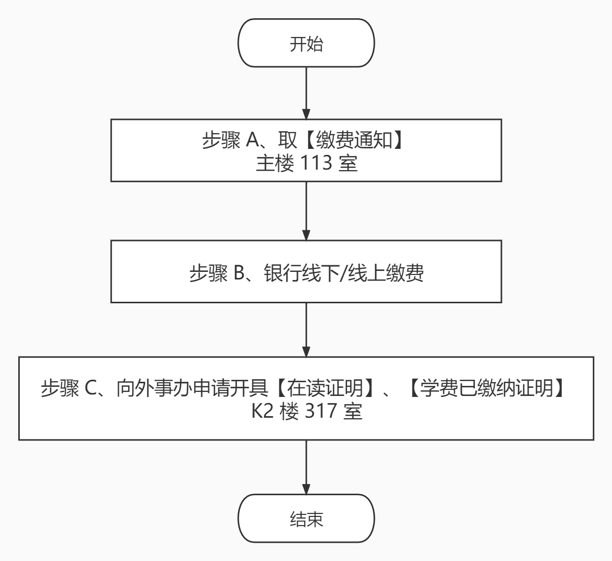

### 2.1、步骤 A

- 主楼113室，工作时间：周一至周五；具体时间不详，碰运气，敲门直接进或锁门的话有人给你开门就没问题。
- 有会英语的老师，但其熟练程度不确定，可以进行简单交流。实在不行就用翻译。
- 带着含有自己乌克兰语姓名的证件（白卡、学生卡、宿舍证等）。

- 向老师说明目的和关键信息，交学费、2021年春季或2月入学、硕士第二年、英语教学、院系、专业等，可提前翻译好。
- 将带乌克兰语姓名的证件交给老师，老师会查询系统，看需要缴纳多少。
- 拿着图片1，给老师看，向老师要【缴费通知】，要盖章的；不明示的话，可能会给你图片2。

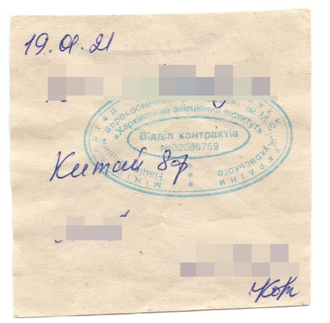

---

### 2.2、步骤 B

- 选择校内银行缴费，准备好护照、白卡、居住证明，缺一不可。手续费1%。翻译告知柜台工作人员，交学费。
- 选择校外银行`PrivateBank`，往常只需银行卡即可。
- 其他方式自由选择，也没尝试过。

- 注意，银行回执原件自己保留，外事办开【在读证明】等给银行回执复印件即可。

---

### 2.3、步骤 C

- 提前将【乌克兰语姓名】、【护照号】、【出生日期】、【院】、【系】、【研究方向】、【硕士二年级】等打印在一张纸上，可参考见本文最后的**附件6**。【院】、【系】、【研究方向】可从学校官网拷贝，并且与上年一致。
- 将上年外事办开具的带乌克兰国徽的**两份**文件打印或复印出来，跟老师说我要这样的文件。
- 将带有个人信息的纸、两份上年的文件打印或复印件、银行回执复印件给老师。如果要检查银行回执原件，给他/她看，但最终确保原件自己保留。
- 可能当天开具不出来。一般是第二天再去取。
- 应该是有偿开具，取的时候准备好现金。

---

## 3、【系统填报】确认学费申请系统入口是否存在

 

- 登录**新国家公派留学管理信息平台**（[https://s.csc.edu.cn](https://s.csc.edu.cn)）。
- 在**首页**（必须是“首页”）的上方，如有【申请学费】，点击后能够成功进入另一个系统，可直接阅读 [【系统填报】具体步骤以及注意事项](javascript:void(0))

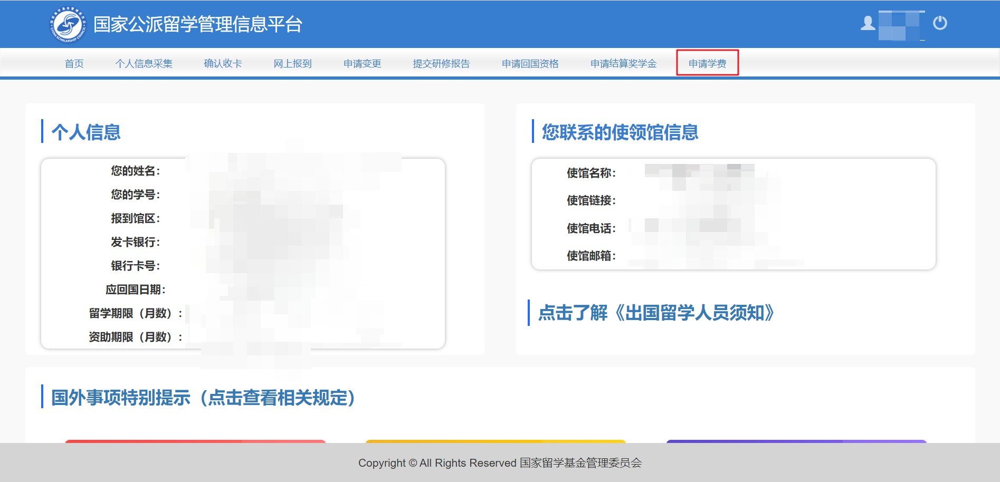

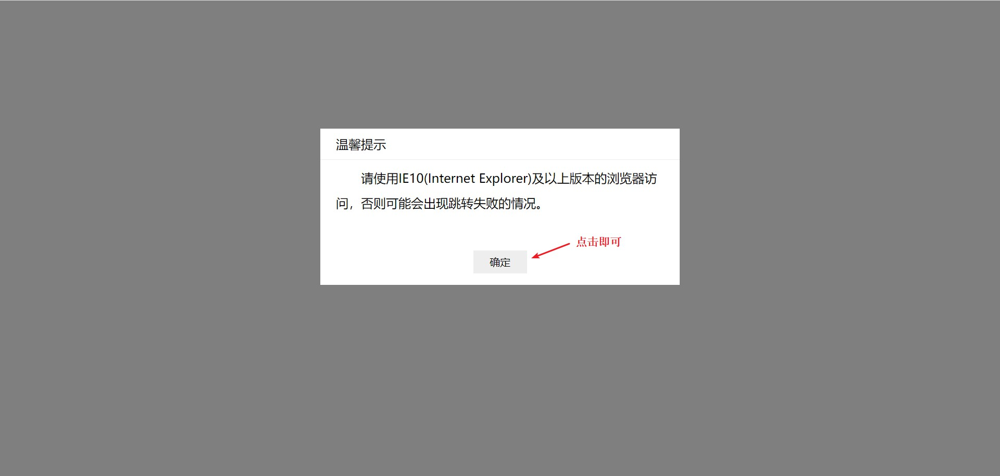

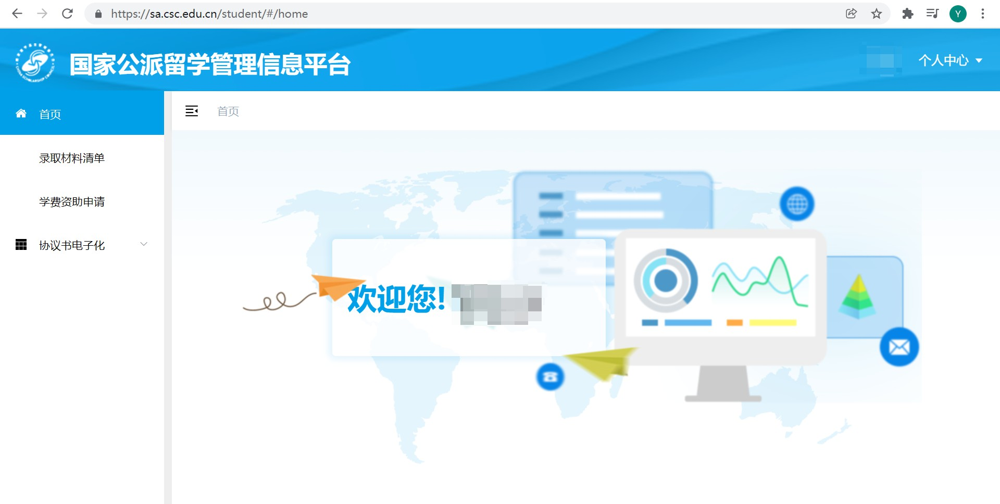

- 在**首页**的上方，如**没有**【申请学费】。请发送邮件至 [ouyafei4@csc.edu.cn](javascript:void(0)) 解决。
  - 邮件标题明确 CSC 学号、姓名、所遇到问题简要说明（例：新系统中无“申请学费”入口）。
  - 邮件正文自由发挥，可以附上相关截图。
  - 按照要求填写一个“学费导入模板”的 Excel 文件（见本文最后的**附件2**），填写文件中的黄色区域，以附件形式发送。

---

## 4、【系统填报】具体步骤以及注意事项

 

### 4.1、进入申请学费系统

- 1、进入系统。如下图：

- 2、点击左侧栏中的【学费资助申请】。如下图：

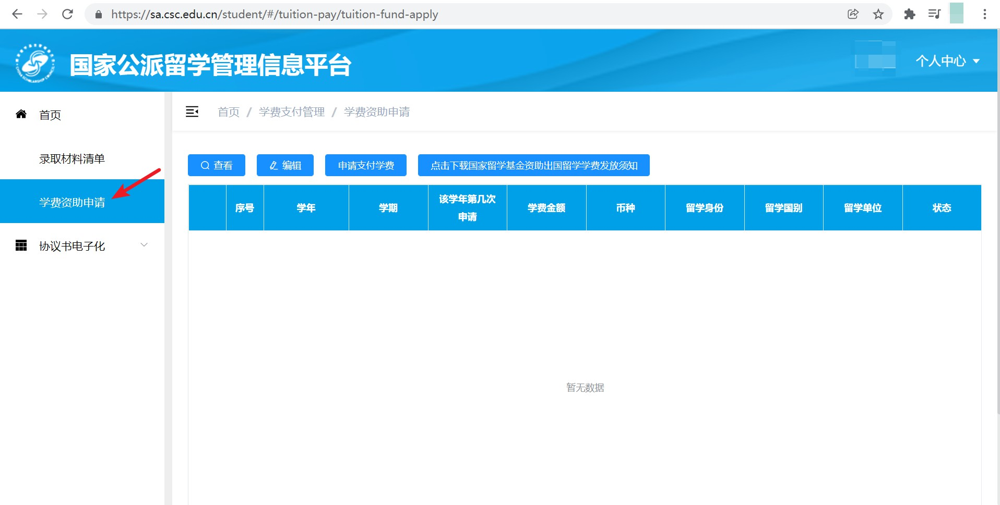

- 3、点击【申请支付学费】，弹出窗口；再点击【报销学费】，弹出填写信息窗口。如下图：

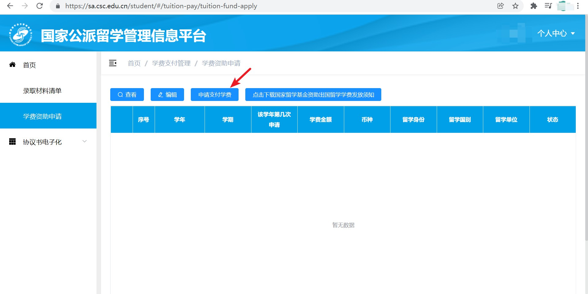

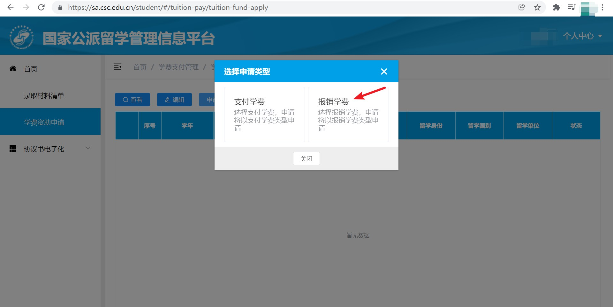

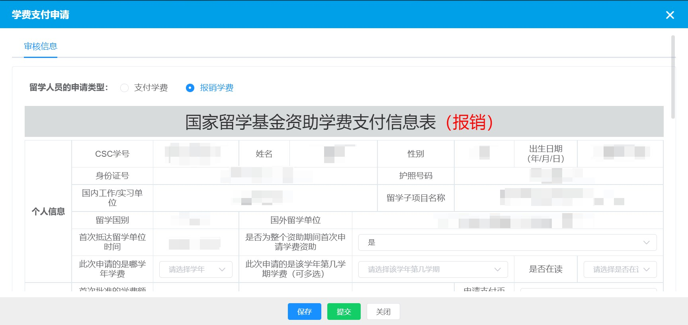

---

### 4.2、填写信息

- 1、【留学人员的申请类型】选中【报销学费】（最上方，单选按钮）。
- 2、表中【CSC学号】、【姓名】、【性别】、【出生日期】、【身份证号】、【护照号码】、【国内工作/实习单位】、【留学子项目名称】、【留学国别】、【国外留学单位】、【首次抵达留学单位时间】、【首次批准的学费额度】、【首次批准的学费币种】由系统生成，无需填写。

- 3、表中【是否为整个资助期间首次申请学费资助】，选择【否】。

- 4、表中【此次申请的是哪学年学费】，选择【2021-2022】。

- 5、表中【此次申请的是该学年第几学期学费（可多选）】，选择【整学年】。

- 6、表中【是否在读】，选择【是】。

- 7、表中【申请支付币种】，选择【人民币】（报销结算币种）。

- 8、表中【留学单位收取学费金额（外币）】，填写实际缴纳的**格里夫纳**金额，允许两位小数。

- 9、表中【学费金额大写（中文）】是由系统基于【留学单位收取学费金额（外币）】自动生成，无需填写（系统有 瑕疵，所有币种的单位都是“元”）。

- 10、表中【留学单位收取学费币种】，选择【格里夫纳】。

- 11、表中【收款人开户银行名称（中文）】，填写一张自己（必须是自己的）**国内一类银行卡**的开户银行，详细到**支行**。可使用对应银行的 APP 等方法获取。

- 12、表中【收款人账号（中文）】，填写一张自己（必须是自己的）**国内一类银行卡**的开户银行的卡号。

- 13、表中【收款人名称（中文）】是由系统生成，无需填写，系统生成的是你自己的姓名。

- 14、表中【汇款附言】，根据弹出的提示填写。

  - > Hao XX, Passport No. C123456, Tuition Fees. 
    >
  
- 15、表中【学费支付期限（以学校通知为准）】，填写缴纳学费时的日期即可。比如`xxxx年xx月xx日`

系统给的提示：

---

### 4.3、提交电子版材料

#### 4.3.1、留学单位提供的材料的变动（基于前期学生的经验，仅参考，一切以实际交涉为准）

<u>不再提供（开具）的：</u>

- 1、原【缴费通知】材料之一：第一次报销时，**外事办**开具，上面有金额、印章等；现在，不再开具。

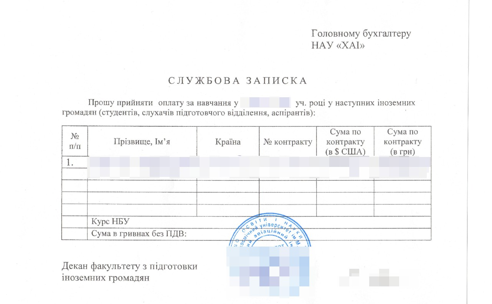

<u>仍能提供（开具）的：</u>

- 1、【在读证明】：外事办有偿开具

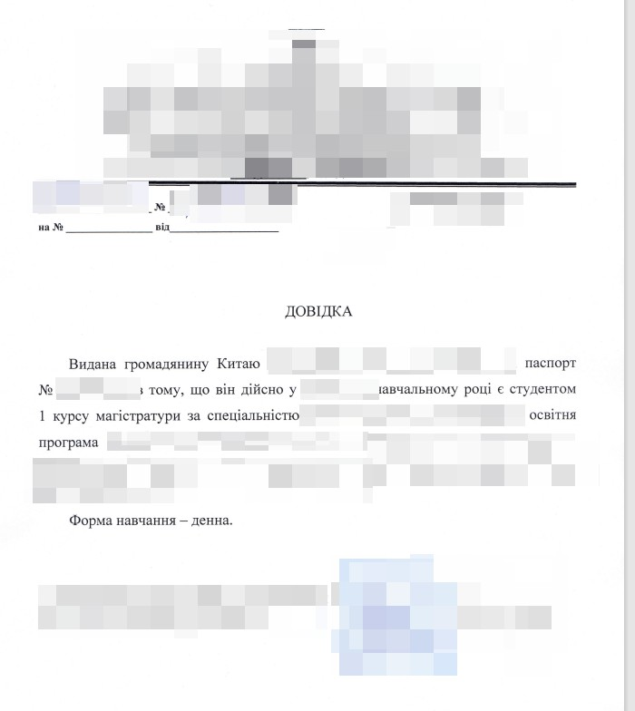

- 2、【学费已缴纳证明】：外事办有偿开具

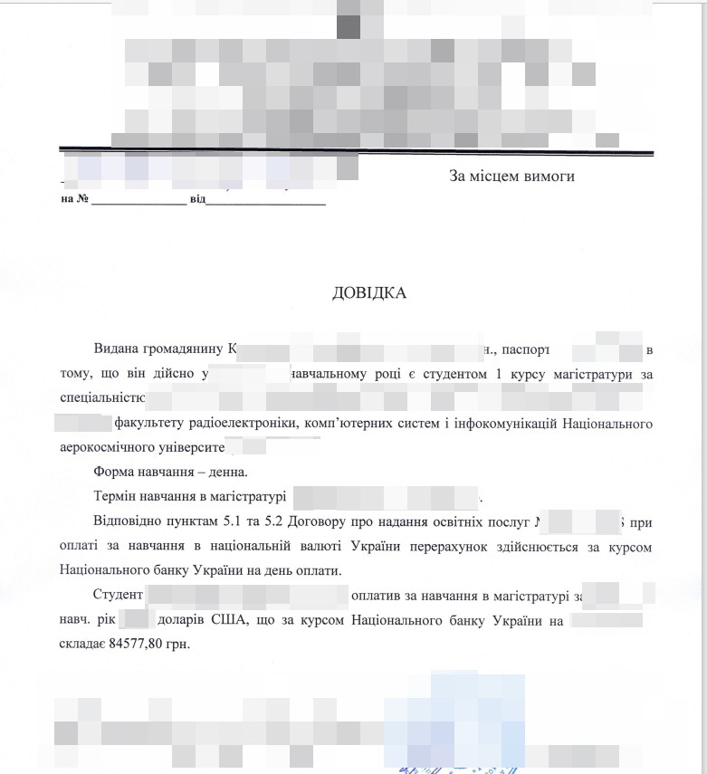

---

#### 4.3.2、系统中需提交材料

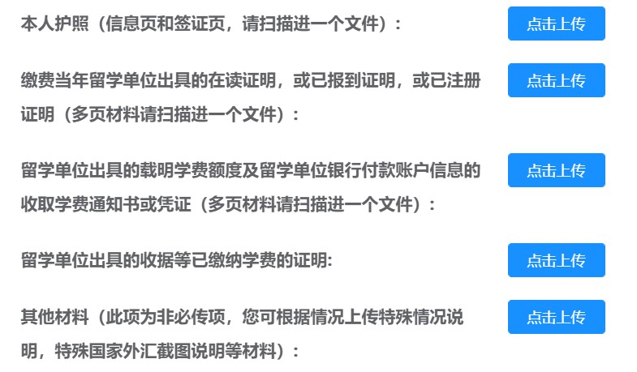

- 所有文件的格式均为 PDF 文件。
- 所有外文材料，应有中文标注（或翻译）件，将原件与中文标注（或翻译）件合并（称“一组”）。一个 PDF 文件中允许**一组或多组**“原件与中文标注（或翻译）件”
- 上传的**每个**文件大小不能超过 3 MB，如果 PDF 文件过大，使用 PDF 压缩。压缩后必须亲自检查 PDF 中内容是否清晰。

- 1、【本人护照（信息页和签证页，请扫描进一个文件）】：身份证反正面、护照信息页、入境留学国家的签证页。**不要忘记身份证**。
- 2、【缴费当年留学单位出具的在读证明，或已报到证明，或已注册证明（多页材料请扫描进一个文件）】：在读证明，原件和中文翻译件。
- 3、【留学单位出具的载明学费额度及留学单位银行付款账户信息的收取学费通知书或凭证（多页材料请扫描进一个文件）】：主楼113室开具的便条可以作为【缴费通知】。如需银行账户信息可以使用学校官网截图 [https://khai.edu/en/inter/tuition-fees/bank-details](https://khai.edu/en/inter/tuition-fees/bank-details)。
- 4、【留学单位出具的收据等已缴纳学费的证明】：【银行回执】，原件和中文标注（或翻译）件；学校外事办开具的【学费已缴纳证明】，原件和中文翻译件。
- 5、【其他材料（此项为非必传项，您可根据情况上传特殊情况说明，特殊国家外汇截图说明等材料）】：邮件提交时期需要提交的但上述未涉及到材料，均要提交，下述材料合并为一个 PDF。
  - 5.1、<u>国家留学基金委员会资助学费申请</u>（见本文最后的**附件3**）。内容可根据实际动态调整，自由度较大。**需手写签字**。
  - 5.2、<u>个人学费使用人民币报销说明</u>（见本文最后的**附件4**）。内容可根据实际动态调整，自由度较大。**无需手写签字**。
  - 5.3、<u>学费缴纳当日格里夫纳官方汇率</u>。缴费当日乌克兰央行官方网站（[乌克兰语](https://bank.gov.ua/ua/markets/exchangerates)、[英语](https://bank.gov.ua/en/markets/exchangerates)，网站内可以进行日期选择，查看任何日期的汇率）汇率的截图，全网页截图，可自行使用编辑软件将 CNY 汇率标注出来。
  - 5.4、<u>国家留学基金资助学费支付信息表</u>（见本文最后的**附件5**）。填写黄色部分，完成后，取消黄色填充。该学费申请系统的本质就是将原来<u>国家留学基金资助学费支付信息表</u>中要填写的内容，“搬到”系统上填写。所以该表填写的时候，与之前在系统中填写内容一致。
  - 5.5、其他一些情况说明。如出现特殊情况，比如“通过他人的银行卡缴纳学费导致银行回执上的信息不是本人信息”，需要提交对应情况的说明。

每个文件成功上传后，可以进行预览等操作：

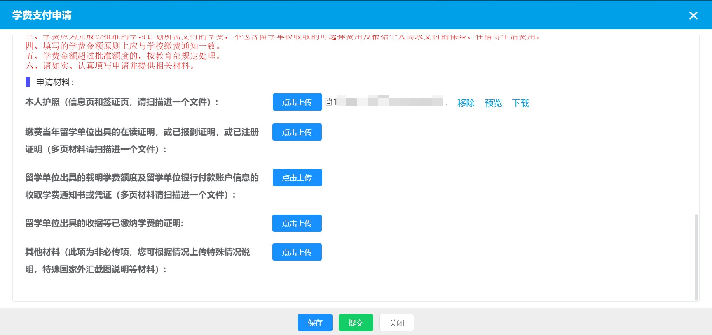

---

### 4.4、其他

- 提交后，密切注意审核状态，审核是先由使馆审核再由留基委审核，两者均有权退回。

---

## 附件

 

> 附件2 建议用 WPS 打开，使用 Microsoft Excel 也没太大问题。
>
> 附件3 ~ 附件5 建议使用 Microsoft Word / Excel 打开。仅供参考，允许个人作适当修改。因已经进行过第一次报销，应该都有记录。

附件1：[《国家留学基金资助出国留学学费发放须知》](https://yyscyber.github.io/ukr-temp/pay-tuition-2022/appendix/5c9ec8e6-e685-47e4-9cfc-ae92a7c1425b.pdf)

附件2：[学费导入模板](https://yyscyber.github.io/ukr-temp/pay-tuition-2022/appendix/51c9c0ce-a52e-42db-928e-d9791917d0be.xls)

附件3：[国家留学基金委员会资助学费申请](https://yyscyber.github.io/ukr-temp/pay-tuition-2022/appendix/3e1e2fc8-7690-4b40-a9af-1d29f59abc01.docx)

附件4：[个人学费使用人民币报销说明](https://yyscyber.github.io/ukr-temp/pay-tuition-2022/appendix/eb94e21c-0745-41c2-b245-62b9c02644fd.docx)

附件5：[国家留学基金资助学费支付信息表](https://yyscyber.github.io/ukr-temp/pay-tuition-2022/appendix/a39b24c9-5e92-4b8f-9e9a-969686be0853.xlsx)

附件6：[外事办申请开具证明用](https://yyscyber.github.io/ukr-temp/pay-tuition-2022/appendix/3fcb5fea-5c3e-4bb4-b7e0-0f9484c06413.docx)

